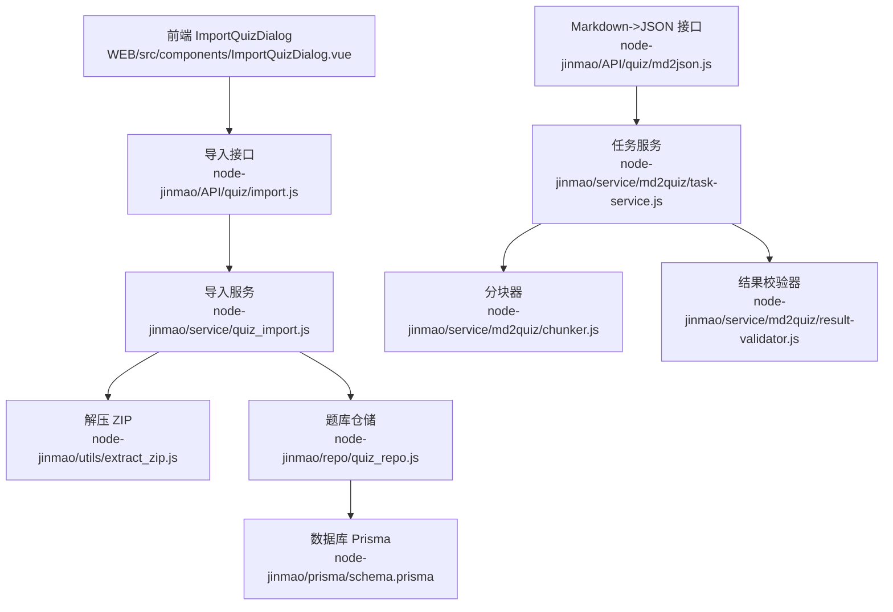
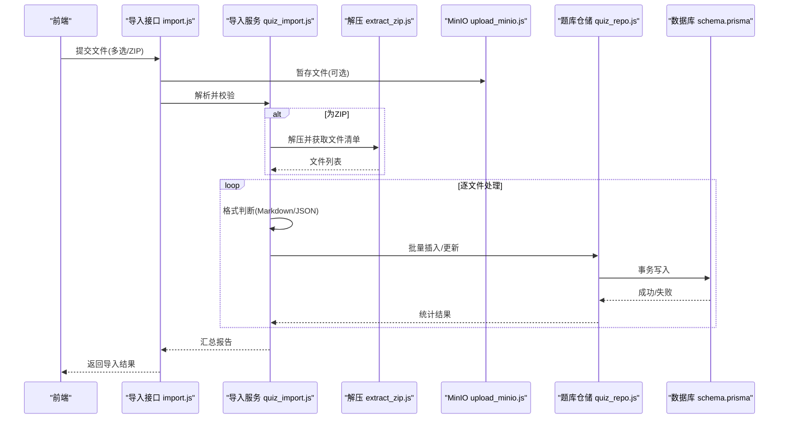
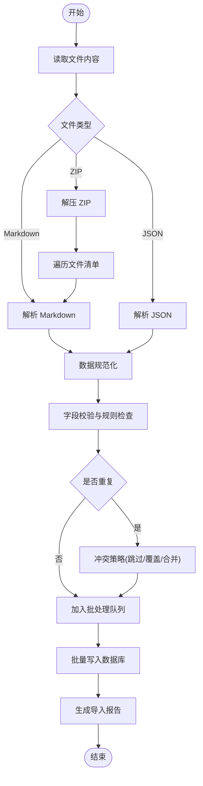
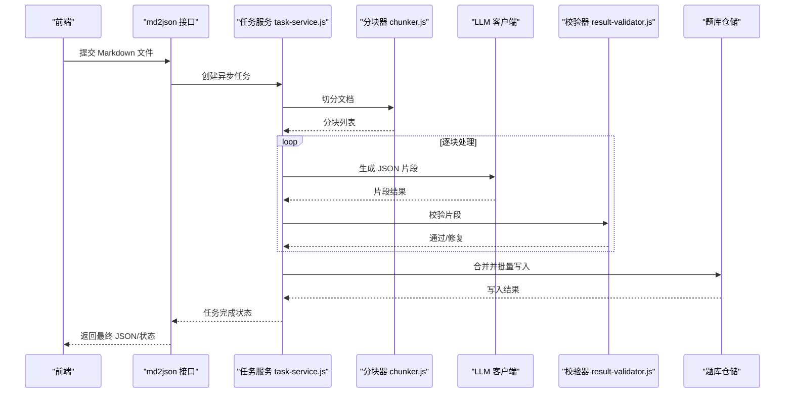
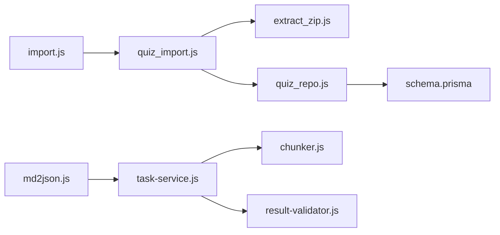

# 题库导入导出

<cite>
**本文引用的文件**   
- [node-jinmao/API/quiz/import.js](file://node-jinmao/API/quiz/import.js)
- [node-jinmao/service/quiz_import.js](file://node-jinmao/service/quiz_import.js)
- [node-jinmao/utils/extract_zip.js](file://node-jinmao/utils/extract_zip.js)
- [node-jinmao/API/quiz/md2json.js](file://node-jinmao/API/quiz/md2json.js)
- [node-jinmao/service/md2quiz/task-service.js](file://node-jinmao/service/md2quiz/task-service.js)
- [node-jinmao/service/md2quiz/chunker.js](file://node-jinmao/service/md2quiz/chunker.js)
- [node-jinmao/service/md2quiz/result-validator.js](file://node-jinmao/service/md2quiz/result-validator.js)
- [node-jinmao/repo/quiz_repo.js](file://node-jinmao/repo/quiz_repo.js)
- [node-jinmao/prisma/schema.prisma](file://node-jinmao/prisma/schema.prisma)
- [node-jinmao/API/files.js](file://node-jinmao/API/files.js)
- [node-jinmao/utils/upload_minio.js](file://node-jinmao/utils/upload_minio.js)
- [WEB/src/components/ImportQuizDialog.vue](file://WEB/src/components/ImportQuizDialog.vue)
- [node-jinmao/service/POSTbook.js](file://node-jinmao/service/POSTbook.js)
</cite>

## 目录
1. [简介](#简介)
2. [项目结构](#项目结构)
3. [核心组件](#核心组件)
4. [架构总览](#架构总览)
5. [详细组件分析](#详细组件分析)
6. [依赖关系分析](#依赖关系分析)
7. [性能考虑](#性能考虑)
8. [故障排查指南](#故障排查指南)
9. [结论](#结论)
10. [附录：API 接口文档](#附录api-接口文档)

## 简介
本文件面向“题库导入导出”功能，覆盖以下目标：
- 支持的导入格式与处理逻辑：Markdown、JSON、ZIP 压缩包等。
- 批量导入工作流：文件上传、格式校验、数据转换、批量插入。
- 导出功能实现：将题库数据转换为标准格式供外部使用。
- 导入过程中的数据校验机制：格式检查、重复检测、冲突解决。
- API 接口说明：请求参数、响应格式、错误码。
- 性能优化建议：分批处理、内存管理、并发控制等最佳实践。

## 项目结构
围绕题库导入导出，后端主要涉及以下模块：
- API 层：接收前端请求，路由到服务层。
- 服务层：解析文件、校验数据、转换格式、调用仓储进行持久化。
- 工具层：解压 ZIP、上传 MinIO、通用校验等。
- 仓储层：数据库访问（Prisma）。
- 前端：导入对话框、进度展示、错误提示。

**图表来源** 
- [node-jinmao/API/quiz/import.js](file://node-jinmao/API/quiz/import.js)
- [node-jinmao/service/quiz_import.js](file://node-jinmao/service/quiz_import.js)
- [node-jinmao/utils/extract_zip.js](file://node-jinmao/utils/extract_zip.js)
- [node-jinmao/repo/quiz_repo.js](file://node-jinmao/repo/quiz_repo.js)
- [node-jinmao/prisma/schema.prisma](file://node-jinmao/prisma/schema.prisma)
- [node-jinmao/API/quiz/md2json.js](file://node-jinmao/API/quiz/md2json.js)
- [node-jinmao/service/md2quiz/task-service.js](file://node-jinmao/service/md2quiz/task-service.js)
- [node-jinmao/service/md2quiz/chunker.js](file://node-jinmao/service/md2quiz/chunker.js)
- [node-jinmao/service/md2quiz/result-validator.js](file://node-jinmao/service/md2quiz/result-validator.js)

**章节来源**
- [node-jinmao/API/quiz/import.js](file://node-jinmao/API/quiz/import.js)
- [node-jinmao/service/quiz_import.js](file://node-jinmao/service/quiz_import.js)
- [node-jinmao/utils/extract_zip.js](file://node-jinmao/utils/extract_zip.js)
- [node-jinmao/repo/quiz_repo.js](file://node-jinmao/repo/quiz_repo.js)
- [node-jinmao/prisma/schema.prisma](file://node-jinmao/prisma/schema.prisma)
- [node-jinmao/API/quiz/md2json.js](file://node-jinmao/API/quiz/md2json.js)
- [node-jinmao/service/md2quiz/task-service.js](file://node-jinmao/service/md2quiz/task-service.js)
- [node-jinmao/service/md2quiz/chunker.js](file://node-jinmao/service/md2quiz/chunker.js)
- [node-jinmao/service/md2quiz/result-validator.js](file://node-jinmao/service/md2quiz/result-validator.js)
- [WEB/src/components/ImportQuizDialog.vue](file://WEB/src/components/ImportQuizDialog.vue)

## 核心组件
- 导入接口（import.js）：接收多文件上传，识别类型（Markdown/JSON/ZIP），调度导入服务。
- 导入服务（quiz_import.js）：统一解析与校验，按批次写入题库表，处理重复与冲突策略。
- ZIP 解压（extract_zip.js）：安全解压并过滤危险路径，返回文件列表。
- Markdown->JSON 任务（md2json.js + task-service.js）：异步任务驱动，分块、LLM 生成 JSON、结果校验。
- 题库仓储（quiz_repo.js）：封装批量插入、去重、更新等操作。
- 存储（upload_minio.js + files.js）：文件上传至对象存储，提供下载与清理能力。
- 前端导入对话框（ImportQuizDialog.vue）：选择文件、显示进度、错误反馈。

**章节来源**
- [node-jinmao/API/quiz/import.js](file://node-jinmao/API/quiz/import.js)
- [node-jinmao/service/quiz_import.js](file://node-jinmao/service/quiz_import.js)
- [node-jinmao/utils/extract_zip.js](file://node-jinmao/utils/extract_zip.js)
- [node-jinmao/API/quiz/md2json.js](file://node-jinmao/API/quiz/md2json.js)
- [node-jinmao/service/md2quiz/task-service.js](file://node-jinmao/service/md2quiz/task-service.js)
- [node-jinmao/repo/quiz_repo.js](file://node-jinmao/repo/quiz_repo.js)
- [node-jinmao/utils/upload_minio.js](file://node-jinmao/utils/upload_minio.js)
- [node-jinmao/API/files.js](file://node-jinmao/API/files.js)
- [WEB/src/components/ImportQuizDialog.vue](file://WEB/src/components/ImportQuizDialog.vue)

## 架构总览
整体采用“接口-服务-仓储”分层，结合对象存储与异步任务，支持多种导入格式与批量处理。

**图表来源** 
- [node-jinmao/API/quiz/import.js](file://node-jinmao/API/quiz/import.js)
- [node-jinmao/service/quiz_import.js](file://node-jinmao/service/quiz_import.js)
- [node-jinmao/utils/extract_zip.js](file://node-jinmao/utils/extract_zip.js)
- [node-jinmao/utils/upload_minio.js](file://node-jinmao/utils/upload_minio.js)
- [node-jinmao/repo/quiz_repo.js](file://node-jinmao/repo/quiz_repo.js)
- [node-jinmao/prisma/schema.prisma](file://node-jinmao/prisma/schema.prisma)

## 详细组件分析

### 导入接口（import.js）
- 职责：接收 multipart/form-data，解析文件集合；根据扩展名或内容类型分流处理。
- 关键点：
  - 支持 .md、.json、.zip 等扩展名识别。
  - 对超大文件进行限制与告警。
  - 将文件交由导入服务处理，返回结构化结果。

**章节来源**
- [node-jinmao/API/quiz/import.js](file://node-jinmao/API/quiz/import.js)

### 导入服务（quiz_import.js）
- 职责：统一解析与校验、数据转换、批量入库、错误聚合。
- 关键流程：
  - 文件类型判定与读取。
  - Markdown/JSON 解析与规范化。
  - 重复检测与冲突策略（跳过/覆盖/合并）。
  - 分批写入数据库，降低单次事务压力。
  - 汇总成功/失败计数与错误明细。

**图表来源** 
- [node-jinmao/service/quiz_import.js](file://node-jinmao/service/quiz_import.js)

**章节来源**
- [node-jinmao/service/quiz_import.js](file://node-jinmao/service/quiz_import.js)

### ZIP 解压（extract_zip.js）
- 职责：安全解压 ZIP，过滤非法路径，返回可处理的文件列表。
- 关键点：
  - 白名单扩展名过滤（如 .md、.json）。
  - 防止路径穿越攻击。
  - 大文件与嵌套层级限制。

**章节来源**
- [node-jinmao/utils/extract_zip.js](file://node-jinmao/utils/extract_zip.js)

### Markdown->JSON 任务（md2json.js + task-service.js）
- 职责：将 Markdown 题库文本通过 LLM 转换为标准 JSON 结构，支持异步任务与进度上报。
- 关键流程：
  - 创建任务并分配 ID。
  - 分块（chunker.js）避免超长上下文。
  - 调用 LLM 生成 JSON 片段。
  - 结果校验（result-validator.js）确保结构合规。
  - 合并结果并落库。

**图表来源** 
- [node-jinmao/API/quiz/md2json.js](file://node-jinmao/API/quiz/md2json.js)
- [node-jinmao/service/md2quiz/task-service.js](file://node-jinmao/service/md2quiz/task-service.js)
- [node-jinmao/service/md2quiz/chunker.js](file://node-jinmao/service/md2quiz/chunker.js)
- [node-jinmao/service/md2quiz/result-validator.js](file://node-jinmao/service/md2quiz/result-validator.js)

**章节来源**
- [node-jinmao/API/quiz/md2json.js](file://node-jinmao/API/quiz/md2json.js)
- [node-jinmao/service/md2quiz/task-service.js](file://node-jinmao/service/md2quiz/task-service.js)
- [node-jinmao/service/md2quiz/chunker.js](file://node-jinmao/service/md2quiz/chunker.js)
- [node-jinmao/service/md2quiz/result-validator.js](file://node-jinmao/service/md2quiz/result-validator.js)

### 题库仓储（quiz_repo.js）
- 职责：封装题库数据的增删改查、批量插入、去重与冲突处理。
- 关键点：
  - 基于主键或业务唯一键的去重。
  - 批量事务写入，提升吞吐。
  - 错误回滚与部分成功记录。

**章节来源**
- [node-jinmao/repo/quiz_repo.js](file://node-jinmao/repo/quiz_repo.js)

### 文件上传与存储（upload_minio.js + files.js）
- 职责：文件上传至 MinIO，提供下载、删除、临时文件清理。
- 关键点：
  - 分片上传与大文件支持。
  - 访问权限控制与签名 URL。
  - 生命周期管理与垃圾回收。

**章节来源**
- [node-jinmao/utils/upload_minio.js](file://node-jinmao/utils/upload_minio.js)
- [node-jinmao/API/files.js](file://node-jinmao/API/files.js)

### 前端导入对话框（ImportQuizDialog.vue）
- 职责：用户选择文件、显示上传进度、错误提示、结果汇总。
- 关键点：
  - 支持拖拽与多选。
  - 实时进度条与断点续传（可选）。
  - 错误详情展开与重试机制。

**章节来源**
- [WEB/src/components/ImportQuizDialog.vue](file://WEB/src/components/ImportQuizDialog.vue)

### 教材/书籍相关（POSTbook.js）
- 职责：与题库导入相关的教材/书籍元数据处理，辅助题库归属与分类。
- 关键点：
  - 教材信息校验与关联。
  - 与题库导入流程的联动。

**章节来源**
- [node-jinmao/service/POSTbook.js](file://node-jinmao/service/POSTbook.js)

## 依赖关系分析
- 导入接口依赖导入服务与文件上传工具。
- 导入服务依赖 ZIP 解压、题库仓储与数据库模型。
- Markdown->JSON 任务依赖分块器、LLM 客户端与校验器。
- 仓储层依赖 Prisma 生成的数据库访问层。

**图表来源** 
- [node-jinmao/API/quiz/import.js](file://node-jinmao/API/quiz/import.js)
- [node-jinmao/service/quiz_import.js](file://node-jinmao/service/quiz_import.js)
- [node-jinmao/utils/extract_zip.js](file://node-jinmao/utils/extract_zip.js)
- [node-jinmao/repo/quiz_repo.js](file://node-jinmao/repo/quiz_repo.js)
- [node-jinmao/prisma/schema.prisma](file://node-jinmao/prisma/schema.prisma)
- [node-jinmao/API/quiz/md2json.js](file://node-jinmao/API/quiz/md2json.js)
- [node-jinmao/service/md2quiz/task-service.js](file://node-jinmao/service/md2quiz/task-service.js)
- [node-jinmao/service/md2quiz/chunker.js](file://node-jinmao/service/md2quiz/chunker.js)
- [node-jinmao/service/md2quiz/result-validator.js](file://node-jinmao/service/md2quiz/result-validator.js)

**章节来源**
- [node-jinmao/API/quiz/import.js](file://node-jinmao/API/quiz/import.js)
- [node-jinmao/service/quiz_import.js](file://node-jinmao/service/quiz_import.js)
- [node-jinmao/utils/extract_zip.js](file://node-jinmao/utils/extract_zip.js)
- [node-jinmao/repo/quiz_repo.js](file://node-jinmao/repo/quiz_repo.js)
- [node-jinmao/prisma/schema.prisma](file://node-jinmao/prisma/schema.prisma)
- [node-jinmao/API/quiz/md2json.js](file://node-jinmao/API/quiz/md2json.js)
- [node-jinmao/service/md2quiz/task-service.js](file://node-jinmao/service/md2quiz/task-service.js)
- [node-jinmao/service/md2quiz/chunker.js](file://node-jinmao/service/md2quiz/chunker.js)
- [node-jinmao/service/md2quiz/result-validator.js](file://node-jinmao/service/md2quiz/result-validator.js)

## 性能考虑
- 分批处理：
  - 将大批量题目拆分为固定大小的批次（如 200~500 条/批），减少单次事务大小。
  - 在导入服务中维护批处理队列，顺序或并行写入。
- 内存管理：
  - 流式读取大文件，避免一次性加载到内存。
  - 及时释放中间对象引用，避免内存泄漏。
- 并发控制：
  - 限制并发写入数量，避免数据库连接池耗尽。
  - 使用信号量或队列控制 LLM 调用频率，避免限流。
- 缓存与去重：
  - 在内存中维护已处理题号/内容的哈希集合，快速去重。
  - 对热点数据进行本地缓存（如字典映射）。
- I/O 优化：
  - 压缩传输（gzip）与分片上传。
  - 对象存储直传，减少服务端中转。
- 监控与降级：
  - 记录关键指标（QPS、延迟、错误率、内存占用）。
  - 当负载过高时，启用排队与限流策略。

[本节为通用指导，不直接分析具体文件]

## 故障排查指南
- 常见错误与定位：
  - 文件格式不支持：检查扩展名与 MIME 类型，确认白名单配置。
  - ZIP 解压失败：检查压缩包完整性与路径合法性。
  - JSON 解析失败：查看语法错误位置与缺失字段。
  - 重复检测冲突：核对业务唯一键（如题号、标题+选项指纹）。
  - 数据库写入失败：检查约束、索引与连接池状态。
- 日志与调试：
  - 开启详细日志，记录每个步骤的输入输出摘要。
  - 对异常堆栈进行归类与告警。
- 恢复策略：
  - 支持断点续传与重试，记录失败项以便后续处理。
  - 提供“仅预览”模式，先校验再写入。

**章节来源**
- [node-jinmao/service/quiz_import.js](file://node-jinmao/service/quiz_import.js)
- [node-jinmao/utils/extract_zip.js](file://node-jinmao/utils/extract_zip.js)
- [node-jinmao/repo/quiz_repo.js](file://node-jinmao/repo/quiz_repo.js)

## 结论
题库导入导出功能通过清晰的接口-服务-仓储分层，结合对象存储与异步任务，实现了多格式、批量、高可靠的导入能力。通过严格的校验与冲突策略，保障数据质量；通过分批、并发与内存优化，提升系统吞吐与稳定性。未来可扩展更多格式与智能校验规则，进一步提升用户体验与数据一致性。

[本节为总结性内容，不直接分析具体文件]

## 附录：API 接口文档

### 题库导入接口
- 方法：POST
- 路径：/api/quiz/import
- 请求体：multipart/form-data
  - 字段：files[]（必填，支持 .md/.json/.zip）
  - 可选参数：
    - conflict_strategy：skip | overwrite | merge（默认 skip）
    - batch_size：数字（默认 200）
    - dry_run：布尔（默认 false，仅校验不写入）
- 响应体：
  - success：布尔
  - total：总数
  - imported：成功数
  - skipped：跳过数
  - failed：失败数
  - errors：错误数组（包含 file、line、message）
- 错误码：
  - 400：请求参数错误或文件格式不支持
  - 413：文件过大
  - 500：服务器内部错误（解析/写入失败）

**章节来源**
- [node-jinmao/API/quiz/import.js](file://node-jinmao/API/quiz/import.js)
- [node-jinmao/service/quiz_import.js](file://node-jinmao/service/quiz_import.js)

### Markdown->JSON 转换接口
- 方法：POST
- 路径：/api/quiz/md2json
- 请求体：multipart/form-data
  - 字段：markdown_file（必填，.md）
  - 可选参数：
    - chunk_size：数字（默认 1000 字符）
    - retry_count：数字（默认 3）
- 响应体：
  - task_id：字符串（用于查询进度）
  - status：pending | processing | completed | failed
  - progress：百分比
  - result：JSON 结构（完成后返回）
- 错误码：
  - 400：文件为空或格式错误
  - 429：LLM 调用限流
  - 500：转换失败

**章节来源**
- [node-jinmao/API/quiz/md2json.js](file://node-jinmao/API/quiz/md2json.js)
- [node-jinmao/service/md2quiz/task-service.js](file://node-jinmao/service/md2quiz/task-service.js)

### 文件上传接口
- 方法：POST
- 路径：/api/files/upload
- 请求体：multipart/form-data
  - 字段：file（必填）
  - 可选参数：
    - bucket：字符串（默认 public）
    - expire_seconds：数字（默认 3600）
- 响应体：
  - url：下载链接
  - key：对象键
  - size：文件大小
- 错误码：
  - 400：文件为空
  - 413：文件过大
  - 500：上传失败

**章节来源**
- [node-jinmao/API/files.js](file://node-jinmao/API/files.js)
- [node-jinmao/utils/upload_minio.js](file://node-jinmao/utils/upload_minio.js)

### 题库导出接口（概念性）
- 方法：GET
- 路径：/api/quiz/export
- 查询参数：
  - format：json | csv（默认 json）
  - filter：JSON 字符串（如 {category, difficulty}）
  - page：数字（默认 1）
  - pageSize：数字（默认 100）
- 响应体：
  - data：数组（题目列表）
  - meta：分页与过滤信息
- 错误码：
  - 400：参数错误
  - 500：导出失败

[本节为概念性接口描述，未直接映射具体文件]