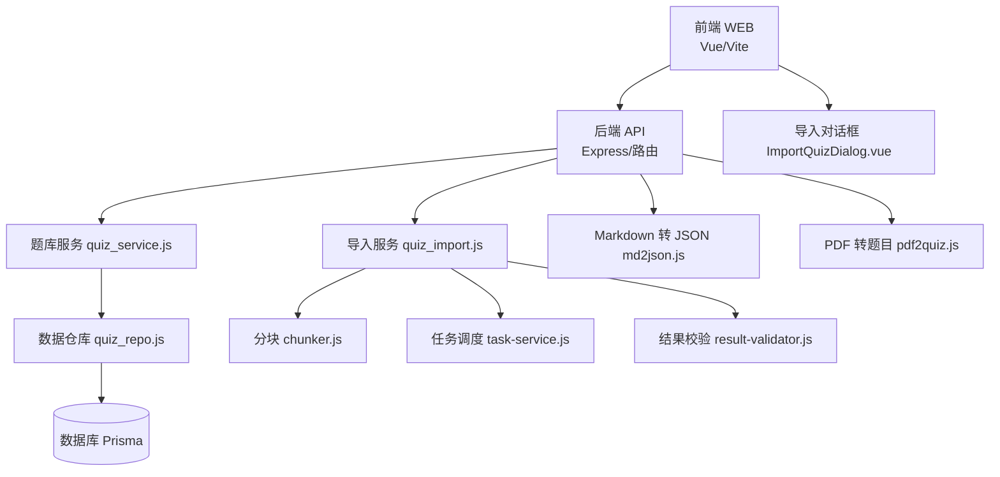
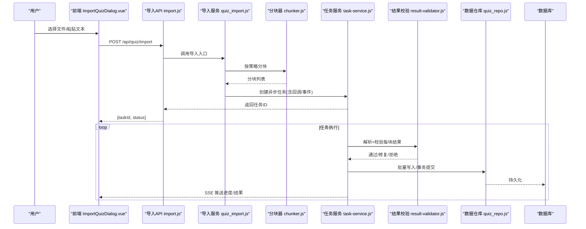
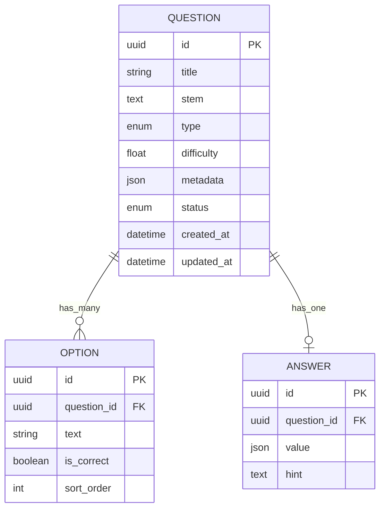
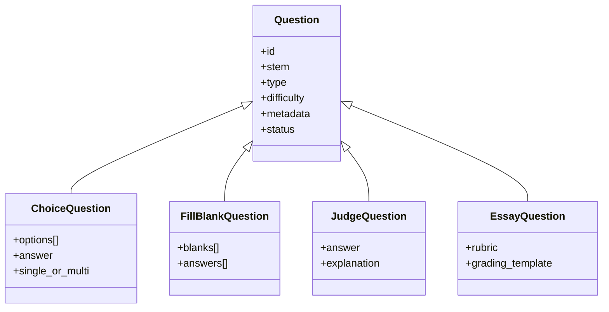
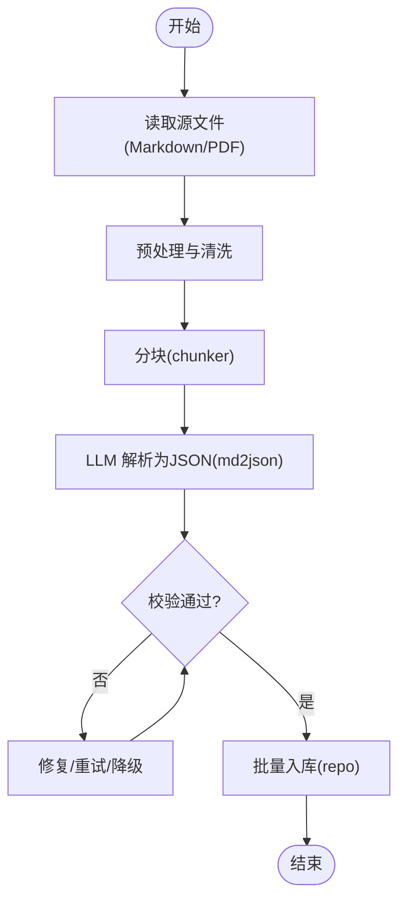
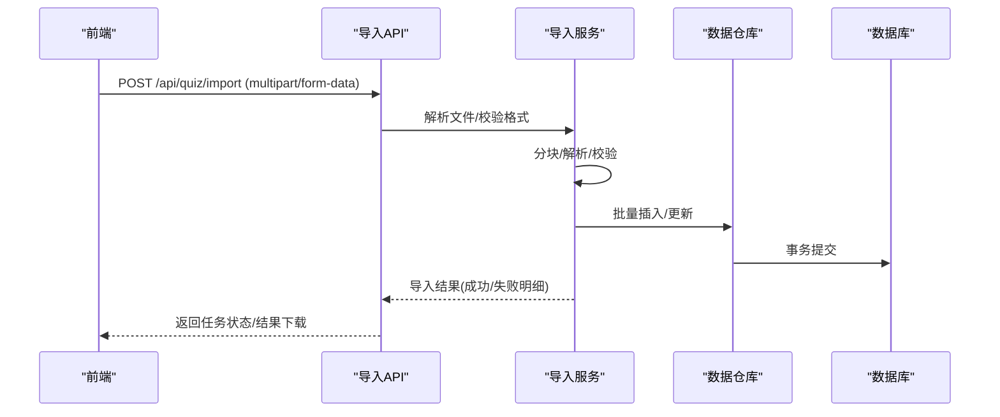
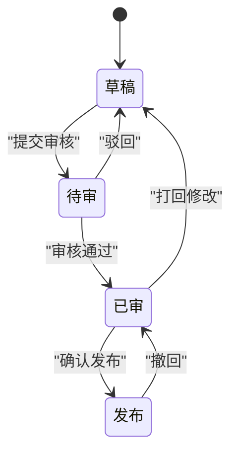
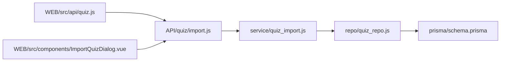

# 题库管理系统

<cite>
**本文档引用的文件**   
- [API文档.md](file://API文档.md)
- [数据库结构.md](file://数据库结构.md)
- [node-jinmao/API/quiz/import.js](file://node-jinmao/API/quiz/import.js)
- [node-jinmao/API/quiz/md2json.js](file://node-jinmao/API/quiz/md2json.js)
- [node-jinmao/API/quiz/pdf2quiz.js](file://node-jinmao/API/quiz/pdf2quiz.js)
- [node-jinmao/service/quiz_service.js](file://node-jinmao/service/quiz_service.js)
- [node-jinmao/service/quiz_import.js](file://node-jinmao/service/quiz_import.js)
- [node-jinmao/service/md2quiz/chunker.js](file://node-jinmao/service/md2quiz/chunker.js)
- [node-jinmao/service/md2quiz/task-service.js](file://node-jinmao/service/md2quiz/task-service.js)
- [node-jinmao/service/md2quiz/result-validator.js](file://node-jinmao/service/md2quiz/result-validator.js)
- [node-jinmao/repo/quiz_repo.js](file://node-jinmao/repo/quiz_repo.js)
- [node-jinmao/prisma/schema.prisma](file://node-jinmao/prisma/schema.prisma)
- [WEB/src/api/quiz.js](file://WEB/src/api/quiz.js)
- [WEB/src/components/ImportQuizDialog.vue](file://WEB/src/components/ImportQuizDialog.vue)
- [test/金毛刷题/backend/docs/api.md](file://test/金毛刷题/backend/docs/api.md)
</cite>

## 目录
1. [简介](#简介)
2. [项目结构](#项目结构)
3. [核心组件](#核心组件)
4. [架构总览](#架构总览)
5. [详细组件分析](#详细组件分析)
6. [依赖关系分析](#依赖关系分析)
7. [性能考量](#性能考量)
8. [故障排查指南](#故障排查指南)
9. [结论](#结论)
10. [附录](#附录)

## 简介
本文件为“题库管理系统”的综合技术文档，面向开发者与产品/教研人员。内容覆盖：
- 题目数据结构设计与多题型支持（选择题、填空题、判断题、作文题）
- Markdown/PDF 解析为结构化题目的实现原理
- AI 辅助出题的集成方式
- 题目 CRUD 接口、批量导入导出、审核流程
- 扩展新题型与自定义解析规则的方法
- 题目质量评估机制、错误检测算法
- 与学习进度系统的集成方式

## 项目结构
系统采用前后端分离架构：
- 前端（WEB）：Vue 3 + Vite，提供题目导入、练习、报告等界面能力
- 后端（node-jinmao）：Node.js + Prisma，提供题库 API、Markdown/PDF 解析、AI 生成、任务调度、存储访问等
- 测试与示例（test/金毛刷题）：包含 TypeScript 版本的参考实现与文档

图表来源 
- [node-jinmao/API/quiz/import.js](file://node-jinmao/API/quiz/import.js)
- [node-jinmao/API/quiz/md2json.js](file://node-jinmao/API/quiz/md2json.js)
- [node-jinmao/API/quiz/pdf2quiz.js](file://node-jinmao/API/quiz/pdf2quiz.js)
- [node-jinmao/service/quiz_service.js](file://node-jinmao/service/quiz_service.js)
- [node-jinmao/service/quiz_import.js](file://node-jinmao/service/quiz_import.js)
- [node-jinmao/service/md2quiz/chunker.js](file://node-jinmao/service/md2quiz/chunker.js)
- [node-jinmao/service/md2quiz/task-service.js](file://node-jinmao/service/md2quiz/task-service.js)
- [node-jinmao/service/md2quiz/result-validator.js](file://node-jinmao/service/md2quiz/result-validator.js)
- [node-jinmao/repo/quiz_repo.js](file://node-jinmao/repo/quiz_repo.js)
- [node-jinmao/prisma/schema.prisma](file://node-jinmao/prisma/schema.prisma)
- [WEB/src/api/quiz.js](file://WEB/src/api/quiz.js)
- [WEB/src/components/ImportQuizDialog.vue](file://WEB/src/components/ImportQuizDialog.vue)

章节来源
- [API文档.md](file://API文档.md)
- [数据库结构.md](file://数据库结构.md)

## 核心组件
- 题库服务（quiz_service.js）：封装题目增删改查、分页、筛选、批量操作等核心业务逻辑
- 导入服务（quiz_import.js）：统一处理批量导入、格式校验、失败重试、事务回滚
- Markdown 转 JSON（md2json.js）：将 Markdown 文本按规则切分并转换为结构化题目 JSON
- PDF 转题目（pdf2quiz.js）：将 PDF 转为 Markdown/文本后进入 md2json 管线
- 分块器（chunker.js）：按标题/段落/长度策略对长文档进行分块，便于 AI 处理
- 任务服务（task-service.js）：异步任务编排、状态跟踪、SSE/轮询反馈
- 结果校验（result-validator.js）：对 AI 输出或解析结果进行结构与语义校验
- 数据仓库（quiz_repo.js）：Prisma ORM 封装，统一数据访问
- 数据库模型（schema.prisma）：题目、选项、答案、元数据、版本、审核状态等实体定义

章节来源
- [node-jinmao/service/quiz_service.js](file://node-jinmao/service/quiz_service.js)
- [node-jinmao/service/quiz_import.js](file://node-jinmao/service/quiz_import.js)
- [node-jinmao/API/quiz/md2json.js](file://node-jinmao/API/quiz/md2json.js)
- [node-jinmao/API/quiz/pdf2quiz.js](file://node-jinmao/API/quiz/pdf2quiz.js)
- [node-jinmao/service/md2quiz/chunker.js](file://node-jinmao/service/md2quiz/chunker.js)
- [node-jinmao/service/md2quiz/task-service.js](file://node-jinmao/service/md2quiz/task-service.js)
- [node-jinmao/service/md2quiz/result-validator.js](file://node-jinmao/service/md2quiz/result-validator.js)
- [node-jinmao/repo/quiz_repo.js](file://node-jinmao/repo/quiz_repo.js)
- [node-jinmao/prisma/schema.prisma](file://node-jinmao/prisma/schema.prisma)

## 架构总览
系统以“解析-校验-入库-展示”为主线，结合任务队列与 SSE 流式反馈，支撑大规模文档到题目的转换与导入。

图表来源 
- [node-jinmao/API/quiz/import.js](file://node-jinmao/API/quiz/import.js)
- [node-jinmao/service/quiz_import.js](file://node-jinmao/service/quiz_import.js)
- [node-jinmao/service/md2quiz/chunker.js](file://node-jinmao/service/md2quiz/chunker.js)
- [node-jinmao/service/md2quiz/task-service.js](file://node-jinmao/service/md2quiz/task-service.js)
- [node-jinmao/service/md2quiz/result-validator.js](file://node-jinmao/service/md2quiz/result-validator.js)
- [node-jinmao/repo/quiz_repo.js](file://node-jinmao/repo/quiz_repo.js)

## 详细组件分析

### 题目数据结构设计
- 题目主表：包含题干、题型、难度、知识点、来源、版本号、审核状态、创建/更新时间等
- 选项表（选择题/判断题）：选项文本、是否正确答案、排序
- 答案表：标准答案、评分规则、提示语
- 元数据：标签、分类、版权、引用来源、图片/附件链接
- 审核流：草稿→待审→已审→发布；支持驳回与修订记录

图表来源 
- [node-jinmao/prisma/schema.prisma](file://node-jinmao/prisma/schema.prisma)

章节来源
- [数据库结构.md](file://数据库结构.md)
- [node-jinmao/prisma/schema.prisma](file://node-jinmao/prisma/schema.prisma)

### 多题型实现原理
- 选择题：题干 + 多个选项 + 单选/多选标记 + 答案索引或集合
- 填空题：题干中留空占位符，答案数组与位置映射
- 判断题：布尔型答案，附带解释
- 作文题：开放作答，评分维度与模板配置

图表来源 
- [node-jinmao/prisma/schema.prisma](file://node-jinmao/prisma/schema.prisma)

章节来源
- [node-jinmao/service/quiz_service.js](file://node-jinmao/service/quiz_service.js)
- [node-jinmao/repo/quiz_repo.js](file://node-jinmao/repo/quiz_repo.js)

### Markdown 与 PDF 解析为结构化题目
- Markdown 解析：基于标题层级、列表、表格等模式识别，结合提示词模板驱动 LLM 输出结构化 JSON
- PDF 解析：先转 Markdown/文本，再进入同一解析管线
- 分块策略：按章节/段落/长度切分，控制单次输入规模，提升稳定性
- 结果校验：类型一致性、必填字段、选项数量、答案合法性、重复题干检测

图表来源 
- [node-jinmao/API/quiz/md2json.js](file://node-jinmao/API/quiz/md2json.js)
- [node-jinmao/API/quiz/pdf2quiz.js](file://node-jinmao/API/quiz/pdf2quiz.js)
- [node-jinmao/service/md2quiz/chunker.js](file://node-jinmao/service/md2quiz/chunker.js)
- [node-jinmao/service/md2quiz/result-validator.js](file://node-jinmao/service/md2quiz/result-validator.js)

章节来源
- [node-jinmao/API/quiz/md2json.js](file://node-jinmao/API/quiz/md2json.js)
- [node-jinmao/API/quiz/pdf2quiz.js](file://node-jinmao/API/quiz/pdf2quiz.js)
- [node-jinmao/service/md2quiz/chunker.js](file://node-jinmao/service/md2quiz/chunker.js)
- [node-jinmao/service/md2quiz/result-validator.js](file://node-jinmao/service/md2quiz/result-validator.js)

### AI 辅助出题集成
- 提示词工程：使用预设 prompt 模板，约束输出 schema，确保可解析
- 任务编排：异步任务 + 进度上报 + 失败重试
- 质量门控：校验失败自动修复或退回人工复核
- 可观测性：任务日志、指标统计、错误分类

章节来源
- [node-jinmao/service/md2quiz/task-service.js](file://node-jinmao/service/md2quiz/task-service.js)
- [node-jinmao/service/md2quiz/result-validator.js](file://node-jinmao/service/md2quiz/result-validator.js)

### 题目 CRUD 与批量导入导出
- 单题创建/更新/删除：参数校验、权限控制、审计日志
- 批量导入：支持 Markdown/JSON/ZIP，断点续传、失败隔离、事务回滚
- 批量导出：按条件筛选导出为 JSON/CSV/PDF

图表来源 
- [node-jinmao/API/quiz/import.js](file://node-jinmao/API/quiz/import.js)
- [node-jinmao/service/quiz_import.js](file://node-jinmao/service/quiz_import.js)
- [node-jinmao/repo/quiz_repo.js](file://node-jinmao/repo/quiz_repo.js)

章节来源
- [node-jinmao/API/quiz/import.js](file://node-jinmao/API/quiz/import.js)
- [node-jinmao/service/quiz_import.js](file://node-jinmao/service/quiz_import.js)
- [node-jinmao/repo/quiz_repo.js](file://node-jinmao/repo/quiz_repo.js)

### 题目审核流程
- 状态机：草稿 → 待审 → 已审 → 发布；支持驳回与修订
- 审核动作：通过/驳回/打回修改；记录审核意见与时间戳
- 版本管理：每次变更生成新版本，保留历史

章节来源
- [node-jinmao/prisma/schema.prisma](file://node-jinmao/prisma/schema.prisma)

### 使用示例：扩展新题型与自定义解析规则
- 新增题型步骤：
  - 在数据模型中添加题型枚举与必要字段
  - 在解析器中增加该题型的识别规则与输出映射
  - 在前端渲染组件中实现对应交互与校验
- 自定义解析规则：
  - 调整分块策略与提示词模板
  - 扩展校验规则（如选项数量、答案格式、必填项）
  - 增加修复策略（正则补全、默认值填充、降级策略）

章节来源
- [node-jinmao/service/md2quiz/chunker.js](file://node-jinmao/service/md2quiz/chunker.js)
- [node-jinmao/service/md2quiz/result-validator.js](file://node-jinmao/service/md2quiz/result-validator.js)
- [node-jinmao/prisma/schema.prisma](file://node-jinmao/prisma/schema.prisma)

### 题目质量评估与错误检测
- 结构校验：必填字段、类型、范围、唯一性
- 语义校验：题干完整性、选项互斥、答案合理性
- 重复检测：题干相似度、选项重复率
- 错误分类：格式错误、内容缺失、逻辑冲突、敏感词

章节来源
- [node-jinmao/service/md2quiz/result-validator.js](file://node-jinmao/service/md2quiz/result-validator.js)

### 与学习进度系统集成
- 答题记录：题目ID、用户ID、作答内容、得分、耗时
- 错题本：按知识点/题型聚合，支持复习计划
- 统计报表：正确率、难度分布、知识点掌握度

章节来源
- [node-jinmao/prisma/schema.prisma](file://node-jinmao/prisma/schema.prisma)

## 依赖关系分析
- 前端依赖：API 客户端封装、导入对话框组件
- 后端依赖：Prisma 数据层、任务调度、外部 LLM 调用、文件处理库
- 模块耦合：API 层薄封装，业务集中在 service，数据访问集中在 repo

图表来源 
- [WEB/src/api/quiz.js](file://WEB/src/api/quiz.js)
- [WEB/src/components/ImportQuizDialog.vue](file://WEB/src/components/ImportQuizDialog.vue)
- [node-jinmao/API/quiz/import.js](file://node-jinmao/API/quiz/import.js)
- [node-jinmao/service/quiz_import.js](file://node-jinmao/service/quiz_import.js)
- [node-jinmao/repo/quiz_repo.js](file://node-jinmao/repo/quiz_repo.js)
- [node-jinmao/prisma/schema.prisma](file://node-jinmao/prisma/schema.prisma)

章节来源
- [WEB/src/api/quiz.js](file://WEB/src/api/quiz.js)
- [WEB/src/components/ImportQuizDialog.vue](file://WEB/src/components/ImportQuizDialog.vue)
- [node-jinmao/API/quiz/import.js](file://node-jinmao/API/quiz/import.js)
- [node-jinmao/service/quiz_import.js](file://node-jinmao/service/quiz_import.js)
- [node-jinmao/repo/quiz_repo.js](file://node-jinmao/repo/quiz_repo.js)
- [node-jinmao/prisma/schema.prisma](file://node-jinmao/prisma/schema.prisma)

## 性能考量
- 分块大小与并发：合理设置分块阈值与并行度，避免 LLM 超时与内存峰值
- 批量写入：使用事务与批量插入减少 IO 次数
- 缓存与去重：题干指纹去重，热点题目缓存
- 流式反馈：SSE 降低轮询开销，提升用户体验

## 故障排查指南
- 导入失败：检查文件格式、分块策略、LLM 响应、校验规则
- 解析异常：查看任务日志、错误分类、修复尝试记录
- 数据不一致：核对事务提交、回滚路径、版本差异
- 性能问题：监控任务队列长度、数据库慢查询、外部 API 延迟

章节来源
- [node-jinmao/service/md2quiz/task-service.js](file://node-jinmao/service/md2quiz/task-service.js)
- [node-jinmao/service/md2quiz/result-validator.js](file://node-jinmao/service/md2quiz/result-validator.js)

## 结论
本系统通过“解析-校验-入库-展示”的流水线化设计，结合任务调度与质量门控，实现了从 Markdown/PDF 到结构化题目的稳定转化，并支持多题型、批量导入导出、审核流程以及与学习进度系统的深度集成。未来可在提示词优化、校验规则增强、性能调优等方面持续迭代。

## 附录
- API 参考：参见 [API文档.md](file://API文档.md) 与 [test/金毛刷题/backend/docs/api.md](file://test/金毛刷题/backend/docs/api.md)
- 数据库模型：参见 [数据库结构.md](file://数据库结构.md) 与 [node-jinmao/prisma/schema.prisma](file://node-jinmao/prisma/schema.prisma)
- 前端组件：导入对话框 [WEB/src/components/ImportQuizDialog.vue](file://WEB/src/components/ImportQuizDialog.vue)，API 客户端 [WEB/src/api/quiz.js](file://WEB/src/api/quiz.js)