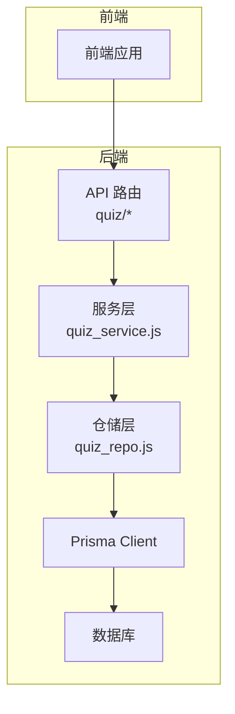
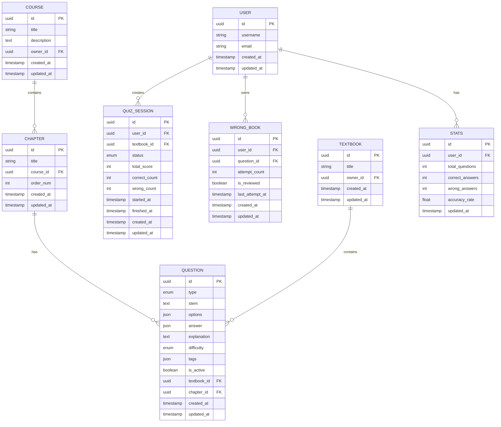
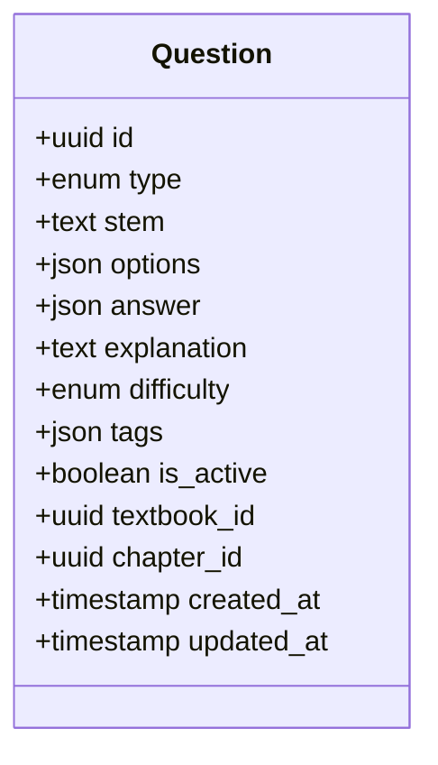
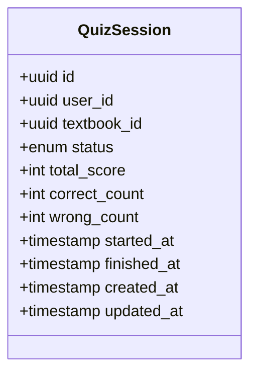
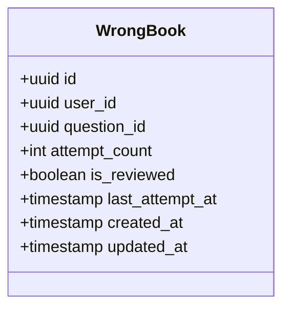
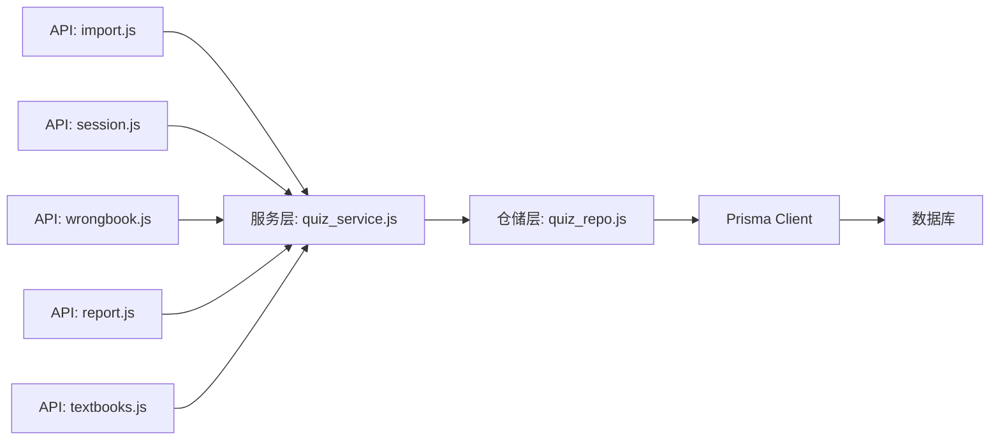

# 题目数据模型

<cite>
**本文引用的文件**   
- [schema.prisma](file://node-jinmao/prisma/schema.prisma)
- [quiz_service.js](file://node-jinmao/service/quiz_service.js)
- [wrongbook.js](file://node-jinmao/API/quiz/wrongbook.js)
- [session.js](file://node-jinmao/API/quiz/session.js)
- [report.js](file://node-jinmao/API/quiz/report.js)
- [import.js](file://node-jinmao/API/quiz/import.js)
- [textbooks.js](file://node-jinmao/API/quiz/textbooks.js)
- [quiz_repo.js](file://node-jinmao/repo/quiz_repo.js)
- [prisma.js](file://node-jinmao/utils/prisma.js)
- [20260704072148_init/migration.sql](file://node-jinmao/prisma/migrations/20260704072148_init/migration.sql)
- [20260709105504_add_course_and_chapter/migration.sql](file://node-jinmao/prisma/migrations/20260709105504_add_course_and_chapter/migration.sql)
- [20260724_add_user_study_record/migration.sql](file://node-jinmao/prisma/migrations/20260724_add_user_study_record/migration.sql)
- [20260729_add_quiz_generating_task_id/migration.sql](file://node-jinmao/prisma/migrations/20260729_add_quiz_generating_task_id/migration.sql)
- [20260729_add_user_billing_fields/migration.sql](file://node-jinmao/prisma/migrations/20260729_add_user_billing_fields/migration.sql)
- [20260729_add_user_daily_activity/migration.sql](file://node-jinmao/prisma/migrations/20260729_add_user_daily_activity/migration.sql)
</cite>

## 目录
1. [简介](#简介)
2. [项目结构](#项目结构)
3. [核心组件](#核心组件)
4. [架构总览](#架构总览)
5. [详细组件分析](#详细组件分析)
6. [依赖关系分析](#依赖关系分析)
7. [性能考虑](#性能考虑)
8. [故障排查指南](#故障排查指南)
9. [结论](#结论)
10. [附录](#附录)

## 简介
本文件围绕 Prisma 中的“题目”相关数据模型进行系统化说明，重点覆盖 Question、QuizSession、WrongBook 等核心实体。内容包含字段定义、数据类型、约束条件与关系映射；题目类型枚举（选择题、填空题、判断题、作文题）；答案存储格式；难度等级设置；并提供高效检索与更新的数据库查询示例。同时总结数据验证规则、业务逻辑约束以及与课程、用户、统计等模块的数据关联关系。

## 项目结构
本项目采用前后端分离架构，后端基于 Node.js + Express，使用 Prisma 作为 ORM 管理数据库。题目相关的数据模型定义在 Prisma Schema 中，并通过迁移脚本维护数据库结构。API 层提供题库导入、练习会话、错题本、报告等功能，服务层封装业务逻辑，仓储层封装 Prisma 查询。

图表来源
- [quiz_service.js](file://node-jinmao/service/quiz_service.js)
- [wrongbook.js](file://node-jinmao/API/quiz/wrongbook.js)
- [session.js](file://node-jinmao/API/quiz/session.js)
- [report.js](file://node-jinmao/API/quiz/report.js)
- [import.js](file://node-jinmao/API/quiz/import.js)
- [textbooks.js](file://node-jinmao/API/quiz/textbooks.js)
- [quiz_repo.js](file://node-jinmao/repo/quiz_repo.js)
- [prisma.js](file://node-jinmao/utils/prisma.js)

章节来源
- [schema.prisma](file://node-jinmao/prisma/schema.prisma)
- [20260704072148_init/migration.sql](file://node-jinmao/prisma/migrations/20260704072148_init/migration.sql)
- [20260709105504_add_course_and_chapter/migration.sql](file://node-jinmao/prisma/migrations/20260709105504_add_course_and_chapter/migration.sql)
- [20260724_add_user_study_record/migration.sql](file://node-jinmao/prisma/migrations/20260724_add_user_study_record/migration.sql)
- [20260729_add_quiz_generating_task_id/migration.sql](file://node-jinmao/prisma/migrations/20260729_add_quiz_generating_task_id/migration.sql)
- [20260729_add_user_billing_fields/migration.sql](file://node-jinmao/prisma/migrations/20260729_add_user_billing_fields/migration.sql)
- [20260729_add_user_daily_activity/migration.sql](file://node-jinmao/prisma/migrations/20260729_add_user_daily_activity/migration.sql)

## 核心组件
- Question：题目主表，承载题干、题型、选项、答案、解析、难度、标签、状态等核心信息。
- QuizSession：练习会话表，记录用户一次答题会话的元数据、时间范围、总分、状态等。
- WrongBook：错题本表，记录用户对某题的错误作答历史与复习标记。
- 其他关联实体：User（用户）、Course/Chapter（课程与章节）、Textbook（教材）、Stats（统计）等，支撑题目与学习流程的完整闭环。

章节来源
- [schema.prisma](file://node-jinmao/prisma/schema.prisma)

## 架构总览
下图展示题目数据模型的核心实体及其关系，以及它们在 API 与服务层的调用路径。

图表来源
- [schema.prisma](file://node-jinmao/prisma/schema.prisma)
- [20260704072148_init/migration.sql](file://node-jinmao/prisma/migrations/20260704072148_init/migration.sql)
- [20260709105504_add_course_and_chapter/migration.sql](file://node-jinmao/prisma/migrations/20260709105504_add_course_and_chapter/migration.sql)
- [20260724_add_user_study_record/migration.sql](file://node-jinmao/prisma/migrations/20260724_add_user_study_record/migration.sql)
- [20260729_add_quiz_generating_task_id/migration.sql](file://node-jinmao/prisma/migrations/20260729_add_quiz_generating_task_id/migration.sql)

## 详细组件分析

### 实体：Question（题目）
- 字段与类型
  - id：主键，唯一标识题目
  - type：题型枚举，支持选择题、填空题、判断题、作文题
  - stem：题干文本
  - options：选项集合（JSON），用于选择题等结构化选项
  - answer：答案（JSON），统一存储不同题型的答案结构
  - explanation：解析文本
  - difficulty：难度等级（如简单、中等、困难）
  - tags：标签（JSON），便于分类与检索
  - is_active：是否启用
  - textbook_id：所属教材外键
  - chapter_id：所属章节外键
  - created_at/updated_at：时间戳
- 约束与关系
  - 与 Textbook 一对多：一个教材包含多道题目
  - 与 Chapter 一对多：一个章节包含多道题目
  - 与 WrongBook 一对多：一道题可被多次错误记录
- 业务规则
  - 题型决定 options 与 answer 的结构校验
  - 难度等级影响推荐与筛选策略
  - is_active 控制题目可见性与可用性

图表来源
- [schema.prisma](file://node-jinmao/prisma/schema.prisma)

章节来源
- [schema.prisma](file://node-jinmao/prisma/schema.prisma)
- [20260704072148_init/migration.sql](file://node-jinmao/prisma/migrations/20260704072148_init/migration.sql)

### 实体：QuizSession（练习会话）
- 字段与类型
  - id：主键
  - user_id：用户外键
  - textbook_id：教材外键（可选，按教材组织练习）
  - status：会话状态（进行中、已完成、已取消）
  - total_score：总分
  - correct_count/wrong_count：正确/错误计数
  - started_at/finished_at：开始/结束时间
  - created_at/updated_at：时间戳
- 约束与关系
  - 与 User 一对多：一个用户有多次会话
  - 与 Textbook 一对多：按教材维度统计
- 业务规则
  - 会话开始时初始化状态为进行中
  - 结束时根据答题结果更新分数与计数

图表来源
- [schema.prisma](file://node-jinmao/prisma/schema.prisma)

章节来源
- [schema.prisma](file://node-jinmao/prisma/schema.prisma)
- [20260704072148_init/migration.sql](file://node-jinmao/prisma/migrations/20260704072148_init/migration.sql)

### 实体：WrongBook（错题本）
- 字段与类型
  - id：主键
  - user_id：用户外键
  - question_id：题目外键
  - attempt_count：错误尝试次数
  - is_reviewed：是否已复习
  - last_attempt_at：最近一次错误时间
  - created_at/updated_at：时间戳
- 约束与关系
  - 与 User 一对多：每个用户的错题独立
  - 与 Question 一对多：同一题可能被多次加入错题本
- 业务规则
  - 答错时增加尝试次数并更新时间
  - 复习后标记 is_reviewed，便于后续推送

图表来源
- [schema.prisma](file://node-jinmao/prisma/schema.prisma)

章节来源
- [schema.prisma](file://node-jinmao/prisma/schema.prisma)
- [20260704072148_init/migration.sql](file://node-jinmao/prisma/migrations/20260704072148_init/migration.sql)

### 题目类型与答案存储格式
- 题型枚举
  - 选择题：options 为选项数组，answer 为正确选项索引或值
  - 填空题：answer 为标准答案字符串或正则匹配规则
  - 判断题：answer 为布尔值
  - 作文题：answer 为评分要点或参考范文
- 答案存储建议
  - 使用 JSON 统一存储，便于扩展与校验
  - 针对不同类型定义严格的 schema 校验规则

章节来源
- [schema.prisma](file://node-jinmao/prisma/schema.prisma)

### 难度等级设置
- 常见等级：简单、中等、困难
- 用途：题目筛选、推荐算法、学习路径规划

章节来源
- [schema.prisma](file://node-jinmao/prisma/schema.prisma)

### 数据验证规则与业务逻辑约束
- 必填字段：type、stem、answer、difficulty
- 题型一致性：options 仅在选择题存在；answer 结构与 type 对应
- 有效性：is_active 控制题目发布状态
- 关联完整性：textbook_id/chapter_id 需指向有效实体
- 会话约束：status 状态机（进行中→已完成/已取消）
- 错题本约束：attempt_count≥0，last_attempt_at 更新策略

章节来源
- [quiz_service.js](file://node-jinmao/service/quiz_service.js)
- [wrongbook.js](file://node-jinmao/API/quiz/wrongbook.js)
- [session.js](file://node-jinmao/API/quiz/session.js)

### 与其他模块的数据关联关系
- 用户模块：会话、错题本、统计数据均与用户关联
- 课程与章节：题目归属章节，章节归属课程，形成层级结构
- 教材模块：题目归属教材，支持按教材导入与导出
- 统计模块：汇总正确率、答题量等指标

章节来源
- [schema.prisma](file://node-jinmao/prisma/schema.prisma)
- [20260709105504_add_course_and_chapter/migration.sql](file://node-jinmao/prisma/migrations/20260709105504_add_course_and_chapter/migration.sql)
- [20260724_add_user_study_record/migration.sql](file://node-jinmao/prisma/migrations/20260724_add_user_study_record/migration.sql)

## 依赖关系分析
- API 层依赖服务层，服务层依赖仓储层，仓储层通过 Prisma Client 访问数据库
- 题目相关 API：导入、会话、错题本、报告、教材列表等
- 关键依赖文件如下所示

图表来源
- [import.js](file://node-jinmao/API/quiz/import.js)
- [session.js](file://node-jinmao/API/quiz/session.js)
- [wrongbook.js](file://node-jinmao/API/quiz/wrongbook.js)
- [report.js](file://node-jinmao/API/quiz/report.js)
- [textbooks.js](file://node-jinmao/API/quiz/textbooks.js)
- [quiz_service.js](file://node-jinmao/service/quiz_service.js)
- [quiz_repo.js](file://node-jinmao/repo/quiz_repo.js)
- [prisma.js](file://node-jinmao/utils/prisma.js)

章节来源
- [quiz_service.js](file://node-jinmao/service/quiz_service.js)
- [quiz_repo.js](file://node-jinmao/repo/quiz_repo.js)
- [prisma.js](file://node-jinmao/utils/prisma.js)

## 性能考虑
- 索引优化
  - 对高频查询字段建立索引：user_id、textbook_id、chapter_id、type、difficulty、is_active
  - 复合索引：(user_id, textbook_id)、(chapter_id, difficulty)
- 查询优化
  - 分页与限制：避免一次性加载大量题目
  - 选择性字段：仅返回必要字段，减少网络传输
  - 预加载关联：按需 include 关联实体，避免 N+1 问题
- 写入优化
  - 批量插入：导入题目时使用事务与批量写入
  - 异步处理：生成任务与报告计算异步化

[本节为通用指导，不直接分析具体文件]

## 故障排查指南
- 常见问题
  - 题型与答案不一致：检查 answer 结构与 type 的匹配
  - 会话状态异常：确认状态机转换逻辑
  - 错题本未更新：检查错误判定与写入逻辑
- 定位方法
  - 查看日志与错误堆栈
  - 使用 Prisma Studio 或数据库工具检查数据一致性
  - 逐步断点调试服务层与仓储层

章节来源
- [quiz_service.js](file://node-jinmao/service/quiz_service.js)
- [wrongbook.js](file://node-jinmao/API/quiz/wrongbook.js)
- [session.js](file://node-jinmao/API/quiz/session.js)

## 结论
本题目数据模型以 Question、QuizSession、WrongBook 为核心，结合用户、课程、章节、教材等实体，构建了完整的刷题与学习闭环。通过统一的 JSON 答案存储与严格的类型校验，确保数据一致性与可扩展性。配合合理的索引与查询策略，可实现高效的检索与更新。建议在导入、会话、错题本与报告等关键环节加强数据验证与事务控制，保障系统稳定性与性能。

[本节为总结，不直接分析具体文件]

## 附录

### 高效检索与更新示例（概念性）
- 按教材与难度检索题目
  - 条件：textbook_id、difficulty、is_active
  - 排序：difficulty 升序，created_at 降序
  - 分页：limit/offset
- 更新题目状态
  - 条件：id
  - 更新：is_active、updated_at
- 创建练习会话
  - 插入：user_id、textbook_id、status、started_at
  - 提交后更新：total_score、correct_count、wrong_count、finished_at
- 记录错题
  - 条件：user_id、question_id
  - 更新：attempt_count、is_reviewed、last_attempt_at

[本节为概念性示例，不直接分析具体文件]