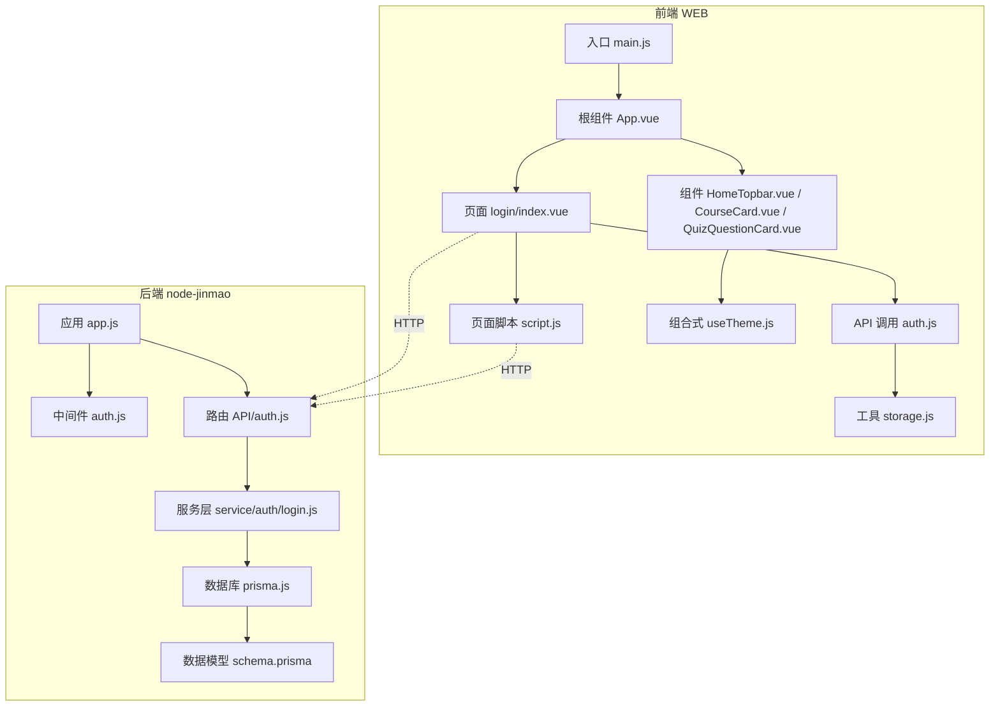
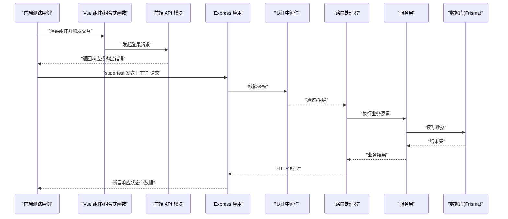
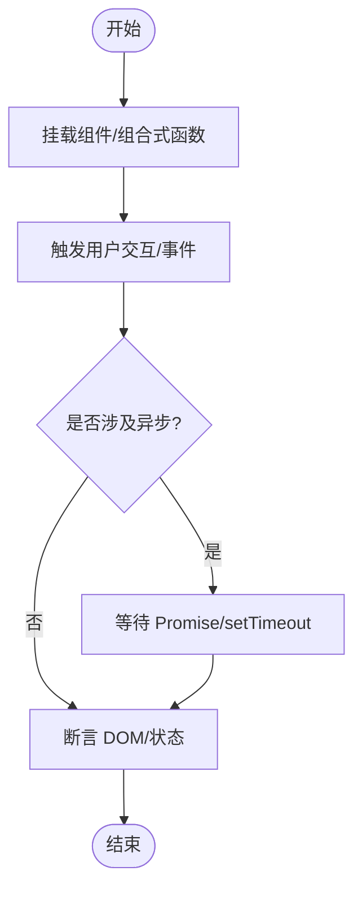
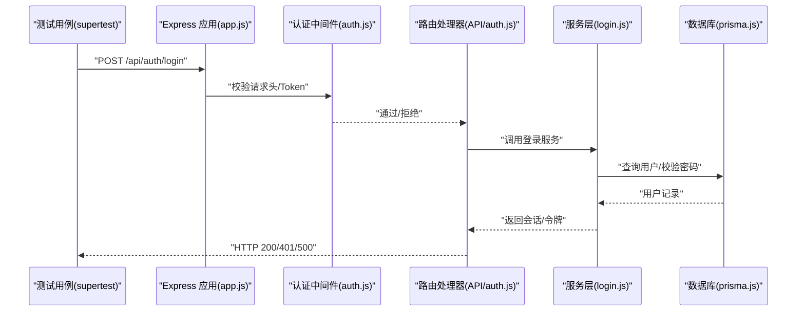
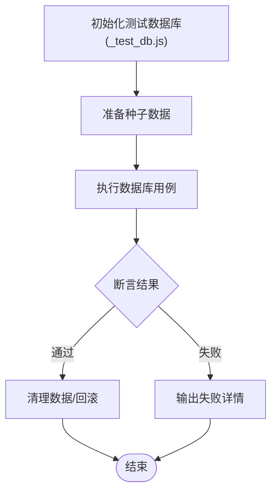
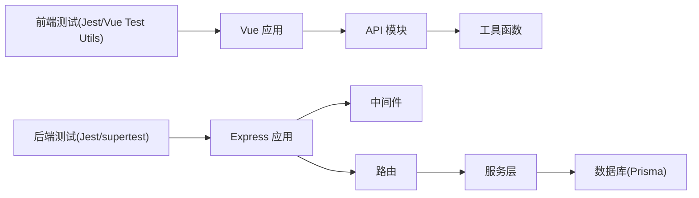

# 单元测试

<cite>
**本文引用的文件**   
- [package.json](file://WEB/package.json)
- [vite.config.js](file://WEB/vite.config.js)
- [App.vue](file://WEB/src/App.vue)
- [main.js](file://WEB/src/main.js)
- [auth.js](file://WEB/src/api/auth.js)
- [storage.js](file://WEB/src/utils/storage.js)
- [useTheme.js](file://WEB/src/composables/useTheme.js)
- [HomeTopbar.vue](file://WEB/src/components/HomeTopbar.vue)
- [CourseCard.vue](file://WEB/src/components/CourseCard.vue)
- [QuizQuestionCard.vue](file://WEB/src/components/quiz/QuizQuestionCard.vue)
- [index.vue](file://WEB/src/pages/login/index.vue)
- [script.js](file://WEB/src/pages/login/script.js)
- [app.js](file://node-jinmao/app.js)
- [auth.js](file://node-jinmao/middleware/auth.js)
- [auth.js](file://node-jinmao/API/auth.js)
- [login.js](file://node-jinmao/service/auth/login.js)
- [prisma.js](file://node-jinmao/utils/prisma.js)
- [schema.prisma](file://node-jinmao/prisma/schema.prisma)
- [_test_db.js](file://node-jinmao/_test_db.js)
- [package.json](file://node-jinmao/package.json)
</cite>

## 目录
1. [简介](#简介)
2. [项目结构](#项目结构)
3. [核心组件](#核心组件)
4. [架构总览](#架构总览)
5. [详细组件分析](#详细组件分析)
6. [依赖分析](#依赖分析)
7. [性能考虑](#性能考虑)
8. [故障排查指南](#故障排查指南)
9. [结论](#结论)
10. [附录](#附录)

## 简介
本文件面向“金毛教你学重构版”项目的单元测试实践，覆盖前端 Vue 组件（Jest + Vue Test Utils）与后端 Node.js 服务（Express 路由、中间件、服务层）的测试策略。内容包含：
- 前端：组件渲染、交互事件、组合式函数、API 调用 Mock、异步状态更新、错误分支覆盖
- 后端：Express 路由与中间件集成测试、服务层单元测试、数据库操作 Mock、错误场景处理
- 工具函数：纯函数与副作用函数的隔离测试
- 覆盖率统计与报告生成、CI 自动化执行建议

## 项目结构
本项目为前后端分离结构：
- WEB：Vue 3 + Vite 前端工程
- node-jinmao：Node.js + Express 后端工程，使用 Prisma 管理数据库

图表来源
- [main.js](file://WEB/src/main.js)
- [App.vue](file://WEB/src/App.vue)
- [index.vue](file://WEB/src/pages/login/index.vue)
- [script.js](file://WEB/src/pages/login/script.js)
- [auth.js](file://WEB/src/api/auth.js)
- [useTheme.js](file://WEB/src/composables/useTheme.js)
- [HomeTopbar.vue](file://WEB/src/components/HomeTopbar.vue)
- [CourseCard.vue](file://WEB/src/components/CourseCard.vue)
- [QuizQuestionCard.vue](file://WEB/src/components/quiz/QuizQuestionCard.vue)
- [app.js](file://node-jinmao/app.js)
- [auth.js](file://node-jinmao/middleware/auth.js)
- [auth.js](file://node-jinmao/API/auth.js)
- [login.js](file://node-jinmao/service/auth/login.js)
- [prisma.js](file://node-jinmao/utils/prisma.js)
- [schema.prisma](file://node-jinmao/prisma/schema.prisma)

章节来源
- [package.json](file://WEB/package.json)
- [vite.config.js](file://WEB/vite.config.js)
- [package.json](file://node-jinmao/package.json)

## 核心组件
- 前端测试框架与工具链
  - Jest 作为测试运行器与断言库
  - Vue Test Utils 用于挂载、触发事件、查询 DOM
  - 可选：@vue/test-utils v2、jsdom 环境配置
- 后端测试框架与工具链
  - Jest 或 Mocha/Chai（以 Jest 为例）
  - supertest 进行 HTTP 接口集成测试
  - 数据库 Mock：Prisma Client 替换或内存数据库（SQLite）

章节来源
- [package.json](file://WEB/package.json)
- [package.json](file://node-jinmao/package.json)

## 架构总览
下图展示从前端请求到后端服务处理的端到端流程，以及测试中如何对关键节点进行 Mock 与验证。

图表来源
- [index.vue](file://WEB/src/pages/login/index.vue)
- [script.js](file://WEB/src/pages/login/script.js)
- [auth.js](file://WEB/src/api/auth.js)
- [app.js](file://node-jinmao/app.js)
- [auth.js](file://node-jinmao/middleware/auth.js)
- [auth.js](file://node-jinmao/API/auth.js)
- [login.js](file://node-jinmao/service/auth/login.js)
- [prisma.js](file://node-jinmao/utils/prisma.js)

## 详细组件分析

### 前端 Vue 组件测试（Jest + Vue Test Utils）
- 目标组件
  - 页面级：登录页 index.vue
  - 通用组件：HomeTopbar.vue、CourseCard.vue、QuizQuestionCard.vue
  - 组合式函数：useTheme.js
  - API 模块：auth.js
  - 工具函数：storage.js
- 测试要点
  - 渲染与快照：确保组件结构与样式稳定
  - 用户交互：点击、输入、表单提交等事件触发与状态更新
  - 组合式函数：主题切换、响应式状态变化
  - API 调用：Mock fetch/axios，模拟成功/失败、超时、网络异常
  - 异步处理：await Promise、setTimeout、微任务队列
  - 错误边界：捕获并显示错误信息，避免崩溃
- 推荐断言
  - DOM 文本、属性、类名
  - 组件 props/emits
  - 组合式函数返回值与副作用
  - 存储读写（localStorage/sessionStorage）

章节来源
- [index.vue](file://WEB/src/pages/login/index.vue)
- [script.js](file://WEB/src/pages/login/script.js)
- [auth.js](file://WEB/src/api/auth.js)
- [useTheme.js](file://WEB/src/composables/useTheme.js)
- [HomeTopbar.vue](file://WEB/src/components/HomeTopbar.vue)
- [CourseCard.vue](file://WEB/src/components/CourseCard.vue)
- [QuizQuestionCard.vue](file://WEB/src/components/quiz/QuizQuestionCard.vue)
- [storage.js](file://WEB/src/utils/storage.js)

### 后端 Express 路由与中间件测试
- 目标模块
  - 应用入口：app.js
  - 认证中间件：middleware/auth.js
  - 路由处理器：API/auth.js
  - 服务层：service/auth/login.js
  - 数据库访问：utils/prisma.js
- 测试策略
  - 中间件：构造 req/res/next，验证鉴权逻辑（如 token 解析、权限判断）
  - 路由：使用 supertest 发送 HTTP 请求，断言状态码、响应体、头部
  - 服务层：直接调用函数，Mock 外部依赖（数据库、第三方 API）
  - 数据库：使用内存 SQLite 或 Mock Prisma Client，保证幂等与可重复性
- 常见场景
  - 正常登录流程：参数校验、密码比对、签发令牌
  - 异常路径：无效凭证、过期令牌、服务器内部错误
  - 并发与安全：限流、防重放、敏感信息脱敏

图表来源
- [app.js](file://node-jinmao/app.js)
- [auth.js](file://node-jinmao/middleware/auth.js)
- [auth.js](file://node-jinmao/API/auth.js)
- [login.js](file://node-jinmao/service/auth/login.js)
- [prisma.js](file://node-jinmao/utils/prisma.js)

章节来源
- [app.js](file://node-jinmao/app.js)
- [auth.js](file://node-jinmao/middleware/auth.js)
- [auth.js](file://node-jinmao/API/auth.js)
- [login.js](file://node-jinmao/service/auth/login.js)
- [prisma.js](file://node-jinmao/utils/prisma.js)

### 数据库操作的单元测试（Prisma）
- 目标
  - 验证数据模型与迁移一致性
  - 确保 CRUD 操作正确性与约束生效
- 策略
  - 使用 _test_db.js 初始化测试数据库
  - 在 beforeEach 中清理数据，afterEach 回滚事务
  - 针对 schema.prisma 中的实体编写增删改查用例
- 注意事项
  - 外键约束、唯一索引、枚举值校验
  - 时间戳、默认值、空值处理
  - 批量操作与事务边界

图表来源
- [_test_db.js](file://node-jinmao/_test_db.js)
- [schema.prisma](file://node-jinmao/prisma/schema.prisma)
- [prisma.js](file://node-jinmao/utils/prisma.js)

章节来源
- [_test_db.js](file://node-jinmao/_test_db.js)
- [schema.prisma](file://node-jinmao/prisma/schema.prisma)
- [prisma.js](file://node-jinmao/utils/prisma.js)

### 工具函数与异步操作测试
- 工具函数
  - 纯函数：输入输出确定性，无需外部依赖
  - 副作用函数：封装 localStorage、时间、随机数等，便于 Mock
- 异步操作
  - Promise 链与 async/await 的断言
  - setTimeout、setInterval 的模拟与等待
  - 错误边界与重试机制的覆盖

章节来源
- [storage.js](file://WEB/src/utils/storage.js)
- [useTheme.js](file://WEB/src/composables/useTheme.js)
- [auth.js](file://WEB/src/api/auth.js)

### 错误场景覆盖
- 前端
  - 网络错误、超时、服务端 5xx、4xx 分支
  - 表单校验失败、必填项缺失
  - 组件内部异常捕获与降级展示
- 后端
  - 参数校验失败、权限不足、资源不存在
  - 数据库连接失败、事务回滚
  - 第三方服务不可用时的熔断与重试

章节来源
- [auth.js](file://WEB/src/api/auth.js)
- [auth.js](file://node-jinmao/middleware/auth.js)
- [login.js](file://node-jinmao/service/auth/login.js)

## 依赖分析
- 前端依赖
  - Vue 3、Vite、Jest、Vue Test Utils、jsdom
- 后端依赖
  - Express、Prisma、Jest、supertest
- 耦合关系
  - 组件与 API 模块松耦合，通过接口契约通信
  - 路由与服务层解耦，便于独立测试
  - 数据库访问抽象化，支持替换实现

图表来源
- [package.json](file://WEB/package.json)
- [package.json](file://node-jinmao/package.json)
- [main.js](file://WEB/src/main.js)
- [app.js](file://node-jinmao/app.js)

章节来源
- [package.json](file://WEB/package.json)
- [package.json](file://node-jinmao/package.json)

## 性能考虑
- 前端
  - 组件懒加载与按需引入，减少首屏压力
  - 事件节流与防抖，降低频繁交互开销
  - 合理使用 computed/watch，避免不必要的重渲染
- 后端
  - 接口响应时间与吞吐优化
  - 数据库查询索引与分页
  - 缓存热点数据，减少重复计算

[本节为通用指导，不直接分析具体文件]

## 故障排查指南
- 常见问题
  - 前端：DOM 未更新、事件未触发、异步未等待
  - 后端：路由未注册、中间件顺序错误、数据库连接失败
  - 数据库：迁移未执行、数据未清理导致污染
- 调试技巧
  - 打印日志与断点
  - 最小化复现用例
  - 逐步剥离依赖定位问题

章节来源
- [auth.js](file://WEB/src/api/auth.js)
- [auth.js](file://node-jinmao/middleware/auth.js)
- [prisma.js](file://node-jinmao/utils/prisma.js)

## 结论
通过系统化的单元测试策略，可有效保障前端组件与后端服务的稳定性与可维护性。建议持续完善测试覆盖率，结合 CI 自动化执行，确保每次变更的质量。

[本节为总结，不直接分析具体文件]

## 附录
- 覆盖率统计与报告
  - 前端：Jest 配置 coverageThreshold、coverageReporters
  - 后端：Jest 配置 coverageDirectory、coverageProvider
- 持续集成
  - GitHub Actions/GitLab CI 中安装依赖、运行测试、生成报告
  - 并行执行测试套件，缩短反馈时间

[本节为通用指导，不直接分析具体文件]