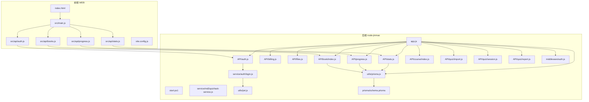
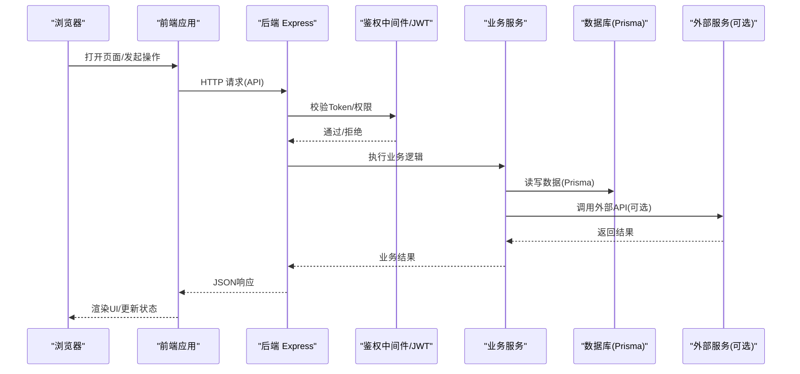
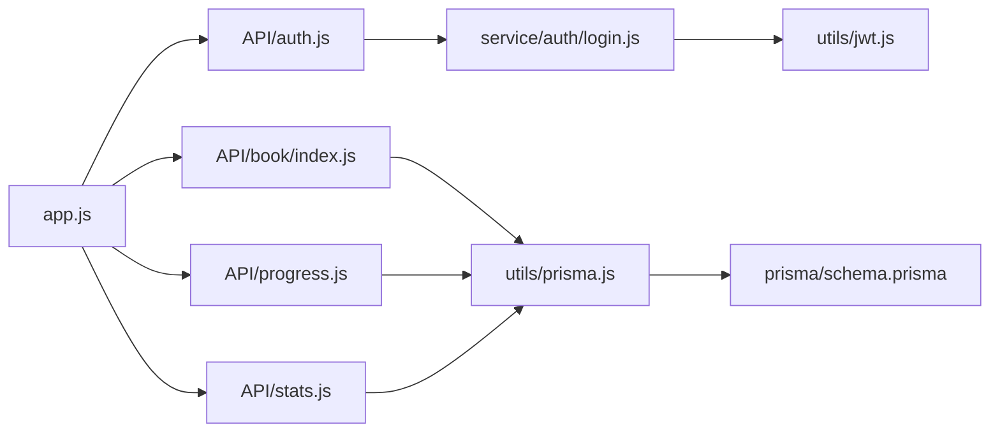

# 性能测试

<cite>
**本文引用的文件**   
- [app.js](file://node-jinmao/app.js)
- [package.json](file://node-jinmao/package.json)
- [schema.prisma](file://node-jinmao/prisma/schema.prisma)
- [auth.js](file://node-jinmao/API/auth.js)
- [billing.js](file://node-jinmao/API/billing.js)
- [files.js](file://node-jinmao/API/files.js)
- [progress.js](file://node-jinmao/API/progress.js)
- [stats.js](file://node-jinmao/API/stats.js)
- [book/index.js](file://node-jinmao/API/book/index.js)
- [course/index.js](file://node-jinmao/API/course/index.js)
- [quiz/import.js](file://node-jinmao/API/quiz/import.js)
- [quiz/session.js](file://node-jinmao/API/quiz/session.js)
- [quiz/report.js](file://node-jinmao/API/quiz/report.js)
- [service/auth/login.js](file://node-jinmao/service/auth/login.js)
- [service/md2quiz/task-service.js](file://node-jinmao/service/md2quiz/task-service.js)
- [utils/prisma.js](file://node-jinmao/utils/prisma.js)
- [utils/jwt.js](file://node-jinmao/utils/jwt.js)
- [middleware/auth.js](file://node-jinmao/middleware/auth.js)
- [index.html](file://WEB/index.html)
- [main.js](file://WEB/src/main.js)
- [api/auth.js](file://WEB/src/api/auth.js)
- [api/books.js](file://WEB/src/api/books.js)
- [api/progress.js](file://WEB/src/api/progress.js)
- [api/stats.js](file://WEB/src/api/stats.js)
- [vite.config.js](file://WEB/vite.config.js)
- [start.ps1](file://node-jinmao/start.ps1)
- [start.ps1](file://start.ps1)
- [部署指南.md](file://宝塔部署指南.md)
- [WSL部署指南.md](file://WSL部署指南.md)
- [数据库结构.md](file://数据库结构.md)
- [API文档.md](file://API文档.md)
</cite>

## 目录
1. [简介](#简介)
2. [项目结构](#项目结构)
3. [核心组件](#核心组件)
4. [架构总览](#架构总览)
5. [详细组件分析](#详细组件分析)
6. [依赖关系分析](#依赖关系分析)
7. [性能考量](#性能考量)
8. [故障排查指南](#故障排查指南)
9. [结论](#结论)
10. [附录](#附录)

## 简介
本性能测试文档面向“金毛教你学重构版”前后端系统，目标是提供一套可落地的负载与压力测试方案。内容覆盖：
- 使用 Apache JMeter 或 k6 进行 API 接口与端到端的负载/压力测试配置与执行
- 针对关键 API 的性能基准测试设计与解读
- 数据库查询性能优化验证（基于 Prisma + 关系型数据库）
- 前端页面性能测试方法（加载时间、渲染性能、内存使用等指标监控）
- 并发用户模拟、资源消耗分析与瓶颈识别
- 性能测试环境搭建、场景设计、报告分析与优化建议

本指南兼顾非技术读者与技术读者，通过分层说明与图示帮助快速上手并深入理解。

## 项目结构
本项目包含前后端两部分：
- 后端：Node.js 应用，Express 路由组织在 API 目录，服务逻辑在 service 目录，数据访问通过 Prisma ORM，中间件用于鉴权等横切关注点
- 前端：Vue 3 + Vite 构建的 SPA，API 调用集中在 src/api 目录，入口为 index.html 与 main.js

图表来源
- [app.js](file://node-jinmao/app.js)
- [package.json](file://node-jinmao/package.json)
- [schema.prisma](file://node-jinmao/prisma/schema.prisma)
- [index.html](file://WEB/index.html)
- [main.js](file://WEB/src/main.js)
- [vite.config.js](file://WEB/vite.config.js)

章节来源
- [app.js](file://node-jinmao/app.js)
- [package.json](file://node-jinmao/package.json)
- [index.html](file://WEB/index.html)
- [main.js](file://WEB/src/main.js)
- [vite.config.js](file://WEB/vite.config.js)

## 核心组件
- 后端入口与路由挂载：Express 应用初始化与路由注册，统一中间件（鉴权、日志、错误处理）
- 鉴权与令牌：JWT 生成与校验，登录流程
- 业务 API：图书、课程、题库导入、会话、报告、计费、进度、统计等
- 数据层：Prisma ORM 与数据库连接管理
- 任务与服务：异步任务编排（如 md2quiz 处理）、SSE 流式输出
- 前端 API 客户端：封装 HTTP 请求、鉴权头注入、错误处理
- 构建与运行：Vite 开发/生产构建，PowerShell 启动脚本

章节来源
- [app.js](file://node-jinmao/app.js)
- [API/auth.js](file://node-jinmao/API/auth.js)
- [service/auth/login.js](file://node-jinmao/service/auth/login.js)
- [utils/jwt.js](file://node-jinmao/utils/jwt.js)
- [API/book/index.js](file://node-jinmao/API/book/index.js)
- [API/progress.js](file://node-jinmao/API/progress.js)
- [API/stats.js](file://node-jinmao/API/stats.js)
- [utils/prisma.js](file://node-jinmao/utils/prisma.js)
- [service/md2quiz/task-service.js](file://node-jinmao/service/md2quiz/task-service.js)
- [src/api/auth.js](file://WEB/src/api/auth.js)
- [src/api/books.js](file://WEB/src/api/books.js)
- [src/api/progress.js](file://WEB/src/api/progress.js)
- [src/api/stats.js](file://WEB/src/api/stats.js)

## 架构总览
下图展示从浏览器到后端 API、再到数据库与外部服务的整体交互路径，便于定位性能瓶颈与规划压测场景。

图表来源
- [app.js](file://node-jinmao/app.js)
- [middleware/auth.js](file://node-jinmao/middleware/auth.js)
- [utils/jwt.js](file://node-jinmao/utils/jwt.js)
- [utils/prisma.js](file://node-jinmao/utils/prisma.js)

## 详细组件分析

### 后端 API 性能基线测试（JMeter/k6）
- 目标接口
  - 认证登录：POST /api/auth/login
  - 图书列表/详情：GET /api/book/list, GET /api/book/detail
  - 进度上报：POST /api/progress
  - 统计查询：GET /api/stats
  - 题库导入：POST /api/quiz/import（长耗时任务，需关注队列与SSE）
  - 会话管理：POST /api/quiz/session
  - 报告查询：GET /api/quiz/report
- 压测策略
  - 单接口基线：固定并发（如 50/100/200），观察 P50/P90/P99 延迟、吞吐、错误率
  - 混合场景：按真实比例组合登录、浏览、提交、查询等接口
  - 阶梯加压：逐步提升并发，寻找拐点（CPU/IO/锁竞争）
  - 长稳测试：持续高负载（如 1h），观察内存泄漏、连接池耗尽
- 关键指标
  - 吞吐量（req/s）、平均/分位延迟、错误率、资源利用率（CPU/内存/IO/网络）
  - 数据库慢查询、连接池等待、缓存命中率（如有）
- 工具配置要点
  - JMeter：线程组（并发数、Ramp-Up、循环次数）、HTTP 请求默认值、CSV 数据源、监听器/聚合报告
  - k6：scenario 定义、VU 数量、迭代时长、阈值（p95 < X ms、错误率 < Y%）、输出（JSON/InfluxDB/Grafana）

章节来源
- [API/auth.js](file://node-jinmao/API/auth.js)
- [API/book/index.js](file://node-jinmao/API/book/index.js)
- [API/progress.js](file://node-jinmao/API/progress.js)
- [API/stats.js](file://node-jinmao/API/stats.js)
- [API/quiz/import.js](file://node-jinmao/API/quiz/import.js)
- [API/quiz/session.js](file://node-jinmao/API/quiz/session.js)
- [API/quiz/report.js](file://node-jinmao/API/quiz/report.js)

### 数据库查询性能优化验证（Prisma）
- 关注点
  - 慢查询定位：启用慢查询日志，结合 EXPLAIN 分析
  - 索引优化：高频过滤字段、排序字段、关联字段建立合适索引
  - 查询复杂度：避免 N+1 查询，合理使用 include/select
  - 连接池：合理设置最大连接数、超时、重试
- 验证方法
  - 对比优化前后 P95/P99 延迟、吞吐变化
  - 监控数据库 CPU、I/O、锁等待、连接池使用率
  - 对热点接口做回归压测，确保无退化

章节来源
- [utils/prisma.js](file://node-jinmao/utils/prisma.js)
- [schema.prisma](file://node-jinmao/prisma/schema.prisma)
- [数据库结构.md](file://数据库结构.md)

### 前端页面性能测试（加载、渲染、内存）
- 指标
  - 首屏时间（FCP/LCP）、可交互时间（TTI）、总阻塞时间（TBT）
  - 渲染帧率（FPS）、主线程占用、布局抖动
  - 内存使用峰值、垃圾回收频率
- 方法与工具
  - Lighthouse：自动化审计，生成性能评分与建议
  - Chrome DevTools Performance/Memory：录制性能面板，分析长任务与内存快照
  - WebPageTest：多地域、多设备、多连接条件测试
  - 自定义埋点：Performance API 采集关键时间点
- 优化方向
  - 代码分割、懒加载、图片压缩与 CDN
  - 减少重排重绘、虚拟列表、Web Worker 计算密集型任务
  - 缓存策略（HTTP Cache、Service Worker）

章节来源
- [index.html](file://WEB/index.html)
- [main.js](file://WEB/src/main.js)
- [vite.config.js](file://WEB/vite.config.js)

### 并发用户模拟与资源消耗分析
- 并发模型
  - 后端：Node.js 单线程事件循环，注意 I/O 密集与 CPU 密集任务的区分；必要时水平扩展
  - 数据库：连接池上限、事务粒度、锁竞争
  - 前端：VU/线程数受限于压测机与网络带宽
- 资源监控
  - 服务器：CPU、内存、磁盘 I/O、网络 I/O、进程句柄
  - 数据库：连接数、慢查询、锁等待、缓冲池命中率
  - 应用：GC 停顿、堆大小、事件循环延迟
- 瓶颈识别
  - 通过 APM/日志/指标定位热点接口与慢查询
  - 结合火焰图与 Profiling 定位 CPU/IO 热点

章节来源
- [app.js](file://node-jinmao/app.js)
- [utils/prisma.js](file://node-jinmao/utils/prisma.js)

### 性能测试环境搭建
- 环境要求
  - Node.js 版本与依赖安装
  - 数据库实例（本地或云数据库）
  - 对象存储（MinIO）与必要的外部服务配置
- 启动步骤
  - 后端：使用 PowerShell 脚本启动服务
  - 前端：Vite 开发服务器或构建静态资源
- 注意事项
  - 隔离测试环境与生产环境
  - 数据准备与脱敏
  - 监控与告警前置

章节来源
- [start.ps1](file://node-jinmao/start.ps1)
- [start.ps1](file://start.ps1)
- [部署指南.md](file://宝塔部署指南.md)
- [WSL部署指南.md](file://WSL部署指南.md)

### 测试场景设计
- 典型场景
  - 登录风暴：短时间高并发登录，验证限流与幂等
  - 图书浏览：分页列表与详情读取，关注缓存命中
  - 进度上报：高频写入，关注写入放大与锁竞争
  - 统计查询：复杂聚合，关注慢查询与索引
  - 题库导入：长任务与 SSE，关注队列与背压
- 场景参数
  - 并发数、Ramp-Up、持续时间、思考时间、数据分布
- 验收标准
  - 延迟分位、吞吐、错误率、资源利用率阈值

章节来源
- [API文档.md](file://API文档.md)

### 性能报告分析与解读
- 报告维度
  - 接口级：吞吐、延迟分位、错误码分布
  - 系统级：CPU/内存/IO/网络趋势
  - 数据库级：慢查询 TopN、连接池使用、锁等待
  - 前端级：LCP/CLS/TBT、内存峰值、帧率
- 分析方法
  - 对比基线与优化后差异
  - 结合日志与 APM 定位根因
  - 回归测试验证改进效果

章节来源
- [API文档.md](file://API文档.md)

## 依赖关系分析
- 模块耦合
  - app.js 集中挂载各 API 路由，职责清晰但需关注中间件顺序
  - 鉴权中间件与 JWT 工具解耦良好，便于替换与扩展
  - Prisma 作为数据访问抽象，屏蔽底层 SQL 细节
- 外部依赖
  - 数据库驱动、对象存储 SDK、第三方 LLM/语音合成等
- 潜在风险
  - 全局状态与连接池未正确释放
  - 第三方服务超时与降级策略缺失

图表来源
- [app.js](file://node-jinmao/app.js)
- [API/auth.js](file://node-jinmao/API/auth.js)
- [API/book/index.js](file://node-jinmao/API/book/index.js)
- [API/progress.js](file://node-jinmao/API/progress.js)
- [API/stats.js](file://node-jinmao/API/stats.js)
- [service/auth/login.js](file://node-jinmao/service/auth/login.js)
- [utils/jwt.js](file://node-jinmao/utils/jwt.js)
- [utils/prisma.js](file://node-jinmao/utils/prisma.js)
- [schema.prisma](file://node-jinmao/prisma/schema.prisma)

章节来源
- [app.js](file://node-jinmao/app.js)
- [package.json](file://node-jinmao/package.json)

## 性能考量
- 后端
  - 事件循环阻塞：避免同步阻塞调用，拆分 CPU 密集任务
  - 连接池与超时：合理配置数据库连接池、外部服务超时与重试
  - 缓存策略：热点数据 Redis/内存缓存，降低数据库压力
  - 水平扩展：无状态服务横向扩容，配合负载均衡
- 数据库
  - 索引与查询优化：覆盖索引、避免全表扫描
  - 读写分离与分库分表：按需演进
- 前端
  - 资源体积与加载：代码分割、懒加载、CDN
  - 渲染优化：虚拟滚动、防抖节流、减少重排重绘
- 压测平台
  - 压测机资源充足，避免成为瓶颈
  - 网络拓扑贴近生产，保证结果可信

[本节为通用指导，不直接分析具体文件]

## 故障排查指南
- 常见问题
  - 登录失败：检查 JWT 配置、密码哈希、中间件顺序
  - 数据库连接失败：检查连接串、权限、连接池上限
  - 接口超时：外部服务超时、慢查询、线程池耗尽
  - 内存泄漏：长时间运行后内存持续增长，检查闭包与事件监听
- 排查步骤
  - 查看应用日志与错误堆栈
  - 使用 APM/Profiler 定位热点与异常
  - 数据库慢查询与 EXPLAIN 分析
  - 前端 Performance 面板与 Memory 快照
- 恢复与加固
  - 增加熔断与降级、重试退避
  - 完善监控告警与自动扩缩容

章节来源
- [middleware/auth.js](file://node-jinmao/middleware/auth.js)
- [utils/jwt.js](file://node-jinmao/utils/jwt.js)
- [utils/prisma.js](file://node-jinmao/utils/prisma.js)

## 结论
通过系统化的负载与压力测试，结合前后端与数据库的全链路监控与分析，可以有效识别性能瓶颈并制定优化策略。建议在每次重大变更前后执行基线回归，确保性能稳定与可预期。

[本节为总结性内容，不直接分析具体文件]

## 附录
- 常用命令与脚本
  - 后端启动：参考 PowerShell 脚本
  - 前端构建：Vite 构建命令
- 参考文档
  - API 文档、数据库结构、部署指南

章节来源
- [start.ps1](file://node-jinmao/start.ps1)
- [start.ps1](file://start.ps1)
- [API文档.md](file://API文档.md)
- [数据库结构.md](file://数据库结构.md)
- [部署指南.md](file://宝塔部署指南.md)
- [WSL部署指南.md](file://WSL部署指南.md)