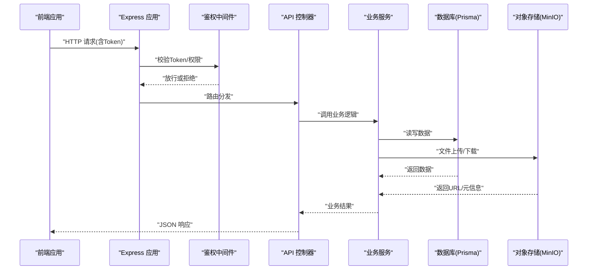
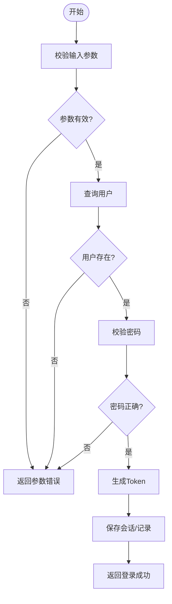
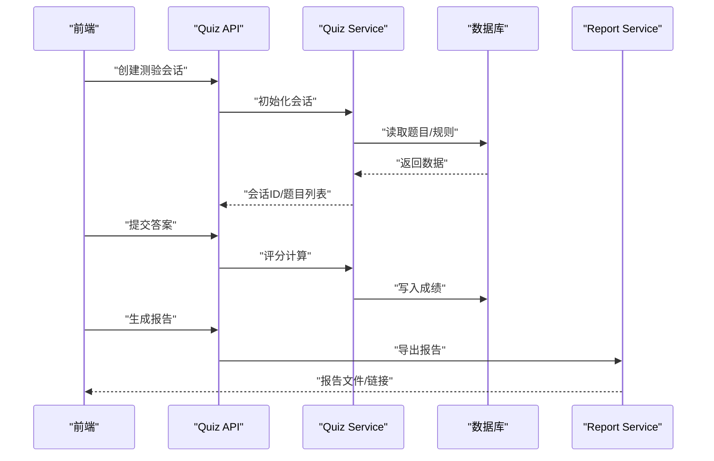
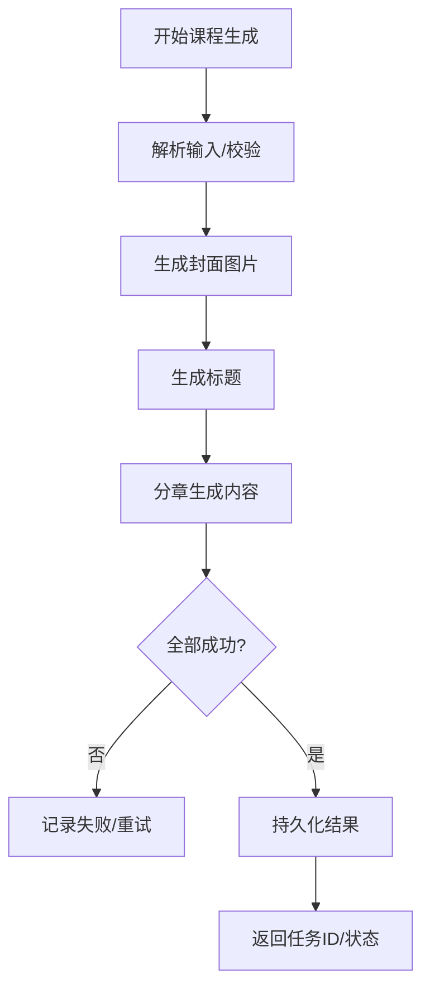
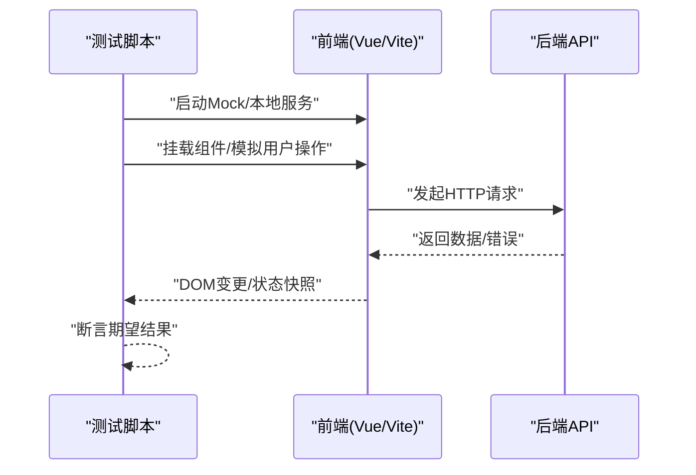
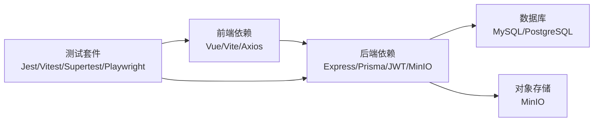

# 测试策略

<cite>
**本文引用的文件**   
- [package.json](file://node-jinmao/package.json)
- [app.js](file://node-jinmao/app.js)
- [_test_db.js](file://node-jinmao/_test_db.js)
- [schema.prisma](file://node-jinmao/prisma/schema.prisma)
- [auth.js](file://node-jinmao/middleware/auth.js)
- [auth.js](file://node-jinmao/API/auth.js)
- [billing.js](file://node-jinmao/API/billing.js)
- [progress.js](file://node-jinmao/API/progress.js)
- [stats.js](file://node-jinmao/API/stats.js)
- [book/index.js](file://node-jinmao/API/book/index.js)
- [course/index.js](file://node-jinmao/API/course/index.js)
- [quiz/session.js](file://node-jinmao/API/quiz/session.js)
- [quiz/report.js](file://node-jinmao/API/quiz/report.js)
- [utils/jwt.js](file://node-jinmao/utils/jwt.js)
- [utils/prisma.js](file://node-jinmao/utils/prisma.js)
- [service/auth/login.js](file://node-jinmao/service/auth/login.js)
- [service/auth/profile.js](file://node-jinmao/service/auth/profile.js)
- [service/POSTbook.js](file://node-jinmao/service/POSTbook.js)
- [service/course_pipeline.js](file://node-jinmao/service/course_pipeline.js)
- [service/quiz_service.js](file://node-jinmao/service/quiz_service.js)
- [service/quiz_report_service.js](file://node-jinmao/service/quiz_report_service.js)
- [utils/input_validator.js](file://node-jinmao/utils/input_validator.js)
- [utils/upload_minio.js](file://node-jinmao/utils/upload_minio.js)
- [config/minio_config.json](file://node-jinmao/config/minio_config.json)
- [package.json](file://WEB/package.json)
- [vite.config.js](file://WEB/vite.config.js)
- [main.js](file://WEB/src/main.js)
- [api/client.js](file://WEB/src/api/client.js)
- [api/auth.js](file://WEB/src/api/auth.js)
- [api/books.js](file://WEB/src/api/books.js)
- [api/quiz.js](file://WEB/src/api/quiz.js)
- [api/stats.js](file://WEB/src/api/stats.js)
- [components/CourseCard.vue](file://WEB/src/components/CourseCard.vue)
- [components/HomeSidebar.vue](file://WEB/src/components/HomeSidebar.vue)
- [pages/login/index.vue](file://WEB/src/pages/login/index.vue)
- [pages/quiz/index.vue](file://WEB/src/pages/quiz/index.vue)
- [e2e-test.ps1](file://test/e2e-test.ps1)
</cite>

## 目录
1. [引言](#引言)
2. [项目结构](#项目结构)
3. [核心组件](#核心组件)
4. [架构总览](#架构总览)
5. [详细组件分析](#详细组件分析)
6. [依赖分析](#依赖分析)
7. [性能考虑](#性能考虑)
8. [故障排查指南](#故障排查指南)
9. [结论](#结论)
10. [附录](#附录)

## 引言
本测试策略面向“金毛教你学重构版”全栈项目，覆盖单元测试、集成测试与端到端测试的实施方案与最佳实践。文档基于仓库中的后端 Node.js（Express + Prisma）、前端 Vue 工程以及现有脚本与配置，给出可落地的测试框架选型、环境搭建、数据准备、Mock 服务、API 自动化、数据库验证、前端组件测试、性能与压力测试、覆盖率统计、持续集成与结果分析等完整方案。

## 项目结构
- 后端：Node.js + Express，使用 Prisma 管理数据库迁移与类型生成；API 按模块拆分在 API 目录，业务逻辑在 service 目录，中间件与工具函数在 middleware 与 utils。
- 前端：Vue 3 + Vite，API 调用集中在 src/api，页面与组件位于 pages 与 components。
- 测试相关：根目录 test 下包含 e2e 脚本与示例数据；后端预留 test 目录用于后续用例组织。

```mermaid
graph TB
subgraph "前端 WEB"
W_main["src/main.js"]
W_api_client["src/api/client.js"]
W_auth_api["src/api/auth.js"]
W_books_api["src/api/books.js"]
W_quiz_api["src/api/quiz.js"]
W_stats_api["src/api/stats.js"]
W_login_page["pages/login/index.vue"]
W_quiz_page["pages/quiz/index.vue"]
W_course_card["components/CourseCard.vue"]
W_home_sidebar["components/HomeSidebar.vue"]
end
subgraph "后端 node-jinmao"
N_app["app.js"]
N_mw_auth["middleware/auth.js"]
N_utils_jwt["utils/jwt.js"]
N_utils_prisma["utils/prisma.js"]
N_api_auth["API/auth.js"]
N_api_billing["API/billing.js"]
N_api_progress["API/progress.js"]
N_api_stats["API/stats.js"]
N_api_book_index["API/book/index.js"]
N_api_course_index["API/course/index.js"]
N_api_quiz_session["API/quiz/session.js"]
N_api_quiz_report["API/quiz/report.js"]
N_svc_auth_login["service/auth/login.js"]
N_svc_auth_profile["service/auth/profile.js"]
N_svc_postbook["service/POSTbook.js"]
N_svc_course_pipeline["service/course_pipeline.js"]
N_svc_quiz_service["service/quiz_service.js"]
N_svc_quiz_report_service["service/quiz_report_service.js"]
N_utils_input_validator["utils/input_validator.js"]
N_utils_upload_minio["utils/upload_minio.js"]
N_cfg_minio["config/minio_config.json"]
N_prisma_schema["prisma/schema.prisma"]
end
W_api_client --> N_app
W_auth_api --> N_api_auth
W_books_api --> N_api_book_index
W_quiz_api --> N_api_quiz_session
W_stats_api --> N_api_stats
N_app --> N_mw_auth
N_mw_auth --> N_utils_jwt
N_api_auth --> N_svc_auth_login
N_api_auth --> N_svc_auth_profile
N_api_book_index --> N_svc_postbook
N_api_course_index --> N_svc_course_pipeline
N_api_quiz_session --> N_svc_quiz_service
N_api_quiz_report --> N_svc_quiz_report_service
N_svc_* --> N_utils_prisma
N_utils_upload_minio --> N_cfg_minio
```

**图表来源** 
- [app.js](file://node-jinmao/app.js)
- [auth.js](file://node-jinmao/middleware/auth.js)
- [jwt.js](file://node-jinmao/utils/jwt.js)
- [prisma.js](file://node-jinmao/utils/prisma.js)
- [auth.js](file://node-jinmao/API/auth.js)
- [billing.js](file://node-jinmao/API/billing.js)
- [progress.js](file://node-jinmao/API/progress.js)
- [stats.js](file://node-jinmao/API/stats.js)
- [book/index.js](file://node-jinmao/API/book/index.js)
- [course/index.js](file://node-jinmao/API/course/index.js)
- [quiz/session.js](file://node-jinmao/API/quiz/session.js)
- [quiz/report.js](file://node-jinmao/API/quiz/report.js)
- [login.js](file://node-jinmao/service/auth/login.js)
- [profile.js](file://node-jinmao/service/auth/profile.js)
- [POSTbook.js](file://node-jinmao/service/POSTbook.js)
- [course_pipeline.js](file://node-jinmao/service/course_pipeline.js)
- [quiz_service.js](file://node-jinmao/service/quiz_service.js)
- [quiz_report_service.js](file://node-jinmao/service/quiz_report_service.js)
- [upload_minio.js](file://node-jinmao/utils/upload_minio.js)
- [minio_config.json](file://node-jinmao/config/minio_config.json)
- [schema.prisma](file://node-jinmao/prisma/schema.prisma)
- [main.js](file://WEB/src/main.js)
- [client.js](file://WEB/src/api/client.js)
- [auth.js](file://WEB/src/api/auth.js)
- [books.js](file://WEB/src/api/books.js)
- [quiz.js](file://WEB/src/api/quiz.js)
- [stats.js](file://WEB/src/api/stats.js)
- [CourseCard.vue](file://WEB/src/components/CourseCard.vue)
- [HomeSidebar.vue](file://WEB/src/components/HomeSidebar.vue)
- [index.vue](file://WEB/src/pages/login/index.vue)
- [index.vue](file://WEB/src/pages/quiz/index.vue)

**章节来源**
- [package.json](file://node-jinmao/package.json)
- [package.json](file://WEB/package.json)
- [vite.config.js](file://WEB/vite.config.js)

## 核心组件
- 认证与鉴权：JWT 签发与校验、登录流程、用户资料接口。
- 题库与测验：会话管理、报告生成、导入与处理。
- 课程与教材：课程流水线、封面生成、章节生成。
- 计费与统计：计费接口、学习进度、统计数据。
- 存储与上传：MinIO 对象存储配置与上传工具。
- 数据库访问：Prisma 客户端封装与迁移。

测试重点：
- 认证链路（登录、鉴权中间件、令牌刷新）
- 题库会话与报告（状态机、边界条件）
- 课程流水线（异步任务、失败重试）
- 计费与统计（幂等性、精度）
- 文件上传（MinIO 连通性与权限）
- 输入校验（非法参数、越界值）

**章节来源**
- [auth.js](file://node-jinmao/middleware/auth.js)
- [auth.js](file://node-jinmao/API/auth.js)
- [login.js](file://node-jinmao/service/auth/login.js)
- [profile.js](file://node-jinmao/service/auth/profile.js)
- [session.js](file://node-jinmao/API/quiz/session.js)
- [report.js](file://node-jinmao/API/quiz/report.js)
- [quiz_service.js](file://node-jinmao/service/quiz_service.js)
- [quiz_report_service.js](file://node-jinmao/service/quiz_report_service.js)
- [POSTbook.js](file://node-jinmao/service/POSTbook.js)
- [course_pipeline.js](file://node-jinmao/service/course_pipeline.js)
- [billing.js](file://node-jinmao/API/billing.js)
- [progress.js](file://node-jinmao/API/progress.js)
- [stats.js](file://node-jinmao/API/stats.js)
- [upload_minio.js](file://node-jinmao/utils/upload_minio.js)
- [input_validator.js](file://node-jinmao/utils/input_validator.js)
- [prisma.js](file://node-jinmao/utils/prisma.js)

## 架构总览
下图展示前后端交互与关键测试切入点：前端通过 HTTP 客户端调用后端 API，后端经中间件鉴权后路由到控制器与服务层，最终访问数据库或外部存储。

**图表来源** 
- [app.js](file://node-jinmao/app.js)
- [auth.js](file://node-jinmao/middleware/auth.js)
- [auth.js](file://node-jinmao/API/auth.js)
- [login.js](file://node-jinmao/service/auth/login.js)
- [profile.js](file://node-jinmao/service/auth/profile.js)
- [session.js](file://node-jinmao/API/quiz/session.js)
- [report.js](file://node-jinmao/API/quiz/report.js)
- [quiz_service.js](file://node-jinmao/service/quiz_service.js)
- [quiz_report_service.js](file://node-jinmao/service/quiz_report_service.js)
- [upload_minio.js](file://node-jinmao/utils/upload_minio.js)
- [prisma.js](file://node-jinmao/utils/prisma.js)

## 详细组件分析

### 认证与鉴权测试
- 目标：验证登录成功/失败、Token 签发与校验、权限控制、过期与刷新。
- 单元：登录服务、Profile 服务、JWT 工具、输入校验器。
- 集成：Auth API 控制器、鉴权中间件、数据库用户表。
- 建议用例：
  - 正常登录、错误密码、账号不存在、重复注册
  - Token 缺失、无效、过期、刷新
  - 无权限访问受保护资源
  - 输入校验失败（空字段、格式错误）

**图表来源** 
- [login.js](file://node-jinmao/service/auth/login.js)
- [profile.js](file://node-jinmao/service/auth/profile.js)
- [auth.js](file://node-jinmao/API/auth.js)
- [auth.js](file://node-jinmao/middleware/auth.js)
- [jwt.js](file://node-jinmao/utils/jwt.js)
- [input_validator.js](file://node-jinmao/utils/input_validator.js)

**章节来源**
- [auth.js](file://node-jinmao/API/auth.js)
- [auth.js](file://node-jinmao/middleware/auth.js)
- [login.js](file://node-jinmao/service/auth/login.js)
- [profile.js](file://node-jinmao/service/auth/profile.js)
- [jwt.js](file://node-jinmao/utils/jwt.js)
- [input_validator.js](file://node-jinmao/utils/input_validator.js)

### 题库与会话测试
- 目标：测验会话创建、题目加载、提交答案、评分与报告生成。
- 单元：Quiz Service、Report Service、任务流处理器。
- 集成：Quiz API（session、report）、数据库题库与报告表。
- 建议用例：
  - 创建会话、获取题目、提交答案、计算得分
  - 报告导出（PDF/HTML）、分页与过滤
  - 并发提交一致性、幂等性

**图表来源** 
- [session.js](file://node-jinmao/API/quiz/session.js)
- [report.js](file://node-jinmao/API/quiz/report.js)
- [quiz_service.js](file://node-jinmao/service/quiz_service.js)
- [quiz_report_service.js](file://node-jinmao/service/quiz_report_service.js)

**章节来源**
- [session.js](file://node-jinmao/API/quiz/session.js)
- [report.js](file://node-jinmao/API/quiz/report.js)
- [quiz_service.js](file://node-jinmao/service/quiz_service.js)
- [quiz_report_service.js](file://node-jinmao/service/quiz_report_service.js)

### 课程流水线与文件上传测试
- 目标：课程生成流水线（封面、标题、章节）、MinIO 上传下载。
- 单元：Course Pipeline、POSTbook、Upload MinIO。
- 集成：Course API、Book API、MinIO 服务。
- 建议用例：
  - 触发课程生成、任务状态跟踪、失败重试
  - 上传大文件、断点续传、权限校验
  - 生成失败的回滚与补偿

**图表来源** 
- [course_pipeline.js](file://node-jinmao/service/course_pipeline.js)
- [POSTbook.js](file://node-jinmao/service/POSTbook.js)
- [upload_minio.js](file://node-jinmao/utils/upload_minio.js)
- [minio_config.json](file://node-jinmao/config/minio_config.json)

**章节来源**
- [course_pipeline.js](file://node-jinmao/service/course_pipeline.js)
- [POSTbook.js](file://node-jinmao/service/POSTbook.js)
- [upload_minio.js](file://node-jinmao/utils/upload_minio.js)
- [minio_config.json](file://node-jinmao/config/minio_config.json)

### 前端组件与 API 调用测试
- 目标：组件渲染、交互行为、API 调用与状态管理。
- 单元：Vue 组件（CourseCard、HomeSidebar）、API Client。
- 集成：Vite Mock、本地开发服务器。
- 建议用例：
  - 组件 props 变化导致渲染更新
  - 表单输入校验与错误提示
  - API 成功/失败分支、Loading 状态
  - 路由跳转与页面状态恢复

**图表来源** 
- [client.js](file://WEB/src/api/client.js)
- [auth.js](file://WEB/src/api/auth.js)
- [books.js](file://WEB/src/api/books.js)
- [quiz.js](file://WEB/src/api/quiz.js)
- [stats.js](file://WEB/src/api/stats.js)
- [CourseCard.vue](file://WEB/src/components/CourseCard.vue)
- [HomeSidebar.vue](file://WEB/src/components/HomeSidebar.vue)
- [index.vue](file://WEB/src/pages/login/index.vue)
- [index.vue](file://WEB/src/pages/quiz/index.vue)

**章节来源**
- [client.js](file://WEB/src/api/client.js)
- [auth.js](file://WEB/src/api/auth.js)
- [books.js](file://WEB/src/api/books.js)
- [quiz.js](file://WEB/src/api/quiz.js)
- [stats.js](file://WEB/src/api/stats.js)
- [CourseCard.vue](file://WEB/src/components/CourseCard.vue)
- [HomeSidebar.vue](file://WEB/src/components/HomeSidebar.vue)
- [index.vue](file://WEB/src/pages/login/index.vue)
- [index.vue](file://WEB/src/pages/quiz/index.vue)

## 依赖分析
- 后端依赖：Express、Prisma、JWT、MinIO SDK、输入校验库。
- 前端依赖：Vue 3、Vite、HTTP 客户端（Axios/Fetch）。
- 测试依赖：建议为后端引入 Jest/Mocha + Supertest，前端引入 Vitest/Jest + Vue Test Utils，E2E 使用 Playwright/Cypress。

**图表来源** 
- [package.json](file://node-jinmao/package.json)
- [package.json](file://WEB/package.json)
- [schema.prisma](file://node-jinmao/prisma/schema.prisma)
- [minio_config.json](file://node-jinmao/config/minio_config.json)

**章节来源**
- [package.json](file://node-jinmao/package.json)
- [package.json](file://WEB/package.json)
- [schema.prisma](file://node-jinmao/prisma/schema.prisma)
- [minio_config.json](file://node-jinmao/config/minio_config.json)

## 性能考虑
- 基准测试：对热点接口（登录、题库加载、报告生成）进行单接口基准测试，关注延迟与吞吐。
- 负载测试：使用 JMeter/Locust/k6 模拟多用户并发，逐步加压至系统瓶颈。
- 压测指标：P95/P99 延迟、错误率、CPU/内存占用、数据库连接池、MinIO I/O。
- 优化建议：缓存热点数据、异步任务队列、数据库索引优化、分页与限流。

[本节为通用指导，不直接分析具体文件]

## 故障排查指南
- 认证失败：检查 JWT 密钥、过期时间、中间件顺序与错误码。
- 数据库连接：确认 Prisma 连接字符串、迁移版本、事务隔离级别。
- MinIO 上传：核对配置、桶权限、网络连通与超时设置。
- 前端报错：查看控制台与网络面板，定位 API 响应与状态管理。
- 日志与追踪：统一日志格式、Trace ID 贯穿请求链路。

**章节来源**
- [auth.js](file://node-jinmao/middleware/auth.js)
- [jwt.js](file://node-jinmao/utils/jwt.js)
- [prisma.js](file://node-jinmao/utils/prisma.js)
- [upload_minio.js](file://node-jinmao/utils/upload_minio.js)
- [client.js](file://WEB/src/api/client.js)

## 结论
本测试策略围绕认证鉴权、题库与报告、课程流水线、文件上传与前端交互等核心能力，构建了从单元到集成的多层测试体系。通过明确的用例设计、Mock 与数据隔离、性能与压测方法，以及覆盖率与 CI 集成，确保系统在重构过程中保持质量稳定与交付高效。

[本节为总结，不直接分析具体文件]

## 附录

### 测试环境与数据管理
- 环境隔离：为测试提供独立数据库实例与 MinIO 桶，避免污染生产数据。
- 数据准备：使用种子脚本与固定数据集，保证用例可重复。
- 清理策略：每个用例前后自动清理临时数据，确保隔离。

**章节来源**
- [_test_db.js](file://node-jinmao/_test_db.js)
- [schema.prisma](file://node-jinmao/prisma/schema.prisma)

### API 自动化测试
- 框架：后端使用 Supertest 对 Express 路由进行 HTTP 级测试。
- 用例范围：登录、鉴权、题库会话、报告生成、计费与统计。
- 断言：状态码、响应体结构、数据库状态、文件上传结果。

**章节来源**
- [auth.js](file://node-jinmao/API/auth.js)
- [billing.js](file://node-jinmao/API/billing.js)
- [progress.js](file://node-jinmao/API/progress.js)
- [stats.js](file://node-jinmao/API/stats.js)
- [book/index.js](file://node-jinmao/API/book/index.js)
- [course/index.js](file://node-jinmao/API/course/index.js)
- [quiz/session.js](file://node-jinmao/API/quiz/session.js)
- [quiz/report.js](file://node-jinmao/API/quiz/report.js)

### 前端组件测试
- 框架：Vitest/Jest + Vue Test Utils，配合 Vite 插件支持。
- 用例范围：组件渲染、事件处理、API 调用分支、路由跳转。
- Mock：使用 Vite Mock 或 MSW 模拟后端接口。

**章节来源**
- [package.json](file://WEB/package.json)
- [vite.config.js](file://WEB/vite.config.js)
- [client.js](file://WEB/src/api/client.js)
- [CourseCard.vue](file://WEB/src/components/CourseCard.vue)
- [HomeSidebar.vue](file://WEB/src/components/HomeSidebar.vue)
- [index.vue](file://WEB/src/pages/login/index.vue)
- [index.vue](file://WEB/src/pages/quiz/index.vue)

### 端到端测试
- 框架：Playwright/Cypress，覆盖关键用户路径（登录、刷题、报告查看）。
- 执行：本地与 CI 并行执行，截图与视频录制辅助定位问题。
- 数据：预置测试账号与题库数据，确保场景稳定。

**章节来源**
- [e2e-test.ps1](file://test/e2e-test.ps1)

### 性能与压力测试
- 工具：k6/JMeter/Locust，编写脚本定义场景与阈值。
- 指标：RT、TPS、错误率、资源使用率。
- 报告：生成 HTML 报告并归档，纳入质量门禁。

[本节为通用指导，不直接分析具体文件]

### 覆盖率统计与 CI 集成
- 覆盖率：后端 Jest 覆盖率、前端 Vitest 覆盖率，设定阈值（如 80%）。
- CI：GitHub Actions/GitLab CI 中运行测试、生成报告、阻断合并。
- 报告：集中展示趋势与回归，便于回溯与改进。

[本节为通用指导，不直接分析具体文件]