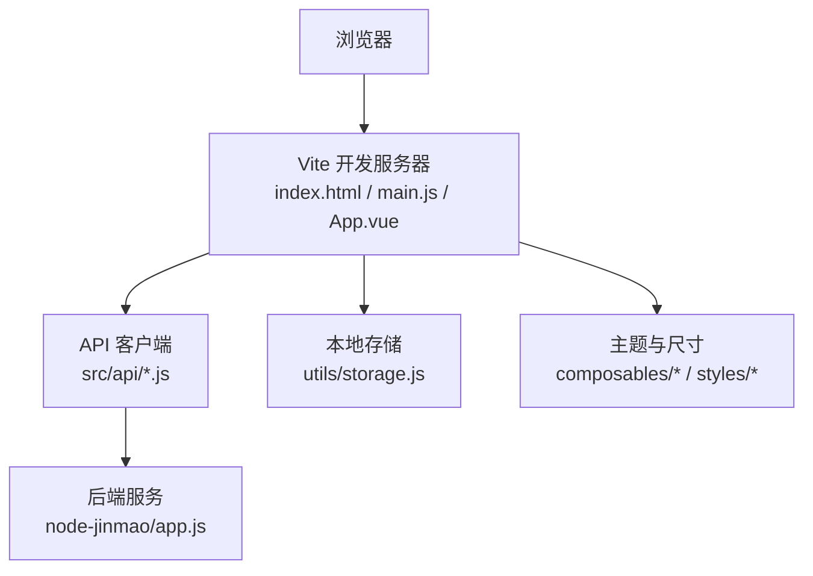
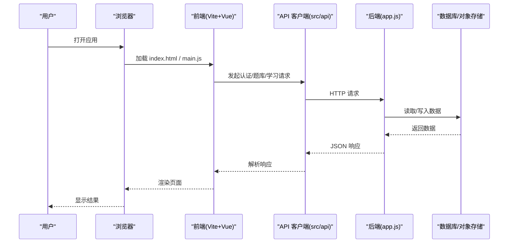
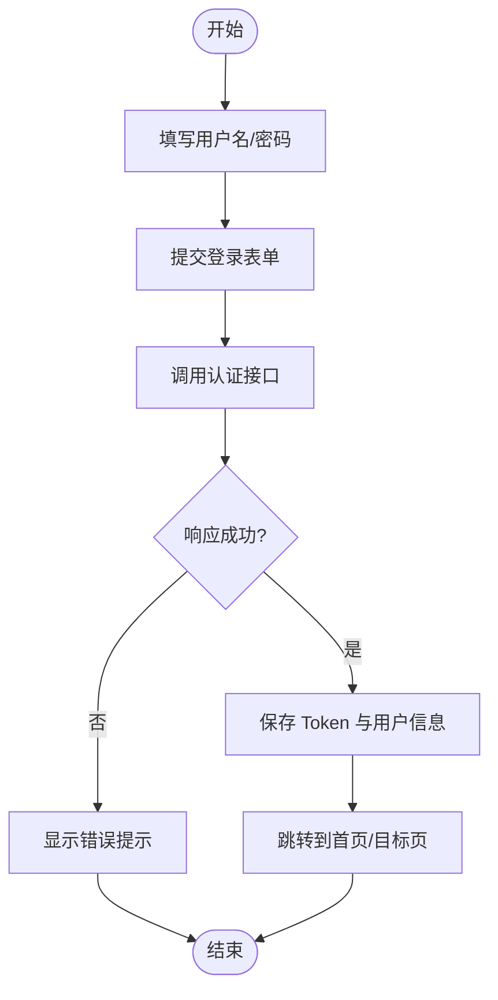
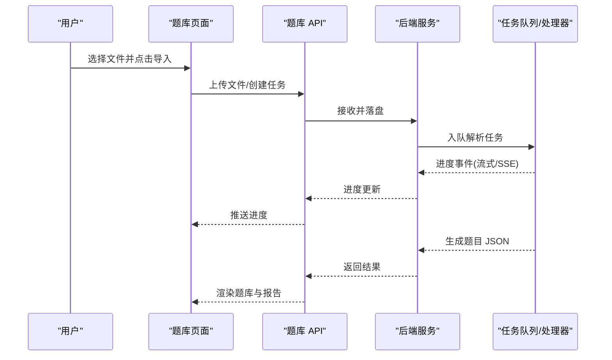
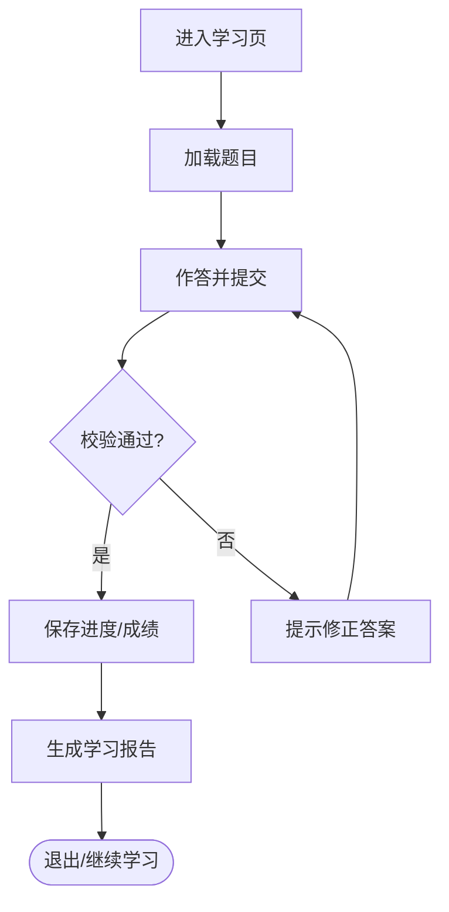
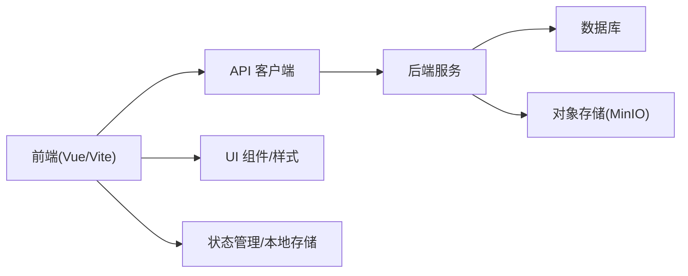

# 端到端测试

<cite>
**本文引用的文件**   
- [package.json](file://WEB/package.json)
- [vite.config.js](file://WEB/vite.config.js)
- [index.html](file://WEB/index.html)
- [main.js](file://WEB/src/main.js)
- [App.vue](file://WEB/src/App.vue)
- [auth.js](file://WEB/src/api/auth.js)
- [quiz.js](file://WEB/src/api/quiz.js)
- [progress.js](file://WEB/src/api/progress.js)
- [stats.js](file://WEB/src/api/stats.js)
- [billing.js](file://WEB/src/api/billing.js)
- [books.js](file://WEB/src/api/books.js)
- [client.js](file://WEB/src/api/client.js)
- [login/index.vue](file://WEB/src/pages/login/index.vue)
- [login/script.js](file://WEB/src/pages/login/script.js)
- [home/index.vue](file://WEB/src/pages/home/index.vue)
- [home/script.js](file://WEB/src/pages/home/script.js)
- [study/index.vue](file://WEB/src/pages/study/index.vue)
- [study/script.js](file://WEB/src/pages/study/script.js)
- [quiz/index.vue](file://WEB/src/pages/quiz/index.vue)
- [quiz/script.js](file://WEB/src/pages/quiz/script.js)
- [quiz/report-script.js](file://WEB/src/pages/quiz/report-script.js)
- [quiz/report.vue](file://WEB/src/pages/quiz/report.vue)
- [stores/auth.js](file://WEB/src/stores/auth.js)
- [utils/storage.js](file://WEB/src/utils/storage.js)
- [composables/useResize.js](file://WEB/src/composables/useResize.js)
- [composables/useTheme.js](file://WEB/src/composables/useTheme.js)
- [styles/index.css](file://WEB/src/styles/index.css)
- [styles/tokens.css](file://WEB/src/styles/tokens.css)
- [e2e-test.ps1](file://test/e2e-test.ps1)
- [app.js](file://node-jinmao/app.js)
- [API文档.md](file://API文档.md)
</cite>

## 目录
1. [简介](#简介)
2. [项目结构](#项目结构)
3. [核心组件](#核心组件)
4. [架构总览](#架构总览)
5. [详细组件分析](#详细组件分析)
6. [依赖分析](#依赖分析)
7. [性能考虑](#性能考虑)
8. [故障排查指南](#故障排查指南)
9. [结论](#结论)
10. [附录](#附录)

## 简介
本文件面向“金毛教你学重构版”的端到端（E2E）测试，目标是基于 Playwright 或 Cypress 构建覆盖登录注册、题库管理、学习功能等核心业务流程的自动化测试套件。文档将说明：
- 如何配置与执行跨浏览器兼容性测试
- 移动端适配与响应式设计的验证方法
- 测试脚本编写规范、页面元素定位策略与测试数据准备
- E2E 在持续集成中的执行与结果报告

## 项目结构
前端采用 Vite + Vue 单页应用，后端为 Node.js 服务。关键入口与模块如下：
- 前端入口：index.html、main.js、App.vue
- API 层：src/api/*（认证、题库、进度、统计、账单、书籍等）
- 页面：pages/login、pages/home、pages/study、pages/quiz
- 状态与工具：stores/auth.js、utils/storage.js、composables/*、styles/*
- 后端入口：node-jinmao/app.js
- 根级脚本：test/e2e-test.ps1（用于触发 E2E 流程）

图表来源
- [index.html](file://WEB/index.html)
- [main.js](file://WEB/src/main.js)
- [App.vue](file://WEB/src/App.vue)
- [client.js](file://WEB/src/api/client.js)
- [app.js](file://node-jinmao/app.js)

章节来源
- [package.json](file://WEB/package.json)
- [vite.config.js](file://WEB/vite.config.js)
- [index.html](file://WEB/index.html)
- [main.js](file://WEB/src/main.js)
- [App.vue](file://WEB/src/App.vue)
- [app.js](file://node-jinmao/app.js)

## 核心组件
- 认证模块
  - 前端：登录页 login/index.vue、script.js；认证状态 stores/auth.js；存储 utils/storage.js
  - 后端：认证相关接口由 app.js 路由分发，具体实现参考 API 文档
- 题库与学习
  - 题库：quiz/index.vue、script.js；report 视图与脚本
  - 学习：study/index.vue、script.js
  - 进度与统计：progress.js、stats.js
- 资源与样式
  - 主题 tokens、全局样式、响应式 composable useResize

章节来源
- [login/index.vue](file://WEB/src/pages/login/index.vue)
- [login/script.js](file://WEB/src/pages/login/script.js)
- [stores/auth.js](file://WEB/src/stores/auth.js)
- [utils/storage.js](file://WEB/src/utils/storage.js)
- [quiz/index.vue](file://WEB/src/pages/quiz/index.vue)
- [quiz/script.js](file://WEB/src/pages/quiz/script.js)
- [quiz/report-script.js](file://WEB/src/pages/quiz/report-script.js)
- [quiz/report.vue](file://WEB/src/pages/quiz/report.vue)
- [study/index.vue](file://WEB/src/pages/study/index.vue)
- [study/script.js](file://WEB/src/pages/study/script.js)
- [progress.js](file://WEB/src/api/progress.js)
- [stats.js](file://WEB/src/api/stats.js)
- [useResize.js](file://WEB/src/composables/useResize.js)
- [tokens.css](file://WEB/src/styles/tokens.css)
- [index.css](file://WEB/src/styles/index.css)

## 架构总览
下图展示 E2E 测试中典型请求链路：浏览器通过 Vite 加载前端，调用 API 客户端访问后端服务，读写数据库与对象存储（如 MinIO），并返回结果渲染到页面。

图表来源
- [main.js](file://WEB/src/main.js)
- [client.js](file://WEB/src/api/client.js)
- [app.js](file://node-jinmao/app.js)

## 详细组件分析

### 认证流程（登录/注册）
- 前端交互
  - 登录页表单提交后调用认证 API，成功后持久化 token 与用户信息
  - 未登录时拦截受保护路由，重定向至登录页
- 后端处理
  - 校验凭据、签发令牌、维护会话或刷新机制
- E2E 用例要点
  - 正常登录、错误密码、邮箱格式校验、验证码/OTP（如有）、登录后跳转、权限控制

图表来源
- [login/index.vue](file://WEB/src/pages/login/index.vue)
- [login/script.js](file://WEB/src/pages/login/script.js)
- [auth.js](file://WEB/src/api/auth.js)
- [stores/auth.js](file://WEB/src/stores/auth.js)
- [utils/storage.js](file://WEB/src/utils/storage.js)

章节来源
- [login/index.vue](file://WEB/src/pages/login/index.vue)
- [login/script.js](file://WEB/src/pages/login/script.js)
- [auth.js](file://WEB/src/api/auth.js)
- [stores/auth.js](file://WEB/src/stores/auth.js)
- [utils/storage.js](file://WEB/src/utils/storage.js)

### 题库管理（导入/编辑/导出）
- 前端交互
  - 题库列表、导入 Markdown/PDF、生成题目、查看报告
- 后端处理
  - 解析文档、生成题目 JSON、任务队列与进度上报、报告聚合
- E2E 用例要点
  - 上传文件、等待任务完成、检查题目数量与类型、导出结果、权限校验

图表来源
- [quiz/index.vue](file://WEB/src/pages/quiz/index.vue)
- [quiz/script.js](file://WEB/src/pages/quiz/script.js)
- [quiz/report-script.js](file://WEB/src/pages/quiz/report-script.js)
- [quiz/report.vue](file://WEB/src/pages/quiz/report.vue)

章节来源
- [quiz/index.vue](file://WEB/src/pages/quiz/index.vue)
- [quiz/script.js](file://WEB/src/pages/quiz/script.js)
- [quiz/report-script.js](file://WEB/src/pages/quiz/report-script.js)
- [quiz/report.vue](file://WEB/src/pages/quiz/report.vue)

### 学习功能（做题/记录/统计）
- 前端交互
  - 进入学习页，答题、提交、查看错题与报告
- 后端处理
  - 记录学习进度、统计正确率、生成报告
- E2E 用例要点
  - 答题路径、提交校验、进度更新、报告一致性

图表来源
- [study/index.vue](file://WEB/src/pages/study/index.vue)
- [study/script.js](file://WEB/src/pages/study/script.js)
- [progress.js](file://WEB/src/api/progress.js)
- [stats.js](file://WEB/src/api/stats.js)

章节来源
- [study/index.vue](file://WEB/src/pages/study/index.vue)
- [study/script.js](file://WEB/src/pages/study/script.js)
- [progress.js](file://WEB/src/api/progress.js)
- [stats.js](file://WEB/src/api/stats.js)

### 计费与账单（可选）
- 前端交互：账单页展示与支付流程
- 后端处理：计费规则、订单与支付回调
- E2E 用例要点：余额查询、购买流程、支付回调、账单明细

章节来源
- [billing.js](file://WEB/src/api/billing.js)

### 书籍与资源管理（可选）
- 前端交互：书籍列表、详情、文件管理
- 后端处理：文件上传/下载、元数据管理
- E2E 用例要点：上传、预览、下载、权限控制

章节来源
- [books.js](file://WEB/src/api/books.js)

## 依赖分析
- 前端依赖
  - Vite 构建与开发服务器
  - Vue 组件与路由
  - API 客户端封装（统一错误处理、鉴权头注入）
- 后端依赖
  - Express/Fastify（根据 app.js 实际框架）
  - 数据库 ORM（Prisma）
  - 对象存储（MinIO）
  - 任务队列/流式处理（SSE/WS）

图表来源
- [client.js](file://WEB/src/api/client.js)
- [app.js](file://node-jinmao/app.js)

章节来源
- [client.js](file://WEB/src/api/client.js)
- [app.js](file://node-jinmao/app.js)

## 性能考虑
- 网络与并发
  - 使用 Mock/Stub 减少外部依赖（短信、支付、AI 生成）
  - 合理设置超时与重试，避免慢接口阻塞测试
- 渲染与稳定性
  - 使用显式等待替代固定 sleep
  - 针对动态内容使用稳定选择器（data-testid、aria-label）
- 资源与缓存
  - 预置测试数据，避免重复初始化
  - 复用登录态与会话，缩短用例执行时间

[本节为通用指导，不直接分析具体文件]

## 故障排查指南
- 常见失败原因
  - 选择器不稳定导致定位失败
  - 网络超时或后端未就绪
  - 跨域问题（CORS）
  - 移动端视口与键盘遮挡
- 定位策略建议
  - 优先 data-testid，其次 aria-*，最后语义化标签
  - 避免使用纯文本或复杂 CSS 层级
- 调试技巧
  - 截图与视频录制
  - 控制台日志与网络面板
  - 逐步回放与断点

章节来源
- [e2e-test.ps1](file://test/e2e-test.ps1)

## 结论
通过系统化的 E2E 测试设计，可覆盖登录注册、题库管理与学习等核心流程，确保前后端协同稳定。结合跨浏览器与移动端适配验证，配合 CI 流水线与报告输出，可有效提升交付质量与回归效率。

[本节为总结性内容，不直接分析具体文件]

## 附录

### 使用 Playwright 的 E2E 方案
- 安装与初始化
  - 安装 Playwright 及浏览器驱动
  - 初始化项目并生成示例测试
- 配置
  - playwright.config.ts：多浏览器、视口、超时、截图/视频、并行度
- 执行
  - 运行全量用例、按标签筛选、指定浏览器/设备
- 报告
  - HTML 报告、JUnit XML 用于 CI

章节来源
- [e2e-test.ps1](file://test/e2e-test.ps1)

### 使用 Cypress 的 E2E 方案
- 安装与初始化
  - 安装 Cypress 并打开 GUI
- 配置
  - cypress.config.js：baseUrl、环境变量、截图/视频、并行
- 执行
  - 命令行运行、组件测试（可选）
- 报告
  - 内置报告、CI 集成

章节来源
- [e2e-test.ps1](file://test/e2e-test.ps1)

### 跨浏览器兼容性测试
- 目标浏览器
  - Chromium、Firefox、WebKit（Safari）
- 配置要点
  - 不同视口与缩放
  - 语言与时区
  - 插件与权限模拟
- 执行策略
  - 并行执行、失败重试、隔离环境

章节来源
- [e2e-test.ps1](file://test/e2e-test.ps1)

### 移动端适配与响应式验证
- 设备矩阵
  - iPhone、Android 常用分辨率
- 交互差异
  - 触摸手势、软键盘、滚动行为
- 断点与布局
  - 验证栅格、导航折叠、图片自适应

章节来源
- [useResize.js](file://WEB/src/composables/useResize.js)
- [tokens.css](file://WEB/src/styles/tokens.css)
- [index.css](file://WEB/src/styles/index.css)

### 测试脚本编写规范
- 命名与组织
  - 按功能域划分文件夹，用例名清晰表达意图
- 数据管理
  - 工厂函数生成测试数据，清理与回滚
- 断言与等待
  - 显式等待、幂等断言、避免脆弱选择器
- 可维护性
  - Page Object/Screenplay 模式，抽取公共步骤

章节来源
- [e2e-test.ps1](file://test/e2e-test.ps1)

### 页面元素定位策略
- 优先级
  - data-testid > aria-label > role > 语义标签
- 避坑
  - 避免文本匹配、索引定位、深层嵌套
- 可观测性
  - 为关键交互添加可测试属性

章节来源
- [login/index.vue](file://WEB/src/pages/login/index.vue)
- [quiz/index.vue](file://WEB/src/pages/quiz/index.vue)
- [study/index.vue](file://WEB/src/pages/study/index.vue)

### 测试数据准备与管理
- 数据来源
  - 种子数据、Mock 服务、随机生成
- 生命周期
  - 用例前准备、用例后清理、事务回滚
- 敏感信息
  - 环境变量与密钥管理

章节来源
- [utils/storage.js](file://WEB/src/utils/storage.js)
- [stores/auth.js](file://WEB/src/stores/auth.js)

### 持续集成中的执行与报告
- 流水线阶段
  - 安装依赖、启动后端、运行 E2E、收集报告
- 并行与隔离
  - 多容器/多实例、端口隔离、数据库隔离
- 报告与告警
  - HTML/JUnit 报告、失败通知、趋势图

章节来源
- [e2e-test.ps1](file://test/e2e-test.ps1)
- [API文档.md](file://API文档.md)