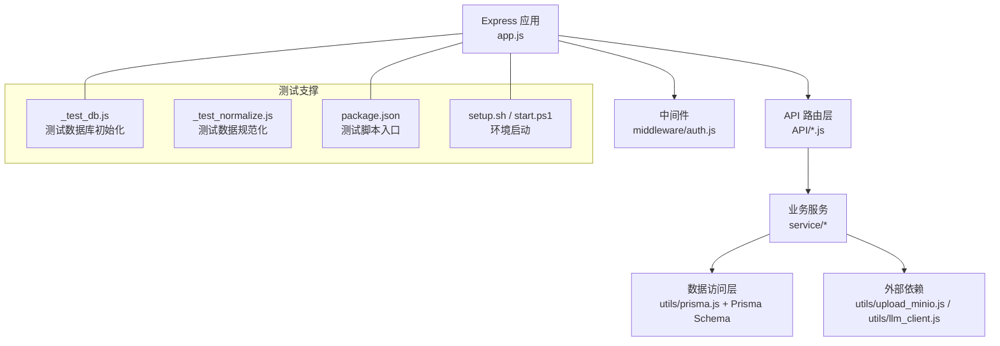
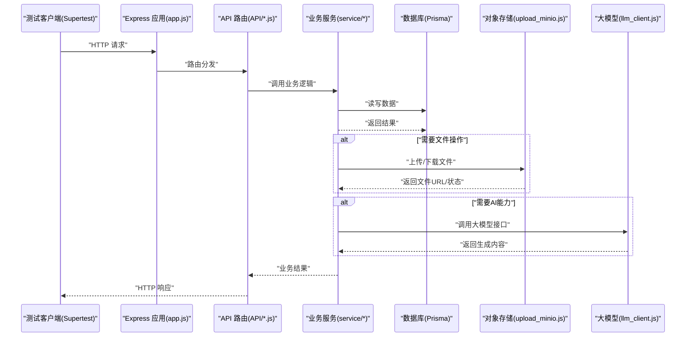
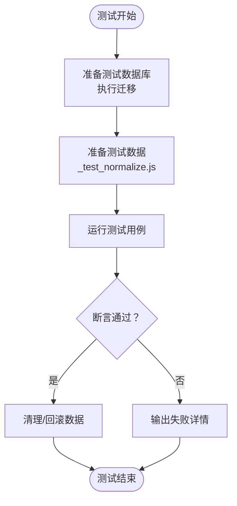
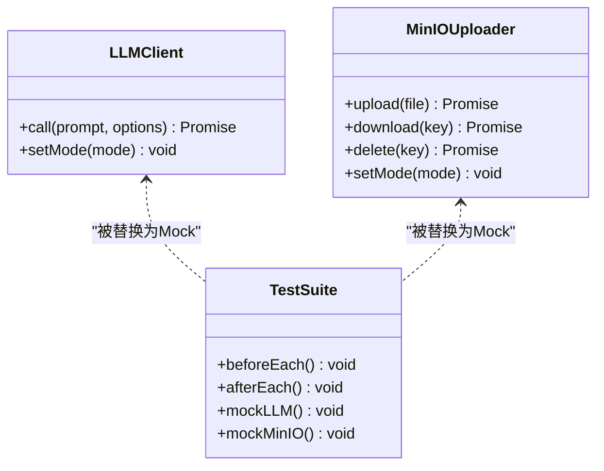
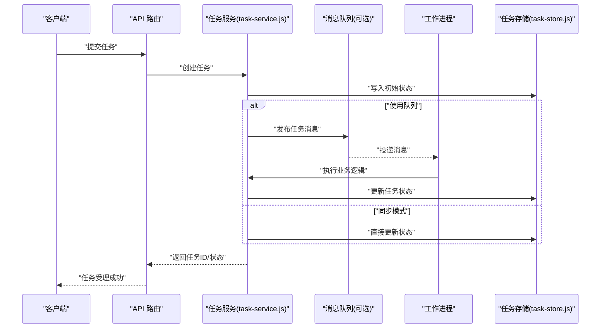
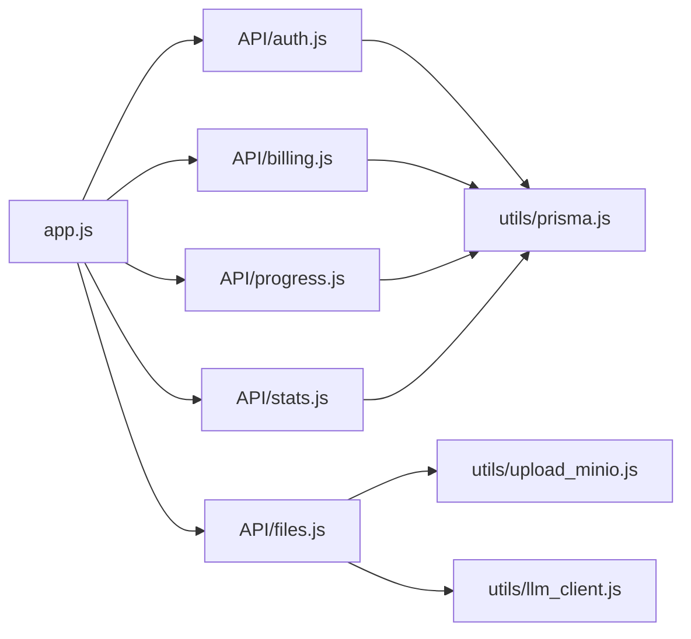

# 集成测试

<cite>
**本文引用的文件**   
- [app.js](file://node-jinmao/app.js)
- [_test_db.js](file://node-jinmao/_test_db.js)
- [_test_normalize.js](file://node-jinmao/_test_normalize.js)
- [package.json](file://node-jinmao/package.json)
- [setup.sh](file://node-jinmao/setup.sh)
- [start.ps1](file://node-jinmao/start.ps1)
- [prisma/schema.prisma](file://node-jinmao/prisma/schema.prisma)
- [API/auth.js](file://node-jinmao/API/auth.js)
- [API/billing.js](file://node-jinmao/API/billing.js)
- [API/files.js](file://node-jinmao/API/files.js)
- [API/progress.js](file://node-jinmao/API/progress.js)
- [API/stats.js](file://node-jinmao/API/stats.js)
- [service/md2quiz/task-service.js](file://node-jinmao/service/md2quiz/task-service.js)
- [service/md2quiz/task-store.js](file://node-jinmao/service/md2quiz/task-store.js)
- [utils/prisma.js](file://node-jinmao/utils/prisma.js)
- [utils/upload_minio.js](file://node-jinmao/utils/upload_minio.js)
- [utils/llm_client.js](file://node-jinmao/utils/llm_client.js)
- [config/deepseek_config.json](file://node-jinmao/config/deepseek_config.json)
- [config/minio_config.json](file://node-jinmao/config/minio_config.json)
</cite>

## 目录
1. [简介](#简介)
2. [项目结构](#项目结构)
3. [核心组件](#核心组件)
4. [架构总览](#架构总览)
5. [详细组件分析](#详细组件分析)
6. [依赖分析](#依赖分析)
7. [性能考虑](#性能考虑)
8. [故障排查指南](#故障排查指南)
9. [结论](#结论)
10. [附录](#附录)

## 简介
本文件面向“金毛教你学重构版”的集成测试实践，聚焦以下目标：
- 使用 Supertest 对 HTTP API 进行端到端集成测试
- 设计数据库集成测试策略（测试库搭建、数据清理与隔离）
- Mock 第三方服务（AI 大模型、对象存储等），确保测试稳定可控
- 覆盖微服务间通信与消息队列的集成验证
- 提供分布式系统的集成测试思路与环境隔离方案
- 规范测试数据的准备与管理，以及测试结果分析方法

## 项目结构
后端 Node.js 应用位于 node-jinmao 目录，包含 Express 路由、Prisma ORM、MinIO 对象存储、LLM 客户端、任务处理服务等。测试相关脚本与工具集中在根目录与 node-jinmao 内部。

图表来源
- [app.js:1-200](file://node-jinmao/app.js#L1-L200)
- [package.json:1-200](file://node-jinmao/package.json#L1-L200)
- [setup.sh:1-200](file://node-jinmao/setup.sh#L1-L200)
- [start.ps1:1-200](file://node-jinmao/start.ps1#L1-L200)

章节来源
- [app.js:1-200](file://node-jinmao/app.js#L1-L200)
- [package.json:1-200](file://node-jinmao/package.json#L1-L200)

## 核心组件
- Express 应用与路由挂载：统一入口加载各模块路由，集中配置中间件与错误处理
- API 路由层：按领域划分 auth、billing、files、progress、stats 等接口
- 业务服务层：md2quiz 任务编排、报告生成、课程流水线等
- 数据访问层：基于 Prisma 的数据库连接与迁移管理
- 外部依赖：MinIO 文件上传、LLM 客户端调用（DeepSeek 等）
- 测试支撑：测试数据库初始化、数据规范化、脚本化启动

章节来源
- [app.js:1-200](file://node-jinmao/app.js#L1-L200)
- [API/auth.js:1-200](file://node-jinmao/API/auth.js#L1-L200)
- [API/billing.js:1-200](file://node-jinmao/API/billing.js#L1-L200)
- [API/files.js:1-200](file://node-jinmao/API/files.js#L1-L200)
- [API/progress.js:1-200](file://node-jinmao/API/progress.js#L1-L200)
- [API/stats.js:1-200](file://node-jinmao/API/stats.js#L1-L200)
- [service/md2quiz/task-service.js:1-200](file://node-jinmao/service/md2quiz/task-service.js#L1-L200)
- [utils/prisma.js:1-200](file://node-jinmao/utils/prisma.js#L1-L200)
- [utils/upload_minio.js:1-200](file://node-jinmao/utils/upload_minio.js#L1-L200)
- [utils/llm_client.js:1-200](file://node-jinmao/utils/llm_client.js#L1-L200)

## 架构总览
下图展示从 HTTP 请求到数据持久化与外部服务的完整链路，并标注测试注入点（Mock、测试库、事务回滚）。

图表来源
- [app.js:1-200](file://node-jinmao/app.js#L1-L200)
- [API/auth.js:1-200](file://node-jinmao/API/auth.js#L1-L200)
- [service/md2quiz/task-service.js:1-200](file://node-jinmao/service/md2quiz/task-service.js#L1-L200)
- [utils/prisma.js:1-200](file://node-jinmao/utils/prisma.js#L1-L200)
- [utils/upload_minio.js:1-200](file://node-jinmao/utils/upload_minio.js#L1-L200)
- [utils/llm_client.js:1-200](file://node-jinmao/utils/llm_client.js#L1-L200)

## 详细组件分析

### API 集成测试（Supertest）
- 测试入口与框架：通过 package.json 中的测试脚本启动测试套件，使用 Supertest 发起真实 HTTP 请求至 Express 应用实例
- 典型流程：
  - 启动应用实例（或复用已启动进程）
  - 构造请求（登录、创建资源、查询、更新、删除）
  - 断言响应状态码、数据结构、业务字段
  - 清理测试数据（事务回滚或专用清理脚本）
- 建议用例：
  - 认证流：注册/登录/刷新令牌/权限校验
  - 计费接口：套餐查询、扣费记录、账单导出
  - 文件接口：上传、预览、删除、权限控制
  - 进度与统计：学习进度上报、统计报表聚合

章节来源
- [package.json:1-200](file://node-jinmao/package.json#L1-L200)
- [API/auth.js:1-200](file://node-jinmao/API/auth.js#L1-L200)
- [API/billing.js:1-200](file://node-jinmao/API/billing.js#L1-L200)
- [API/files.js:1-200](file://node-jinmao/API/files.js#L1-L200)
- [API/progress.js:1-200](file://node-jinmao/API/progress.js#L1-L200)
- [API/stats.js:1-200](file://node-jinmao/API/stats.js#L1-L200)

### 数据库集成测试策略
- 测试库搭建：
  - 使用独立测试数据库连接串，避免污染生产数据
  - 在测试前执行 Prisma 迁移，确保 schema 一致
- 数据隔离与清理：
  - 每个测试用例包裹事务，结束后回滚，保证零副作用
  - 或使用专用清理脚本在测试前后清空/重置必要表
- 数据准备：
  - 使用 _test_normalize.js 将测试数据标准化，便于断言
  - 预置基础数据（用户、角色、课程、题库等）

图表来源
- [_test_db.js:1-200](file://node-jinmao/_test_db.js#L1-L200)
- [_test_normalize.js:1-200](file://node-jinmao/_test_normalize.js#L1-L200)
- [utils/prisma.js:1-200](file://node-jinmao/utils/prisma.js#L1-L200)
- [prisma/schema.prisma:1-200](file://node-jinmao/prisma/schema.prisma#L1-L200)

章节来源
- [_test_db.js:1-200](file://node-jinmao/_test_db.js#L1-L200)
- [_test_normalize.js:1-200](file://node-jinmao/_test_normalize.js#L1-L200)
- [utils/prisma.js:1-200](file://node-jinmao/utils/prisma.js#L1-L200)
- [prisma/schema.prisma:1-200](file://node-jinmao/prisma/schema.prisma#L1-L200)

### 第三方服务 Mock（AI 与文件存储）
- AI 服务（如 DeepSeek）：
  - 通过环境变量或配置文件切换为 Mock 模式
  - 拦截 llm_client.js 的调用，返回固定响应，避免网络波动与费用
- 对象存储（MinIO）：
  - 使用本地或容器化的 MinIO 作为测试后端
  - 或在 upload_minio.js 中替换为内存实现，快速验证上传/下载流程
- 配置项参考：
  - config/deepseek_config.json：AI 服务地址、密钥、超时等
  - config/minio_config.json：MinIO 端点、桶名、凭证等

图表来源
- [utils/llm_client.js:1-200](file://node-jinmao/utils/llm_client.js#L1-L200)
- [utils/upload_minio.js:1-200](file://node-jinmao/utils/upload_minio.js#L1-L200)
- [config/deepseek_config.json:1-200](file://node-jinmao/config/deepseek_config.json#L1-L200)
- [config/minio_config.json:1-200](file://node-jinmao/config/minio_config.json#L1-L200)

章节来源
- [utils/llm_client.js:1-200](file://node-jinmao/utils/llm_client.js#L1-L200)
- [utils/upload_minio.js:1-200](file://node-jinmao/utils/upload_minio.js#L1-L200)
- [config/deepseek_config.json:1-200](file://node-jinmao/config/deepseek_config.json#L1-L200)
- [config/minio_config.json:1-200](file://node-jinmao/config/minio_config.json#L1-L200)

### 微服务间通信与消息队列测试
- 微服务通信：
  - 若存在异步任务（如 md2quiz 任务编排），可通过 HTTP 回调或消息队列（RabbitMQ/Kafka）协调
  - 测试时可使用本地消息代理或内存队列替代
- 任务服务示例：
  - service/md2quiz/task-service.js 负责任务调度与状态管理
  - service/md2quiz/task-store.js 用于任务持久化（可替换为内存存储）
- 测试要点：
  - 发送任务后断言状态流转（待处理→进行中→完成/失败）
  - 验证消费者是否正确消费消息并更新结果
  - 模拟异常场景（超时、重试、死信队列）

图表来源
- [service/md2quiz/task-service.js:1-200](file://node-jinmao/service/md2quiz/task-service.js#L1-L200)
- [service/md2quiz/task-store.js:1-200](file://node-jinmao/service/md2quiz/task-store.js#L1-L200)

章节来源
- [service/md2quiz/task-service.js:1-200](file://node-jinmao/service/md2quiz/task-service.js#L1-L200)
- [service/md2quiz/task-store.js:1-200](file://node-jinmao/service/md2quiz/task-store.js#L1-L200)

### 分布式系统集成测试
- 多实例部署：
  - 使用 Docker Compose 启动多个服务实例与共享依赖（数据库、缓存、消息队列）
- 一致性验证：
  - 跨节点幂等性、最终一致性、补偿机制
- 容错与恢复：
  - 模拟节点宕机、网络分区、消息丢失等场景
- 观测与诊断：
  - 集中日志、链路追踪、指标采集

[本节为概念性说明，不直接分析具体文件]

## 依赖分析
- 应用入口与路由：
  - app.js 统一挂载 API 路由与中间件
- 数据层：
  - utils/prisma.js 封装 Prisma 客户端，schema.prisma 定义数据模型
- 外部依赖：
  - utils/upload_minio.js 对接 MinIO
  - utils/llm_client.js 对接 AI 服务
- 测试脚本：
  - package.json 定义测试命令
  - setup.sh 与 start.ps1 提供跨平台启动支持

图表来源
- [app.js:1-200](file://node-jinmao/app.js#L1-L200)
- [API/auth.js:1-200](file://node-jinmao/API/auth.js#L1-L200)
- [API/billing.js:1-200](file://node-jinmao/API/billing.js#L1-L200)
- [API/files.js:1-200](file://node-jinmao/API/files.js#L1-L200)
- [API/progress.js:1-200](file://node-jinmao/API/progress.js#L1-L200)
- [API/stats.js:1-200](file://node-jinmao/API/stats.js#L1-L200)
- [utils/prisma.js:1-200](file://node-jinmao/utils/prisma.js#L1-L200)
- [utils/upload_minio.js:1-200](file://node-jinmao/utils/upload_minio.js#L1-L200)
- [utils/llm_client.js:1-200](file://node-jinmao/utils/llm_client.js#L1-L200)

章节来源
- [app.js:1-200](file://node-jinmao/app.js#L1-L200)
- [package.json:1-200](file://node-jinmao/package.json#L1-L200)

## 性能考虑
- 数据库连接池：合理设置连接数与超时，避免测试并发过高导致连接耗尽
- 外部服务限流：Mock 时应模拟延迟与限流，评估系统在高负载下的表现
- 任务队列背压：监控队列长度与消费者吞吐，防止积压
- 资源隔离：测试环境与生产环境严格隔离，避免资源争用

[本节为通用指导，不直接分析具体文件]

## 故障排查指南
- 常见错误定位：
  - 数据库连接失败：检查连接串、迁移是否执行、权限是否正确
  - 文件上传失败：确认 MinIO 端点、桶名、凭证与网络可达性
  - AI 调用失败：核对配置、鉴权、超时与重试策略
- 调试手段：
  - 启用详细日志，记录请求链路、SQL 语句与外部调用
  - 使用事务回滚快照，对比变更前后的数据差异
  - 针对关键路径编写最小复现用例

章节来源
- [_test_db.js:1-200](file://node-jinmao/_test_db.js#L1-L200)
- [_test_normalize.js:1-200](file://node-jinmao/_test_normalize.js#L1-L200)
- [utils/prisma.js:1-200](file://node-jinmao/utils/prisma.js#L1-L200)
- [utils/upload_minio.js:1-200](file://node-jinmao/utils/upload_minio.js#L1-L200)
- [utils/llm_client.js:1-200](file://node-jinmao/utils/llm_client.js#L1-L200)

## 结论
通过 Supertest 对 API 进行集成测试，结合独立的测试数据库与严格的隔离策略，可有效保障后端稳定性。借助 Mock 技术屏蔽外部依赖的不确定性，配合任务服务与消息队列的验证，能够全面覆盖微服务与分布式场景。建议在 CI 中自动化执行测试套件，持续反馈质量与性能指标。

[本节为总结性内容，不直接分析具体文件]

## 附录
- 环境启动与脚本：
  - setup.sh：Linux/macOS 环境初始化
  - start.ps1：Windows 环境启动脚本
- 配置参考：
  - deepseek_config.json：AI 服务配置
  - minio_config.json：对象存储配置

章节来源
- [setup.sh:1-200](file://node-jinmao/setup.sh#L1-L200)
- [start.ps1:1-200](file://node-jinmao/start.ps1#L1-L200)
- [config/deepseek_config.json:1-200](file://node-jinmao/config/deepseek_config.json#L1-L200)
- [config/minio_config.json:1-200](file://node-jinmao/config/minio_config.json#L1-L200)