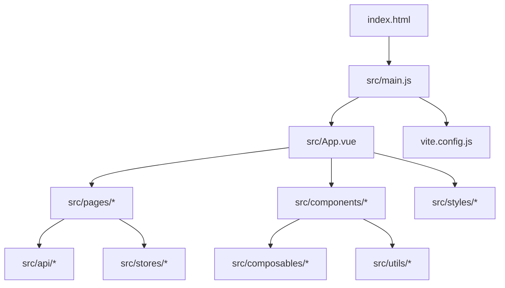
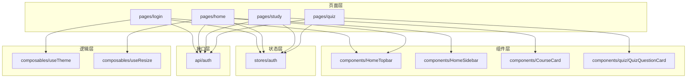
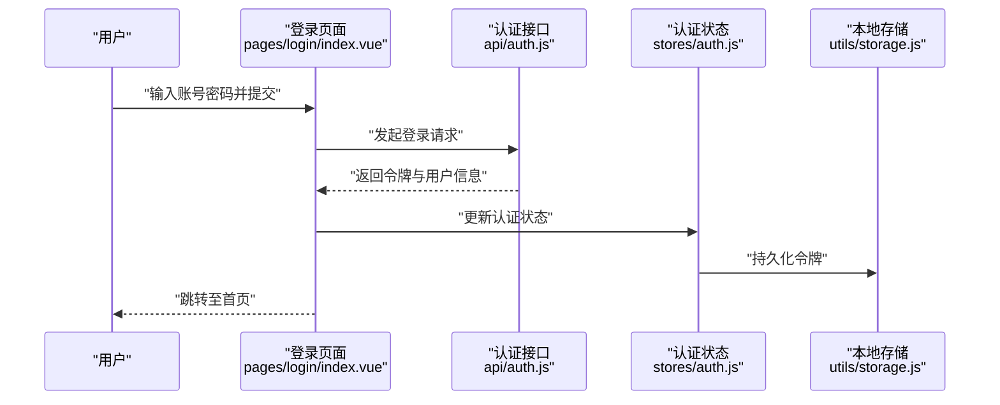
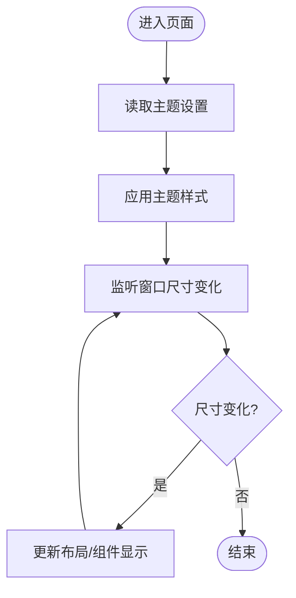
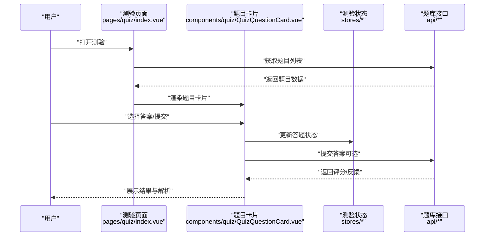
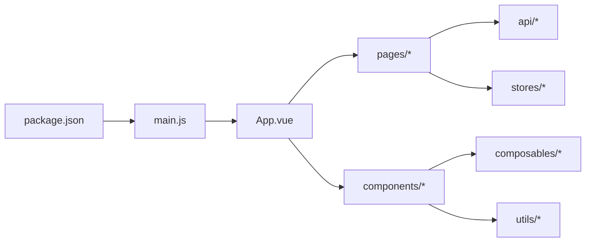

# 前端架构

<cite>
**本文引用的文件**   
- [main.js](file://WEB/src/main.js)
- [App.vue](file://WEB/src/App.vue)
- [vite.config.js](file://WEB/vite.config.js)
- [package.json](file://WEB/package.json)
- [index.html](file://WEB/index.html)
- [auth.js](file://WEB/src/api/auth.js)
- [auth store](file://WEB/src/stores/auth.js)
- [storage.js](file://WEB/src/utils/storage.js)
- [useTheme.js](file://WEB/src/composables/useTheme.js)
- [useResize.js](file://WEB/src/composables/useResize.js)
- [HomeTopbar.vue](file://WEB/src/components/HomeTopbar.vue)
- [HomeSidebar.vue](file://WEB/src/components/HomeSidebar.vue)
- [CourseCard.vue](file://WEB/src/components/CourseCard.vue)
- [QuizQuestionCard.vue](file://WEB/src/components/quiz/QuizQuestionCard.vue)
- [login/index.vue](file://WEB/src/pages/login/index.vue)
- [login/script.js](file://WEB/src/pages/login/script.js)
- [home/index.vue](file://WEB/src/pages/home/index.vue)
- [study/index.vue](file://WEB/src/pages/study/index.vue)
- [quiz/index.vue](file://WEB/src/pages/quiz/index.vue)
- [report.vue](file://WEB/src/pages/quiz/report.vue)
</cite>

## 目录
1. [简介](#简介)
2. [项目结构](#项目结构)
3. [核心组件](#核心组件)
4. [架构总览](#架构总览)
5. [详细组件分析](#详细组件分析)
6. [依赖关系分析](#依赖关系分析)
7. [性能考虑](#性能考虑)
8. [故障排查指南](#故障排查指南)
9. [结论](#结论)
10. [附录](#附录)

## 简介
本文件为“金毛教你学重构版”的前端架构文档，聚焦基于 Vue 3 的单页应用（SPA）设计。内容涵盖：
- 组件化设计与组合式 API 的使用
- 状态管理方案（Pinia/Store）与数据流
- 路由配置、页面组织与组件层次
- 响应式设计策略（移动端与 PC 端适配）
- 构建配置（Vite）、开发环境与热重载机制
- 安全策略（JWT 存储、CSRF 防护建议）
- 性能优化（代码分割、懒加载）
- 错误处理机制与最佳实践

## 项目结构
前端工程位于 WEB 目录，采用 Vite + Vue 3 的现代化 SPA 架构。核心目录说明如下：
- src/main.js：应用入口，初始化 Vue 实例、插件与全局样式
- src/App.vue：根组件，承载布局与全局状态
- vite.config.js：Vite 构建配置（代理、路径别名、插件等）
- package.json：依赖与脚本定义
- index.html：HTML 模板与挂载点
- src/api/*：按领域划分的接口封装（如 auth.js）
- src/stores/*：Pinia Store（如 auth.js）
- src/composables/*：组合式函数（主题、尺寸等）
- src/components/*：可复用业务组件
- src/pages/*：页面级组件（登录、首页、学习、测验等）
- src/styles/*：全局样式与 Token 变量
- src/utils/*：工具函数（如 storage.js）

图表来源
- [index.html](file://WEB/index.html)
- [main.js](file://WEB/src/main.js)
- [App.vue](file://WEB/src/App.vue)
- [vite.config.js](file://WEB/vite.config.js)

章节来源
- [main.js](file://WEB/src/main.js)
- [App.vue](file://WEB/src/App.vue)
- [vite.config.js](file://WEB/vite.config.js)
- [package.json](file://WEB/package.json)
- [index.html](file://WEB/index.html)

## 核心组件
- 根组件 App.vue：负责全局布局、导航容器与跨页面共享状态的挂载点
- 页面组件 pages/*：按功能域划分（登录、首页、学习、测验、报告），每个页面通常包含视图与逻辑脚本
- 通用组件 components/*：如课程卡片、侧边栏、顶部栏、测验题目卡片等，强调高内聚与低耦合
- 组合式函数 composables/*：封装跨组件复用的逻辑（如主题切换 useTheme、窗口尺寸监听 useResize）
- 状态管理 stores/*：使用 Pinia 集中管理认证状态与用户信息
- 接口层 api/*：按模块封装 HTTP 请求，统一错误处理与鉴权头注入

章节来源
- [App.vue](file://WEB/src/App.vue)
- [login/index.vue](file://WEB/src/pages/login/index.vue)
- [home/index.vue](file://WEB/src/pages/home/index.vue)
- [study/index.vue](file://WEB/src/pages/study/index.vue)
- [quiz/index.vue](file://WEB/src/pages/quiz/index.vue)
- [report.vue](file://WEB/src/pages/quiz/report.vue)
- [HomeTopbar.vue](file://WEB/src/components/HomeTopbar.vue)
- [HomeSidebar.vue](file://WEB/src/components/HomeSidebar.vue)
- [CourseCard.vue](file://WEB/src/components/CourseCard.vue)
- [QuizQuestionCard.vue](file://WEB/src/components/quiz/QuizQuestionCard.vue)
- [auth.js](file://WEB/src/api/auth.js)
- [auth store](file://WEB/src/stores/auth.js)
- [useTheme.js](file://WEB/src/composables/useTheme.js)
- [useResize.js](file://WEB/src/composables/useResize.js)

## 架构总览
整体采用“页面-组件-组合式函数-Store-API”的分层模式：
- 页面层：负责路由映射与页面级状态编排
- 组件层：UI 渲染与交互，通过 props/events 或组合式函数协作
- 组合式函数：封装可复用逻辑（主题、尺寸、表单校验等）
- Store：集中式状态（认证、用户信息、全局开关）
- API：统一网络请求封装，处理鉴权、重试与错误

图表来源
- [login/index.vue](file://WEB/src/pages/login/index.vue)
- [home/index.vue](file://WEB/src/pages/home/index.vue)
- [study/index.vue](file://WEB/src/pages/study/index.vue)
- [quiz/index.vue](file://WEB/src/pages/quiz/index.vue)
- [HomeTopbar.vue](file://WEB/src/components/HomeTopbar.vue)
- [HomeSidebar.vue](file://WEB/src/components/HomeSidebar.vue)
- [CourseCard.vue](file://WEB/src/components/CourseCard.vue)
- [QuizQuestionCard.vue](file://WEB/src/components/quiz/QuizQuestionCard.vue)
- [useTheme.js](file://WEB/src/composables/useTheme.js)
- [useResize.js](file://WEB/src/composables/useResize.js)
- [auth store](file://WEB/src/stores/auth.js)
- [auth.js](file://WEB/src/api/auth.js)

## 详细组件分析

### 认证流程（登录）
- 页面 login/index.vue 调用组合式逻辑与 API 进行登录
- API 层 auth.js 封装登录请求，携带必要参数并返回结果
- Store 层 stores/auth.js 保存 JWT 与用户信息，提供 isLogin、user 等状态
- 工具层 utils/storage.js 持久化令牌（注意安全性）

图表来源
- [login/index.vue](file://WEB/src/pages/login/index.vue)
- [auth.js](file://WEB/src/api/auth.js)
- [auth store](file://WEB/src/stores/auth.js)
- [storage.js](file://WEB/src/utils/storage.js)

章节来源
- [login/index.vue](file://WEB/src/pages/login/index.vue)
- [login/script.js](file://WEB/src/pages/login/script.js)
- [auth.js](file://WEB/src/api/auth.js)
- [auth store](file://WEB/src/stores/auth.js)
- [storage.js](file://WEB/src/utils/storage.js)

### 主题与尺寸适配
- useTheme.js：提供主题切换能力（如暗黑模式），通过 CSS 变量或类名控制
- useResize.js：监听窗口尺寸变化，用于响应式布局与条件渲染

图表来源
- [useTheme.js](file://WEB/src/composables/useTheme.js)
- [useResize.js](file://WEB/src/composables/useResize.js)

章节来源
- [useTheme.js](file://WEB/src/composables/useTheme.js)
- [useResize.js](file://WEB/src/composables/useResize.js)

### 测验答题流程
- quiz/index.vue 作为测验页面容器，加载题目与提交答案
- QuizQuestionCard.vue 渲染单个题目，支持多种题型展示
- 通过组合式函数与 Store 管理答题状态与进度

图表来源
- [quiz/index.vue](file://WEB/src/pages/quiz/index.vue)
- [QuizQuestionCard.vue](file://WEB/src/components/quiz/QuizQuestionCard.vue)

章节来源
- [quiz/index.vue](file://WEB/src/pages/quiz/index.vue)
- [report.vue](file://WEB/src/pages/quiz/report.vue)
- [QuizQuestionCard.vue](file://WEB/src/components/quiz/QuizQuestionCard.vue)

## 依赖关系分析
- 构建与运行依赖由 package.json 管理，包含 Vue、Vite、Router、Pinia 等
- main.js 初始化应用，引入 Router、Pinia、全局样式与根组件
- App.vue 作为根组件，挂载页面与全局状态
- 各页面与组件按需引入 API、Store 与组合式函数

图表来源
- [package.json](file://WEB/package.json)
- [main.js](file://WEB/src/main.js)
- [App.vue](file://WEB/src/App.vue)

章节来源
- [package.json](file://WEB/package.json)
- [main.js](file://WEB/src/main.js)
- [App.vue](file://WEB/src/App.vue)

## 性能考虑
- 代码分割与懒加载：通过动态导入页面与组件，减少首屏体积
- 资源优化：图片压缩、字体子集化、CDN 加速静态资源
- 缓存策略：HTTP 缓存、浏览器缓存、Service Worker（可选）
- 构建优化：Vite 插件（如压缩、Tree-shaking）、按需引入第三方库
- 运行时优化：虚拟滚动、防抖节流、避免不必要的重渲染

[本节为通用指导，不直接分析具体文件]

## 故障排查指南
- 登录失败：检查 API 返回码、网络请求头（Authorization）、Token 存储位置
- 主题异常：确认 CSS 变量是否生效、类名是否正确切换
- 响应式错乱：检查 useResize 监听逻辑与媒体查询覆盖
- 构建报错：核对 vite.config.js 路径别名、插件配置与依赖版本
- 权限问题：确认 JWT 有效期、刷新机制与后端校验一致性

章节来源
- [auth.js](file://WEB/src/api/auth.js)
- [auth store](file://WEB/src/stores/auth.js)
- [storage.js](file://WEB/src/utils/storage.js)
- [useTheme.js](file://WEB/src/composables/useTheme.js)
- [useResize.js](file://WEB/src/composables/useResize.js)
- [vite.config.js](file://WEB/vite.config.js)

## 结论
本项目采用 Vue 3 + Vite 的现代前端架构，通过清晰的页面-组件-组合式函数-Store-API 分层，实现了良好的可维护性与扩展性。结合响应式设计与性能优化策略，能够稳定支撑多端场景。建议在后续迭代中持续完善错误处理、监控埋点与安全加固。

[本节为总结性内容，不直接分析具体文件]

## 附录
- 开发环境启动：参考 package.json scripts 与 vite.config.js 配置
- 环境变量：在 .env 文件中定义 API 地址、调试开关等
- 部署建议：静态资源上 CDN，开启 Gzip/Brotli，合理设置缓存头

[本节为补充信息，不直接分析具体文件]