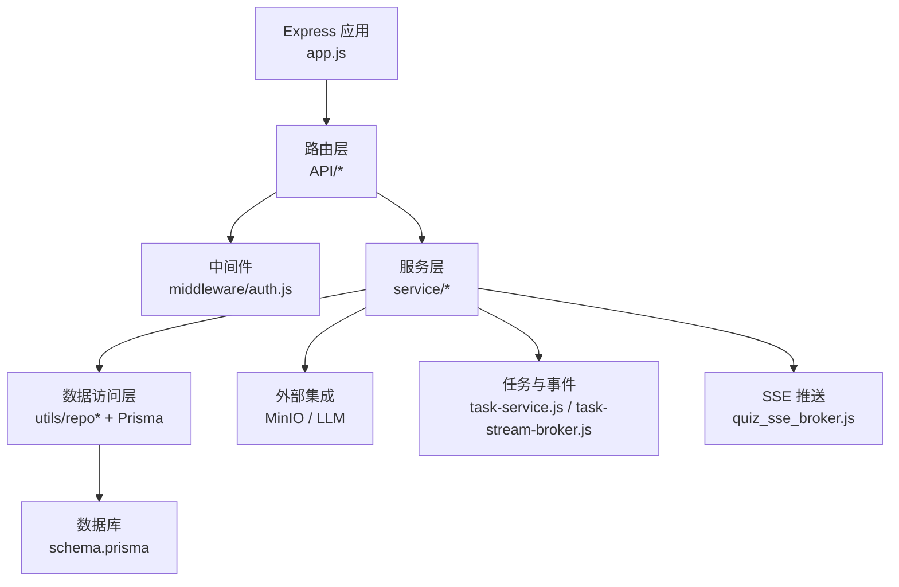
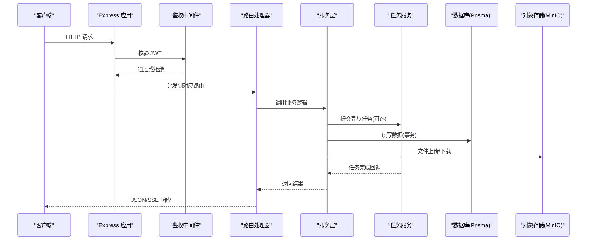
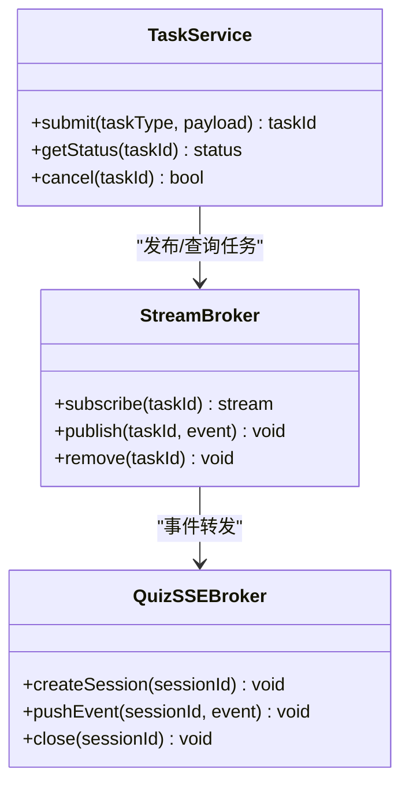
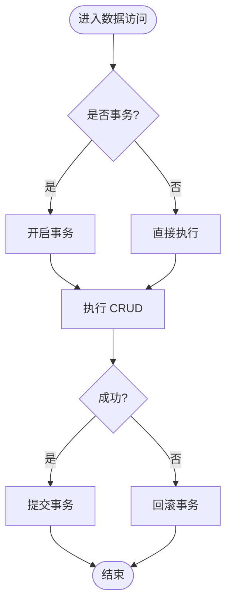
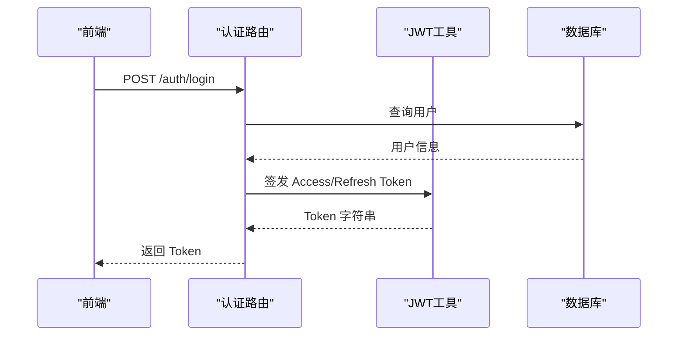
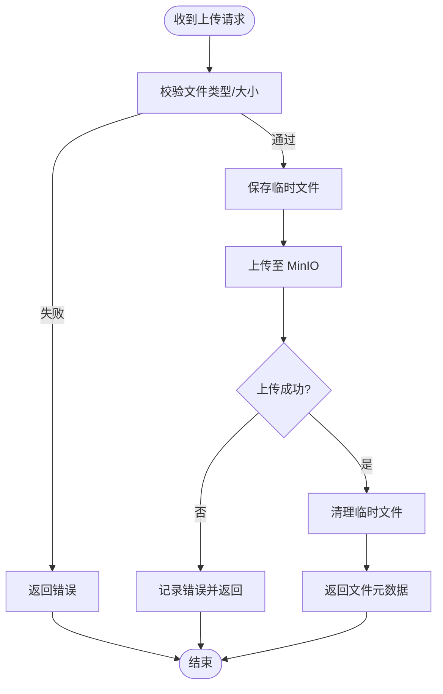
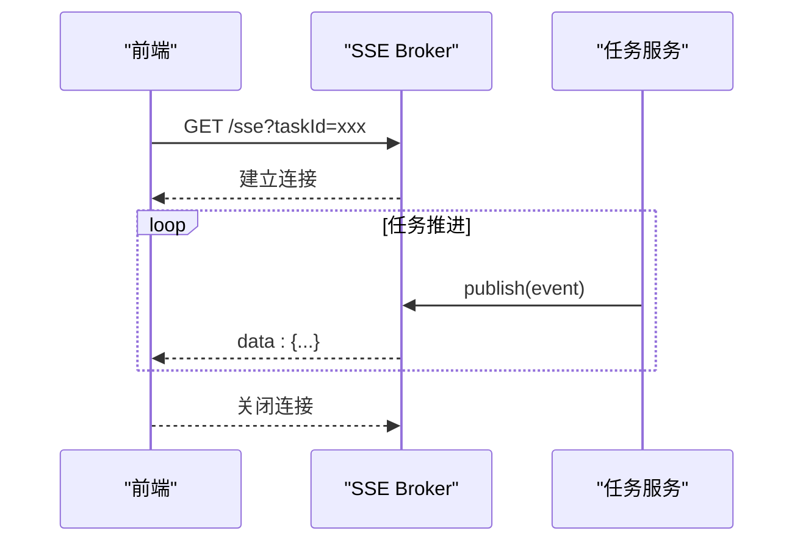
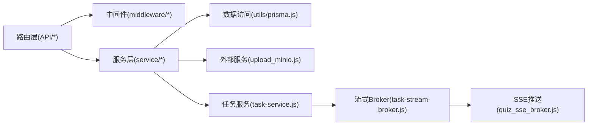

# 后端架构

<cite>
**本文档引用的文件**   
- [app.js](file://node-jinmao/app.js)
- [package.json](file://node-jinmao/package.json)
- [auth.js](file://node-jinmao/API/auth.js)
- [billing.js](file://node-jinmao/API/billing.js)
- [files.js](file://node-jinmao/API/files.js)
- [progress.js](file://node-jinmao/API/progress.js)
- [stats.js](file://node-jinmao/API/stats.js)
- [book/index.js](file://node-jinmao/API/book/index.js)
- [course/index.js](file://node-jinmao/API/course/index.js)
- [quiz/import.js](file://node-jinmao/API/quiz/import.js)
- [quiz/session.js](file://node-jinmao/API/quiz/session.js)
- [quiz/report.js](file://node-jinmao/API/quiz/report.js)
- [middleware/auth.js](file://node-jinmao/middleware/auth.js)
- [utils/jwt.js](file://node-jinmao/utils/jwt.js)
- [utils/prisma.js](file://node-jinmao/utils/prisma.js)
- [utils/upload_minio.js](file://node-jinmao/utils/upload_minio.js)
- [config/minio_config.json](file://node-jinmao/config/minio_config.json)
- [service/md2quiz/task-service.js](file://node-jinmao/service/md2quiz/task-service.js)
- [service/md2quiz/task-stream-broker.js](file://node-jinmao/service/md2quiz/task-stream-broker.js)
- [service/quiz_sse_broker.js](file://node-jinmao/service/quiz_sse_broker.js)
- [prisma/schema.prisma](file://node-jinmao/prisma/schema.prisma)
</cite>

## 目录
1. [简介](#简介)
2. [项目结构](#项目结构)
3. [核心组件](#核心组件)
4. [架构总览](#架构总览)
5. [详细组件分析](#详细组件分析)
6. [依赖关系分析](#依赖关系分析)
7. [性能考量](#性能考量)
8. [故障排查指南](#故障排查指南)
9. [结论](#结论)
10. [附录](#附录)

## 简介
本文件为“金毛教你学重构版”的后端架构文档，聚焦基于 Express.js 的服务端设计。内容涵盖：
- 路由组织与中间件机制
- 控制器-服务-数据访问的分层设计
- 异步任务处理、事件驱动架构与 SSE 流式传输
- 认证授权（JWT）、请求验证、错误处理与日志记录
- 数据库连接管理、事务处理与连接池配置
- 文件上传与 MinIO 集成、临时文件管理
- API 设计规范、错误码约定、性能监控与调试工具使用

## 项目结构
后端代码位于 node-jinmao 目录，采用按功能域划分的路由与模块组织方式：
- 入口与服务器启动：app.js
- 路由层：API/*（按业务域拆分）
- 中间件：middleware/*（鉴权等）
- 服务层：service/*（业务流程编排、SSE 与任务调度）
- 数据访问层：utils/repo*（通过 Prisma ORM）
- 配置与外部集成：config/*、utils/*（MinIO、LLM、Prisma）
- 数据库模型与迁移：prisma/*

图表来源
- [app.js](file://node-jinmao/app.js)
- [API/auth.js](file://node-jinmao/API/auth.js)
- [middleware/auth.js](file://node-jinmao/middleware/auth.js)
- [service/md2quiz/task-service.js](file://node-jinmao/service/md2quiz/task-service.js)
- [service/md2quiz/task-stream-broker.js](file://node-jinmao/service/md2quiz/task-stream-broker.js)
- [service/quiz_sse_broker.js](file://node-jinmao/service/quiz_sse_broker.js)
- [utils/prisma.js](file://node-jinmao/utils/prisma.js)
- [prisma/schema.prisma](file://node-jinmao/prisma/schema.prisma)

章节来源
- [app.js](file://node-jinmao/app.js)
- [package.json](file://node-jinmao/package.json)

## 核心组件
- 应用入口与中间件装配：统一注册全局中间件、路由挂载、错误处理与日志。
- 路由层：按业务域拆分的 RESTful 接口集合，负责参数解析、校验与响应封装。
- 服务层：编排复杂流程（如题库导入、报告生成），协调任务队列与 SSE 推送。
- 数据访问层：基于 Prisma 的强类型 ORM，提供事务与连接池能力。
- 认证授权：JWT 签发与校验中间件，保护受保护资源。
- 文件与对象存储：上传至 MinIO，支持分片与临时文件清理。
- 异步与事件：任务服务与流式 Broker 解耦长耗时操作，前端通过 SSE 实时获取进度。

章节来源
- [app.js](file://node-jinmao/app.js)
- [API/auth.js](file://node-jinmao/API/auth.js)
- [API/billing.js](file://node-jinmao/API/billing.js)
- [API/files.js](file://node-jinmao/API/files.js)
- [API/progress.js](file://node-jinmao/API/progress.js)
- [API/stats.js](file://node-jinmao/API/stats.js)
- [API/book/index.js](file://node-jinmao/API/book/index.js)
- [API/course/index.js](file://node-jinmao/API/course/index.js)
- [API/quiz/import.js](file://node-jinmao/API/quiz/import.js)
- [API/quiz/session.js](file://node-jinmao/API/quiz/session.js)
- [API/quiz/report.js](file://node-jinmao/API/quiz/report.js)
- [middleware/auth.js](file://node-jinmao/middleware/auth.js)
- [utils/jwt.js](file://node-jinmao/utils/jwt.js)
- [utils/prisma.js](file://node-jinmao/utils/prisma.js)
- [utils/upload_minio.js](file://node-jinmao/utils/upload_minio.js)
- [config/minio_config.json](file://node-jinmao/config/minio_config.json)
- [service/md2quiz/task-service.js](file://node-jinmao/service/md2quiz/task-service.js)
- [service/md2quiz/task-stream-broker.js](file://node-jinmao/service/md2quiz/task-stream-broker.js)
- [service/quiz_sse_broker.js](file://node-jinmao/service/quiz_sse_broker.js)
- [prisma/schema.prisma](file://node-jinmao/prisma/schema.prisma)

## 架构总览
整体采用“控制器-服务-数据访问”分层，配合中间件与事件驱动，实现高内聚低耦合。

图表来源
- [app.js](file://node-jinmao/app.js)
- [middleware/auth.js](file://node-jinmao/middleware/auth.js)
- [API/auth.js](file://node-jinmao/API/auth.js)
- [service/md2quiz/task-service.js](file://node-jinmao/service/md2quiz/task-service.js)
- [service/quiz_sse_broker.js](file://node-jinmao/service/quiz_sse_broker.js)
- [utils/prisma.js](file://node-jinmao/utils/prisma.js)
- [utils/upload_minio.js](file://node-jinmao/utils/upload_minio.js)

## 详细组件分析

### 路由与控制器
- 路由组织：按领域划分（auth、billing、files、progress、stats、book、course、quiz）。
- 职责边界：路由仅做参数解析、校验与响应包装；业务逻辑下沉至服务层。
- 典型接口：
  - 认证：登录、登出、刷新令牌、个人信息
  - 计费：账单查询、支付回调
  - 文件：上传、下载、列表
  - 学习进度与统计：读取用户学习轨迹与统计数据
  - 题库：导入、会话、报告生成

章节来源
- [API/auth.js](file://node-jinmao/API/auth.js)
- [API/billing.js](file://node-jinmao/API/billing.js)
- [API/files.js](file://node-jinmao/API/files.js)
- [API/progress.js](file://node-jinmao/API/progress.js)
- [API/stats.js](file://node-jinmao/API/stats.js)
- [API/book/index.js](file://node-jinmao/API/book/index.js)
- [API/course/index.js](file://node-jinmao/API/course/index.js)
- [API/quiz/import.js](file://node-jinmao/API/quiz/import.js)
- [API/quiz/session.js](file://node-jinmao/API/quiz/session.js)
- [API/quiz/report.js](file://node-jinmao/API/quiz/report.js)

### 中间件机制
- 鉴权中间件：校验 JWT 签名、过期时间，注入用户上下文。
- 全局中间件：请求日志、CORS、Body 解析、错误捕获。
- 扩展点：可按需增加限流、审计、灰度开关等。

章节来源
- [middleware/auth.js](file://node-jinmao/middleware/auth.js)
- [utils/jwt.js](file://node-jinmao/utils/jwt.js)

### 服务层与异步任务
- 任务服务：将耗时操作（如 Markdown 转题库、报告生成）放入任务队列，避免阻塞请求。
- 流式 Broker：维护任务状态与进度，供 SSE 消费。
- 事件驱动：任务完成触发事件，通知订阅者更新状态。

图表来源
- [service/md2quiz/task-service.js](file://node-jinmao/service/md2quiz/task-service.js)
- [service/md2quiz/task-stream-broker.js](file://node-jinmao/service/md2quiz/task-stream-broker.js)
- [service/quiz_sse_broker.js](file://node-jinmao/service/quiz_sse_broker.js)

章节来源
- [service/md2quiz/task-service.js](file://node-jinmao/service/md2quiz/task-service.js)
- [service/md2quiz/task-stream-broker.js](file://node-jinmao/service/md2quiz/task-stream-broker.js)
- [service/quiz_sse_broker.js](file://node-jinmao/service/quiz_sse_broker.js)

### 数据访问层与数据库
- ORM：Prisma 提供类型安全的数据访问与迁移管理。
- 连接池：通过 Prisma Client 配置连接数、超时与重试策略。
- 事务：在写入路径中使用事务保证一致性。

图表来源
- [utils/prisma.js](file://node-jinmao/utils/prisma.js)
- [prisma/schema.prisma](file://node-jinmao/prisma/schema.prisma)

章节来源
- [utils/prisma.js](file://node-jinmao/utils/prisma.js)
- [prisma/schema.prisma](file://node-jinmao/prisma/schema.prisma)

### 认证与授权（JWT）
- 登录流程：校验凭据，签发 JWT（含过期时间与角色信息）。
- 鉴权流程：中间件解析 Token，校验签名与有效期，注入 req.user。
- 刷新机制：支持 Refresh Token 轮换与黑名单控制（可扩展）。

图表来源
- [API/auth.js](file://node-jinmao/API/auth.js)
- [utils/jwt.js](file://node-jinmao/utils/jwt.js)

章节来源
- [API/auth.js](file://node-jinmao/API/auth.js)
- [middleware/auth.js](file://node-jinmao/middleware/auth.js)
- [utils/jwt.js](file://node-jinmao/utils/jwt.js)

### 文件上传与 MinIO 集成
- 上传流程：接收文件 -> 校验类型/大小 -> 写入临时目录 -> 上传至 MinIO -> 删除临时文件。
- 配置：通过 minio_config.json 管理 endpoint、bucket、凭证等。
- 下载：直链或预签名 URL 下发。

图表来源
- [API/files.js](file://node-jinmao/API/files.js)
- [utils/upload_minio.js](file://node-jinmao/utils/upload_minio.js)
- [config/minio_config.json](file://node-jinmao/config/minio_config.json)

章节来源
- [API/files.js](file://node-jinmao/API/files.js)
- [utils/upload_minio.js](file://node-jinmao/utils/upload_minio.js)
- [config/minio_config.json](file://node-jinmao/config/minio_config.json)

### SSE 流式传输
- 场景：长耗时任务（如题库导入、报告生成）的进度与增量输出。
- 实现：服务端创建 SSE 通道，持续推送事件；前端以 EventSource 订阅。
- 可靠性：断线重连、心跳保活、任务状态持久化。

图表来源
- [service/quiz_sse_broker.js](file://node-jinmao/service/quiz_sse_broker.js)
- [service/md2quiz/task-stream-broker.js](file://node-jinmao/service/md2quiz/task-stream-broker.js)

章节来源
- [service/quiz_sse_broker.js](file://node-jinmao/service/quiz_sse_broker.js)
- [service/md2quiz/task-stream-broker.js](file://node-jinmao/service/md2quiz/task-stream-broker.js)

### 错误处理与日志记录
- 错误分类：业务错误、参数校验错误、系统异常。
- 统一格式：包含 code、message、details、traceId。
- 日志：结构化日志（请求 ID、耗时、关键步骤），便于追踪。

章节来源
- [app.js](file://node-jinmao/app.js)

### 请求验证
- 输入校验：对路径、查询、体进行白名单校验与类型检查。
- 错误提示：明确字段级错误，便于前端定位。

章节来源
- [API/*](file://node-jinmao/API/auth.js)
- [API/*](file://node-jinmao/API/files.js)

## 依赖关系分析
- 路由依赖中间件与服务层，服务层依赖数据访问与外部服务。
- 任务与 SSE 通过 Broker 解耦，降低路由层复杂度。
- Prisma 作为唯一数据访问抽象，屏蔽底层差异。

图表来源
- [app.js](file://node-jinmao/app.js)
- [API/auth.js](file://node-jinmao/API/auth.js)
- [middleware/auth.js](file://node-jinmao/middleware/auth.js)
- [utils/prisma.js](file://node-jinmao/utils/prisma.js)
- [utils/upload_minio.js](file://node-jinmao/utils/upload_minio.js)
- [service/md2quiz/task-service.js](file://node-jinmao/service/md2quiz/task-service.js)
- [service/md2quiz/task-stream-broker.js](file://node-jinmao/service/md2quiz/task-stream-broker.js)
- [service/quiz_sse_broker.js](file://node-jinmao/service/quiz_sse_broker.js)

章节来源
- [package.json](file://node-jinmao/package.json)

## 性能考量
- 连接池：合理设置 Prisma 连接池大小与超时，避免连接耗尽。
- 缓存：热点数据可引入内存缓存（如 Redis）减少 DB 压力。
- 异步化：长耗时任务走任务队列+SSE，缩短请求时延。
- 静态资源：CDN 加速与浏览器缓存策略。
- 监控：接入 APM 与指标采集（QPS、延迟、错误率）。

[本节为通用指导，不直接分析具体文件]

## 故障排查指南
- 常见问题
  - 鉴权失败：检查 JWT 签名、过期时间、环境变量。
  - 上传失败：确认 MinIO 可达、Bucket 权限、临时目录空间。
  - 任务卡住：查看任务状态、Broker 连接、SSE 心跳。
  - 数据库连接异常：检查连接池配置、网络连通性、迁移版本。
- 诊断手段
  - 启用请求级 traceId，串联日志。
  - 打开 Prisma 查询日志定位慢查询。
  - 观察 SSE 连接数与事件吞吐。

章节来源
- [app.js](file://node-jinmao/app.js)
- [utils/prisma.js](file://node-jinmao/utils/prisma.js)
- [service/quiz_sse_broker.js](file://node-jinmao/service/quiz_sse_broker.js)

## 结论
本项目以 Express 为核心，结合分层架构、事件驱动与 SSE 流式传输，实现了高内聚、易扩展的后端体系。通过 Prisma 统一管理数据访问，借助 MinIO 提供稳定对象存储，配合 JWT 保障安全。建议在生产环境完善监控告警与容量规划，持续提升稳定性与性能。

[本节为总结性内容，不直接分析具体文件]

## 附录
- API 设计规范
  - 命名：RESTful 风格，名词复数表示资源集合。
  - 状态码：2xx 成功，4xx 客户端错误，5xx 服务端错误。
  - 错误体：{ code, message, details, traceId }。
- 调试工具
  - 本地开发：nodemon 热重载，Prisma Studio 可视化数据。
  - 线上排查：结构化日志、APM 指标、SSE 连接监控。

[本节为通用规范说明，不直接分析具体文件]