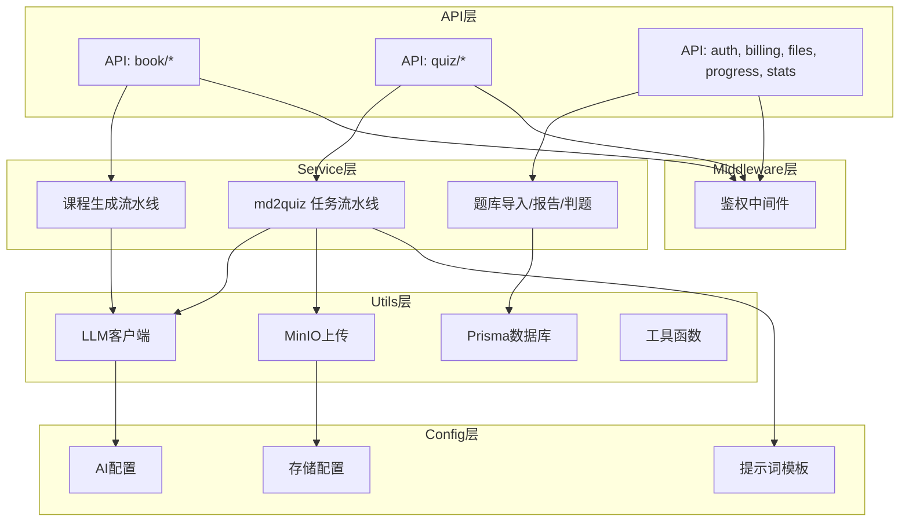
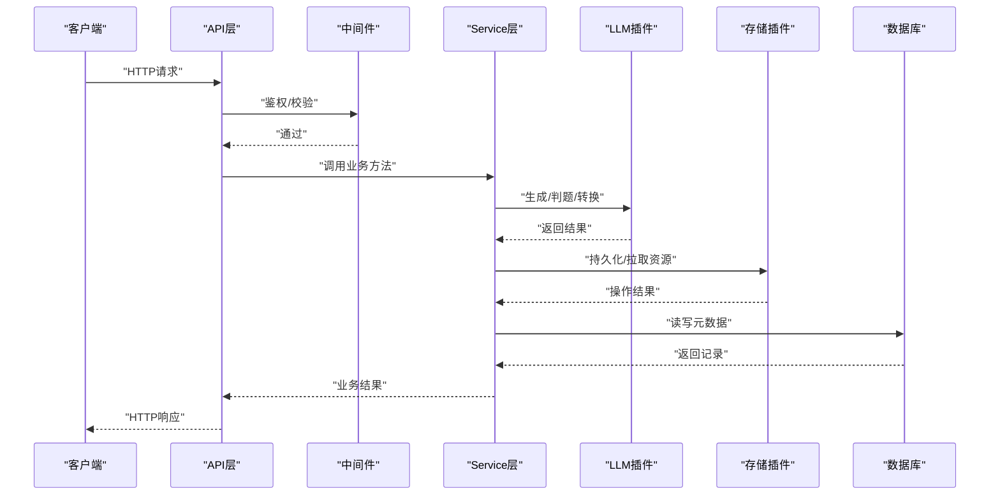
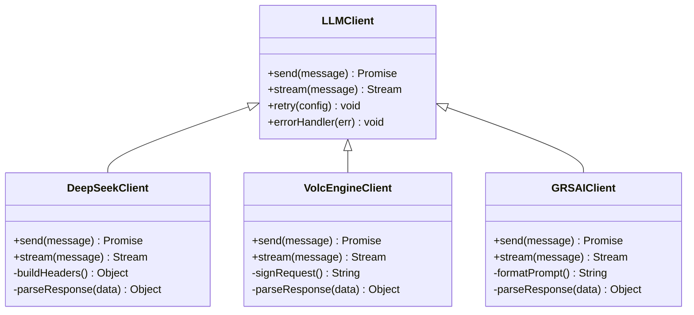
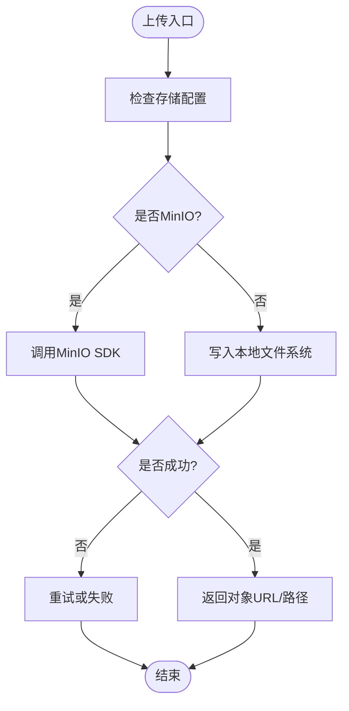
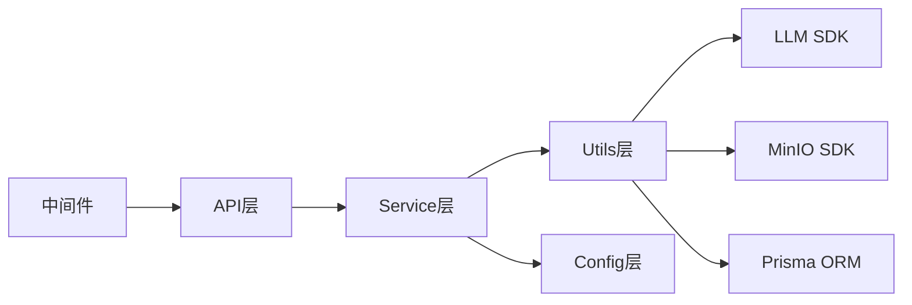

# 扩展架构

<cite>
**本文引用的文件**   
- [app.js](file://node-jinmao/app.js)
- [package.json](file://node-jinmao/package.json)
- [llm_client.js](file://node-jinmao/utils/llm_client.js)
- [deepseek-client.js](file://node-jinmao/service/md2quiz/deepseek-client.js)
- [upload_minio.js](file://node-jinmao/utils/upload_minio.js)
- [minio_config.json](file://node-jinmao/config/minio_config.json)
- [deepseek_config.json](file://node-jinmao/config/deepseek_config.json)
- [volcengine_config.json](file://node-jinmao/config/volcengine_config.json)
- [grsai_config.json](file://node-jinmao/config/grsai_config.json)
- [doc2x_config.json](file://node-jinmao/config/doc2x_config.json)
- [auth.js](file://node-jinmao/middleware/auth.js)
- [API文档.md](file://API文档.md)
</cite>

## 目录
1. [引言](#引言)
2. [项目结构](#项目结构)
3. [核心组件](#核心组件)
4. [架构总览](#架构总览)
5. [详细组件分析](#详细组件分析)
6. [依赖分析](#依赖分析)
7. [性能考虑](#性能考虑)
8. [故障排查指南](#故障排查指南)
9. [结论](#结论)
10. [附录](#附录)

## 引言
本扩展架构文档面向“金毛教你学重构版”的后端系统，聚焦插件化设计与可扩展性。内容涵盖：
- AI服务插件机制（支持多种大模型提供商）
- 存储后端插件（MinIO、本地存储等）
- 题目格式插件（支持新的题型）
- 配置管理系统（动态配置加载、环境变量管理、配置文件结构）
- 中间件扩展点（自定义业务逻辑接入）
- API扩展机制（新增接口不影响现有功能）
- 第三方服务集成标准接口、错误处理与重试机制
- 扩展开发指南与最佳实践

目标是为开发者提供清晰、可操作的扩展路径，确保系统在演进过程中保持高内聚、低耦合与强扩展性。

## 项目结构
后端采用模块化组织方式，按职责划分目录：
- API层：REST接口定义与路由注册
- Service层：业务编排与流程控制
- Utils层：通用能力封装（LLM客户端、上传、数据库连接等）
- Config层：外部服务配置与提示词模板
- Middleware层：鉴权、日志、限流等横切关注点
- Repo层：数据访问抽象

图表来源
- [app.js](file://node-jinmao/app.js)
- [package.json](file://node-jinmao/package.json)

章节来源
- [app.js](file://node-jinmao/app.js)
- [package.json](file://node-jinmao/package.json)

## 核心组件
- AI服务插件：统一抽象不同大模型提供商的调用方式，通过配置切换实现多模型接入。
- 存储后端插件：以统一接口对接MinIO或本地文件系统，便于替换与扩展。
- 题目格式插件：定义题型解析与生成的标准化协议，支持新增题型。
- 配置管理：集中化管理外部服务配置与提示词模板，支持环境变量注入与热更新。
- 中间件扩展点：在请求生命周期中插入鉴权、审计、限流等逻辑。
- API扩展机制：基于路由与控制器分离，新增接口不影响既有模块。

章节来源
- [llm_client.js](file://node-jinmao/utils/llm_client.js)
- [upload_minio.js](file://node-jinmao/utils/upload_minio.js)
- [deepseek-client.js](file://node-jinmao/service/md2quiz/deepseek-client.js)
- [minio_config.json](file://node-jinmao/config/minio_config.json)
- [deepseek_config.json](file://node-jinmao/config/deepseek_config.json)
- [volcengine_config.json](file://node-jinmao/config/volcengine_config.json)
- [grsai_config.json](file://node-jinmao/config/grsai_config.json)
- [doc2x_config.json](file://node-jinmao/config/doc2x_config.json)
- [auth.js](file://node-jinmao/middleware/auth.js)

## 架构总览
系统采用分层+插件化的架构模式，核心流程如下：
- 请求进入API层后，经过中间件链（鉴权、校验、限流等）
- 路由分发到对应控制器，控制器编排Service层完成业务
- Service层调用Utils层的插件（LLM、存储、数据库等）
- 配置由Config层统一管理，支持运行时读取与环境变量覆盖

图表来源
- [app.js](file://node-jinmao/app.js)
- [llm_client.js](file://node-jinmao/utils/llm_client.js)
- [upload_minio.js](file://node-jinmao/utils/upload_minio.js)

## 详细组件分析

### AI服务插件机制（多模型提供商）
- 设计要点
  - 统一抽象：对外暴露一致的调用接口（如发送消息、流式输出、错误码映射）
  - 配置驱动：通过配置文件选择具体提供商（DeepSeek、火山引擎、GRSAI等）
  - 可扩展：新增提供商只需实现适配器并注册配置项
- 关键文件
  - 统一客户端抽象：utils/llm_client.js
  - DeepSeek适配器：service/md2quiz/deepseek-client.js
  - 各提供商配置：config/deepseek_config.json、config/volcengine_config.json、config/grsai_config.json

图表来源
- [llm_client.js](file://node-jinmao/utils/llm_client.js)
- [deepseek-client.js](file://node-jinmao/service/md2quiz/deepseek-client.js)
- [deepseek_config.json](file://node-jinmao/config/deepseek_config.json)
- [volcengine_config.json](file://node-jinmao/config/volcengine_config.json)
- [grsai_config.json](file://node-jinmao/config/grsai_config.json)

章节来源
- [llm_client.js](file://node-jinmao/utils/llm_client.js)
- [deepseek-client.js](file://node-jinmao/service/md2quiz/deepseek-client.js)
- [deepseek_config.json](file://node-jinmao/config/deepseek_config.json)
- [volcengine_config.json](file://node-jinmao/config/volcengine_config.json)
- [grsai_config.json](file://node-jinmao/config/grsai_config.json)

### 存储后端插件（MinIO、本地存储）
- 设计要点
  - 统一接口：上传、下载、删除、列表等
  - 配置切换：根据环境选择MinIO或本地文件系统
  - 错误处理：网络异常、权限不足、容量不足等
- 关键文件
  - MinIO上传封装：utils/upload_minio.js
  - MinIO配置：config/minio_config.json

图表来源
- [upload_minio.js](file://node-jinmao/utils/upload_minio.js)
- [minio_config.json](file://node-jinmao/config/minio_config.json)

章节来源
- [upload_minio.js](file://node-jinmao/utils/upload_minio.js)
- [minio_config.json](file://node-jinmao/config/minio_config.json)

### 题目格式插件（支持新题型）
- 设计要点
  - 题型协议：统一的题目JSON结构（题干、选项、答案、解析、难度等）
  - 解析器：Markdown/Word/PDF转JSON的解析器，支持扩展新格式
  - 验证器：对题目数据进行完整性与一致性校验
- 扩展步骤
  - 定义新题型数据结构
  - 实现解析器与验证器
  - 在题库导入流程中注册新解析器

章节来源
- [API文档.md](file://API文档.md)

### 配置管理系统（动态加载、环境变量、配置文件结构）
- 设计要点
  - 集中化配置：所有外部服务配置集中在config目录
  - 环境变量优先：敏感信息通过环境变量注入，配置文件作为默认值
  - 动态加载：启动时加载配置，支持运行时刷新（按需）
- 关键文件
  - AI配置：deepseek_config.json、volcengine_config.json、grsai_config.json
  - 存储配置：minio_config.json
  - 其他服务：doc2x_config.json

章节来源
- [deepseek_config.json](file://node-jinmao/config/deepseek_config.json)
- [volcengine_config.json](file://node-jinmao/config/volcengine_config.json)
- [grsai_config.json](file://node-jinmao/config/grsai_config.json)
- [minio_config.json](file://node-jinmao/config/minio_config.json)
- [doc2x_config.json](file://node-jinmao/config/doc2x_config.json)

### 中间件扩展点（自定义业务逻辑）
- 设计要点
  - 中间件链：在请求进入控制器前执行鉴权、校验、限流、审计等
  - 扩展方式：新增中间件函数，按顺序挂载到路由或全局
  - 上下文传递：通过req/res对象传递用户信息、租户ID等
- 关键文件
  - 鉴权中间件：middleware/auth.js

章节来源
- [auth.js](file://node-jinmao/middleware/auth.js)

### API扩展机制（新增接口不影响现有功能）
- 设计要点
  - 路由与控制器分离：新增接口仅需添加路由与控制器方法
  - 版本化：通过URL前缀或参数进行API版本管理
  - 向后兼容：避免破坏性变更，使用弃用标记与迁移策略
- 参考
  - API文档：API文档.md

章节来源
- [API文档.md](file://API文档.md)

## 依赖分析
- 内部依赖
  - API层依赖Service层，Service层依赖Utils层与Config层
  - 中间件独立于业务逻辑，横向贯穿请求链路
- 外部依赖
  - LLM提供商SDK（DeepSeek、火山引擎、GRSAI等）
  - 存储服务SDK（MinIO）
  - 数据库ORM（Prisma）
- 潜在风险
  - 循环依赖：需避免Service与Utils之间的双向引用
  - 配置不一致：环境变量与配置文件冲突时需明确优先级

图表来源
- [app.js](file://node-jinmao/app.js)
- [package.json](file://node-jinmao/package.json)

章节来源
- [app.js](file://node-jinmao/app.js)
- [package.json](file://node-jinmao/package.json)

## 性能考虑
- LLM调用优化
  - 连接池与并发控制：限制并发数，避免雪崩
  - 缓存热点数据：如提示词模板、常用结果
  - 流式传输：长文本生成使用流式输出降低内存占用
- 存储优化
  - 分片上传与大对象优化
  - CDN加速静态资源
- 数据库优化
  - 索引设计合理，避免全表扫描
  - 读写分离与查询缓存

## 故障排查指南
- 常见问题
  - LLM调用超时：检查网络、密钥、配额与限流
  - 存储上传失败：检查权限、桶名、路径与磁盘空间
  - 配置错误：核对环境变量与配置文件一致性
- 排查步骤
  - 查看日志：定位错误堆栈与上下文
  - 模拟调用：使用curl或Postman复现问题
  - 降级策略：切换到备用提供商或本地存储

章节来源
- [API文档.md](file://API文档.md)

## 结论
本扩展架构通过插件化设计实现了AI服务、存储后端与题目格式的灵活扩展，配合配置管理与中间件机制，为系统演进提供了坚实基础。建议遵循统一接口、配置驱动与错误处理规范，确保扩展的可维护性与稳定性。

## 附录
- 扩展开发最佳实践
  - 单一职责：每个插件只负责一个领域
  - 配置外置：敏感信息不硬编码
  - 错误统一：定义标准错误码与消息
  - 测试先行：为插件编写单元测试与集成测试
  - 文档同步：更新API文档与配置说明