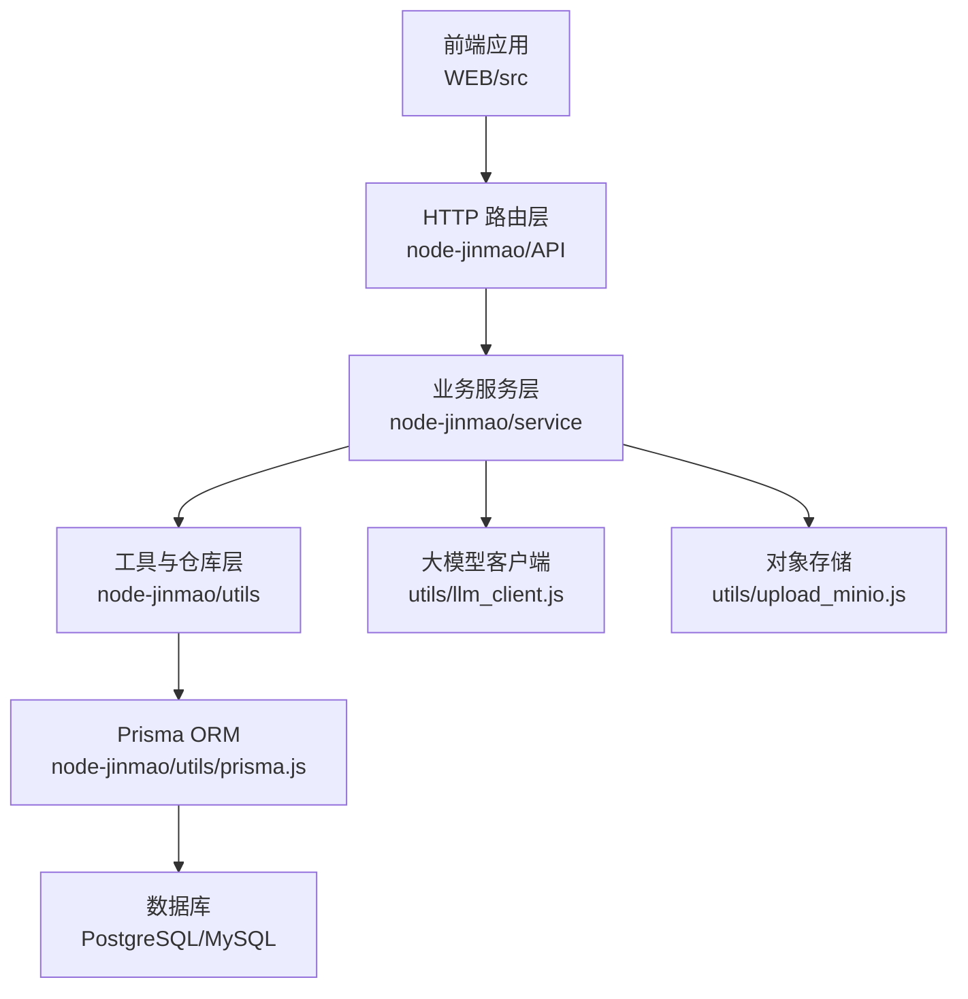
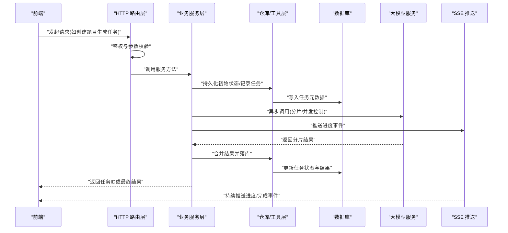
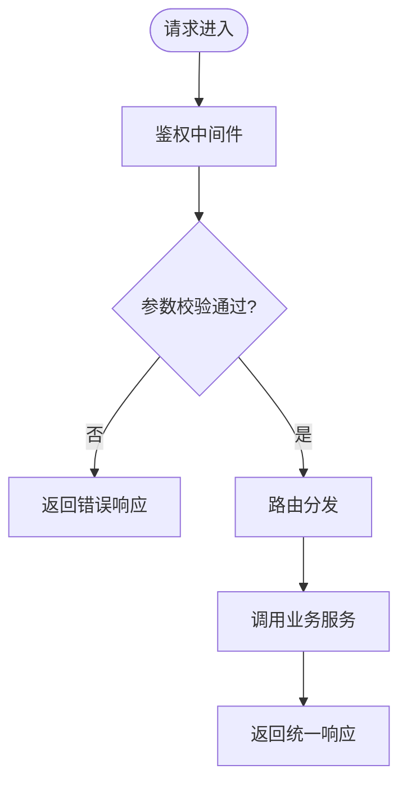
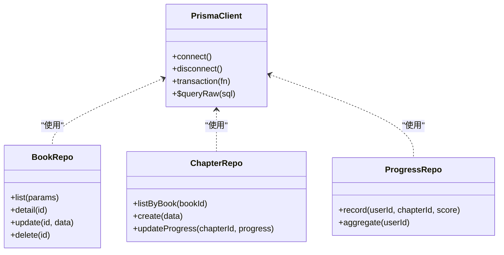
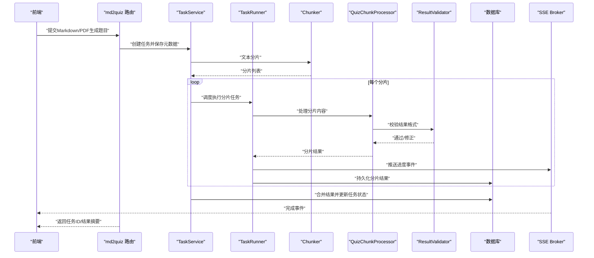
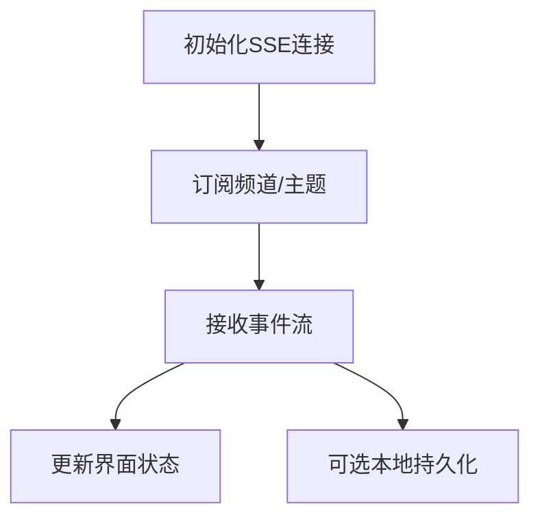
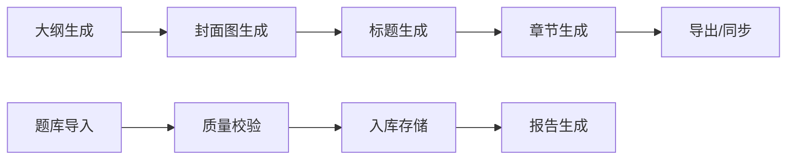
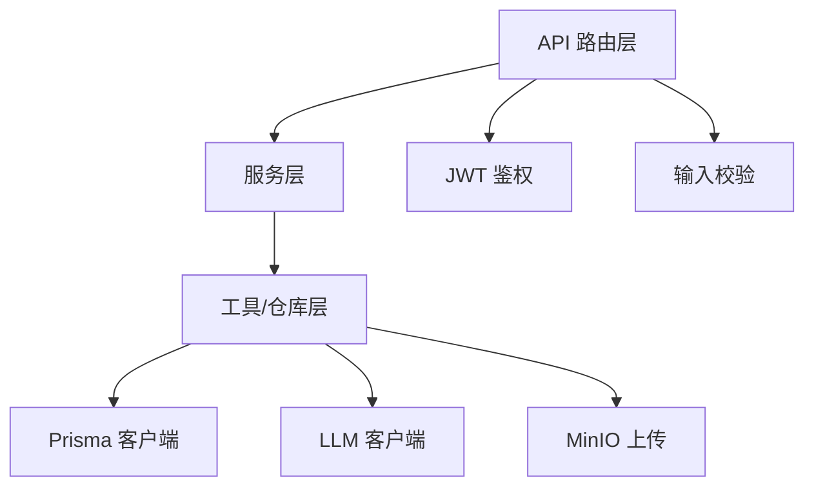

# 数据流架构

<cite>
**本文引用的文件**   
- [app.js](file://node-jinmao/app.js)
- [prisma.js](file://node-jinmao/utils/prisma.js)
- [schema.prisma](file://node-jinmao/prisma/schema.prisma)
- [auth.js](file://node-jinmao/API/auth.js)
- [progress.js](file://node-jinmao/API/progress.js)
- [stats.js](file://node-jinmao/API/stats.js)
- [task-service.js](file://node-jinmao/service/md2quiz/task-service.js)
- [task-runner.js](file://node-jinmao/service/md2quiz/task-runner.js)
- [task-store.js](file://node-jinmao/service/md2quiz/task-store.js)
- [task-stream-broker.js](file://node-jinmao/service/md2quiz/task-stream-broker.js)
- [quiz_sse_broker.js](file://node-jinmao/service/quiz_sse_broker.js)
- [chunker.js](file://node-jinmao/service/md2quiz/chunker.js)
- [quiz-chunk-processor.js](file://node-jinmao/service/md2quiz/quiz-chunk-processor.js)
- [result-validator.js](file://node-jinmao/service/md2quiz/result-validator.js)
- [deepseek-client.js](file://node-jinmao/service/md2quiz/deepseek-client.js)
- [md2quiz.js](file://node-jinmao/API/quiz/md2quiz.js)
- [pdf2quiz.js](file://node-jinmao/API/quiz/pdf2quiz.js)
- [import.js](file://node-jinmao/API/quiz/import.js)
- [report.js](file://node-jinmao/API/quiz/report.js)
- [session.js](file://node-jinmao/API/quiz/session.js)
- [textbooks.js](file://node-jinmao/API/quiz/textbooks.js)
- [wrongbook.js](file://node-jinmao/API/quiz/wrongbook.js)
- [activity_repo.js](file://node-jinmao/utils/repo/activity_repo.js)
- [book_repo.js](file://node-jinmao/utils/repo/book_repo.js)
- [chapter_repo.js](file://node-jinmao/utils/repo/chapter_repo.js)
- [progress_repo.js](file://node-jinmao/utils/repo/progress_repo.js)
- [stats_repo.js](file://node-jinmao/utils/repo/stats_repo.js)
- [update_repo.js](file://node-jinmao/utils/repo/update_repo.js)
- [course_pipeline.js](file://node-jinmao/service/course_pipeline.js)
- [create_cover_image.js](file://node-jinmao/service/create_cover_image.js)
- [create_title.js](file://node-jinmao/service/create_title.js)
- [POSTbook.js](file://node-jinmao/service/POSTbook.js)
- [quiz_import.js](file://node-jinmao/service/quiz_import.js)
- [quiz_judge.js](file://node-jinmao/service/quiz_judge.js)
- [quiz_report_service.js](file://node-jinmao/service/quiz_report_service.js)
- [llm_client.js](file://node-jinmao/utils/llm_client.js)
- [jwt.js](file://node-jinmao/utils/jwt.js)
- [input_validator.js](file://node-jinmao/utils/input_validator.js)
- [can_generate_next.js](file://node-jinmao/utils/can_generate_next.js)
- [generate_outline.js](file://node-jinmao/utils/generate_outline.js)
- [line_indexer.js](file://node-jinmao/utils/line_indexer.js)
- [get_line.js](file://node-jinmao/utils/get_line.js)
- [htmlppt.js](file://node-jinmao/utils/htmlppt.js)
- [doc2x.js](file://node-jinmao/utils/doc2x.js)
- [upload_minio.js](file://node-jinmao/utils/upload_minio.js)
- [billing.js](file://node-jinmao/utils/billing.js)
- [auth/index.js](file://node-jinmao/service/auth/index.js)
- [auth/login.js](file://node-jinmao/service/auth/login.js)
- [auth/otp.js](file://node-jinmao/service/auth/otp.js)
- [auth/profile.js](file://node-jinmao/service/auth/profile.js)
- [middleware/auth.js](file://node-jinmao/middleware/auth.js)
</cite>

## 目录
1. [引言](#引言)
2. [项目结构](#项目结构)
3. [核心组件](#核心组件)
4. [架构总览](#架构总览)
5. [详细组件分析](#详细组件分析)
6. [依赖关系分析](#依赖关系分析)
7. [性能考量](#性能考量)
8. [故障排查指南](#故障排查指南)
9. [结论](#结论)
10. [附录](#附录)

## 引言
本文件面向“金毛教你学重构版”的数据流架构，覆盖从前端到后端再到数据库的完整数据流转过程。重点包括：
- HTTP 请求处理链路、业务逻辑编排与数据持久化
- Prisma ORM 的数据访问模式、查询优化与关联关系处理
- 异步任务（AI 题目生成）的队列处理、进度跟踪与结果回调机制
- 缓存策略、数据一致性保证与事务管理
- 实时数据更新（SSE）的实现原理与数据同步机制
- 数据迁移策略与备份恢复方案

## 项目结构
后端采用 Node.js + Express 风格的路由与服务分层，结合 Prisma ORM 进行数据访问；前端为 Vue/Vite 工程，通过 API 模块与后端交互。关键目录说明：
- node-jinmao/API：HTTP 路由层，按功能域划分（如 quiz、auth、progress、stats 等）
- node-jinmao/service：业务服务层，封装复杂流程（如 md2quiz 任务流水线、课程生成管线、报告服务等）
- node-jinmao/utils：通用工具与仓库（repo）层，封装 Prisma 访问、外部调用（LLM、MinIO）、校验与辅助算法
- node-jinmao/prisma：Prisma Schema 与迁移脚本
- WEB/src：前端页面、组件、API 客户端与状态管理

图表来源
- [app.js:1-200](file://node-jinmao/app.js#L1-L200)
- [prisma.js:1-200](file://node-jinmao/utils/prisma.js#L1-L200)
- [schema.prisma:1-200](file://node-jinmao/prisma/schema.prisma#L1-L200)

章节来源
- [app.js:1-200](file://node-jinmao/app.js#L1-L200)
- [package.json](file://node-jinmao/package.json)

## 核心组件
- HTTP 路由层：集中暴露 RESTful 接口，负责参数校验、鉴权、调用服务层并返回统一响应
- 业务服务层：实现领域逻辑与跨模块协作（如 md2quiz 任务编排、课程生成、报告统计）
- 工具与仓库层：封装 Prisma 查询、外部系统调用（LLM、MinIO）、输入校验与工具函数
- Prisma ORM：类型安全的数据库访问，支持关联查询、事务与批量操作
- SSE 与任务中心：基于事件流的任务进度推送与结果回调，支撑长耗时 AI 任务

章节来源
- [auth.js:1-200](file://node-jinmao/API/auth.js#L1-L200)
- [progress.js:1-200](file://node-jinmao/API/progress.js#L1-L200)
- [stats.js:1-200](file://node-jinmao/API/stats.js#L1-L200)
- [task-service.js:1-200](file://node-jinmao/service/md2quiz/task-service.js#L1-L200)
- [task-runner.js:1-200](file://node-jinmao/service/md2quiz/task-runner.js#L1-L200)
- [task-store.js:1-200](file://node-jinmao/service/md2quiz/task-store.js#L1-L200)
- [task-stream-broker.js:1-200](file://node-jinmao/service/md2quiz/task-stream-broker.js#L1-L200)
- [quiz_sse_broker.js:1-200](file://node-jinmao/service/quiz_sse_broker.js#L1-L200)

## 架构总览
整体数据流遵循“请求进入 -> 路由解析 -> 鉴权与校验 -> 服务编排 -> 数据访问 -> 持久化 -> 响应/SSE 推送”的模式。AI 题目生成属于长耗时任务，采用“任务入队 -> 分片处理 -> 进度上报 -> 结果回调”的流程。

图表来源
- [app.js:1-200](file://node-jinmao/app.js#L1-L200)
- [task-service.js:1-200](file://node-jinmao/service/md2quiz/task-service.js#L1-L200)
- [task-runner.js:1-200](file://node-jinmao/service/md2quiz/task-runner.js#L1-L200)
- [task-store.js:1-200](file://node-jinmao/service/md2quiz/task-store.js#L1-L200)
- [task-stream-broker.js:1-200](file://node-jinmao/service/md2quiz/task-stream-broker.js#L1-L200)
- [quiz_sse_broker.js:1-200](file://node-jinmao/service/quiz_sse_broker.js#L1-L200)

## 详细组件分析

### HTTP 请求处理与鉴权
- 路由层统一入口，挂载中间件进行鉴权与限流
- 认证相关接口包含登录、OTP、个人资料等
- 请求体与路径参数经输入校验器验证，非法请求直接拒绝

图表来源
- [middleware/auth.js:1-200](file://node-jinmao/middleware/auth.js#L1-L200)
- [auth/index.js:1-200](file://node-jinmao/service/auth/index.js#L1-L200)
- [auth/login.js:1-200](file://node-jinmao/service/auth/login.js#L1-L200)
- [auth/otp.js:1-200](file://node-jinmao/service/auth/otp.js#L1-L200)
- [auth/profile.js:1-200](file://node-jinmao/service/auth/profile.js#L1-L200)
- [jwt.js:1-200](file://node-jinmao/utils/jwt.js#L1-L200)
- [input_validator.js:1-200](file://node-jinmao/utils/input_validator.js#L1-L200)

章节来源
- [auth.js:1-200](file://node-jinmao/API/auth.js#L1-L200)
- [middleware/auth.js:1-200](file://node-jinmao/middleware/auth.js#L1-L200)
- [jwt.js:1-200](file://node-jinmao/utils/jwt.js#L1-L200)
- [input_validator.js:1-200](file://node-jinmao/utils/input_validator.js#L1-L200)

### Prisma ORM 数据访问与事务
- 使用 Prisma 客户端进行类型安全的数据访问
- 仓库层封装常用 CRUD、聚合查询与关联加载
- 事务用于多表一致更新（如任务状态变更与结果落库）

图表来源
- [prisma.js:1-200](file://node-jinmao/utils/prisma.js#L1-L200)
- [book_repo.js:1-200](file://node-jinmao/utils/repo/book_repo.js#L1-L200)
- [chapter_repo.js:1-200](file://node-jinmao/utils/repo/chapter_repo.js#L1-L200)
- [progress_repo.js:1-200](file://node-jinmao/utils/repo/progress_repo.js#L1-L200)
- [stats_repo.js:1-200](file://node-jinmao/utils/repo/stats_repo.js#L1-L200)
- [activity_repo.js:1-200](file://node-jinmao/utils/repo/activity_repo.js#L1-L200)
- [update_repo.js:1-200](file://node-jinmao/utils/repo/update_repo.js#L1-L200)

章节来源
- [prisma.js:1-200](file://node-jinmao/utils/prisma.js#L1-L200)
- [schema.prisma:1-200](file://node-jinmao/prisma/schema.prisma#L1-L200)
- [book_repo.js:1-200](file://node-jinmao/utils/repo/book_repo.js#L1-L200)
- [chapter_repo.js:1-200](file://node-jinmao/utils/repo/chapter_repo.js#L1-L200)
- [progress_repo.js:1-200](file://node-jinmao/utils/repo/progress_repo.js#L1-L200)
- [stats_repo.js:1-200](file://node-jinmao/utils/repo/stats_repo.js#L1-L200)
- [activity_repo.js:1-200](file://node-jinmao/utils/repo/activity_repo.js#L1-L200)
- [update_repo.js:1-200](file://node-jinmao/utils/repo/update_repo.js#L1-L200)

### 异步任务：AI 题目生成（md2quiz）
- 任务生命周期：创建任务 -> 分片切分 -> 并行调用 LLM -> 结果校验 -> 合并落库 -> 进度推送 -> 完成回调
- 任务存储与执行器分离，支持失败重试与幂等性
- SSE 推送进度事件，前端可实时更新任务状态

图表来源
- [md2quiz.js:1-200](file://node-jinmao/API/quiz/md2quiz.js#L1-L200)
- [task-service.js:1-200](file://node-jinmao/service/md2quiz/task-service.js#L1-L200)
- [task-runner.js:1-200](file://node-jinmao/service/md2quiz/task-runner.js#L1-L200)
- [task-store.js:1-200](file://node-jinmao/service/md2quiz/task-store.js#L1-L200)
- [task-stream-broker.js:1-200](file://node-jinmao/service/md2quiz/task-stream-broker.js#L1-L200)
- [chunker.js:1-200](file://node-jinmao/service/md2quiz/chunker.js#L1-L200)
- [quiz-chunk-processor.js:1-200](file://node-jinmao/service/md2quiz/quiz-chunk-processor.js#L1-L200)
- [result-validator.js:1-200](file://node-jinmao/service/md2quiz/result-validator.js#L1-L200)
- [deepseek-client.js:1-200](file://node-jinmao/service/md2quiz/deepseek-client.js#L1-L200)

章节来源
- [md2quiz.js:1-200](file://node-jinmao/API/quiz/md2quiz.js#L1-L200)
- [pdf2quiz.js:1-200](file://node-jinmao/API/quiz/pdf2quiz.js#L1-L200)
- [import.js:1-200](file://node-jinmao/API/quiz/import.js#L1-L200)
- [task-service.js:1-200](file://node-jinmao/service/md2quiz/task-service.js#L1-L200)
- [task-runner.js:1-200](file://node-jinmao/service/md2quiz/task-runner.js#L1-L200)
- [task-store.js:1-200](file://node-jinmao/service/md2quiz/task-store.js#L1-L200)
- [task-stream-broker.js:1-200](file://node-jinmao/service/md2quiz/task-stream-broker.js#L1-L200)
- [chunker.js:1-200](file://node-jinmao/service/md2quiz/chunker.js#L1-L200)
- [quiz-chunk-processor.js:1-200](file://node-jinmao/service/md2quiz/quiz-chunk-processor.js#L1-L200)
- [result-validator.js:1-200](file://node-jinmao/service/md2quiz/result-validator.js#L1-L200)
- [deepseek-client.js:1-200](file://node-jinmao/service/md2quiz/deepseek-client.js#L1-L200)

### 实时数据更新（SSE）
- 使用独立 SSE Broker 维护连接与事件广播
- 任务进度、评分结果、学习统计等通过事件通道推送
- 前端订阅特定频道，接收增量更新

图表来源
- [quiz_sse_broker.js:1-200](file://node-jinmao/service/quiz_sse_broker.js#L1-L200)
- [task-stream-broker.js:1-200](file://node-jinmao/service/md2quiz/task-stream-broker.js#L1-L200)

章节来源
- [quiz_sse_broker.js:1-200](file://node-jinmao/service/quiz_sse_broker.js#L1-L200)
- [task-stream-broker.js:1-200](file://node-jinmao/service/md2quiz/task-stream-broker.js#L1-L200)

### 课程与题库相关服务
- 课程生成管线：大纲生成、封面图创建、标题生成、章节推进
- 题库导入与转换：PDF/Markdown 转题目 JSON，质量校验与修复
- 错题本与报告：学习记录聚合、成绩统计、报告导出

图表来源
- [course_pipeline.js:1-200](file://node-jinmao/service/course_pipeline.js#L1-L200)
- [create_cover_image.js:1-200](file://node-jinmao/service/create_cover_image.js#L1-L200)
- [create_title.js:1-200](file://node-jinmao/service/create_title.js#L1-L200)
- [POSTbook.js:1-200](file://node-jinmao/service/POSTbook.js#L1-L200)
- [quiz_import.js:1-200](file://node-jinmao/service/quiz_import.js#L1-L200)
- [quiz_report_service.js:1-200](file://node-jinmao/service/quiz_report_service.js#L1-L200)

章节来源
- [course_pipeline.js:1-200](file://node-jinmao/service/course_pipeline.js#L1-L200)
- [create_cover_image.js:1-200](file://node-jinmao/service/create_cover_image.js#L1-L200)
- [create_title.js:1-200](file://node-jinmao/service/create_title.js#L1-L200)
- [POSTbook.js:1-200](file://node-jinmao/service/POSTbook.js#L1-L200)
- [quiz_import.js:1-200](file://node-jinmao/service/quiz_import.js#L1-L200)
- [quiz_report_service.js:1-200](file://node-jinmao/service/quiz_report_service.js#L1-L200)

## 依赖关系分析
- 路由层依赖服务层，服务层依赖仓库与工具层
- 外部依赖包括 LLM 客户端、对象存储（MinIO）、JWT 鉴权、输入校验器
- Prisma 作为数据访问抽象，屏蔽底层数据库差异

图表来源
- [app.js:1-200](file://node-jinmao/app.js#L1-L200)
- [llm_client.js:1-200](file://node-jinmao/utils/llm_client.js#L1-L200)
- [upload_minio.js:1-200](file://node-jinmao/utils/upload_minio.js#L1-L200)
- [jwt.js:1-200](file://node-jinmao/utils/jwt.js#L1-L200)
- [input_validator.js:1-200](file://node-jinmao/utils/input_validator.js#L1-L200)

章节来源
- [app.js:1-200](file://node-jinmao/app.js#L1-L200)
- [llm_client.js:1-200](file://node-jinmao/utils/llm_client.js#L1-L200)
- [upload_minio.js:1-200](file://node-jinmao/utils/upload_minio.js#L1-L200)
- [jwt.js:1-200](file://node-jinmao/utils/jwt.js#L1-L200)
- [input_validator.js:1-200](file://node-jinmao/utils/input_validator.js#L1-L200)

## 性能考量
- 查询优化：使用 Prisma 的 select/include 减少字段与关联加载；对高频查询建立索引
- 并发控制：LLM 调用限制并发度，避免过载；分片处理提升吞吐
- 缓存策略：热点数据（如配置、静态资源）可使用内存缓存或 Redis；结果缓存需考虑失效策略
- 事务边界：将写操作集中在最小事务内，降低锁竞争与死锁风险
- I/O 优化：大文件上传走 MinIO 直传；异步任务解耦主线程

[本节为通用指导，不直接分析具体文件]

## 故障排查指南
- 鉴权失败：检查 JWT 签发与验证逻辑、中间件顺序与过期时间
- 参数校验错误：核对输入校验规则与前端传参类型
- 任务失败：查看任务存储状态、分片处理日志、LLM 调用结果与重试策略
- 数据不一致：检查事务回滚点、重复写入保护与幂等键设计
- SSE 断连：确认连接存活检测、重连机制与事件广播稳定性

章节来源
- [middleware/auth.js:1-200](file://node-jinmao/middleware/auth.js#L1-L200)
- [task-store.js:1-200](file://node-jinmao/service/md2quiz/task-store.js#L1-L200)
- [task-runner.js:1-200](file://node-jinmao/service/md2quiz/task-runner.js#L1-L200)
- [task-stream-broker.js:1-200](file://node-jinmao/service/md2quiz/task-stream-broker.js#L1-L200)
- [quiz_sse_broker.js:1-200](file://node-jinmao/service/quiz_sse_broker.js#L1-L200)

## 结论
本架构以清晰的分层与职责分离为基础，结合 Prisma ORM 的类型安全与事务能力，以及 SSE 与任务中心的异步处理能力，实现了从前端到后端再到数据库的稳定数据流。针对 AI 题目生成等长耗时场景，采用分片与并发控制、进度推送与结果回调，确保用户体验与系统可靠性。后续可在缓存策略、监控告警与弹性伸缩方面进一步增强。

[本节为总结性内容，不直接分析具体文件]

## 附录
- 数据迁移策略：基于 Prisma Migrations，版本化管理 schema 变更；灰度发布时先跑迁移再部署代码
- 备份恢复方案：定期全量备份与增量日志备份；恢复时按时间点回放日志，确保 RPO/RTO 目标
- 监控与日志：关键节点埋点（任务创建、分片处理、LLM 调用、落库），统一采集与分析

[本节为补充信息，不直接分析具体文件]