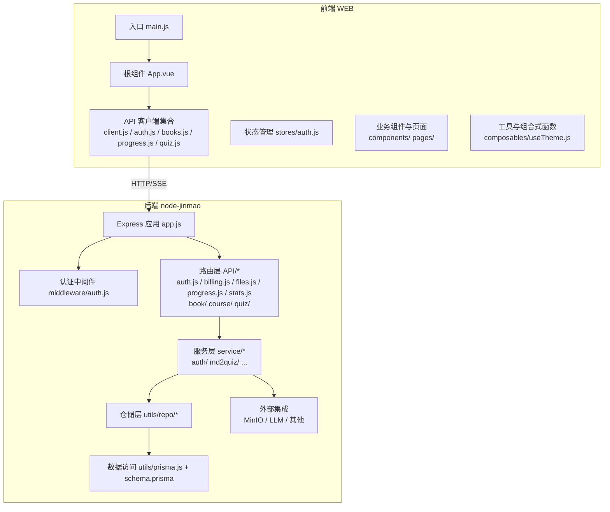
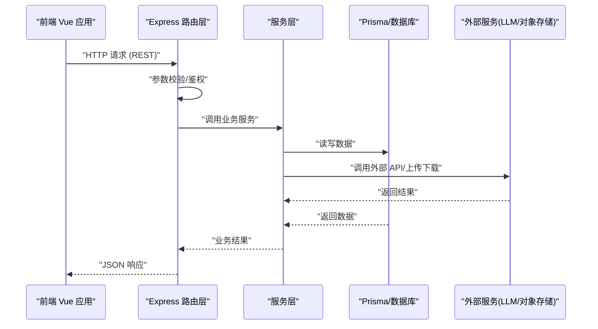
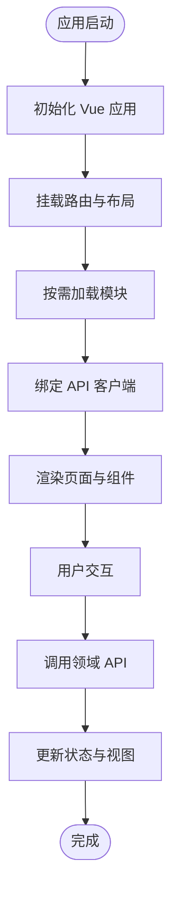
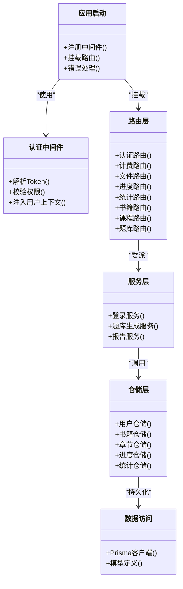
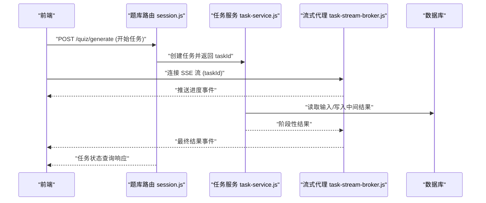
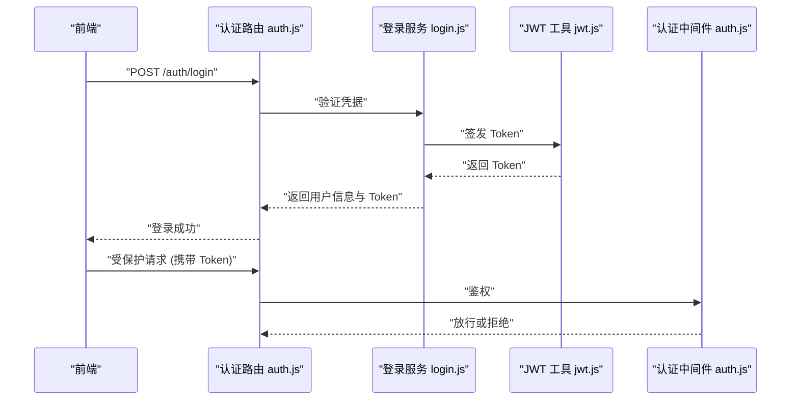
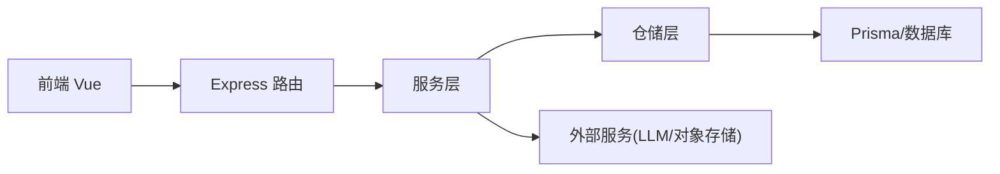

# 整体架构设计

<cite>
**本文引用的文件**   
- [app.js](file://node-jinmao/app.js)
- [package.json](file://node-jinmao/package.json)
- [schema.prisma](file://node-jinmao/prisma/schema.prisma)
- [auth.js](file://node-jinmao/API/auth.js)
- [billing.js](file://node-jinmao/API/billing.js)
- [files.js](file://node-jinmao/API/files.js)
- [progress.js](file://node-jinmao/API/progress.js)
- [stats.js](file://node-jinmao/API/stats.js)
- [book/index.js](file://node-jinmao/API/book/index.js)
- [course/index.js](file://node-jinmao/API/course/index.js)
- [quiz/session.js](file://node-jinmao/API/quiz/session.js)
- [quiz/report.js](file://node-jinmao/API/quiz/report.js)
- [service/auth/login.js](file://node-jinmao/service/auth/login.js)
- [service/md2quiz/task-service.js](file://node-jinmao/service/md2quiz/task-service.js)
- [service/md2quiz/task-stream-broker.js](file://node-jinmao/service/md2quiz/task-stream-broker.js)
- [utils/prisma.js](file://node-jinmao/utils/prisma.js)
- [utils/jwt.js](file://node-jinmao/utils/jwt.js)
- [middleware/auth.js](file://node-jinmao/middleware/auth.js)
- [main.js](file://WEB/src/main.js)
- [App.vue](file://WEB/src/App.vue)
- [api/client.js](file://WEB/src/api/client.js)
- [api/auth.js](file://WEB/src/api/auth.js)
- [api/books.js](file://WEB/src/api/books.js)
- [api/progress.js](file://WEB/src/api/progress.js)
- [api/quiz.js](file://WEB/src/api/quiz.js)
- [stores/auth.js](file://WEB/src/stores/auth.js)
- [composables/useTheme.js](file://WEB/src/composables/useTheme.js)
</cite>

## 目录
1. [引言](#引言)
2. [项目结构](#项目结构)
3. [核心组件](#核心组件)
4. [架构总览](#架构总览)
5. [详细组件分析](#详细组件分析)
6. [依赖关系分析](#依赖关系分析)
7. [性能考量](#性能考量)
8. [故障排查指南](#故障排查指南)
9. [结论](#结论)
10. [附录](#附录)

## 引言
本文件面向“金毛教你学重构版”的整体架构设计，聚焦前后端分离、MVC与微服务风格的服务模块划分、RESTful API 与 SSE 流式传输的通信机制，以及数据流向与扩展性设计。文档同时解释技术选型（Vue 3、Express.js、Prisma）的原因与权衡，并给出可维护性与可扩展性的实践原则。

## 项目结构
系统由两大子系统构成：
- 前端：基于 Vue 3 + Vite 的单页应用，按功能域组织页面、组件、API 客户端与状态管理。
- 后端：基于 Node.js + Express 的 REST API 服务，采用 MVC 分层与按领域划分的微服务风格模块，使用 Prisma 进行数据访问。

图表来源
- [main.js](file://WEB/src/main.js)
- [App.vue](file://WEB/src/App.vue)
- [client.js](file://WEB/src/api/client.js)
- [app.js](file://node-jinmao/app.js)
- [auth.js](file://node-jinmao/middleware/auth.js)
- [schema.prisma](file://node-jinmao/prisma/schema.prisma)

章节来源
- [main.js](file://WEB/src/main.js)
- [App.vue](file://WEB/src/App.vue)
- [app.js](file://node-jinmao/app.js)
- [package.json](file://node-jinmao/package.json)

## 核心组件
- 前端入口与路由：main.js 初始化 Vue 应用，App.vue 挂载全局布局与主题；路由与页面按功能域组织。
- API 客户端：统一封装 HTTP 请求与错误处理，按领域拆分 client.js、auth.js、books.js、progress.js、quiz.js 等。
- 状态管理：stores/auth.js 管理登录态与用户信息，配合 composables/useTheme.js 实现主题切换。
- 后端应用：app.js 注册中间件、路由与错误处理；middleware/auth.js 提供鉴权能力。
- 路由层：API/* 按领域划分控制器，如 auth.js、billing.js、files.js、progress.js、stats.js，以及 book/、course/、quiz/ 子模块。
- 服务层：service/* 承载业务编排，如 service/auth/login.js、service/md2quiz/task-service.js 等。
- 数据访问：utils/prisma.js 与 prisma/schema.prisma 定义模型与迁移，仓储层 utils/repo/* 封装查询。

章节来源
- [main.js](file://WEB/src/main.js)
- [App.vue](file://WEB/src/App.vue)
- [client.js](file://WEB/src/api/client.js)
- [auth.js](file://WEB/src/api/auth.js)
- [books.js](file://WEB/src/api/books.js)
- [progress.js](file://WEB/src/api/progress.js)
- [quiz.js](file://WEB/src/api/quiz.js)
- [auth.js](file://WEB/src/stores/auth.js)
- [useTheme.js](file://WEB/src/composables/useTheme.js)
- [app.js](file://node-jinmao/app.js)
- [auth.js](file://node-jinmao/middleware/auth.js)
- [auth.js](file://node-jinmao/API/auth.js)
- [billing.js](file://node-jinmao/API/billing.js)
- [files.js](file://node-jinmao/API/files.js)
- [progress.js](file://node-jinmao/API/progress.js)
- [stats.js](file://node-jinmao/API/stats.js)
- [index.js](file://node-jinmao/API/book/index.js)
- [index.js](file://node-jinmao/API/course/index.js)
- [session.js](file://node-jinmao/API/quiz/session.js)
- [report.js](file://node-jinmao/API/quiz/report.js)
- [login.js](file://node-jinmao/service/auth/login.js)
- [task-service.js](file://node-jinmao/service/md2quiz/task-service.js)
- [prisma.js](file://node-jinmao/utils/prisma.js)
- [schema.prisma](file://node-jinmao/prisma/schema.prisma)

## 架构总览
系统采用前后端分离与 MVC 分层，结合微服务风格的模块边界：
- 表现层（前端）：Vue 3 单页应用，负责 UI 渲染、用户交互与本地状态。
- 接口层（后端路由）：Express 路由按领域划分，接收请求、校验参数、委派服务。
- 服务层（业务编排）：service/* 聚合仓储调用、第三方服务与任务编排。
- 数据层（仓储与 ORM）：utils/repo/* 与 Prisma 抽象数据库访问，schema.prisma 描述模型。
- 横切关注点：认证中间件、日志、错误处理、配置与密钥管理。

图表来源
- [app.js](file://node-jinmao/app.js)
- [auth.js](file://node-jinmao/API/auth.js)
- [task-service.js](file://node-jinmao/service/md2quiz/task-service.js)
- [prisma.js](file://node-jinmao/utils/prisma.js)
- [schema.prisma](file://node-jinmao/prisma/schema.prisma)

## 详细组件分析

### 前端应用（Vue 3）
- 入口与根组件：main.js 创建应用实例并挂载；App.vue 定义全局布局、主题与路由容器。
- API 客户端：client.js 统一封装 fetch/axios 请求拦截、错误处理与重试策略；各 domain API（auth.js、books.js、progress.js、quiz.js）暴露领域方法。
- 状态管理：stores/auth.js 管理登录态、令牌与用户信息；composables/useTheme.js 提供主题切换逻辑。
- 组件与页面：components/ 与 pages/ 按功能域组织，复用通用组件（如课程卡片、题库导入对话框）。

章节来源
- [main.js](file://WEB/src/main.js)
- [App.vue](file://WEB/src/App.vue)
- [client.js](file://WEB/src/api/client.js)
- [auth.js](file://WEB/src/api/auth.js)
- [books.js](file://WEB/src/api/books.js)
- [progress.js](file://WEB/src/api/progress.js)
- [quiz.js](file://WEB/src/api/quiz.js)
- [auth.js](file://WEB/src/stores/auth.js)
- [useTheme.js](file://WEB/src/composables/useTheme.js)

### 后端应用（Express + MVC）
- 应用启动：app.js 注册中间件、路由、错误处理与静态资源。
- 认证中间件：middleware/auth.js 解析 Token、校验权限，保护受保护路由。
- 路由层：API/* 按领域划分，如 auth.js（认证）、billing.js（计费）、files.js（文件）、progress.js（学习进度）、stats.js（统计），以及 book/、course/、quiz/ 子模块。
- 服务层：service/* 编排业务流程，如 service/auth/login.js 处理登录流程，service/md2quiz/task-service.js 协调 Markdown 转题库的任务。
- 数据访问：utils/prisma.js 提供 Prisma 客户端，schema.prisma 定义模型与迁移；仓储层 utils/repo/* 封装 CRUD。

图表来源
- [app.js](file://node-jinmao/app.js)
- [auth.js](file://node-jinmao/middleware/auth.js)
- [auth.js](file://node-jinmao/API/auth.js)
- [billing.js](file://node-jinmao/API/billing.js)
- [files.js](file://node-jinmao/API/files.js)
- [progress.js](file://node-jinmao/API/progress.js)
- [stats.js](file://node-jinmao/API/stats.js)
- [index.js](file://node-jinmao/API/book/index.js)
- [index.js](file://node-jinmao/API/course/index.js)
- [session.js](file://node-jinmao/API/quiz/session.js)
- [report.js](file://node-jinmao/API/quiz/report.js)
- [login.js](file://node-jinmao/service/auth/login.js)
- [task-service.js](file://node-jinmao/service/md2quiz/task-service.js)
- [prisma.js](file://node-jinmao/utils/prisma.js)
- [schema.prisma](file://node-jinmao/prisma/schema.prisma)

章节来源
- [app.js](file://node-jinmao/app.js)
- [auth.js](file://node-jinmao/middleware/auth.js)
- [auth.js](file://node-jinmao/API/auth.js)
- [billing.js](file://node-jinmao/API/billing.js)
- [files.js](file://node-jinmao/API/files.js)
- [progress.js](file://node-jinmao/API/progress.js)
- [stats.js](file://node-jinmao/API/stats.js)
- [index.js](file://node-jinmao/API/book/index.js)
- [index.js](file://node-jinmao/API/course/index.js)
- [session.js](file://node-jinmao/API/quiz/session.js)
- [report.js](file://node-jinmao/API/quiz/report.js)
- [login.js](file://node-jinmao/service/auth/login.js)
- [task-service.js](file://node-jinmao/service/md2quiz/task-service.js)
- [prisma.js](file://node-jinmao/utils/prisma.js)
- [schema.prisma](file://node-jinmao/prisma/schema.prisma)

### SSE 流式传输（Markdown 转题库）
- 前端通过事件流订阅任务进度与结果，提升长耗时任务的体验。
- 后端 task-stream-broker.js 作为流式消息代理，task-service.js 编排任务执行并推送进度。

图表来源
- [session.js](file://node-jinmao/API/quiz/session.js)
- [task-service.js](file://node-jinmao/service/md2quiz/task-service.js)
- [task-stream-broker.js](file://node-jinmao/service/md2quiz/task-stream-broker.js)

章节来源
- [session.js](file://node-jinmao/API/quiz/session.js)
- [task-service.js](file://node-jinmao/service/md2quiz/task-service.js)
- [task-stream-broker.js](file://node-jinmao/service/md2quiz/task-stream-broker.js)

### 认证与授权流程
- 前端 stores/auth.js 管理登录态与令牌，API 客户端在请求头携带 Token。
- 后端 middleware/auth.js 校验 Token，路由层根据角色控制访问。

图表来源
- [auth.js](file://WEB/src/api/auth.js)
- [auth.js](file://WEB/src/stores/auth.js)
- [auth.js](file://node-jinmao/API/auth.js)
- [login.js](file://node-jinmao/service/auth/login.js)
- [jwt.js](file://node-jinmao/utils/jwt.js)
- [auth.js](file://node-jinmao/middleware/auth.js)

章节来源
- [auth.js](file://WEB/src/api/auth.js)
- [auth.js](file://WEB/src/stores/auth.js)
- [auth.js](file://node-jinmao/API/auth.js)
- [login.js](file://node-jinmao/service/auth/login.js)
- [jwt.js](file://node-jinmao/utils/jwt.js)
- [auth.js](file://node-jinmao/middleware/auth.js)

## 依赖关系分析
- 前端依赖 Express 后端提供的 REST API，必要时通过 SSE 获取实时数据。
- 后端路由层依赖服务层，服务层依赖仓储层与外部服务（如 MinIO、LLM）。
- 数据访问统一通过 Prisma，避免直接 SQL 耦合，便于迁移与类型安全。

图表来源
- [app.js](file://node-jinmao/app.js)
- [auth.js](file://node-jinmao/API/auth.js)
- [task-service.js](file://node-jinmao/service/md2quiz/task-service.js)
- [prisma.js](file://node-jinmao/utils/prisma.js)
- [schema.prisma](file://node-jinmao/prisma/schema.prisma)

章节来源
- [app.js](file://node-jinmao/app.js)
- [auth.js](file://node-jinmao/API/auth.js)
- [task-service.js](file://node-jinmao/service/md2quiz/task-service.js)
- [prisma.js](file://node-jinmao/utils/prisma.js)
- [schema.prisma](file://node-jinmao/prisma/schema.prisma)

## 性能考量
- 前端：
  - 组件懒加载与路由级代码分割，减少首屏体积。
  - 请求去重与缓存策略，降低重复网络开销。
  - SSE 用于长任务，避免轮询带来的服务器压力。
- 后端：
  - 路由参数校验与快速失败，减少无效计算。
  - 服务层异步编排与并发控制，避免阻塞。
  - 数据库查询优化与索引设计，利用 Prisma 的类型提示与查询构建器。
  - 外部服务调用超时与重试策略，增强鲁棒性。

[本节为通用指导，不直接分析具体文件]

## 故障排查指南
- 认证问题：检查前端是否携带有效 Token，后端中间件是否正确解析与校验。
- SSE 断连：确认流式代理是否正常转发事件，前端事件监听与重连逻辑是否健壮。
- 数据不一致：核对仓储层事务与异常回滚，确保 Prisma 迁移与 schema 一致。
- 外部服务异常：记录调用链路日志，设置降级与熔断策略。

章节来源
- [auth.js](file://node-jinmao/middleware/auth.js)
- [task-stream-broker.js](file://node-jinmao/service/md2quiz/task-stream-broker.js)
- [prisma.js](file://node-jinmao/utils/prisma.js)
- [schema.prisma](file://node-jinmao/prisma/schema.prisma)

## 结论
本架构以 Vue 3 与 Express 为核心，结合 MVC 与微服务风格的模块边界，实现了清晰的前后端职责划分与稳定的通信机制。通过 Prisma 的数据建模与仓储封装，提升了可维护性与扩展性。SSE 流式传输增强了长任务的用户体验。未来可在服务治理、监控与弹性伸缩方面进一步演进。

[本节为总结性内容，不直接分析具体文件]

## 附录
- 技术选型与权衡：
  - Vue 3：响应式与组合式 API 提升开发效率与组件复用；生态成熟，适合复杂交互场景。
  - Express.js：轻量灵活，中间件生态完善，易于快速搭建 REST API。
  - Prisma：类型安全的 ORM，简化数据库操作与迁移，提高团队协作效率。
- 可扩展性与可维护性原则：
  - 单一职责与高内聚低耦合，按领域划分模块。
  - 明确接口契约，避免跨层直接依赖。
  - 配置与密钥外置，支持多环境部署。
  - 完善的日志、监控与错误上报，保障可观测性。

[本节为通用指导，不直接分析具体文件]