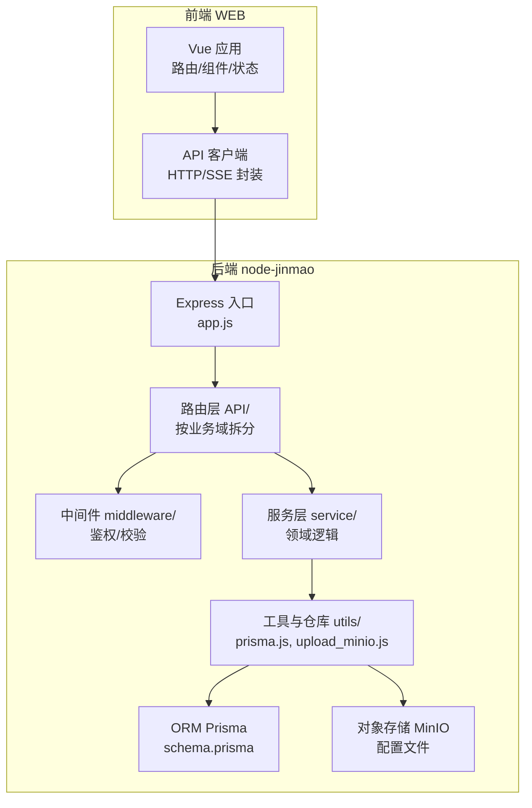
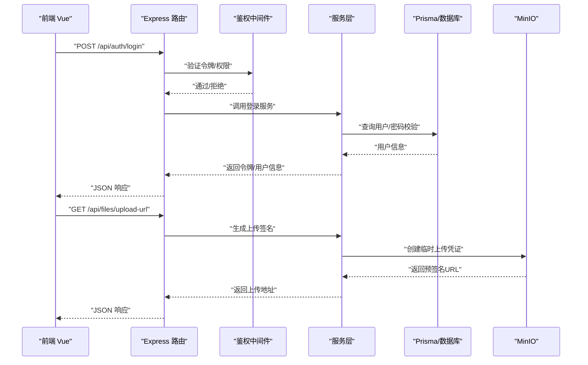
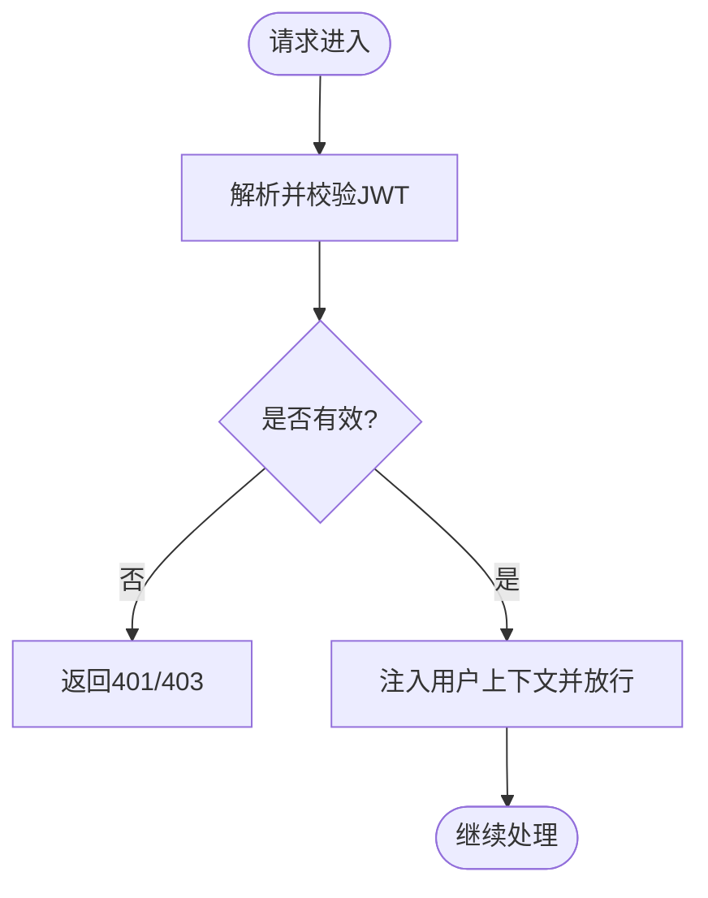
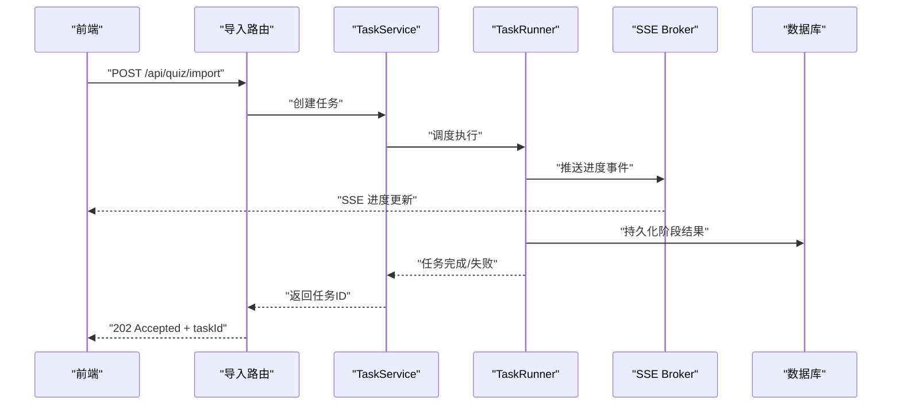
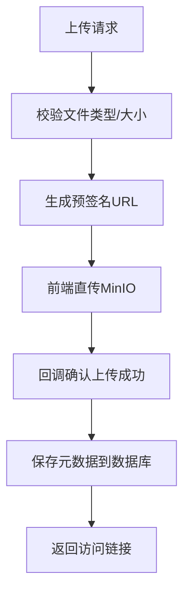
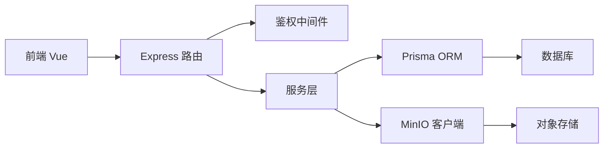
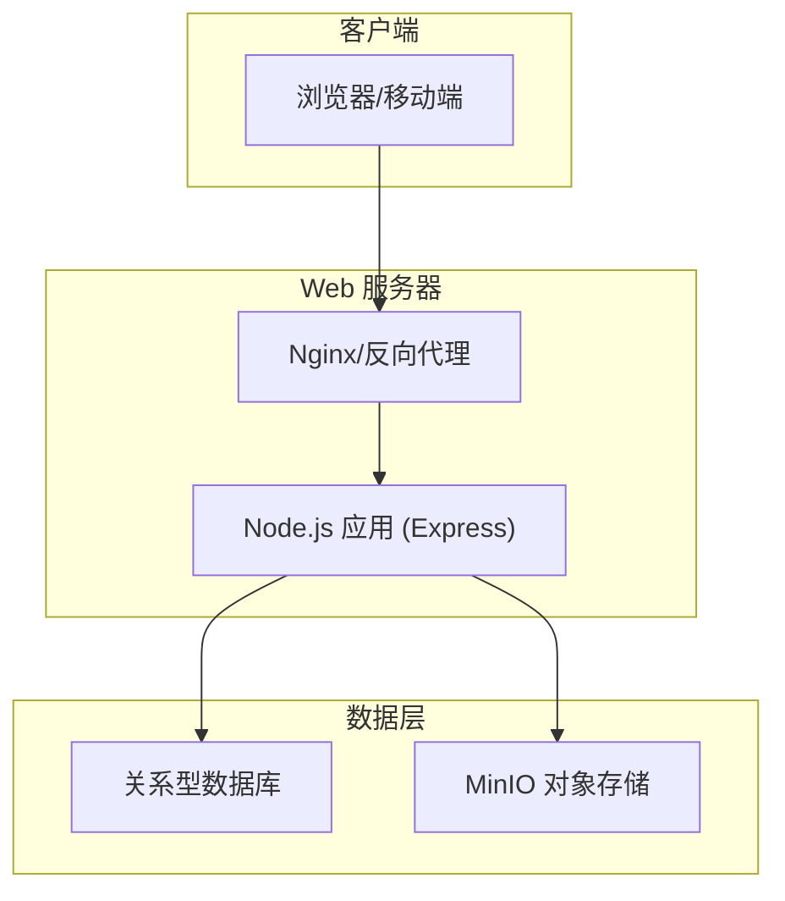

# 系统架构

<cite>
**本文引用的文件**   
- [app.js](file://node-jinmao/app.js)
- [package.json](file://node-jinmao/package.json)
- [schema.prisma](file://node-jinmao/prisma/schema.prisma)
- [auth.js](file://node-jinmao/API/auth.js)
- [files.js](file://node-jinmao/API/files.js)
- [progress.js](file://node-jinmao/API/progress.js)
- [stats.js](file://node-jinmao/API/stats.js)
- [book/index.js](file://node-jinmao/API/book/index.js)
- [course/index.js](file://node-jinmao/API/course/index.js)
- [quiz/import.js](file://node-jinmao/API/quiz/import.js)
- [quiz/session.js](file://node-jinmao/API/quiz/session.js)
- [quiz/report.js](file://node-jinmao/API/quiz/report.js)
- [middleware/auth.js](file://node-jinmao/middleware/auth.js)
- [service/auth/login.js](file://node-jinmao/service/auth/login.js)
- [service/auth/profile.js](file://node-jinmao/service/auth/profile.js)
- [service/md2quiz/task-service.js](file://node-jinmao/service/md2quiz/task-service.js)
- [service/md2quiz/task-runner.js](file://node-jinmao/service/md2quiz/task-runner.js)
- [service/md2quiz/task-store.js](file://node-jinmao/service/md2quiz/task-store.js)
- [service/md2quiz/task-stream-broker.js](file://node-jinmao/service/md2quiz/task-stream-broker.js)
- [utils/prisma.js](file://node-jinmao/utils/prisma.js)
- [utils/upload_minio.js](file://node-jinmao/utils/upload_minio.js)
- [config/minio_config.json](file://node-jinmao/config/minio_config.json)
- [main.js](file://WEB/src/main.js)
- [api/client.js](file://WEB/src/api/client.js)
- [pages/login/index.vue](file://WEB/src/pages/login/index.vue)
- [pages/quiz/index.vue](file://WEB/src/pages/quiz/index.vue)
- [stores/auth.js](file://WEB/src/stores/auth.js)
</cite>

## 目录
1. [引言](#引言)
2. [项目结构](#项目结构)
3. [核心组件](#核心组件)
4. [架构总览](#架构总览)
5. [详细组件分析](#详细组件分析)
6. [依赖关系分析](#依赖关系分析)
7. [性能考量](#性能考量)
8. [故障排查指南](#故障排查指南)
9. [结论](#结论)
10. [附录](#附录)

## 引言
本架构文档面向“金毛教你学重构版”系统，覆盖前后端分离的整体设计：Vue.js 前端、Node.js Express 后端、Prisma ORM 数据访问层与 MinIO 对象存储。文档阐述 MVC 模式应用、微服务风格的服务模块划分、事件驱动的异步任务处理机制（SSE/任务队列），并给出系统边界、组件通信协议、数据流向图、扩展点设计、技术选型权衡、可扩展性与可维护性策略，以及部署拓扑与基础设施需求说明。

## 项目结构
- 前端（WEB）
  - Vue 3 + Vite 构建，模块化页面与组件，API 客户端封装统一调用后端接口，状态管理集中化。
- 后端（node-jinmao）
  - Express 路由按业务域拆分（API 目录），中间件负责鉴权等横切关注点；Service 层承载领域逻辑；Repo/Utils 提供数据访问与工具能力；Prisma 作为 ORM 管理数据库迁移与类型安全访问；MinIO 用于文件对象存储。
- 配置与脚本
  - 各服务配置（如 MinIO、LLM 等）集中于 config 目录；启动脚本与部署脚本位于根目录。

**图表来源** 
- [app.js:1-200](file://node-jinmao/app.js#L1-L200)
- [package.json:1-100](file://node-jinmao/package.json#L1-L100)
- [schema.prisma:1-200](file://node-jinmao/prisma/schema.prisma#L1-L200)
- [main.js:1-100](file://WEB/src/main.js#L1-L100)
- [client.js:1-100](file://WEB/src/api/client.js#L1-L100)

**章节来源**
- [app.js:1-200](file://node-jinmao/app.js#L1-L200)
- [package.json:1-100](file://node-jinmao/package.json#L1-L100)
- [schema.prisma:1-200](file://node-jinmao/prisma/schema.prisma#L1-L200)
- [main.js:1-100](file://WEB/src/main.js#L1-L100)
- [client.js:1-100](file://WEB/src/api/client.js#L1-L100)

## 核心组件
- 前端应用（Vue 3）
  - 路由与页面：登录、刷题、学习、账单等页面按功能组织。
  - 状态管理：认证状态集中管理，跨页面共享用户会话信息。
  - API 客户端：统一封装 HTTP 请求与 SSE 事件订阅，简化调用与错误处理。
- 后端服务（Express）
  - 路由层：按业务域拆分为 auth、book、course、quiz、files、progress、stats 等模块。
  - 中间件：鉴权、参数校验、日志等横切逻辑。
  - 服务层：领域逻辑与编排，协调外部服务（LLM、MinIO、数据库）。
  - 数据访问：通过 Prisma 生成类型安全的查询与变更操作。
  - 对象存储：上传/下载文件至 MinIO，返回可访问 URL。
- 数据层（Prisma + 数据库）
  - schema.prisma 定义模型与关系，migrations 管理版本演进。
- 对象存储（MinIO）
  - 统一文件存取，支持课程资料、题目附件、报告等。

**章节来源**
- [auth.js:1-200](file://node-jinmao/API/auth.js#L1-L200)
- [files.js:1-200](file://node-jinmao/API/files.js#L1-L200)
- [progress.js:1-200](file://node-jinmao/API/progress.js#L1-L200)
- [stats.js:1-200](file://node-jinmao/API/stats.js#L1-L200)
- [book/index.js:1-200](file://node-jinmao/API/book/index.js#L1-L200)
- [course/index.js:1-200](file://node-jinmao/API/course/index.js#L1-L200)
- [quiz/import.js:1-200](file://node-jinmao/API/quiz/import.js#L1-L200)
- [quiz/session.js:1-200](file://node-jinmao/API/quiz/session.js#L1-L200)
- [quiz/report.js:1-200](file://node-jinmao/API/quiz/report.js#L1-L200)
- [middleware/auth.js:1-200](file://node-jinmao/middleware/auth.js#L1-L200)
- [utils/prisma.js:1-200](file://node-jinmao/utils/prisma.js#L1-L200)
- [utils/upload_minio.js:1-200](file://node-jinmao/utils/upload_minio.js#L1-L200)
- [config/minio_config.json:1-100](file://node-jinmao/config/minio_config.json#L1-L100)

## 架构总览
系统采用前后端分离的 MVC 架构：
- 表现层（前端）：Vue 组件与页面，负责 UI 渲染与用户交互。
- 控制层（后端路由）：Express 路由接收请求，进行参数校验与鉴权。
- 服务层（业务编排）：Service 模块实现领域逻辑，协调外部依赖。
- 数据层（ORM 与存储）：Prisma 访问数据库，MinIO 管理对象文件。

**图表来源** 
- [auth.js:1-200](file://node-jinmao/API/auth.js#L1-L200)
- [middleware/auth.js:1-200](file://node-jinmao/middleware/auth.js#L1-L200)
- [files.js:1-200](file://node-jinmao/API/files.js#L1-L200)
- [upload_minio.js:1-200](file://node-jinmao/utils/upload_minio.js#L1-L200)

## 详细组件分析

### 认证与授权（Auth）
- 职责
  - 登录、注册、OTP、个人资料更新。
  - 基于 JWT 的无状态鉴权，中间件校验请求合法性。
- 关键流程
  - 登录：前端提交凭据 -> 路由校验 -> 服务层验证 -> 签发令牌 -> 返回前端。
  - 受保护接口：中间件解析 Token -> 注入用户上下文 -> 路由继续处理。
- 数据流
  - 用户表、活动记录、计费字段在数据库中持久化。

**图表来源** 
- [middleware/auth.js:1-200](file://node-jinmao/middleware/auth.js#L1-L200)
- [auth.js:1-200](file://node-jinmao/API/auth.js#L1-L200)
- [service/auth/login.js:1-200](file://node-jinmao/service/auth/login.js#L1-L200)
- [service/auth/profile.js:1-200](file://node-jinmao/service/auth/profile.js#L1-L200)

**章节来源**
- [auth.js:1-200](file://node-jinmao/API/auth.js#L1-L200)
- [middleware/auth.js:1-200](file://node-jinmao/middleware/auth.js#L1-L200)
- [service/auth/login.js:1-200](file://node-jinmao/service/auth/login.js#L1-L200)
- [service/auth/profile.js:1-200](file://node-jinmao/service/auth/profile.js#L1-L200)

### 题库导入与异步任务（MD2Quiz）
- 职责
  - 将 Markdown/PDF 转换为结构化题目 JSON，支持分块处理、结果校验、任务持久化与进度推送。
- 关键组件
  - TaskService：任务生命周期管理（创建、调度、完成、失败重试）。
  - TaskRunner：执行具体转换步骤（分块、调用 LLM、校验、落库）。
  - TaskStore：任务状态持久化（内存或数据库）。
  - TaskStreamBroker：SSE 推送任务进度与结果。
- 数据流
  - 前端发起导入 -> 后端创建任务 -> 后台分块处理 -> 实时推送进度 -> 完成后返回结果。

**图表来源** 
- [quiz/import.js:1-200](file://node-jinmao/API/quiz/import.js#L1-L200)
- [service/md2quiz/task-service.js:1-200](file://node-jinmao/service/md2quiz/task-service.js#L1-L200)
- [service/md2quiz/task-runner.js:1-200](file://node-jinmao/service/md2quiz/task-runner.js#L1-L200)
- [service/md2quiz/task-store.js:1-200](file://node-jinmao/service/md2quiz/task-store.js#L1-L200)
- [service/md2quiz/task-stream-broker.js:1-200](file://node-jinmao/service/md2quiz/task-stream-broker.js#L1-L200)

**章节来源**
- [quiz/import.js:1-200](file://node-jinmao/API/quiz/import.js#L1-L200)
- [service/md2quiz/task-service.js:1-200](file://node-jinmao/service/md2quiz/task-service.js#L1-L200)
- [service/md2quiz/task-runner.js:1-200](file://node-jinmao/service/md2quiz/task-runner.js#L1-L200)
- [service/md2quiz/task-store.js:1-200](file://node-jinmao/service/md2quiz/task-store.js#L1-L200)
- [service/md2quiz/task-stream-broker.js:1-200](file://node-jinmao/service/md2quiz/task-stream-broker.js#L1-L200)

### 文件与对象存储（Files & MinIO）
- 职责
  - 文件上传、下载、删除与元数据管理；与 MinIO 集成生成预签名 URL。
- 关键点
  - 上传路径与桶名策略；大文件分片与断点续传（可选扩展点）。
  - 安全策略：访问控制、防盗链、过期时间。

**图表来源** 
- [files.js:1-200](file://node-jinmao/API/files.js#L1-L200)
- [upload_minio.js:1-200](file://node-jinmao/utils/upload_minio.js#L1-L200)
- [config/minio_config.json:1-100](file://node-jinmao/config/minio_config.json#L1-L100)

**章节来源**
- [files.js:1-200](file://node-jinmao/API/files.js#L1-L200)
- [upload_minio.js:1-200](file://node-jinmao/utils/upload_minio.js#L1-L200)
- [config/minio_config.json:1-100](file://node-jinmao/config/minio_config.json#L1-L100)

### 学习进度与统计（Progress & Stats）
- 职责
  - 记录用户学习行为（答题、阅读时长、正确率等），聚合统计报表。
- 关键点
  - 高并发写入优化（批量插入、缓存聚合）。
  - 统计维度灵活扩展（按课程、章节、题型）。

**章节来源**
- [progress.js:1-200](file://node-jinmao/API/progress.js#L1-L200)
- [stats.js:1-200](file://node-jinmao/API/stats.js#L1-L200)

### 课程与章节（Course & Chapter）
- 职责
  - 课程目录管理、章节生成与内容编排。
- 关键点
  - 章节生成流水线（大纲提取、内容扩写、多媒体资源关联）。

**章节来源**
- [course/index.js:1-200](file://node-jinmao/API/course/index.js#L1-L200)

### 题库与测验（Quiz）
- 职责
  - 题库导入、练习会话、错题本、报告生成。
- 关键点
  - 会话状态管理、评分规则、报告模板与导出。

**章节来源**
- [quiz/session.js:1-200](file://node-jinmao/API/quiz/session.js#L1-L200)
- [quiz/report.js:1-200](file://node-jinmao/API/quiz/report.js#L1-L200)

### 书籍管理（Book）
- 职责
  - 书籍列表、详情、文件管理、缺失修复、下一章节生成。
- 关键点
  - 与课程/章节联动，文件与内容一致性校验。

**章节来源**
- [book/index.js:1-200](file://node-jinmao/API/book/index.js#L1-L200)

## 依赖关系分析
- 前端依赖
  - Vue 生态（路由、状态管理、组件库）、HTTP/SSE 客户端。
- 后端依赖
  - Express、Prisma、MinIO SDK、JWT、第三方 LLM 客户端。
- 数据依赖
  - 关系型数据库（PostgreSQL/MySQL 等，由 Prisma 驱动）。
  - 对象存储（MinIO）用于非结构化数据。

**图表来源** 
- [app.js:1-200](file://node-jinmao/app.js#L1-L200)
- [package.json:1-100](file://node-jinmao/package.json#L1-L100)
- [utils/prisma.js:1-200](file://node-jinmao/utils/prisma.js#L1-L200)
- [utils/upload_minio.js:1-200](file://node-jinmao/utils/upload_minio.js#L1-L200)

**章节来源**
- [app.js:1-200](file://node-jinmao/app.js#L1-L200)
- [package.json:1-100](file://node-jinmao/package.json#L1-L100)

## 性能考量
- 前端
  - 代码分割与懒加载，静态资源 CDN 加速。
  - 请求去重与缓存策略（ETag/Cache-Control）。
- 后端
  - 路由与中间件轻量化，避免阻塞操作。
  - 数据库连接池与查询优化（索引、分页、批量写入）。
  - 大文件上传使用预签名直传，减轻服务器压力。
  - 异步任务与 SSE 提升长耗时操作的体验。
- 存储
  - MinIO 多副本与分片上传，保障可靠性与吞吐。
  - 冷热数据分层（归档历史报告、压缩旧文件）。

[本节为通用指导，不直接分析具体文件]

## 故障排查指南
- 常见问题
  - 鉴权失败：检查 JWT 签发与校验逻辑、中间件顺序。
  - 上传失败：核对 MinIO 配置、桶权限、网络连通性。
  - 任务卡住：查看任务状态、重试策略、SSE 连接稳定性。
  - 数据库异常：检查连接池、迁移版本、慢查询。
- 定位手段
  - 启用详细日志（请求链路、SQL 语句、外部调用耗时）。
  - 健康检查端点（数据库、MinIO、外部服务可用性）。
  - 监控指标（QPS、延迟、错误率、资源使用）。

**章节来源**
- [middleware/auth.js:1-200](file://node-jinmao/middleware/auth.js#L1-L200)
- [upload_minio.js:1-200](file://node-jinmao/utils/upload_minio.js#L1-L200)
- [task-stream-broker.js:1-200](file://node-jinmao/service/md2quiz/task-stream-broker.js#L1-L200)
- [prisma.js:1-200](file://node-jinmao/utils/prisma.js#L1-L200)

## 结论
本系统以清晰的 MVC 分层与微服务风格的模块划分，结合 Prisma 的类型安全数据访问与 MinIO 的对象存储能力，构建了可扩展、可维护的学习平台。通过事件驱动的异步任务与 SSE 实时推送，显著提升了长耗时任务的交互体验。未来可在网关层引入 API 网关与服务发现，进一步解耦与弹性伸缩。

[本节为总结性内容，不直接分析具体文件]

## 附录

### 系统边界与组件通信协议
- 系统边界
  - 前端：浏览器内运行，通过 HTTPS 与后端通信。
  - 后端：RESTful API，内部服务间可通过消息队列或 RPC 扩展。
  - 外部依赖：数据库、MinIO、LLM 服务。
- 通信协议
  - REST API：JSON 格式，统一错误码与分页规范。
  - SSE：服务端推送任务进度与结果。
  - 对象存储：预签名 URL 直传。

[本节为概念性说明，不直接分析具体文件]

### 扩展点设计
- 新增业务模块
  - 在 API 目录下新增路由模块，注册到 Express 入口。
  - 在 service 层实现领域逻辑，复用 utils 与 ORM。
- 新增存储后端
  - 抽象存储接口，替换 MinIO 客户端实现。
- 新增任务类型
  - 扩展 TaskRunner 处理器，接入新的外部服务。

[本节为概念性说明，不直接分析具体文件]

### 技术选型与权衡
- Vue 3 + Vite：快速开发、良好生态、构建性能优。
- Node.js + Express：轻量、I/O 密集场景友好、生态丰富。
- Prisma：类型安全、迁移管理、开发者体验佳。
- MinIO：兼容 S3 协议、私有化部署、成本可控。
- SSE：简单可靠、适合进度推送；如需更高吞吐可替换为 WebSocket。

[本节为概念性说明，不直接分析具体文件]

### 部署拓扑与基础设施需求

- 基础设施需求
  - Web 服务器：Nginx 或同等反向代理。
  - 应用服务器：Node.js 运行时，建议容器化部署。
  - 数据库：PostgreSQL/MySQL，主从或集群以提升可用性。
  - 对象存储：MinIO 集群，多副本与跨区域复制（按需）。
  - 监控与日志：Prometheus/Grafana、ELK/ Loki。

**图表来源** 
- [app.js:1-200](file://node-jinmao/app.js#L1-L200)
- [package.json:1-100](file://node-jinmao/package.json#L1-L100)