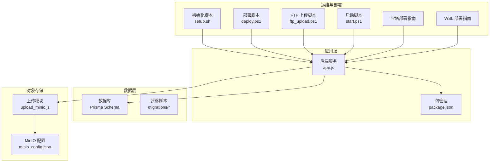
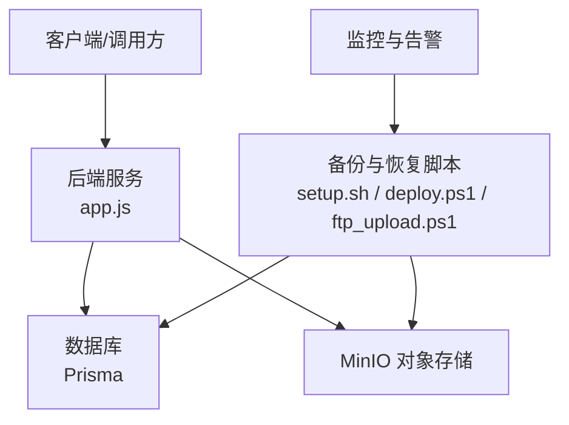
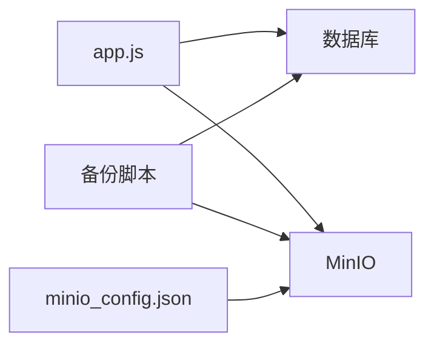

# 备份恢复

<cite>
**本文引用的文件**   
- [node-jinmao/config/minio_config.json](file://node-jinmao/config/minio_config.json)
- [node-jinmao/utils/upload_minio.js](file://node-jinmao/utils/upload_minio.js)
- [node-jinmao/prisma/schema.prisma](file://node-jinmao/prisma/schema.prisma)
- [node-jinmao/app.js](file://node-jinmao/app.js)
- [node-jinmao/package.json](file://node-jinmao/package.json)
- [node-jinmao/setup.sh](file://node-jinmao/setup.sh)
- [node-jinmao/.schema_hash](file://node-jinmao/.schema_hash)
- [node-jinmao/.migration_version](file://node-jinmao/.migration_version)
- [test/code/minio-crud.js](file://test/code/minio-crud.js)
- [deploy.ps1](file://deploy.ps1)
- [ftp_upload.ps1](file://ftp_upload.ps1)
- [start.ps1](file://start.ps1)
- [宝塔部署指南.md](file://宝塔部署指南.md)
- [WSL部署指南.md](file://WSL部署指南.md)
</cite>

## 目录
1. [简介](#简介)
2. [项目结构](#项目结构)
3. [核心组件](#核心组件)
4. [架构总览](#架构总览)
5. [详细组件分析](#详细组件分析)
6. [依赖分析](#依赖分析)
7. [性能考虑](#性能考虑)
8. [故障排查指南](#故障排查指南)
9. [结论](#结论)
10. [附录](#附录)

## 简介
本文件为“金毛教你学重构版”的备份与恢复策略文档，覆盖数据库全量/增量备份、定时任务配置、MinIO对象存储数据备份、重要配置文件备份、数据恢复流程、灾难恢复预案、RTO/RPO目标设定、备份验证与恢复演练、数据一致性检查、自动化脚本、异地容灾配置以及版本升级时的数据兼容性处理。内容基于仓库中现有代码与配置进行梳理，并给出可落地的实施建议。

## 项目结构
本项目包含前端（WEB）、后端服务（node-jinmao）及测试与工具脚本等。与备份恢复相关的关键位置包括：
- 后端服务入口与依赖管理：app.js、package.json
- 数据库模型与迁移：prisma/schema.prisma、prisma/migrations/*
- 对象存储配置与上传：config/minio_config.json、utils/upload_minio.js
- 部署与运维脚本：setup.sh、deploy.ps1、ftp_upload.ps1、start.ps1
- 部署文档：宝塔部署指南.md、WSL部署指南.md
- 测试用例：test/code/minio-crud.js

图表来源
- [node-jinmao/app.js](file://node-jinmao/app.js)
- [node-jinmao/package.json](file://node-jinmao/package.json)
- [node-jinmao/prisma/schema.prisma](file://node-jinmao/prisma/schema.prisma)
- [node-jinmao/config/minio_config.json](file://node-jinmao/config/minio_config.json)
- [node-jinmao/utils/upload_minio.js](file://node-jinmao/utils/upload_minio.js)
- [node-jinmao/setup.sh](file://node-jinmao/setup.sh)
- [deploy.ps1](file://deploy.ps1)
- [ftp_upload.ps1](file://ftp_upload.ps1)
- [start.ps1](file://start.ps1)
- [宝塔部署指南.md](file://宝塔部署指南.md)
- [WSL部署指南.md](file://WSL部署指南.md)

章节来源
- [node-jinmao/app.js](file://node-jinmao/app.js)
- [node-jinmao/package.json](file://node-jinmao/package.json)
- [node-jinmao/prisma/schema.prisma](file://node-jinmao/prisma/schema.prisma)
- [node-jinmao/config/minio_config.json](file://node-jinmao/config/minio_config.json)
- [node-jinmao/utils/upload_minio.js](file://node-jinmao/utils/upload_minio.js)
- [node-jinmao/setup.sh](file://node-jinmao/setup.sh)
- [deploy.ps1](file://deploy.ps1)
- [ftp_upload.ps1](file://ftp_upload.ps1)
- [start.ps1](file://start.ps1)
- [宝塔部署指南.md](file://宝塔部署指南.md)
- [WSL部署指南.md](file://WSL部署指南.md)

## 核心组件
- 数据库与迁移
  - 使用 Prisma 作为 ORM，Schema 定义位于 schema.prisma，迁移脚本位于 prisma/migrations。
  - 版本控制通过 .schema_hash 与 .migration_version 跟踪当前模式与迁移版本。
- 对象存储
  - MinIO 配置在 config/minio_config.json，上传逻辑在 utils/upload_minio.js。
  - 测试用例 test/code/minio-crud.js 提供基础 CRUD 操作示例。
- 应用与部署
  - 应用入口 app.js，包依赖 package.json。
  - 初始化与部署脚本 setup.sh、deploy.ps1、ftp_upload.ps1、start.ps1。
  - 部署文档宝塔部署指南.md、WSL部署指南.md。

章节来源
- [node-jinmao/prisma/schema.prisma](file://node-jinmao/prisma/schema.prisma)
- [node-jinmao/.schema_hash](file://node-jinmao/.schema_hash)
- [node-jinmao/.migration_version](file://node-jinmao/.migration_version)
- [node-jinmao/config/minio_config.json](file://node-jinmao/config/minio_config.json)
- [node-jinmao/utils/upload_minio.js](file://node-jinmao/utils/upload_minio.js)
- [test/code/minio-crud.js](file://test/code/minio-crud.js)
- [node-jinmao/app.js](file://node-jinmao/app.js)
- [node-jinmao/package.json](file://node-jinmao/package.json)
- [node-jinmao/setup.sh](file://node-jinmao/setup.sh)
- [deploy.ps1](file://deploy.ps1)
- [ftp_upload.ps1](file://ftp_upload.ps1)
- [start.ps1](file://start.ps1)
- [宝塔部署指南.md](file://宝塔部署指南.md)
- [WSL部署指南.md](file://WSL部署指南.md)

## 架构总览
下图展示备份恢复相关的系统交互：应用读写数据库与对象存储，运维脚本负责备份与恢复，部署文档指导环境搭建。

图表来源
- [node-jinmao/app.js](file://node-jinmao/app.js)
- [node-jinmao/prisma/schema.prisma](file://node-jinmao/prisma/schema.prisma)
- [node-jinmao/config/minio_config.json](file://node-jinmao/config/minio_config.json)
- [node-jinmao/utils/upload_minio.js](file://node-jinmao/utils/upload_minio.js)
- [node-jinmao/setup.sh](file://node-jinmao/setup.sh)
- [deploy.ps1](file://deploy.ps1)
- [ftp_upload.ps1](file://ftp_upload.ps1)

## 详细组件分析

### 数据库备份策略（全量与增量）
- 全量备份
  - 建议在低峰期执行完整导出，确保事务一致性与完整性校验。
  - 结合 Prisma 迁移，备份前记录当前 .schema_hash 与 .migration_version，便于恢复后对齐。
- 增量备份
  - 若数据库支持 WAL/二进制日志，可在每日全量基础上按时间窗口做增量快照。
  - 对迁移脚本变更采用“每次迁移即归档”的策略，保证恢复路径连续。
- 备份保留策略
  - 保留最近 N 份全量与 M 份增量，定期清理过期副本。
  - 将备份元数据（时间戳、大小、校验和、迁移版本）集中记录，便于检索与审计。

章节来源
- [node-jinmao/prisma/schema.prisma](file://node-jinmao/prisma/schema.prisma)
- [node-jinmao/.schema_hash](file://node-jinmao/.schema_hash)
- [node-jinmao/.migration_version](file://node-jinmao/.migration_version)

### 定时备份任务配置
- 操作系统级调度
  - Linux：使用 cron 或 systemd timer 触发备份脚本。
  - Windows：使用计划任务触发 PowerShell 脚本。
- 任务编排建议
  - 先锁写或进入只读模式（如可用），再执行全量/增量导出。
  - 导出完成后进行校验（哈希/行数对比），失败则重试并告警。
  - 成功后推送备份清单与指标到监控系统。

章节来源
- [node-jinmao/setup.sh](file://node-jinmao/setup.sh)
- [deploy.ps1](file://deploy.ps1)
- [ftp_upload.ps1](file://ftp_upload.ps1)
- [start.ps1](file://start.ps1)

### 文件存储备份方案（MinIO）
- 配置与接入
  - MinIO 连接参数位于 config/minio_config.json。
  - 上传逻辑封装在 utils/upload_minio.js，测试用例见 test/code/minio-crud.js。
- 备份范围
  - 业务文件（课程资料、题库附件、生成产物等）。
  - 临时文件与缓存需区分生命周期，避免长期留存。
- 备份策略
  - 全量镜像桶/目录结构，增量仅同步新增/变更对象。
  - 开启服务端版本控制（若可用），实现时间点恢复。
  - 跨地域复制（CRR）用于异地容灾。

章节来源
- [node-jinmao/config/minio_config.json](file://node-jinmao/config/minio_config.json)
- [node-jinmao/utils/upload_minio.js](file://node-jinmao/utils/upload_minio.js)
- [test/code/minio-crud.js](file://test/code/minio-crud.js)

### 重要配置文件备份
- 需要纳入备份的配置项
  - MinIO 配置、数据库连接串、密钥与证书、应用环境变量、Nginx/反向代理配置。
- 备份方式
  - 加密压缩归档，独立于业务数据目录，存放于安全介质或对象存储。
  - 变更审计：任何配置更新需记录版本与变更原因。

章节来源
- [node-jinmao/config/minio_config.json](file://node-jinmao/config/minio_config.json)
- [node-jinmao/package.json](file://node-jinmao/package.json)

### 数据恢复流程
- 恢复步骤
  - 准备目标环境（同版本或兼容版本）。
  - 导入数据库全量备份，按顺序回放迁移脚本至目标版本。
  - 校验 .schema_hash 与 .migration_version 与备份时一致。
  - 恢复对象存储数据（全量+增量），校验关键对象完整性。
  - 启动应用并进行冒烟测试。
- 回滚策略
  - 若恢复后异常，立即回滚到上一个已知健康版本，并重新从对应备份点恢复。

章节来源
- [node-jinmao/prisma/schema.prisma](file://node-jinmao/prisma/schema.prisma)
- [node-jinmao/.schema_hash](file://node-jinmao/.schema_hash)
- [node-jinmao/.migration_version](file://node-jinmao/.migration_version)
- [node-jinmao/utils/upload_minio.js](file://node-jinmao/utils/upload_minio.js)

### 灾难恢复预案与 RTO/RPO
- 目标设定
  - RPO：建议不超过 15 分钟（基于增量备份频率）。
  - RTO：建议不超过 1 小时（含环境准备、数据恢复与验证）。
- 预案要点
  - 明确责任人、沟通渠道、决策阈值。
  - 预置应急资源（备用主机、网络策略、访问凭证）。
  - 定期演练并复盘优化。

章节来源
- [node-jinmao/setup.sh](file://node-jinmao/setup.sh)
- [deploy.ps1](file://deploy.ps1)

### 备份验证方法
- 数据库验证
  - 随机抽样表行数与关键字段校验。
  - 运行轻量查询与统计报表，确认数据可读与计算正确。
- 对象存储验证
  - 校验关键对象的哈希值与下载可用性。
  - 模拟读取高频对象，验证延迟与吞吐。
- 自动化校验
  - 在备份脚本中加入校验步骤，失败即告警并重试。

章节来源
- [test/code/minio-crud.js](file://test/code/minio-crud.js)
- [node-jinmao/utils/upload_minio.js](file://node-jinmao/utils/upload_minio.js)

### 恢复演练流程
- 演练计划
  - 选择非生产时段，准备隔离环境。
  - 按真实恢复流程执行，记录耗时与问题。
- 演练评估
  - 对比实际 RTO/RPO 与目标，输出改进项。
  - 更新应急预案与脚本。

章节来源
- [宝塔部署指南.md](file://宝塔部署指南.md)
- [WSL部署指南.md](file://WSL部署指南.md)

### 数据一致性检查
- 数据库层面
  - 外键约束、唯一性约束、索引一致性检查。
  - 业务维度对账（用户、课程、题目、进度等关键实体）。
- 对象存储层面
  - 元数据与内容一致性校验（文件名、大小、哈希）。
- 端到端
  - 恢复后执行关键业务流程，确保状态机与结果一致。

章节来源
- [node-jinmao/prisma/schema.prisma](file://node-jinmao/prisma/schema.prisma)
- [node-jinmao/utils/upload_minio.js](file://node-jinmao/utils/upload_minio.js)

### 自动化备份脚本与存储策略
- 脚本职责
  - 全量/增量导出、校验、归档、上传、清理过期副本、发送通知。
- 存储策略
  - 本地短期保留 + 远端长期归档。
  - 分桶/分区按日期与版本组织，命名规范统一。
  - 启用加密与访问控制。

章节来源
- [node-jinmao/setup.sh](file://node-jinmao/setup.sh)
- [deploy.ps1](file://deploy.ps1)
- [ftp_upload.ps1](file://ftp_upload.ps1)

### 异地容灾配置
- 多站点策略
  - 主站点实时写入，备站点异步复制（数据库与对象存储）。
  - 切换流程预演，DNS/负载均衡切换策略。
- 监控与告警
  - 复制延迟、失败重试、容量水位告警。

章节来源
- [node-jinmao/config/minio_config.json](file://node-jinmao/config/minio_config.json)
- [node-jinmao/utils/upload_minio.js](file://node-jinmao/utils/upload_minio.js)

### 数据迁移与版本升级兼容性
- 迁移原则
  - 向前兼容优先，避免破坏性变更；必要时双写过渡。
  - 每次迁移脚本幂等，支持重复执行。
- 升级流程
  - 停机窗口内执行迁移，或灰度发布逐步切换。
  - 升级前后分别备份，确保可回滚。
- 兼容性检查
  - 校验 .schema_hash 与 .migration_version 与目标版本一致。
  - 运行回归测试与数据对账。

章节来源
- [node-jinmao/prisma/schema.prisma](file://node-jinmao/prisma/schema.prisma)
- [node-jinmao/.schema_hash](file://node-jinmao/.schema_hash)
- [node-jinmao/.migration_version](file://node-jinmao/.migration_version)

## 依赖分析
- 组件耦合
  - 应用依赖数据库与对象存储，备份恢复脚本直接对接二者。
  - 配置集中在 minio_config.json，便于统一管理与替换。
- 外部依赖
  - 数据库引擎、MinIO 服务、操作系统调度器（cron/计划任务）。
- 潜在风险
  - 配置泄露、权限不足、网络不通、磁盘空间不足、迁移脚本不兼容。

图表来源
- [node-jinmao/app.js](file://node-jinmao/app.js)
- [node-jinmao/config/minio_config.json](file://node-jinmao/config/minio_config.json)
- [node-jinmao/utils/upload_minio.js](file://node-jinmao/utils/upload_minio.js)

章节来源
- [node-jinmao/app.js](file://node-jinmao/app.js)
- [node-jinmao/config/minio_config.json](file://node-jinmao/config/minio_config.json)
- [node-jinmao/utils/upload_minio.js](file://node-jinmao/utils/upload_minio.js)

## 性能考虑
- 备份窗口
  - 避开业务高峰，限制并发与 I/O 占用，避免影响在线服务。
- 传输优化
  - 对象存储启用并行上传与断点续传，数据库导出启用流式输出。
- 存储优化
  - 压缩与去重，冷热分层存储，减少长期保留成本。
- 监控与限流
  - 监控 CPU、内存、磁盘、网络，设置阈值告警与自动降级。

## 故障排查指南
- 常见问题
  - 数据库连接失败、权限不足、迁移冲突、对象存储鉴权失败、磁盘空间不足。
- 排查步骤
  - 检查网络连接与端口、核对配置与密钥、查看日志与错误码、验证备份文件完整性。
- 应急措施
  - 快速回滚到上一健康版本，切换到备用节点，扩容磁盘或临时提升配额。

章节来源
- [node-jinmao/setup.sh](file://node-jinmao/setup.sh)
- [deploy.ps1](file://deploy.ps1)
- [ftp_upload.ps1](file://ftp_upload.ps1)

## 结论
通过全量与增量结合的备份策略、完善的对象存储备份与配置备份、严格的恢复流程与演练机制，以及明确的 RTO/RPO 目标与异地容灾方案，可有效保障“金毛教你学重构版”的数据安全与服务连续性。建议持续完善自动化脚本与监控告警，定期演练并迭代优化。

## 附录
- 部署参考
  - 宝塔部署指南.md、WSL部署指南.md
- 启动与部署脚本
  - start.ps1、deploy.ps1、ftp_upload.ps1、setup.sh