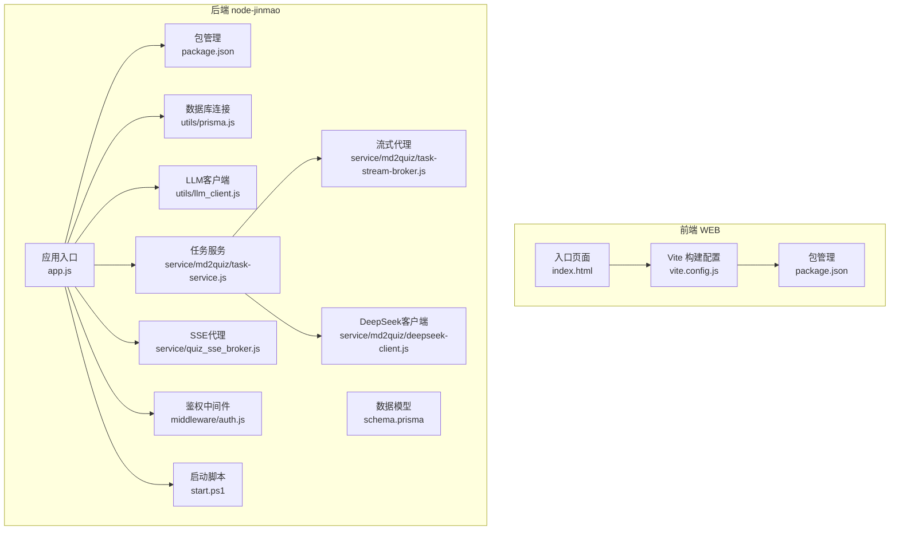
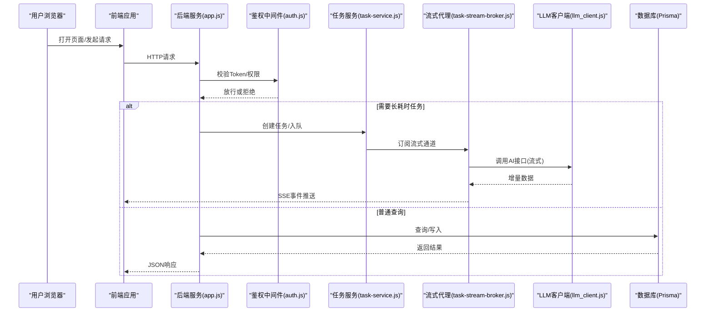
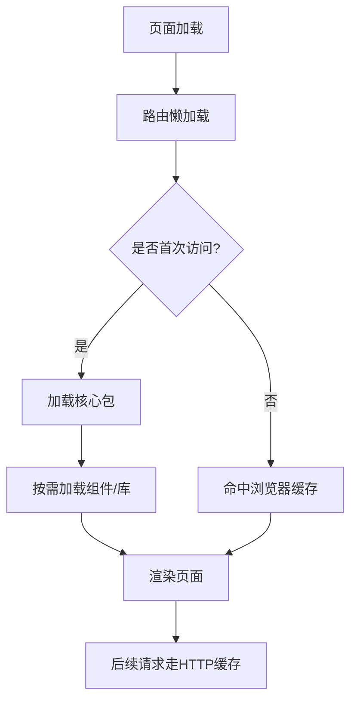
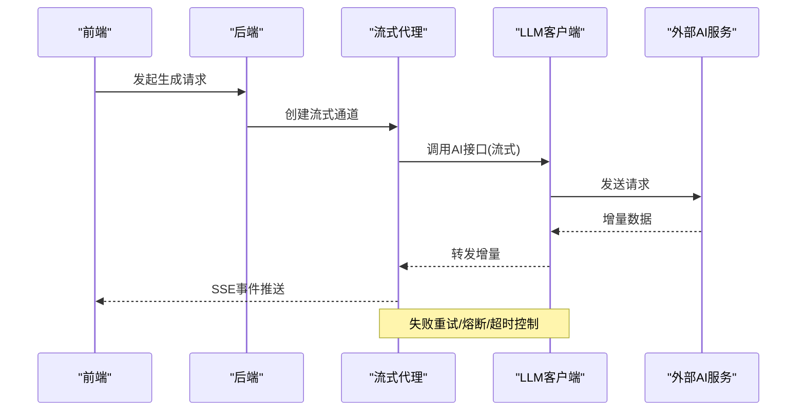
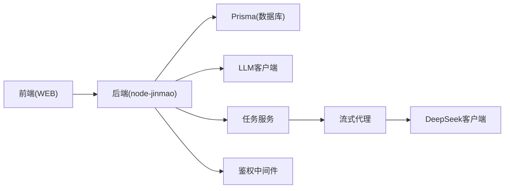

# 性能优化

<cite>
**本文引用的文件**   
- [vite.config.js](file://WEB/vite.config.js)
- [package.json](file://WEB/package.json)
- [index.html](file://WEB/index.html)
- [app.js](file://node-jinmao/app.js)
- [package.json](file://node-jinmao/package.json)
- [schema.prisma](file://node-jinmao/prisma/schema.prisma)
- [prisma.js](file://node-jinmao/utils/prisma.js)
- [llm_client.js](file://node-jinmao/utils/llm_client.js)
- [task-service.js](file://node-jinmao/service/md2quiz/task-service.js)
- [task-stream-broker.js](file://node-jinmao/service/md2quiz/task-stream-broker.js)
- [deepseek-client.js](file://node-jinmao/service/md2quiz/deepseek-client.js)
- [quiz_sse_broker.js](file://node-jinmao/service/quiz_sse_broker.js)
- [auth.js](file://node-jinmao/middleware/auth.js)
- [start.ps1](file://node-jinmao/start.ps1)
- [start.ps1](file://WEB/start.ps1)
</cite>

## 目录
1. [简介](#简介)
2. [项目结构](#项目结构)
3. [核心组件](#核心组件)
4. [架构总览](#架构总览)
5. [详细组件分析](#详细组件分析)
6. [依赖关系分析](#依赖关系分析)
7. [性能考量](#性能考量)
8. [故障排查指南](#故障排查指南)
9. [结论](#结论)
10. [附录](#附录)

## 简介
本指南面向“金毛教你学重构版”项目的性能优化，覆盖前端、后端、数据库、缓存、AI服务调用、异步任务与流式响应、服务器与Nginx、CDN与静态资源、移动端优化以及性能测试与基准。目标是帮助读者在现有代码基础上，系统性地提升首屏加载速度、接口响应时延、吞吐能力与资源利用率，并建立可复用的性能度量与调优流程。

## 项目结构
本项目包含前端（WEB）、后端（node-jinmao）以及若干工具与文档。前端基于Vite构建，后端为Node.js Express应用，使用Prisma管理数据库，集成大模型API与SSE流式输出，并通过脚本进行启动与部署。

**图表来源** 
- [vite.config.js](file://WEB/vite.config.js)
- [package.json](file://WEB/package.json)
- [index.html](file://WEB/index.html)
- [app.js](file://node-jinmao/app.js)
- [package.json](file://node-jinmao/package.json)
- [schema.prisma](file://node-jinmao/prisma/schema.prisma)
- [prisma.js](file://node-jinmao/utils/prisma.js)
- [llm_client.js](file://node-jinmao/utils/llm_client.js)
- [task-service.js](file://node-jinmao/service/md2quiz/task-service.js)
- [task-stream-broker.js](file://node-jinmao/service/md2quiz/task-stream-broker.js)
- [deepseek-client.js](file://node-jinmao/service/md2quiz/deepseek-client.js)
- [quiz_sse_broker.js](file://node-jinmao/service/quiz_sse_broker.js)
- [auth.js](file://node-jinmao/middleware/auth.js)
- [start.ps1](file://node-jinmao/start.ps1)

**章节来源**
- [vite.config.js](file://WEB/vite.config.js)
- [package.json](file://WEB/package.json)
- [index.html](file://WEB/index.html)
- [app.js](file://node-jinmao/app.js)
- [package.json](file://node-jinmao/package.json)
- [schema.prisma](file://node-jinmao/prisma/schema.prisma)
- [prisma.js](file://node-jinmao/utils/prisma.js)
- [llm_client.js](file://node-jinmao/utils/llm_client.js)
- [task-service.js](file://node-jinmao/service/md2quiz/task-service.js)
- [task-stream-broker.js](file://node-jinmao/service/md2quiz/task-stream-broker.js)
- [deepseek-client.js](file://node-jinmao/service/md2quiz/deepseek-client.js)
- [quiz_sse_broker.js](file://node-jinmao/service/quiz_sse_broker.js)
- [auth.js](file://node-jinmao/middleware/auth.js)
- [start.ps1](file://node-jinmao/start.ps1)

## 核心组件
- 前端构建与打包：Vite负责模块解析、按需编译、资源压缩与产物输出；通过入口HTML与JS初始化应用。
- 后端路由与中间件：Express应用挂载鉴权中间件，统一处理请求生命周期。
- 数据库访问：Prisma ORM配合连接池，提供类型安全的数据访问。
- AI服务调用：封装LLM客户端，支持流式传输与重试策略。
- 异步任务与流式响应：任务服务编排长耗时任务，流式代理将结果逐步推送至前端。

**章节来源**
- [vite.config.js](file://WEB/vite.config.js)
- [index.html](file://WEB/index.html)
- [app.js](file://node-jinmao/app.js)
- [auth.js](file://node-jinmao/middleware/auth.js)
- [prisma.js](file://node-jinmao/utils/prisma.js)
- [llm_client.js](file://node-jinmao/utils/llm_client.js)
- [task-service.js](file://node-jinmao/service/md2quiz/task-service.js)
- [task-stream-broker.js](file://node-jinmao/service/md2quiz/task-stream-broker.js)
- [deepseek-client.js](file://node-jinmao/service/md2quiz/deepseek-client.js)
- [quiz_sse_broker.js](file://node-jinmao/service/quiz_sse_broker.js)

## 架构总览
下图展示从浏览器到后端、数据库与外部AI服务的整体交互路径，包括鉴权、任务调度、流式响应与缓存层。

**图表来源** 
- [app.js](file://node-jinmao/app.js)
- [auth.js](file://node-jinmao/middleware/auth.js)
- [task-service.js](file://node-jinmao/service/md2quiz/task-service.js)
- [task-stream-broker.js](file://node-jinmao/service/md2quiz/task-stream-broker.js)
- [llm_client.js](file://node-jinmao/utils/llm_client.js)
- [prisma.js](file://node-jinmao/utils/prisma.js)

## 详细组件分析

### 前端性能优化（代码分割、懒加载、缓存、资源压缩）
- 代码分割与懒加载
  - 利用Vite的按需导入与动态import实现路由级与组件级懒加载，减少初始包体积。
  - 对重型库（如富文本、图表）采用延迟加载，仅在进入相关页面时加载。
- 缓存策略
  - 启用HTTP缓存头（Cache-Control、ETag），结合版本号化文件名，确保强缓存命中。
  - 对静态资源开启浏览器缓存，避免重复下载。
- 资源压缩
  - 启用Gzip/Brotli压缩，减小传输体积。
  - 图片与字体进行格式转换与尺寸裁剪，优先使用WebP/AVIF。
- 构建优化
  - 合理拆分chunk，避免单包过大；提取公共依赖，提高缓存命中率。
  - 关闭开发模式下的调试信息，生产环境移除console与无用代码。

**图表来源** 
- [vite.config.js](file://WEB/vite.config.js)
- [package.json](file://WEB/package.json)
- [index.html](file://WEB/index.html)

**章节来源**
- [vite.config.js](file://WEB/vite.config.js)
- [package.json](file://WEB/package.json)
- [index.html](file://WEB/index.html)

### 后端性能调优（连接池、并发、内存与GC）
- 连接池配置
  - 调整Prisma连接池大小以匹配CPU核数与数据库最大连接数，避免过多连接导致上下文切换开销。
  - 设置连接超时与空闲回收时间，防止连接泄漏。
- 并发与线程模型
  - Node.js单线程事件循环适合I/O密集型任务；CPU密集任务应拆分为子进程或Worker线程。
  - 使用集群模式（多进程）横向扩展，结合负载均衡分发请求。
- 内存管理与GC
  - 监控堆内存使用，避免大对象长期驻留；及时释放临时变量与句柄。
  - 合理设置Node.js内存上限，避免频繁GC造成抖动。
- 日志与追踪
  - 结构化日志记录关键路径耗时，定位瓶颈；采样高频日志降低IO压力。

**章节来源**
- [prisma.js](file://node-jinmao/utils/prisma.js)
- [app.js](file://node-jinmao/app.js)
- [package.json](file://node-jinmao/package.json)

### 数据库查询优化（索引、慢查询、事务与批处理）
- 索引设计
  - 为高频查询字段建立复合索引，避免全表扫描；定期分析慢查询日志。
- 查询优化
  - 只选择必要字段，减少数据传输；使用分页与游标避免大结果集。
  - 合并多次查询为批量操作，减少往返次数。
- 事务与锁
  - 合理使用事务保证一致性；避免长事务持有锁过久。
- 读写分离与缓存
  - 读多写少场景引入缓存层（Redis）减轻数据库压力。

**章节来源**
- [schema.prisma](file://node-jinmao/prisma/schema.prisma)
- [prisma.js](file://node-jinmao/utils/prisma.js)

### Redis缓存使用（热点数据、会话、限流）
- 缓存策略
  - 热点数据（如课程列表、题库片段）放入Redis，设置合理TTL与失效策略。
  - 使用缓存穿透保护（布隆过滤器）与回源降级。
- 会话与限流
  - 用户会话存储于Redis，支持分布式共享；接口限流基于令牌桶或滑动窗口。
- 一致性
  - 更新数据库后同步或删除缓存，避免脏读；必要时采用双写一致性方案。

[本节为通用指导，不直接分析具体文件]

### AI服务调用优化（流式响应、重试、超时与节流）
- 流式响应
  - 使用SSE或WebSocket将AI生成内容分块推送，提升用户体验与感知时延。
  - 流式代理需处理背压与错误恢复，避免阻塞事件循环。
- 重试与熔断
  - 对不稳定网络或第三方API实施指数退避重试；达到阈值触发熔断。
- 超时与限流
  - 设置合理的请求超时与并发限制，防止雪崩；队列化排队处理突发流量。
- 缓存与去重
  - 对相同输入的结果进行缓存，减少重复计算；对敏感内容做脱敏处理。

**图表来源** 
- [task-service.js](file://node-jinmao/service/md2quiz/task-service.js)
- [task-stream-broker.js](file://node-jinmao/service/md2quiz/task-stream-broker.js)
- [llm_client.js](file://node-jinmao/utils/llm_client.js)
- [deepseek-client.js](file://node-jinmao/service/md2quiz/deepseek-client.js)
- [quiz_sse_broker.js](file://node-jinmao/service/quiz_sse_broker.js)

**章节来源**
- [task-service.js](file://node-jinmao/service/md2quiz/task-service.js)
- [task-stream-broker.js](file://node-jinmao/service/md2quiz/task-stream-broker.js)
- [llm_client.js](file://node-jinmao/utils/llm_client.js)
- [deepseek-client.js](file://node-jinmao/service/md2quiz/deepseek-client.js)
- [quiz_sse_broker.js](file://node-jinmao/service/quiz_sse_broker.js)

### 异步任务队列配置（生产者-消费者、优先级与持久化）
- 队列设计
  - 使用消息队列（如Redis Streams/RabbitMQ/Kafka）解耦生产与消费；支持优先级与死信队列。
- 消费者管理
  - 多消费者并行处理，按CPU与I/O特性调节并发度；监控队列积压与消费速率。
- 任务状态与重试
  - 持久化任务元数据，支持进度查询与失败重试；幂等性设计避免重复执行。
- 背压与限流
  - 根据下游处理能力动态调整入队速率，防止过载。

[本节为通用指导，不直接分析具体文件]

### 服务器性能调优（Nginx、负载均衡、HTTPS与缓存）
- Nginx优化
  - 启用HTTP/2与Keep-Alive；合理设置worker_processes与worker_connections。
  - 配置反向代理、Gzip/Brotli压缩、静态资源缓存与过期策略。
- 负载均衡
  - 使用轮询、加权或IP哈希策略；健康检查与故障转移。
- HTTPS与安全
  - 启用TLS 1.3与强加密套件；证书自动续期与HSTS。
- 监控与告警
  - 采集QPS、延迟、错误率与资源使用指标；设置阈值告警。

[本节为通用指导，不直接分析具体文件]

### CDN加速与静态资源优化
- CDN配置
  - 将静态资源（JS/CSS/图片/字体）托管至CDN，启用边缘缓存与按需刷新。
- 资源优化
  - 图片自适应与懒加载；字体子集化与预加载关键资源。
- 版本化与缓存
  - 文件名哈希化，确保强缓存命中；清理旧版本资源。

[本节为通用指导，不直接分析具体文件]

### 移动端性能优化
- 首屏优化
  - 关键CSS内联，非关键资源延迟加载；减少主线程阻塞。
- 网络优化
  - 启用HTTP/2与QUIC；合理分包与预取。
- 渲染优化
  - 减少重排与重绘；使用虚拟列表与骨架屏提升体验。
- 兼容性
  - 针对低端设备降级功能；检测网络状况动态调整质量。

[本节为通用指导，不直接分析具体文件]

## 依赖关系分析
前后端通过HTTP/SSE通信，后端依赖Prisma与LLM客户端，任务服务协调流式代理与外部AI服务。

**图表来源** 
- [app.js](file://node-jinmao/app.js)
- [prisma.js](file://node-jinmao/utils/prisma.js)
- [llm_client.js](file://node-jinmao/utils/llm_client.js)
- [task-service.js](file://node-jinmao/service/md2quiz/task-service.js)
- [task-stream-broker.js](file://node-jinmao/service/md2quiz/task-stream-broker.js)
- [deepseek-client.js](file://node-jinmao/service/md2quiz/deepseek-client.js)
- [auth.js](file://node-jinmao/middleware/auth.js)

**章节来源**
- [app.js](file://node-jinmao/app.js)
- [prisma.js](file://node-jinmao/utils/prisma.js)
- [llm_client.js](file://node-jinmao/utils/llm_client.js)
- [task-service.js](file://node-jinmao/service/md2quiz/task-service.js)
- [task-stream-broker.js](file://node-jinmao/service/md2quiz/task-stream-broker.js)
- [deepseek-client.js](file://node-jinmao/service/md2quiz/deepseek-client.js)
- [auth.js](file://node-jinmao/middleware/auth.js)

## 性能考量
- 前端
  - 首屏时间、包体积、缓存命中率、渲染帧率。
- 后端
  - QPS、P95/P99延迟、错误率、CPU/内存占用、连接池利用率。
- 数据库
  - 慢查询数量、索引命中率、锁等待、复制延迟。
- 缓存
  - 命中率、过期策略、内存使用、淘汰算法。
- AI服务
  - 调用成功率、平均时延、重试率、熔断触发次数。
- 基础设施
  - 带宽利用率、CDN命中率、负载均衡健康状态。

[本节为通用指导，不直接分析具体文件]

## 故障排查指南
- 常见问题
  - 连接池耗尽：检查连接泄漏与最大连接数配置。
  - 内存溢出：定位大对象与未释放引用，调整Node内存上限。
  - 流式中断：检查网络稳定性与代理超时设置。
  - 缓存不一致：核对更新策略与失效时机。
- 诊断工具
  - 前端：浏览器开发者工具、Lighthouse、WebPageTest。
  - 后端：Node.js Profiler、PM2监控、APM（如New Relic）。
  - 数据库：慢查询日志、Explain计划、连接监控。
  - 缓存：Redis CLI、内存与命中率统计。
- 日志与追踪
  - 结构化日志、链路追踪ID、错误堆栈上报。

**章节来源**
- [app.js](file://node-jinmao/app.js)
- [prisma.js](file://node-jinmao/utils/prisma.js)
- [task-stream-broker.js](file://node-jinmao/service/md2quiz/task-stream-broker.js)
- [llm_client.js](file://node-jinmao/utils/llm_client.js)

## 结论
通过系统化的前端构建优化、后端连接与并发调优、数据库索引与查询优化、Redis缓存策略、AI服务流式与重试机制、Nginx与负载均衡配置、CDN与静态资源优化，以及完善的性能测试与监控体系，可以显著提升“金毛教你学重构版”的整体性能与用户体验。建议持续迭代优化，建立基线指标与回归测试，确保性能稳定可控。

[本节为总结性内容，不直接分析具体文件]

## 附录
- 性能测试方法
  - 压力测试：使用wrk、autocannon、JMeter模拟高并发请求，观察QPS与延迟分布。
  - 基准测试：对关键接口与函数编写基准用例，对比优化前后差异。
  - 端到端测试：结合真实用户路径进行全链路压测，验证缓存与流式效果。
- 启动与部署
  - 前端：通过启动脚本安装依赖与构建产物。
  - 后端：通过启动脚本拉起服务，配置环境变量与端口。

**章节来源**
- [start.ps1](file://WEB/start.ps1)
- [start.ps1](file://node-jinmao/start.ps1)