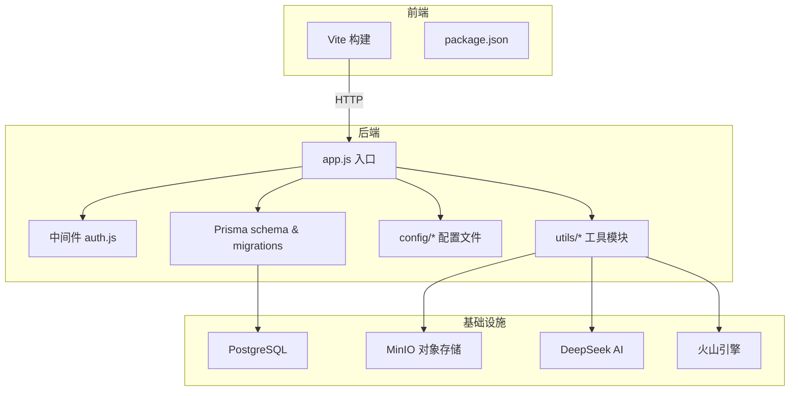
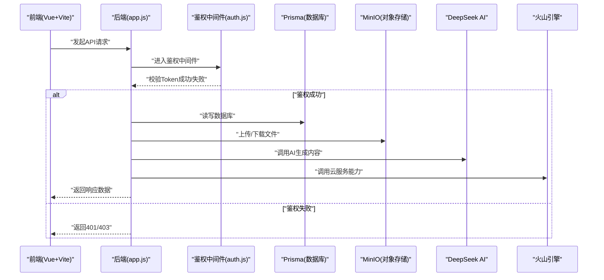
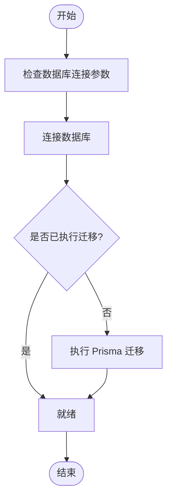
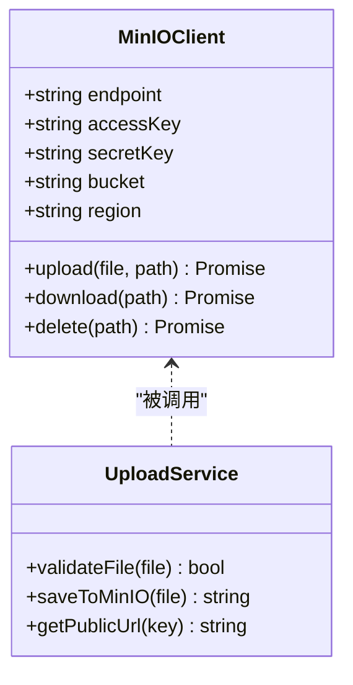
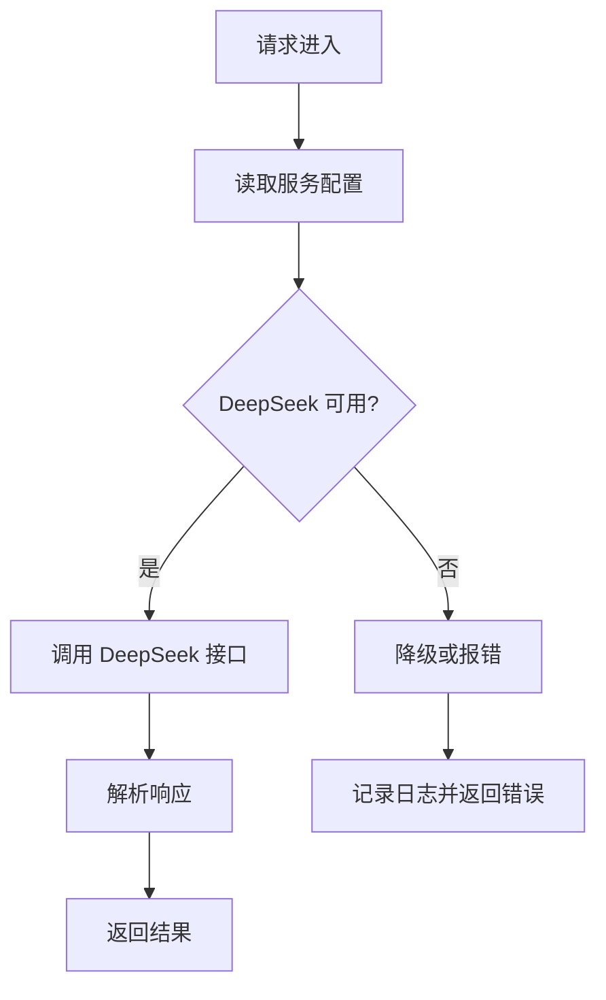
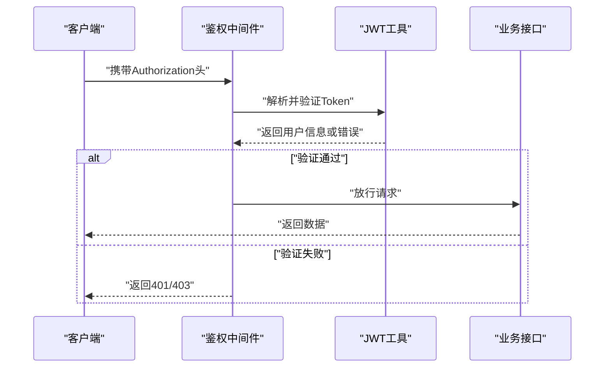
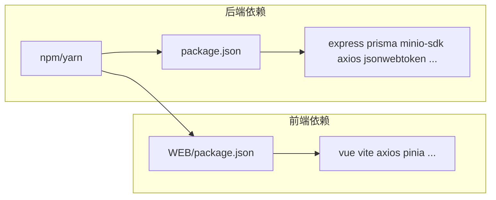

# 环境配置

<cite>
**本文引用的文件**   
- [package.json](file://node-jinmao/package.json)
- [app.js](file://node-jinmao/app.js)
- [setup.sh](file://node-jinmao/setup.sh)
- [start.ps1](file://node-jinmao/start.ps1)
- [.gitignore](file://node-jinmao/.gitignore)
- [deepseek_config.json](file://node-jinmao/config/deepseek_config.json)
- [minio_config.json](file://node-jinmao/config/minio_config.json)
- [volcengine_config.json](file://node-jinmao/config/volcengine_config.json)
- [schema.prisma](file://node-jinmao/prisma/schema.prisma)
- [20260704072148_init/migration.sql](file://node-jinmao/prisma/migrations/20260704072148_init/migration.sql)
- [20260709105504_add_course_and_chapter/migration.sql](file://node-jinmao/prisma/migrations/20260709105504_add_course_and_chapter/migration.sql)
- [prisma.js](file://node-jinmao/utils/prisma.js)
- [upload_minio.js](file://node-jinmao/utils/upload_minio.js)
- [llm_client.js](file://node-jinmao/utils/llm_client.js)
- [doc2x.js](file://node-jinmao/utils/doc2x.js)
- [auth.js](file://node-jinmao/middleware/auth.js)
- [JWT工具](file://node-jinmao/utils/jwt.js)
- [Vite配置](file://WEB/vite.config.js)
- [前端包管理](file://WEB/package.json)
</cite>

## 目录
1. [简介](#简介)
2. [项目结构](#项目结构)
3. [核心组件](#核心组件)
4. [架构总览](#架构总览)
5. [详细组件分析](#详细组件分析)
6. [依赖分析](#依赖分析)
7. [性能考虑](#性能考虑)
8. [故障排查指南](#故障排查指南)
9. [结论](#结论)
10. [附录](#附录)

## 简介
本环境配置文档面向“金毛教你学重构版”项目的开发与生产部署，覆盖以下内容：
- Node.js 版本要求与前后端依赖安装
- 数据库（PostgreSQL）安装、初始化与迁移
- MinIO 对象存储服务的安装与配置
- DeepSeek AI 服务、火山引擎等第三方服务的环境变量与配置文件说明
- 环境变量管理与敏感信息保护策略
- 不同环境的配置差异（开发/测试/生产）
- 常见环境问题排查方法与解决方案

## 项目结构
本项目采用前后端分离架构：
- 后端：Node.js + Express（入口 app.js），使用 Prisma 进行数据建模与迁移，MinIO 作为对象存储，DeepSeek 与火山引擎作为外部服务。
- 前端：Vue 3 + Vite（入口 WEB 目录），通过 API 与后端交互。

图表来源
- [app.js](file://node-jinmao/app.js)
- [vite.config.js](file://WEB/vite.config.js)
- [package.json](file://node-jinmao/package.json)
- [package.json](file://WEB/package.json)

章节来源
- [package.json](file://node-jinmao/package.json)
- [app.js](file://node-jinmao/app.js)
- [vite.config.js](file://WEB/vite.config.js)
- [package.json](file://WEB/package.json)

## 核心组件
- 应用入口与启动流程：Express 应用初始化、中间件注册、路由挂载、端口监听。
- 数据库连接与迁移：Prisma Client 初始化、Schema 定义、迁移脚本执行。
- 对象存储：MinIO 客户端初始化、Bucket 创建、上传/下载接口封装。
- 第三方服务：DeepSeek AI 调用封装、火山引擎 SDK 配置。
- 认证与鉴权：JWT 签发与校验、请求级鉴权中间件。

章节来源
- [app.js](file://node-jinmao/app.js)
- [prisma.js](file://node-jinmao/utils/prisma.js)
- [schema.prisma](file://node-jinmao/prisma/schema.prisma)
- [upload_minio.js](file://node-jinmao/utils/upload_minio.js)
- [llm_client.js](file://node-jinmao/utils/llm_client.js)
- [auth.js](file://node-jinmao/middleware/auth.js)
- [JWT工具](file://node-jinmao/utils/jwt.js)

## 架构总览
系统整体由前端、后端、数据库、对象存储与外部服务组成。前端通过 HTTP 调用后端 API；后端根据业务逻辑访问数据库与对象存储，并调用外部 AI 服务完成内容生成与处理。

图表来源
- [app.js](file://node-jinmao/app.js)
- [auth.js](file://node-jinmao/middleware/auth.js)
- [prisma.js](file://node-jinmao/utils/prisma.js)
- [upload_minio.js](file://node-jinmao/utils/upload_minio.js)
- [llm_client.js](file://node-jinmao/utils/llm_client.js)

## 详细组件分析

### 后端启动与环境加载
- 应用入口负责加载环境变量、初始化中间件、挂载路由、启动服务。
- 关键步骤包括：读取配置、连接数据库、初始化对象存储客户端、暴露健康检查与业务接口。

章节来源
- [app.js](file://node-jinmao/app.js)
- [setup.sh](file://node-jinmao/setup.sh)
- [start.ps1](file://node-jinmao/start.ps1)

### 数据库与迁移
- 使用 Prisma 管理 Schema 与迁移，确保多环境一致性。
- 首次运行需执行迁移以创建表结构，后续通过迁移脚本演进数据结构。

图表来源
- [schema.prisma](file://node-jinmao/prisma/schema.prisma)
- [20260704072148_init/migration.sql](file://node-jinmao/prisma/migrations/20260704072148_init/migration.sql)
- [20260709105504_add_course_and_chapter/migration.sql](file://node-jinmao/prisma/migrations/20260709105504_add_course_and_chapter/migration.sql)
- [prisma.js](file://node-jinmao/utils/prisma.js)

章节来源
- [schema.prisma](file://node-jinmao/prisma/schema.prisma)
- [20260704072148_init/migration.sql](file://node-jinmao/prisma/migrations/20260704072148_init/migration.sql)
- [20260709105504_add_course_and_chapter/migration.sql](file://node-jinmao/prisma/migrations/20260709105504_add_course_and_chapter/migration.sql)
- [prisma.js](file://node-jinmao/utils/prisma.js)

### 对象存储（MinIO）
- MinIO 用于存储课程资料、题库附件、生成的资源等。
- 需要配置服务端地址、访问密钥、桶名与路径前缀。

图表来源
- [upload_minio.js](file://node-jinmao/utils/upload_minio.js)
- [minio_config.json](file://node-jinmao/config/minio_config.json)

章节来源
- [upload_minio.js](file://node-jinmao/utils/upload_minio.js)
- [minio_config.json](file://node-jinmao/config/minio_config.json)

### 第三方服务配置（DeepSeek AI、火山引擎）
- DeepSeek AI 用于题目生成、文本增强等任务，需配置 API Key、Base URL、模型名称等。
- 火山引擎提供云能力（如语音合成、图像生成等），需配置 AK/SK、区域、服务域名等。

图表来源
- [llm_client.js](file://node-jinmao/utils/llm_client.js)
- [deepseek_config.json](file://node-jinmao/config/deepseek_config.json)
- [volcengine_config.json](file://node-jinmao/config/volcengine_config.json)

章节来源
- [llm_client.js](file://node-jinmao/utils/llm_client.js)
- [deepseek_config.json](file://node-jinmao/config/deepseek_config.json)
- [volcengine_config.json](file://node-jinmao/config/volcengine_config.json)

### 认证与鉴权
- 基于 JWT 的认证流程：登录成功后签发 Token，后续请求携带 Token 进行校验。
- 中间件在路由层统一拦截，验证 Token 有效性并注入用户上下文。

图表来源
- [auth.js](file://node-jinmao/middleware/auth.js)
- [JWT工具](file://node-jinmao/utils/jwt.js)

章节来源
- [auth.js](file://node-jinmao/middleware/auth.js)
- [JWT工具](file://node-jinmao/utils/jwt.js)

### 文档转换与外部工具
- 文档转 Markdown、Markdown 转 Word、Word 转 PDF 等功能通过外部工具或 Python 脚本实现。
- 相关配置与调用封装在 utils 中，便于扩展与维护。

章节来源
- [doc2x.js](file://node-jinmao/utils/doc2x.js)

## 依赖分析
- 后端依赖：Express、Prisma、MinIO SDK、HTTP 客户端、JWT 库等。
- 前端依赖：Vue 3、Vite、Axios、状态管理等。
- 工具链：Node.js、npm/yarn、Prisma CLI、Python（可选）。

图表来源
- [package.json](file://node-jinmao/package.json)
- [package.json](file://WEB/package.json)

章节来源
- [package.json](file://node-jinmao/package.json)
- [package.json](file://WEB/package.json)

## 性能考虑
- 数据库连接池：合理设置连接数与超时，避免连接耗尽。
- 对象存储：启用分片上传与缓存，减少大文件传输开销。
- 第三方服务：增加重试与熔断机制，提升稳定性。
- 前端构建：按需打包与懒加载，优化首屏加载时间。

[本节为通用指导，不直接分析具体文件]

## 故障排查指南
- 数据库连接失败
  - 检查环境变量中的数据库连接字符串是否正确。
  - 确认数据库服务已启动且端口可达。
  - 查看迁移是否成功执行。
- MinIO 上传失败
  - 核对 endpoint、accessKey、secretKey、bucket 配置。
  - 检查网络连通性与权限策略。
- DeepSeek 调用异常
  - 确认 API Key 有效、Base URL 正确。
  - 查看限流与配额限制。
- 鉴权失败
  - 检查 Token 是否过期或签名不匹配。
  - 确认中间件顺序与路由保护配置。

章节来源
- [prisma.js](file://node-jinmao/utils/prisma.js)
- [upload_minio.js](file://node-jinmao/utils/upload_minio.js)
- [llm_client.js](file://node-jinmao/utils/llm_client.js)
- [auth.js](file://node-jinmao/middleware/auth.js)

## 结论
通过规范的环境配置与依赖管理，可快速搭建开发与生产环境。建议将敏感信息纳入环境变量管理，结合 CI/CD 自动化部署，确保环境一致性与安全性。

[本节为总结性内容，不直接分析具体文件]

## 附录

### Node.js 版本要求
- 建议使用 LTS 版本（如 18.x 或 20.x），确保与依赖兼容。
- 前端构建需 Node.js 支持 ES 模块与 Vite 插件生态。

章节来源
- [package.json](file://node-jinmao/package.json)
- [package.json](file://WEB/package.json)

### 数据库安装与初始化
- 安装 PostgreSQL 并创建数据库用户与数据库。
- 执行 Prisma 迁移以初始化表结构。
- 生产环境建议使用只读副本与备份策略。

章节来源
- [schema.prisma](file://node-jinmao/prisma/schema.prisma)
- [20260704072148_init/migration.sql](file://node-jinmao/prisma/migrations/20260704072148_init/migration.sql)
- [20260709105504_add_course_and_chapter/migration.sql](file://node-jinmao/prisma/migrations/20260709105504_add_course_and_chapter/migration.sql)

### MinIO 安装与配置
- 安装 MinIO Server，创建 Bucket 与访问密钥。
- 在后端配置文件中设置 endpoint、accessKey、secretKey、bucket。
- 生产环境建议启用 HTTPS 与访问控制。

章节来源
- [minio_config.json](file://node-jinmao/config/minio_config.json)
- [upload_minio.js](file://node-jinmao/utils/upload_minio.js)

### DeepSeek AI 服务配置
- 获取 API Key 并配置 Base URL。
- 在后端配置文件中设置模型名称、超时与重试策略。
- 建议在生产环境启用限流与监控。

章节来源
- [deepseek_config.json](file://node-jinmao/config/deepseek_config.json)
- [llm_client.js](file://node-jinmao/utils/llm_client.js)

### 火山引擎配置
- 获取 AK/SK 并配置区域与服务域名。
- 在后端配置文件中设置相关参数。
- 建议启用日志与告警。

章节来源
- [volcengine_config.json](file://node-jinmao/config/volcengine_config.json)

### 环境变量管理与敏感信息保护
- 使用 .env 文件管理环境变量，禁止提交到版本库。
- 生产环境通过平台环境变量注入，避免硬编码。
- 定期轮换密钥并限制访问权限。

章节来源
- [.gitignore](file://node-jinmao/.gitignore)
- [app.js](file://node-jinmao/app.js)

### 依赖包安装
- 后端：进入 node-jinmao 目录执行依赖安装。
- 前端：进入 WEB 目录执行依赖安装。
- 工具链：安装 Prisma CLI、Python（如需）。

章节来源
- [package.json](file://node-jinmao/package.json)
- [package.json](file://WEB/package.json)

### 启动与停止
- 开发环境：使用启动脚本启动后端与前端。
- 生产环境：使用进程管理器（如 PM2）托管服务。

章节来源
- [start.ps1](file://node-jinmao/start.ps1)
- [setup.sh](file://node-jinmao/setup.sh)