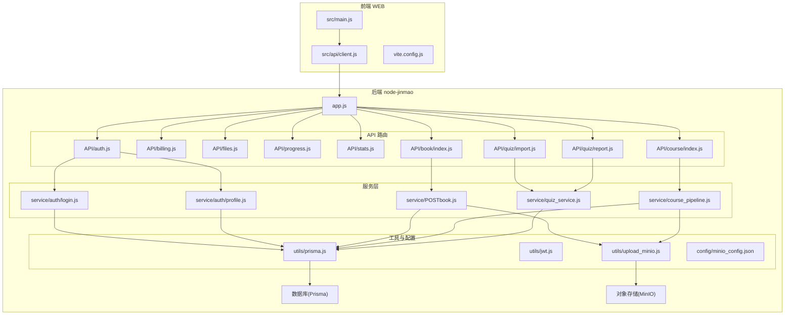
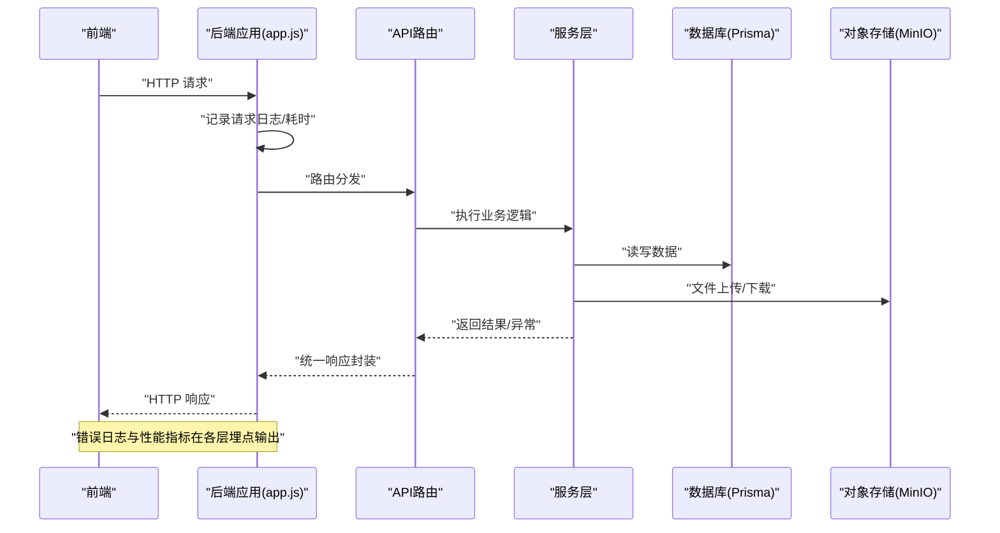
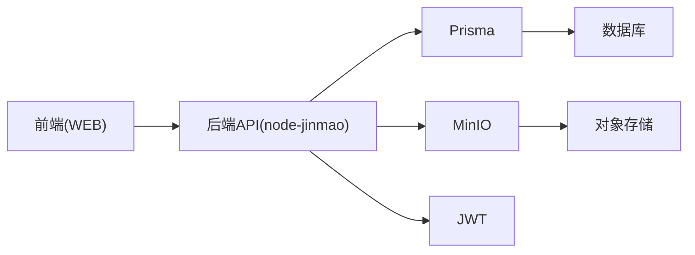

# 监控日志

<cite>
**本文档引用的文件**   
- [app.js](file://node-jinmao/app.js)
- [package.json](file://node-jinmao/package.json)
- [auth.js](file://node-jinmao/API/auth.js)
- [billing.js](file://node-jinmao/API/billing.js)
- [files.js](file://node-jinmao/API/files.js)
- [progress.js](file://node-jinmao/API/progress.js)
- [stats.js](file://node-jinmao/API/stats.js)
- [course/index.js](file://node-jinmao/API/course/index.js)
- [book/index.js](file://node-jinmao/API/book/index.js)
- [quiz/import.js](file://node-jinmao/API/quiz/import.js)
- [quiz/report.js](file://node-jinmao/API/quiz/report.js)
- [service/auth/login.js](file://node-jinmao/service/auth/login.js)
- [service/auth/profile.js](file://node-jinmao/service/auth/profile.js)
- [service/POSTbook.js](file://node-jinmao/service/POSTbook.js)
- [service/course_pipeline.js](file://node-jinmao/service/course_pipeline.js)
- [service/quiz_service.js](file://node-jinmao/service/quiz_service.js)
- [utils/prisma.js](file://node-jinmao/utils/prisma.js)
- [utils/jwt.js](file://node-jinmao/utils/jwt.js)
- [utils/upload_minio.js](file://node-jinmao/utils/upload_minio.js)
- [config/minio_config.json](file://node-jinmao/config/minio_config.json)
- [prisma/schema.prisma](file://node-jinmao/prisma/schema.prisma)
- [vite.config.js](file://WEB/vite.config.js)
- [main.js](file://WEB/src/main.js)
- [api/client.js](file://WEB/src/api/client.js)
</cite>

## 目录
1. [简介](#简介)
2. [项目结构](#项目结构)
3. [核心组件](#核心组件)
4. [架构总览](#架构总览)
5. [详细组件分析](#详细组件分析)
6. [依赖分析](#依赖分析)
7. [性能考虑](#性能考虑)
8. [故障排查指南](#故障排查指南)
9. [结论](#结论)
10. [附录](#附录)

## 简介
本文件面向“金毛教你学重构版”项目的监控与日志体系，目标是：
- 明确应用日志收集策略（请求日志、错误日志、业务日志）的分类与格式规范
- 定义性能监控指标与关键业务指标采集方案
- 给出系统资源监控配置建议
- 说明日志分析工具集成（ELK栈）、日志轮转与归档策略
- 提供告警规则配置、异常通知机制与监控仪表盘搭建指引
- 给出性能瓶颈识别方法、慢查询分析与内存泄漏检测实践
- 解释分布式追踪实现、链路追踪配置与监控数据可视化展示

## 项目结构
后端采用 Node.js + Express 风格路由组织，API 层位于 API 目录，服务逻辑在 service 目录，数据库访问通过 Prisma，对象存储通过 MinIO。前端为 Vue 3 + Vite 工程，API 客户端集中在 src/api 中。

图表来源
- [app.js](file://node-jinmao/app.js)
- [API/auth.js](file://node-jinmao/API/auth.js)
- [API/billing.js](file://node-jinmao/API/billing.js)
- [API/files.js](file://node-jinmao/API/files.js)
- [API/progress.js](file://node-jinmao/API/progress.js)
- [API/stats.js](file://node-jinmao/API/stats.js)
- [API/course/index.js](file://node-jinmao/API/course/index.js)
- [API/book/index.js](file://node-jinmao/API/book/index.js)
- [API/quiz/import.js](file://node-jinmao/API/quiz/import.js)
- [API/quiz/report.js](file://node-jinmao/API/quiz/report.js)
- [service/auth/login.js](file://node-jinmao/service/auth/login.js)
- [service/auth/profile.js](file://node-jinmao/service/auth/profile.js)
- [service/POSTbook.js](file://node-jinmao/service/POSTbook.js)
- [service/course_pipeline.js](file://node-jinmao/service/course_pipeline.js)
- [service/quiz_service.js](file://node-jinmao/service/quiz_service.js)
- [utils/prisma.js](file://node-jinmao/utils/prisma.js)
- [utils/upload_minio.js](file://node-jinmao/utils/upload_minio.js)
- [config/minio_config.json](file://node-jinmao/config/minio_config.json)

章节来源
- [app.js](file://node-jinmao/app.js)
- [package.json](file://node-jinmao/package.json)
- [vite.config.js](file://WEB/vite.config.js)
- [main.js](file://WEB/src/main.js)
- [api/client.js](file://WEB/src/api/client.js)

## 核心组件
- 应用入口与中间件：Express 应用初始化、全局中间件挂载点、统一错误处理与响应封装位置
- API 路由层：按模块划分的路由控制器，负责参数校验、鉴权、调用服务层并返回结果
- 服务层：业务编排与外部依赖调用（数据库、对象存储、第三方服务）
- 工具层：数据库连接、JWT 签发与校验、MinIO 上传等通用能力
- 前端 API 客户端：统一的 HTTP 请求封装、拦截器与错误处理

章节来源
- [app.js](file://node-jinmao/app.js)
- [API/auth.js](file://node-jinmao/API/auth.js)
- [service/auth/login.js](file://node-jinmao/service/auth/login.js)
- [utils/prisma.js](file://node-jinmao/utils/prisma.js)
- [utils/jwt.js](file://node-jinmao/utils/jwt.js)
- [utils/upload_minio.js](file://node-jinmao/utils/upload_minio.js)
- [api/client.js](file://WEB/src/api/client.js)

## 架构总览
整体采用前后端分离架构。前端通过 API 客户端发起请求，后端以 Express 路由接收请求，经中间件进行鉴权与基础处理，再进入服务层完成业务逻辑，最终通过 Prisma 访问数据库、通过 MinIO 访问对象存储。监控与日志贯穿全链路：请求生命周期、错误捕获、业务事件、性能指标与资源使用均应在各层埋点输出。

图表来源
- [app.js](file://node-jinmao/app.js)
- [API/auth.js](file://node-jinmao/API/auth.js)
- [service/auth/login.js](file://node-jinmao/service/auth/login.js)
- [utils/prisma.js](file://node-jinmao/utils/prisma.js)
- [utils/upload_minio.js](file://node-jinmao/utils/upload_minio.js)

## 详细组件分析

### 应用入口与中间件（app.js）
- 职责：初始化 Express 应用、注册全局中间件（如请求日志、错误处理、CORS、JSON 解析等）、挂载路由、启动监听端口
- 监控要点：
  - 请求日志：记录方法、路径、状态码、耗时、用户标识、请求ID
  - 错误日志：统一捕获未处理异常，记录堆栈与上下文
  - 性能指标：接口耗时分布、QPS、错误率
- 建议实现：
  - 在请求进入时生成唯一 request_id，贯穿响应
  - 使用中间件统计每个请求的起止时间，计算耗时
  - 对 4xx/5xx 分别记录不同级别日志

章节来源
- [app.js](file://node-jinmao/app.js)

### API 路由层（示例：认证、计费、文件、进度、统计、课程、图书、题库）
- 职责：接收请求、参数校验、鉴权、调用服务层、返回结构化响应
- 监控要点：
  - 请求维度：method、path、status、latency、user_id、trace_id
  - 错误维度：错误码、错误信息、堆栈、触发条件
  - 业务维度：登录成功/失败、计费扣费、文件上传成功/失败、题目导入进度
- 建议实现：
  - 在每个路由入口记录请求开始与结束日志
  - 对关键业务动作输出业务日志（含必要字段）
  - 对异常进行捕获并输出错误日志

章节来源
- [API/auth.js](file://node-jinmao/API/auth.js)
- [API/billing.js](file://node-jinmao/API/billing.js)
- [API/files.js](file://node-jinmao/API/files.js)
- [API/progress.js](file://node-jinmao/API/progress.js)
- [API/stats.js](file://node-jinmao/API/stats.js)
- [API/course/index.js](file://node-jinmao/API/course/index.js)
- [API/book/index.js](file://node-jinmao/API/book/index.js)
- [API/quiz/import.js](file://node-jinmao/API/quiz/import.js)
- [API/quiz/report.js](file://node-jinmao/API/quiz/report.js)

### 服务层（认证、图书生成、课程流水线、题库服务）
- 职责：编排业务流程、调用数据库与外部服务、事务控制、重试与降级
- 监控要点：
  - 业务指标：登录成功率、计费交易成功率、文件上传成功率、题目导入成功率
  - 性能指标：服务方法耗时、数据库查询耗时、外部调用耗时
  - 错误指标：异常类型、失败原因、重试次数
- 建议实现：
  - 在服务方法入口/出口埋点，记录入参摘要与出参摘要（脱敏）
  - 对数据库操作与外部调用分别计时
  - 对异常进行分类记录，附带上下文（用户、租户、会话）

章节来源
- [service/auth/login.js](file://node-jinmao/service/auth/login.js)
- [service/auth/profile.js](file://node-jinmao/service/auth/profile.js)
- [service/POSTbook.js](file://node-jinmao/service/POSTbook.js)
- [service/course_pipeline.js](file://node-jinmao/service/course_pipeline.js)
- [service/quiz_service.js](file://node-jinmao/service/quiz_service.js)

### 工具层（数据库、JWT、MinIO）
- 职责：提供稳定的基础设施能力
- 监控要点：
  - 数据库连接池状态、慢查询、连接超时
  - JWT 签发/校验失败率
  - MinIO 上传/下载成功率与耗时
- 建议实现：
  - 在 prisma 初始化与查询执行处埋点
  - 在 jwt 工具函数中记录失败原因
  - 在 upload_minio 中记录文件大小、耗时、错误码

章节来源
- [utils/prisma.js](file://node-jinmao/utils/prisma.js)
- [utils/jwt.js](file://node-jinmao/utils/jwt.js)
- [utils/upload_minio.js](file://node-jinmao/utils/upload_minio.js)
- [config/minio_config.json](file://node-jinmao/config/minio_config.json)

### 前端 API 客户端（WEB）
- 职责：统一发起 HTTP 请求、处理响应与错误、携带鉴权头
- 监控要点：
  - 请求耗时、网络错误、业务错误码
  - 页面级性能指标（首屏、交互延迟）
- 建议实现：
  - 在请求拦截器中记录请求开始与结束时间
  - 对网络异常与业务异常分类记录
  - 上报关键用户行为与页面性能指标

章节来源
- [api/client.js](file://WEB/src/api/client.js)
- [main.js](file://WEB/src/main.js)
- [vite.config.js](file://WEB/vite.config.js)

## 依赖分析
- 后端依赖：Express（路由与中间件）、Prisma（ORM）、MinIO（对象存储）、JWT（鉴权）
- 前端依赖：Vue 3、Vite、HTTP 客户端库
- 外部依赖：数据库（MySQL/PostgreSQL 等）、对象存储服务（MinIO/S3兼容）

图表来源
- [package.json](file://node-jinmao/package.json)
- [utils/prisma.js](file://node-jinmao/utils/prisma.js)
- [utils/upload_minio.js](file://node-jinmao/utils/upload_minio.js)
- [utils/jwt.js](file://node-jinmao/utils/jwt.js)

章节来源
- [package.json](file://node-jinmao/package.json)
- [prisma/schema.prisma](file://node-jinmao/prisma/schema.prisma)

## 性能考虑
- 接口性能
  - 统计 P50/P95/P99 耗时，设置阈值告警
  - 热点接口增加缓存或限流
- 数据库性能
  - 慢查询日志开启与采样，定期分析索引使用情况
  - 连接池大小与超时合理配置
- 对象存储性能
  - 大文件分片上传、断点续传、并发优化
  - 带宽与 I/O 监控
- 前端性能
  - 首屏加载时间、资源体积、懒加载
  - 用户交互延迟与渲染耗时

[本节为通用指导，不直接分析具体文件]

## 故障排查指南
- 日志分级与格式
  - 请求日志：包含 request_id、method、path、status、latency_ms、user_id、ip
  - 错误日志：包含 error_code、message、stack、context、request_id
  - 业务日志：包含 event_name、payload_summary、user_id、trace_id
- 常见问题定位
  - 接口超时：检查上游依赖（数据库、MinIO、第三方服务）耗时与错误
  - 鉴权失败：检查 JWT 签发与校验流程、令牌有效期
  - 文件上传失败：检查 MinIO 配置、权限、网络连通性
- 诊断手段
  - 基于 request_id 串联全链路日志
  - 结合错误码与堆栈快速定位问题
  - 使用性能指标与资源监控辅助判断瓶颈

章节来源
- [app.js](file://node-jinmao/app.js)
- [API/auth.js](file://node-jinmao/API/auth.js)
- [utils/jwt.js](file://node-jinmao/utils/jwt.js)
- [utils/upload_minio.js](file://node-jinmao/utils/upload_minio.js)

## 结论
通过在应用入口、API 路由、服务层与工具层系统化埋点，配合统一的日志格式与链路追踪，可实现从请求到业务的全链路可观测性。结合 ELK 栈、告警规则与仪表盘，能够及时发现并定位问题，保障系统稳定与性能。

[本节为总结性内容，不直接分析具体文件]

## 附录

### 日志分类与格式规范
- 请求日志
  - 字段：timestamp、level、event、request_id、method、path、status、latency_ms、user_id、ip、ua
  - 用途：请求审计、性能分析、错误归因
- 错误日志
  - 字段：timestamp、level、event、error_code、message、stack、context、request_id
  - 用途：异常定位、根因分析、告警触发
- 业务日志
  - 字段：timestamp、level、event、event_name、payload_summary、user_id、trace_id
  - 用途：业务指标统计、流程追踪、合规审计

[本节为规范说明，不直接分析具体文件]

### 性能监控指标定义
- 系统资源
  - CPU 使用率、内存占用、GC 次数与停顿、磁盘 I/O、网络吞吐
- 应用性能
  - QPS、P95/P99 延迟、错误率、线程/进程数、连接池使用率
- 关键业务指标
  - 登录成功率、计费成功率、文件上传成功率、题目导入成功率、平均处理时长

[本节为指标定义，不直接分析具体文件]

### 系统资源监控配置
- Node.js 进程监控：CPU、内存、事件循环延迟、句柄数量
- 数据库监控：连接池、慢查询、锁等待、表空间
- 对象存储监控：带宽、请求量、错误率、容量

[本节为配置建议，不直接分析具体文件]

### 日志分析工具集成（ELK 栈）
- 采集：Filebeat/Fluent Bit 采集应用日志文件
- 传输：Logstash 过滤与转发
- 存储：Elasticsearch 索引管理（按天/按模块）
- 可视化：Kibana 仪表板（请求趋势、错误分布、业务指标）

[本节为工具集成建议，不直接分析具体文件]

### 日志轮转与归档策略
- 轮转：按大小或时间切分，保留最近 N 天
- 压缩：归档后压缩存储，降低磁盘占用
- 清理：过期日志自动删除，避免磁盘爆满

[本节为策略建议，不直接分析具体文件]

### 告警规则配置与异常通知
- 告警规则
  - 错误率超过阈值（如 5%）
  - P95 延迟超过阈值（如 2s）
  - 资源使用率超过阈值（如 CPU > 80%）
- 通知渠道
  - 邮件、企业微信、钉钉、短信
- 告警收敛
  - 去重、合并、抑制重复告警

[本节为告警建议，不直接分析具体文件]

### 监控仪表盘搭建
- 概览页：QPS、错误率、P95 延迟、资源使用率
- 接口页：各接口耗时分布、错误分布
- 业务页：关键业务指标趋势、转化率
- 资源页：CPU、内存、磁盘、网络

[本节为可视化建议，不直接分析具体文件]

### 性能瓶颈识别与慢查询分析
- 瓶颈识别
  - 热点接口耗时突增、数据库慢查询增多、对象存储上传失败率上升
- 慢查询分析
  - 开启慢查询日志，分析 SQL 执行计划与索引命中
  - 优化查询语句与数据结构
- 内存泄漏检测
  - 使用 Node.js 内存快照对比，定位未释放引用
  - 关注长生命周期对象与事件监听器

[本节为分析方法，不直接分析具体文件]

### 分布式追踪与链路追踪配置
- 链路 ID
  - 生成 trace_id 与 span_id，贯穿请求全链路
- 埋点
  - 在入口、服务调用、数据库、对象存储处打点
- 可视化
  - 使用 APM 工具（如 OpenTelemetry、Jaeger）展示链路拓扑与时序

[本节为追踪建议，不直接分析具体文件]

### 监控数据可视化展示
- Kibana 仪表板
  - 请求趋势、错误分布、业务指标
- 自定义面板
  - 按模块/接口/用户维度聚合展示
- 导出与分享
  - 支持导出报表与共享链接

[本节为可视化建议，不直接分析具体文件]