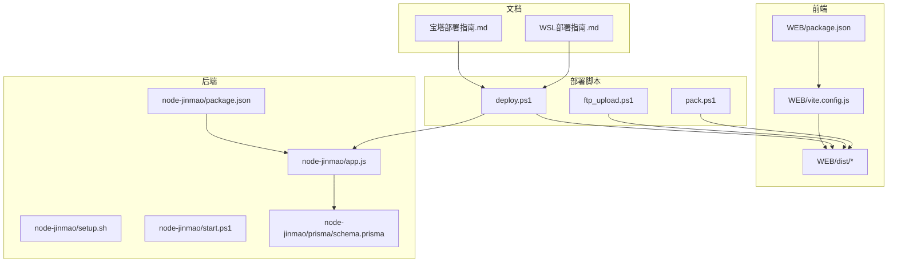
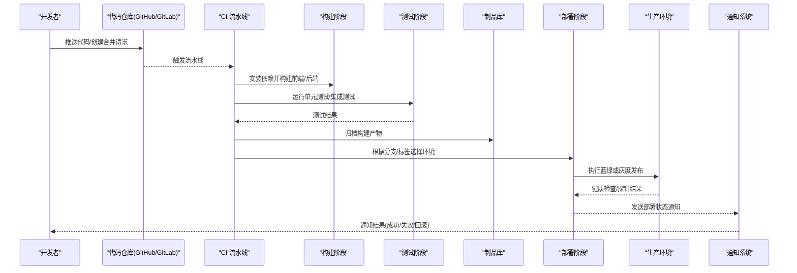
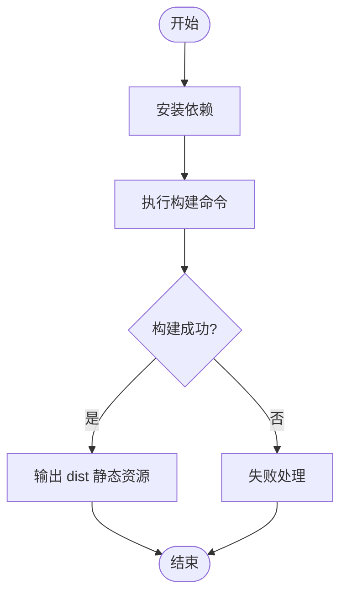
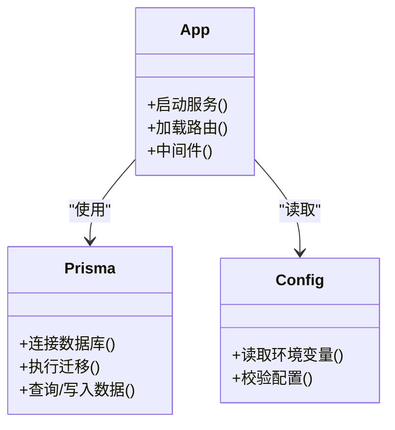
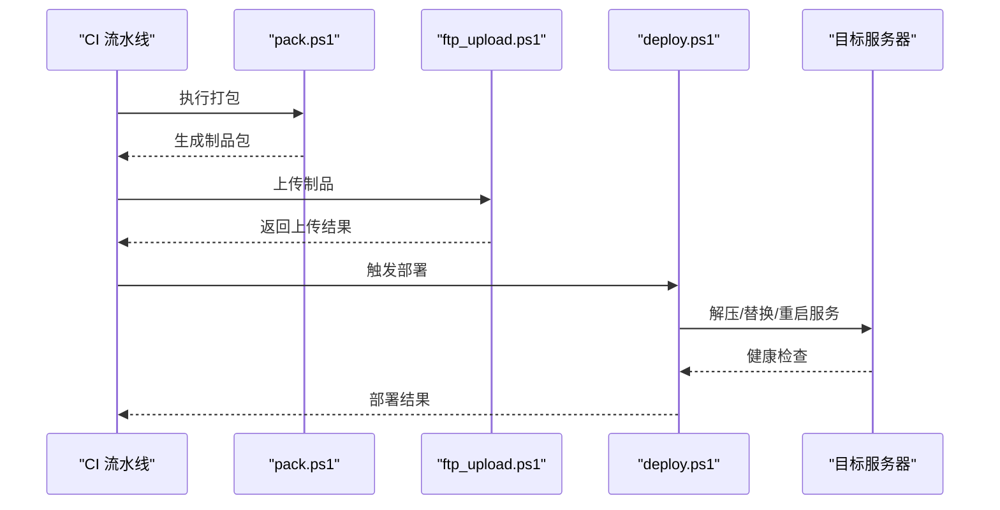
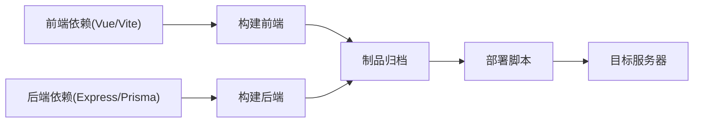

# CI/CD自动化部署

<cite>
**本文档引用的文件**   
- [package.json](file://node-jinmao/package.json)
- [app.js](file://node-jinmao/app.js)
- [setup.sh](file://node-jinmao/setup.sh)
- [start.ps1](file://node-jinmao/start.ps1)
- [vite.config.js](file://WEB/vite.config.js)
- [package.json](file://WEB/package.json)
- [deploy.ps1](file://deploy.ps1)
- [ftp_upload.ps1](file://ftp_upload.ps1)
- [pack.ps1](file://pack.ps1)
- [宝塔部署指南.md](file://宝塔部署指南.md)
- [WSL部署指南.md](file://WSL部署指南.md)
</cite>

## 目录
1. [简介](#简介)
2. [项目结构](#项目结构)
3. [核心组件](#核心组件)
4. [架构总览](#架构总览)
5. [详细组件分析](#详细组件分析)
6. [依赖分析](#依赖分析)
7. [性能考虑](#性能考虑)
8. [故障排查指南](#故障排查指南)
9. [结论](#结论)
10. [附录](#附录)

## 简介
本指南面向“金毛刷题”前后端一体化项目，提供端到端的持续集成与持续部署（CI/CD）方案。内容覆盖：
- 代码检查、测试执行、构建打包的自动化流水线设计（GitHub Actions / GitLab CI）
- 自动化部署流程：提交触发、环境检测、自动发布
- 灰度发布策略与蓝绿部署实现、回滚机制设计
- 部署通知、监控告警、日志收集集成
- 多环境部署管理与配置中心集成方案

目标是在保证质量的前提下，提升交付效率与稳定性，降低人工操作风险。

## 项目结构
仓库包含前端（Vue/Vite）、后端（Node.js/Express）、文档与脚本等。关键目录与职责：
- WEB：前端工程，Vite 构建，输出静态资源到 dist
- node-jinmao：后端服务，Express 应用，Prisma 数据迁移，外部工具与配置
- 根目录脚本：打包、上传、部署辅助脚本
- 文档：部署指南与说明

图表来源
- [package.json](file://node-jinmao/package.json)
- [app.js](file://node-jinmao/app.js)
- [setup.sh](file://node-jinmao/setup.sh)
- [start.ps1](file://node-jinmao/start.ps1)
- [vite.config.js](file://WEB/vite.config.js)
- [package.json](file://WEB/package.json)
- [deploy.ps1](file://deploy.ps1)
- [ftp_upload.ps1](file://ftp_upload.ps1)
- [pack.ps1](file://pack.ps1)
- [宝塔部署指南.md](file://宝塔部署指南.md)
- [WSL部署指南.md](file://WSL部署指南.md)

章节来源
- [package.json](file://node-jinmao/package.json)
- [app.js](file://node-jinmao/app.js)
- [setup.sh](file://node-jinmao/setup.sh)
- [start.ps1](file://node-jinmao/start.ps1)
- [vite.config.js](file://WEB/vite.config.js)
- [package.json](file://WEB/package.json)
- [deploy.ps1](file://deploy.ps1)
- [ftp_upload.ps1](file://ftp_upload.ps1)
- [pack.ps1](file://pack.ps1)
- [宝塔部署指南.md](file://宝塔部署指南.md)
- [WSL部署指南.md](file://WSL部署指南.md)

## 核心组件
- 前端构建：基于 Vite，通过 package.json 中的脚本进行安装与构建，产物为静态资源
- 后端服务：Express 应用入口 app.js，配合 Prisma 管理数据库迁移与种子数据
- 部署脚本：根目录 PowerShell 脚本负责打包、上传与部署；Windows 环境下使用 start.ps1 启动服务
- 环境准备：setup.sh 用于 Linux 环境初始化（如依赖安装、权限设置等）

章节来源
- [package.json](file://WEB/package.json)
- [vite.config.js](file://WEB/vite.config.js)
- [package.json](file://node-jinmao/package.json)
- [app.js](file://node-jinmao/app.js)
- [setup.sh](file://node-jinmao/setup.sh)
- [start.ps1](file://node-jinmao/start.ps1)

## 架构总览
下图展示从代码提交到生产发布的完整流水线，包括代码检查、测试、构建、制品归档、部署与回滚。

图表来源
- [package.json](file://WEB/package.json)
- [package.json](file://node-jinmao/package.json)
- [deploy.ps1](file://deploy.ps1)
- [ftp_upload.ps1](file://ftp_upload.ps1)
- [pack.ps1](file://pack.ps1)

## 详细组件分析

### 前端构建与打包
- 构建流程：安装依赖 -> 执行构建脚本 -> 生成静态资源至 dist
- 环境变量：通过 vite.config.js 与环境变量注入 API 地址、功能开关等
- 产物：dist 目录下的 HTML/CSS/JS 资源，可直接由 Web 服务器托管

图表来源
- [package.json](file://WEB/package.json)
- [vite.config.js](file://WEB/vite.config.js)

章节来源
- [package.json](file://WEB/package.json)
- [vite.config.js](file://WEB/vite.config.js)

### 后端服务与数据库迁移
- 应用入口：app.js 作为 Express 服务启动点
- 数据库：Prisma schema 定义模型，迁移脚本在 setup.sh 中执行
- 启动方式：Windows 下通过 start.ps1 启动服务进程

图表来源
- [app.js](file://node-jinmao/app.js)
- [setup.sh](file://node-jinmao/setup.sh)
- [start.ps1](file://node-jinmao/start.ps1)

章节来源
- [app.js](file://node-jinmao/app.js)
- [setup.sh](file://node-jinmao/setup.sh)
- [start.ps1](file://node-jinmao/start.ps1)

### 部署脚本与上传流程
- 打包：pack.ps1 将前端 dist 与后端代码打包为可分发制品
- 上传：ftp_upload.ps1 将制品上传至目标服务器
- 部署：deploy.ps1 协调构建、上传、切换流量与回滚逻辑

图表来源
- [pack.ps1](file://pack.ps1)
- [ftp_upload.ps1](file://ftp_upload.ps1)
- [deploy.ps1](file://deploy.ps1)

章节来源
- [pack.ps1](file://pack.ps1)
- [ftp_upload.ps1](file://ftp_upload.ps1)
- [deploy.ps1](file://deploy.ps1)

### 多环境部署与配置中心
- 环境区分：开发、测试、预发、生产，通过分支或标签控制
- 配置管理：环境变量注入（前端 .env、后端配置文件），建议接入配置中心统一管理
- 安全敏感信息：使用密钥管理（如 GitHub Secrets、GitLab CI/CD Variables）

章节来源
- [宝塔部署指南.md](file://宝塔部署指南.md)
- [WSL部署指南.md](file://WSL部署指南.md)

## 依赖分析
- 前端依赖：Vite、Vue 生态，构建产物为静态资源
- 后端依赖：Express、Prisma、第三方 API 客户端（如 MinIO、LLM 接口）
- 部署依赖：PowerShell 脚本、FTP/SFTP 上传工具、Web 服务器（Nginx/Apache/宝塔）

图表来源
- [package.json](file://WEB/package.json)
- [package.json](file://node-jinmao/package.json)
- [deploy.ps1](file://deploy.ps1)

章节来源
- [package.json](file://WEB/package.json)
- [package.json](file://node-jinmao/package.json)
- [deploy.ps1](file://deploy.ps1)

## 性能考虑
- 构建优化：启用缓存依赖、并行构建、按需加载
- 制品瘦身：压缩资源、移除调试信息、合理分包
- 部署加速：增量更新、蓝绿切换零停机、健康检查快速失败
- 监控与日志：集中化日志采集、指标上报、告警阈值设定

[本节为通用指导，不直接分析具体文件]

## 故障排查指南
- 构建失败：检查依赖版本冲突、环境变量缺失、构建脚本错误
- 部署失败：确认网络连通性、权限配置、端口占用、健康检查失败
- 回滚策略：保留上一版本制品，快速切换流量指向旧版本
- 日志定位：查看服务端日志、前端错误上报、CI 流水线日志

章节来源
- [宝塔部署指南.md](file://宝塔部署指南.md)
- [WSL部署指南.md](file://WSL部署指南.md)

## 结论
通过本指南，可实现从代码提交到生产发布的完整自动化流水线，结合蓝绿部署与灰度策略，确保发布过程稳定可控。建议逐步引入配置中心与统一监控，进一步提升运维效率与系统可靠性。

[本节为总结性内容，不直接分析具体文件]

## 附录
- 推荐实践：
  - 分支策略：main/release/feature 分支对应不同环境
  - 流水线模板：复用步骤，减少重复配置
  - 安全加固：最小权限原则、密钥轮换、审计日志
- 参考文档：
  - 宝塔部署指南.md
  - WSL部署指南.md

[本节为补充信息，不直接分析具体文件]