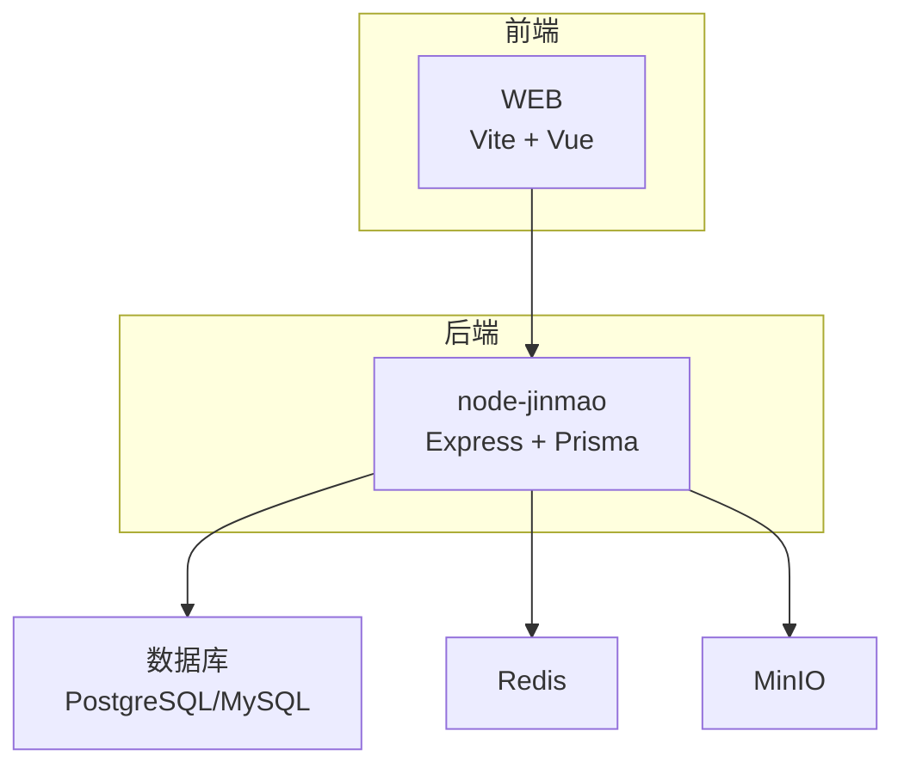
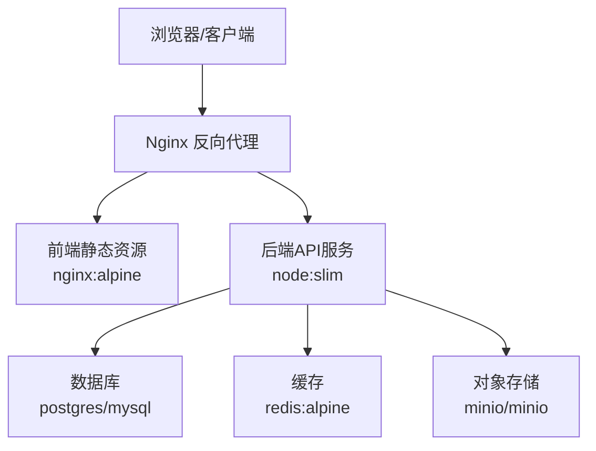
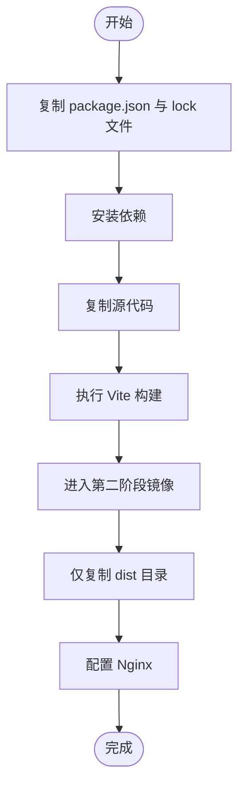
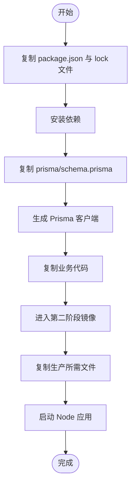
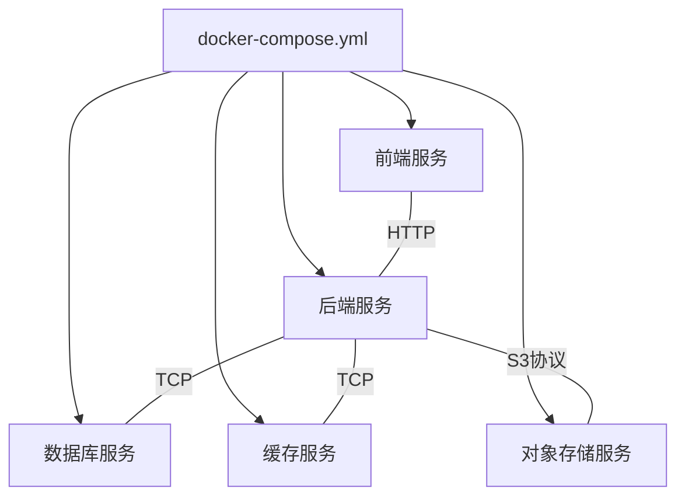
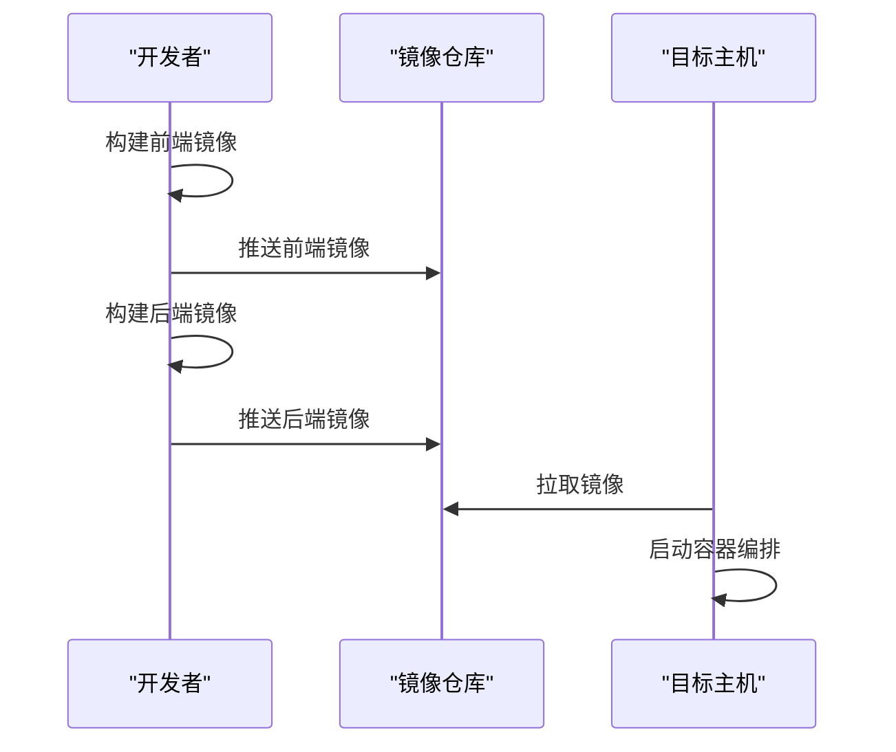
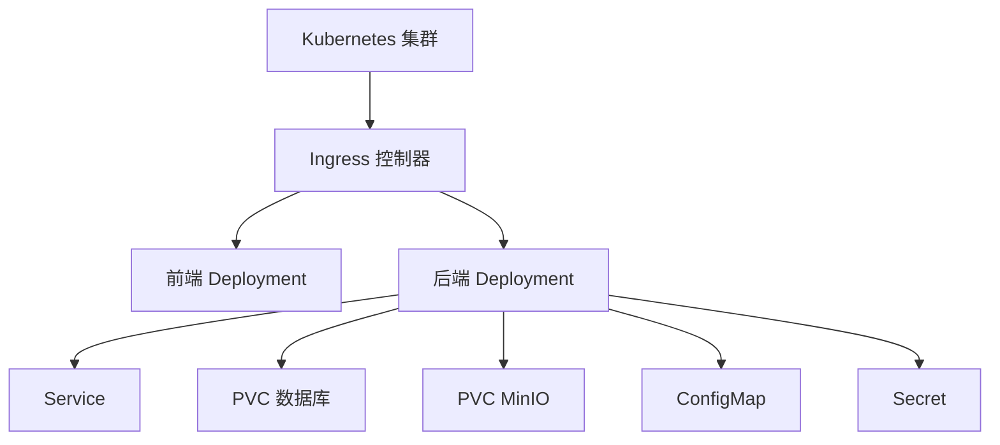
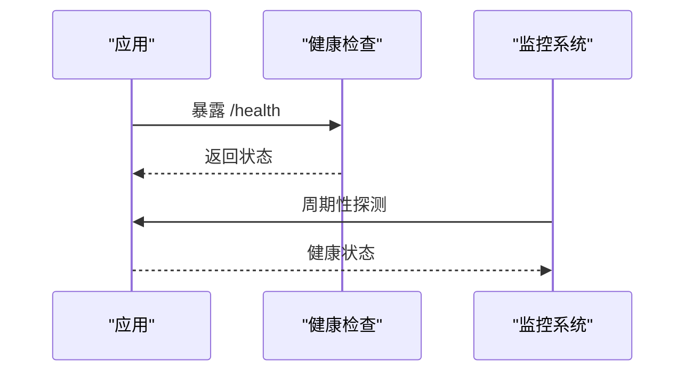
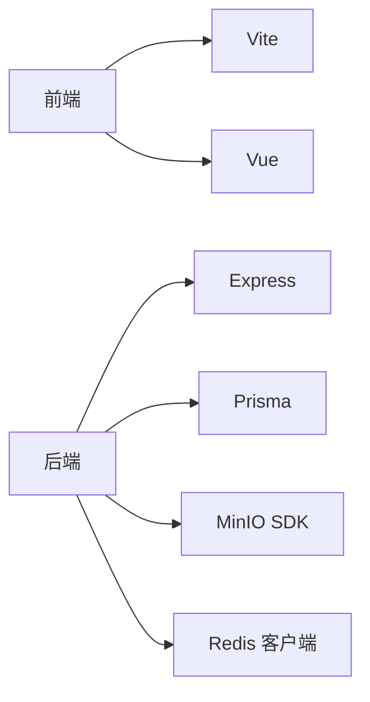

# Docker容器化部署

<cite>
**本文档引用的文件**   
- [package.json](file://node-jinmao/package.json)
- [app.js](file://node-jinmao/app.js)
- [prisma/schema.prisma](file://node-jinmao/prisma/schema.prisma)
- [config/minio_config.json](file://node-jinmao/config/minio_config.json)
- [vite.config.js](file://WEB/vite.config.js)
- [package.json](file://WEB/package.json)
- [.gitignore](file://node-jinmao/.gitignore)
- [.gitignore](file://WEB/.gitignore)
</cite>

## 目录
1. [简介](#简介)
2. [项目结构](#项目结构)
3. [核心组件](#核心组件)
4. [架构总览](#架构总览)
5. [详细组件分析](#详细组件分析)
6. [依赖分析](#依赖分析)
7. [性能考虑](#性能考虑)
8. [故障排查指南](#故障排查指南)
9. [结论](#结论)
10. [附录](#附录)

## 简介
本指南面向将本项目进行Docker容器化与编排部署的工程团队，目标是：
- 设计多阶段Dockerfile构建优化策略，分离前端静态资源构建与后端服务镜像。
- 使用Docker Compose编排应用服务、数据库、Redis缓存、MinIO对象存储。
- 规范环境变量配置管理与数据卷持久化策略。
- 提供镜像推送/拉取流程与Kubernetes集群部署方案。
- 集成容器监控、日志收集与健康检查配置。

## 项目结构
- 前端（WEB）：基于Vite的Vue应用，构建产物为静态资源，由反向代理或Nginx直接提供服务。
- 后端（node-jinmao）：Node.js Express服务，依赖Prisma ORM、MinIO对象存储、可选Redis缓存。
- 配置文件：包含MinIO等第三方服务配置；前端构建配置位于vite.config.js。
- 数据库：使用关系型数据库（通过Prisma管理），建议以容器方式运行并挂载数据卷。
- 缓存：建议使用Redis作为会话或热点数据缓存。
- 对象存储：MinIO用于文件上传与静态资源托管。

**图表来源** 
- [vite.config.js](file://WEB/vite.config.js)
- [package.json](file://WEB/package.json)
- [app.js](file://node-jinmao/app.js)
- [package.json](file://node-jinmao/package.json)

**章节来源**
- [vite.config.js](file://WEB/vite.config.js)
- [package.json](file://WEB/package.json)
- [app.js](file://node-jinmao/app.js)
- [package.json](file://node-jinmao/package.json)

## 核心组件
- 前端构建与运行
  - 构建工具：Vite，输出静态资源到dist目录。
  - 运行方式：生产环境通过Nginx或反向代理提供静态资源。
- 后端服务
  - 运行时：Node.js，入口文件为app.js。
  - 数据访问：Prisma ORM，schema定义在prisma/schema.prisma。
  - 外部依赖：MinIO对象存储（配置见config/minio_config.json），可选Redis缓存。
- 基础设施
  - 数据库：关系型数据库容器，数据持久化到卷。
  - Redis：缓存容器，数据可持久化。
  - MinIO：对象存储容器，数据持久化到卷。

**章节来源**
- [app.js](file://node-jinmao/app.js)
- [package.json](file://node-jinmao/package.json)
- [prisma/schema.prisma](file://node-jinmao/prisma/schema.prisma)
- [config/minio_config.json](file://node-jinmao/config/minio_config.json)
- [vite.config.js](file://WEB/vite.config.js)
- [package.json](file://WEB/package.json)

## 架构总览
下图展示了容器化后的整体架构与服务间调用关系。

**图表来源** 
- [app.js](file://node-jinmao/app.js)
- [vite.config.js](file://WEB/vite.config.js)

## 详细组件分析

### 多阶段Dockerfile构建策略（前端）
- 构建阶段
  - 使用包含Node.js与包管理器的工作镜像安装依赖并执行Vite构建。
  - 仅复制构建产物dist目录到最终镜像，避免携带源码与开发依赖。
- 运行阶段
  - 使用轻量级Nginx镜像提供静态资源。
  - 通过环境变量注入后端API地址与CDN前缀。
- 优化要点
  - 利用Docker层缓存：先复制package.json与lock文件，再安装依赖，最后复制源码。
  - 使用.dockerignore排除无关文件，减少上下文体积。

**图表来源** 
- [vite.config.js](file://WEB/vite.config.js)
- [package.json](file://WEB/package.json)

**章节来源**
- [vite.config.js](file://WEB/vite.config.js)
- [package.json](file://WEB/package.json)

### 多阶段Dockerfile构建策略（后端）
- 构建阶段
  - 使用Node.js工作镜像安装依赖并生成Prisma客户端。
  - 确保只复制必要文件（如prisma/schema.prisma与业务代码）。
- 运行阶段
  - 使用精简Node镜像运行生产进程。
  - 通过环境变量注入数据库连接串、MinIO端点与密钥、Redis地址等。
- 优化要点
  - 分层缓存依赖安装结果。
  - 使用.dockerignore排除测试、文档与临时文件。

**图表来源** 
- [app.js](file://node-jinmao/app.js)
- [package.json](file://node-jinmao/package.json)
- [prisma/schema.prisma](file://node-jinmao/prisma/schema.prisma)

**章节来源**
- [app.js](file://node-jinmao/app.js)
- [package.json](file://node-jinmao/package.json)
- [prisma/schema.prisma](file://node-jinmao/prisma/schema.prisma)

### Docker Compose编排配置
- 服务清单
  - 前端：Nginx镜像提供静态资源。
  - 后端：Node.js镜像运行API服务。
  - 数据库：关系型数据库镜像，挂载数据卷。
  - 缓存：Redis镜像，可选持久化。
  - 对象存储：MinIO镜像，挂载数据卷。
- 网络与端口
  - 统一内部网络供服务通信。
  - 对外暴露Nginx与MinIO控制台端口。
- 健康检查
  - 后端提供健康检查接口（如/health）。
  - 数据库与Redis可通过内置探针或脚本检测。
- 环境变量
  - 通过.env或Compose env_file注入敏感配置。
- 数据卷
  - 数据库、MinIO数据持久化到宿主机卷。

**图表来源** 
- [app.js](file://node-jinmao/app.js)
- [config/minio_config.json](file://node-jinmao/config/minio_config.json)

**章节来源**
- [app.js](file://node-jinmao/app.js)
- [config/minio_config.json](file://node-jinmao/config/minio_config.json)

### 环境变量配置管理
- 前端
  - API基础路径、CDN域名、功能开关等。
- 后端
  - 数据库连接串、MinIO端点与凭据、Redis地址、JWT密钥、日志级别等。
- 管理方式
  - 使用.env文件按环境区分（开发、测试、生产）。
  - Compose中通过env_file引入，避免硬编码。
- 安全建议
  - 敏感信息不入库，使用密钥管理服务或CI/CD注入。

**章节来源**
- [config/minio_config.json](file://node-jinmao/config/minio_config.json)
- [app.js](file://node-jinmao/app.js)

### 数据卷持久化策略
- 数据库卷
  - 映射数据库数据目录到宿主机，保障重启不丢失。
- MinIO卷
  - 映射MinIO数据目录，确保对象存储数据持久化。
- Redis卷（可选）
  - 启用AOF/RDB持久化，映射数据目录。
- 备份策略
  - 定期快照或导出数据库与对象存储数据。

**章节来源**
- [config/minio_config.json](file://node-jinmao/config/minio_config.json)

### 镜像推送与拉取流程
- 本地构建
  - 分别构建前端与后端镜像，打标签。
- 推送到仓库
  - 登录镜像仓库，推送镜像至远端。
- 拉取与部署
  - 目标节点拉取镜像，使用Compose或Kubernetes部署。
- 版本管理
  - 使用语义化版本号或Git提交哈希标记镜像。

[无图表来源，因为该图为概念流程]

### Kubernetes集群部署方案
- 资源对象
  - Deployment：前后端服务副本管理。
  - Service：暴露后端API与MinIO控制台。
  - Ingress：对外暴露HTTP入口。
  - ConfigMap/Secret：环境变量与敏感信息。
  - PersistentVolumeClaim：数据库与MinIO持久化。
- 滚动更新与回滚
  - 使用滚动更新策略，支持快速回滚。
- 扩缩容
  - 根据负载自动扩缩容（HPA）。
- 健康检查
  - Liveness/Readiness探针确保服务可用性。

[无图表来源，因为该图为概念架构]

### 容器监控、日志收集与健康检查
- 监控
  - 使用Prometheus抓取指标，Grafana可视化。
  - 后端暴露指标端点（如/metrics）。
- 日志
  - 集中式日志采集（Fluentd/Fluent Bit），输出到Elasticsearch或对象存储。
- 健康检查
  - 后端提供/health接口，返回服务状态。
  - 数据库与Redis通过探针或脚本检测。

**图表来源** 
- [app.js](file://node-jinmao/app.js)

**章节来源**
- [app.js](file://node-jinmao/app.js)

## 依赖分析
- 前端依赖
  - Vite、Vue生态、构建插件与依赖。
- 后端依赖
  - Express框架、Prisma ORM、MinIO SDK、可选Redis客户端。
- 外部服务依赖
  - 数据库、Redis、MinIO。

**图表来源** 
- [package.json](file://WEB/package.json)
- [package.json](file://node-jinmao/package.json)

**章节来源**
- [package.json](file://WEB/package.json)
- [package.json](file://node-jinmao/package.json)

## 性能考虑
- 镜像体积
  - 多阶段构建最小化镜像体积，减少攻击面。
- 构建缓存
  - 合理分层，最大化Docker层缓存命中率。
- 资源限制
  - 设置CPU与内存限制，防止单实例占用过多资源。
- 连接池
  - 数据库与Redis连接池调优，提升并发能力。
- 静态资源
  - 启用CDN与缓存头，降低后端压力。

[本节为通用指导，无需特定文件引用]

## 故障排查指南
- 常见问题
  - 环境变量缺失导致连接失败。
  - 数据卷权限问题导致写入失败。
  - 端口冲突或服务未就绪。
- 诊断步骤
  - 查看容器日志与事件。
  - 检查健康检查接口与探针状态。
  - 验证网络连通性与防火墙规则。
- 恢复措施
  - 重置环境变量与密钥。
  - 修复卷权限与重新初始化数据。
  - 重启服务或回滚到稳定版本。

**章节来源**
- [app.js](file://node-jinmao/app.js)

## 结论
通过多阶段Dockerfile构建、Docker Compose编排与Kubernetes部署，结合完善的监控、日志与健康检查机制，可实现高可用、易维护的前后端分离架构。建议在CI/CD流水线中自动化镜像构建与发布，确保一致性与可追溯性。

[本节为总结，无需特定文件引用]

## 附录
- .gitignore建议
  - 排除node_modules、dist、.env等敏感与构建产物。
- 推荐命令
  - 本地构建与运行、镜像推送、集群部署常用命令参考。

**章节来源**
- [.gitignore](file://node-jinmao/.gitignore)
- [.gitignore](file://WEB/.gitignore)