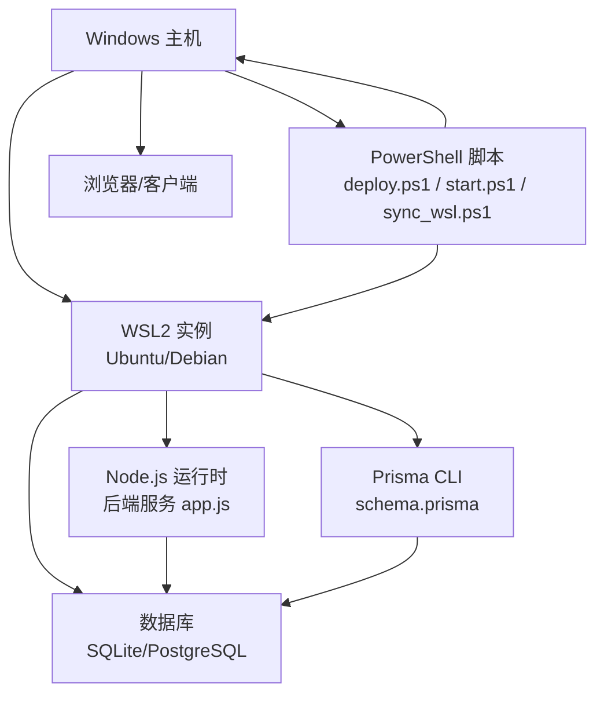
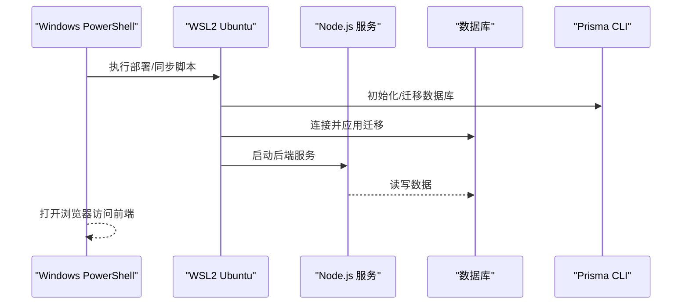
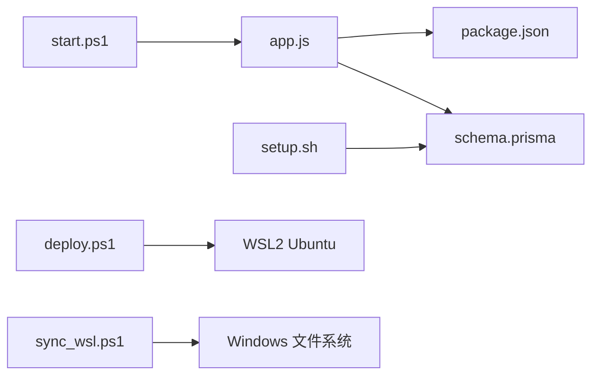

# WSL环境部署

<cite>
**本文档引用的文件**   
- [WSL部署指南.md](file://WSL部署指南.md)
- [deploy.ps1](file://deploy.ps1)
- [sync_wsl.ps1](file://sync_wsl.ps1)
- [start.ps1](file://start.ps1)
- [node-jinmao/app.js](file://node-jinmao/app.js)
- [node-jinmao/package.json](file://node-jinmao/package.json)
- [node-jinmao/setup.sh](file://node-jinmao/setup.sh)
- [node-jinmao/prisma/schema.prisma](file://node-jinmao/prisma/schema.prisma)
- [WEB/package.json](file://WEB/package.json)
- [WEB/vite.config.js](file://WEB/vite.config.js)
</cite>

## 目录
1. [简介](#简介)
2. [项目结构](#项目结构)
3. [核心组件](#核心组件)
4. [架构总览](#架构总览)
5. [详细组件分析](#详细组件分析)
6. [依赖关系分析](#依赖关系分析)
7. [性能考虑](#性能考虑)
8. [故障排查指南](#故障排查指南)
9. [结论](#结论)
10. [附录](#附录)

## 简介
本指南面向在Windows上使用WSL（Windows Subsystem for Linux）进行本地开发与部署的工程师，提供从WSL2安装与配置、Linux发行版选择建议、Windows与WSL之间的文件同步与共享、在WSL中运行Node.js服务与数据库、网络配置与端口映射、防火墙设置，到性能优化与常见问题解决的完整流程。文档同时结合仓库中的脚本与配置文件，给出可操作的步骤与最佳实践。

## 项目结构
仓库包含前端（WEB）、后端（node-jinmao）、部署脚本与WSL相关说明等关键内容：
- WEB：前端工程，基于Vite构建，提供开发/生产脚本与配置。
- node-jinmao：后端Node.js服务，使用Prisma管理数据库迁移与数据模型，包含启动脚本与初始化脚本。
- 根目录脚本：deploy.ps1、sync_wsl.ps1、start.ps1等用于自动化部署、文件同步与服务启停。
- WSL部署指南.md：WSL相关的部署说明与注意事项。

图表来源
- [deploy.ps1](file://deploy.ps1)
- [sync_wsl.ps1](file://sync_wsl.ps1)
- [start.ps1](file://start.ps1)
- [node-jinmao/app.js](file://node-jinmao/app.js)
- [node-jinmao/prisma/schema.prisma](file://node-jinmao/prisma/schema.prisma)

章节来源
- [WSL部署指南.md](file://WSL部署指南.md)
- [deploy.ps1](file://deploy.ps1)
- [sync_wsl.ps1](file://sync_wsl.ps1)
- [start.ps1](file://start.ps1)

## 核心组件
- WSL2环境与发行版：通过Windows功能启用WSL2并安装Linux发行版（推荐Ubuntu LTS），用于运行Node.js与数据库。
- Node.js服务：后端应用由app.js作为入口，依赖package.json声明的模块与脚本。
- 数据库与迁移：Prisma schema定义数据模型，配合迁移脚本完成数据库初始化与版本管理。
- 前端构建：Vite配置与脚本用于开发服务器与生产构建。
- 部署与同步脚本：PowerShell脚本负责在Windows侧触发WSL内的操作、文件同步与服务启停。

章节来源
- [node-jinmao/app.js](file://node-jinmao/app.js)
- [node-jinmao/package.json](file://node-jinmao/package.json)
- [node-jinmao/setup.sh](file://node-jinmao/setup.sh)
- [node-jinmao/prisma/schema.prisma](file://node-jinmao/prisma/schema.prisma)
- [WEB/package.json](file://WEB/package.json)
- [WEB/vite.config.js](file://WEB/vite.config.js)

## 架构总览
整体架构采用“Windows + WSL2”的双端协作模式：
- Windows侧：PowerShell脚本协调任务，包括WSL命令调用、文件同步、服务启停。
- WSL2侧：Linux发行版内运行Node.js服务与数据库，Prisma负责数据模型与迁移。
- 前端：Vite开发服务器或构建产物供浏览器访问；生产环境可通过反向代理暴露端口。

图表来源
- [deploy.ps1](file://deploy.ps1)
- [sync_wsl.ps1](file://sync_wsl.ps1)
- [start.ps1](file://start.ps1)
- [node-jinmao/setup.sh](file://node-jinmao/setup.sh)
- [node-jinmao/prisma/schema.prisma](file://node-jinmao/prisma/schema.prisma)

## 详细组件分析

### WSL2安装与配置
- 启用WSL2：通过Windows功能或命令行启用WSL2内核与虚拟机平台。
- 安装发行版：推荐使用Ubuntu LTS，便于获得稳定的包管理与社区支持。
- 用户与环境：创建非root用户，配置环境变量（如PATH、NODE_HOME），确保Node.js与npm可用。
- 文件系统挂载：Windows路径在WSL中以/mnt/<盘符>形式挂载，注意权限与符号链接问题。

章节来源
- [WSL部署指南.md](file://WSL部署指南.md)

### Linux发行版选择建议
- Ubuntu LTS：包管理成熟、兼容性良好，适合大多数Node.js与数据库场景。
- Debian Stable：更稳定但更新较慢，适合对稳定性要求极高的环境。
- Alpine：镜像小但glibc兼容性问题较多，不推荐用于需要原生编译的场景。

章节来源
- [WSL部署指南.md](file://WSL部署指南.md)

### 文件同步机制与共享配置
- 直接访问WSL文件系统：Windows资源管理器可通过\\wsl$访问WSL发行版文件系统，便于编辑与调试。
- 跨系统文件同步：使用rsync或PowerShell脚本实现增量同步，避免频繁全量复制带来的性能损耗。
- 权限与换行符：确保文件权限正确，必要时统一换行符为LF以避免Git与编辑器冲突。

章节来源
- [sync_wsl.ps1](file://sync_wsl.ps1)

### 在WSL中运行Node.js服务
- 安装Node.js：通过nvm或包管理器安装指定版本，确保与package.json的engines字段兼容。
- 依赖安装：进入后端目录执行依赖安装，生成锁文件并校验一致性。
- 启动服务：通过app.js启动HTTP服务，监听本地端口（如3000），并在WSL内验证连通性。

章节来源
- [node-jinmao/app.js](file://node-jinmao/app.js)
- [node-jinmao/package.json](file://node-jinmao/package.json)

### 数据库初始化与迁移
- 数据模型：Prisma schema定义表结构与关系，需保证与业务逻辑一致。
- 迁移执行：在WSL内运行Prisma迁移命令，创建或更新数据库结构。
- 连接配置：根据数据库类型配置连接字符串与池参数，确保高并发下的稳定性。

章节来源
- [node-jinmao/prisma/schema.prisma](file://node-jinmao/prisma/schema.prisma)
- [node-jinmao/setup.sh](file://node-jinmao/setup.sh)

### 前端构建与开发
- 开发服务器：Vite提供热重载的开发体验，监听端口与代理配置需与后端一致。
- 生产构建：执行构建命令生成静态资源，部署至Web服务器或通过CDN分发。
- 环境变量：区分开发与生产环境变量，避免敏感信息泄露。

章节来源
- [WEB/package.json](file://WEB/package.json)
- [WEB/vite.config.js](file://WEB/vite.config.js)

### 网络配置、端口映射与防火墙
- 端口监听：确保服务绑定到0.0.0.0或具体IP，WSL2默认仅localhost可达。
- 端口转发：使用netsh或Windows防火墙规则将宿主机端口转发至WSL2内部端口。
- 防火墙策略：开放必要端口（如3000、8080），限制来源IP以增强安全性。

章节来源
- [deploy.ps1](file://deploy.ps1)
- [start.ps1](file://start.ps1)

### 自动化部署脚本
- deploy.ps1：封装WSL命令调用、依赖安装、数据库迁移与服务启动流程。
- sync_wsl.ps1：实现Windows与WSL间的文件同步，支持增量与排除规则。
- start.ps1：快速启动前后端服务，便于本地调试与演示。

章节来源
- [deploy.ps1](file://deploy.ps1)
- [sync_wsl.ps1](file://sync_wsl.ps1)
- [start.ps1](file://start.ps1)

## 依赖关系分析
- 后端依赖：Node.js运行时、Prisma CLI、数据库驱动与业务模块。
- 前端依赖：Vite、Vue生态与第三方库，通过package-lock.json锁定版本。
- 脚本依赖：PowerShell环境、WSL2内核、rsync或内置命令。

图表来源
- [node-jinmao/app.js](file://node-jinmao/app.js)
- [node-jinmao/package.json](file://node-jinmao/package.json)
- [node-jinmao/prisma/schema.prisma](file://node-jinmao/prisma/schema.prisma)
- [node-jinmao/setup.sh](file://node-jinmao/setup.sh)
- [deploy.ps1](file://deploy.ps1)
- [sync_wsl.ps1](file://sync_wsl.ps1)
- [start.ps1](file://start.ps1)

章节来源
- [node-jinmao/package.json](file://node-jinmao/package.json)
- [WEB/package.json](file://WEB/package.json)

## 性能考虑
- 文件系统I/O：避免在/mnt目录下频繁读写大文件，优先使用WSL原生文件系统路径。
- 进程管理：使用pm2或systemd管理Node.js进程，提升重启与监控能力。
- 数据库优化：调整连接池大小、索引与查询计划，减少锁竞争与慢查询。
- 构建缓存：利用Vite与npm缓存加速前端构建与依赖安装。

[本节为通用指导，无需特定文件引用]

## 故障排查指南
- 端口占用：检查Windows与WSL内端口占用情况，必要时更换端口或释放占用。
- 权限错误：确认文件与目录权限，避免root与非root用户混用导致写入失败。
- 网络不通：验证WSL2 IP与端口转发规则，确保Windows防火墙未拦截。
- 依赖缺失：重新安装依赖并核对版本，关注native模块编译失败问题。

章节来源
- [deploy.ps1](file://deploy.ps1)
- [start.ps1](file://start.ps1)

## 结论
通过在WSL2中运行Node.js服务与数据库，并结合PowerShell脚本实现自动化部署与文件同步，可以在Windows环境下获得接近原生Linux的开发体验。遵循本文的安装、配置、网络与性能优化建议，可有效提升本地开发效率与稳定性。

[本节为总结性内容，无需特定文件引用]

## 附录
- 常用命令参考：WSL发行版切换、进程查看、日志定位等。
- 安全建议：最小权限原则、密钥管理与访问控制。
- 扩展阅读：WSL官方文档、Node.js与Prisma最佳实践。

[本节为补充信息，无需特定文件引用]