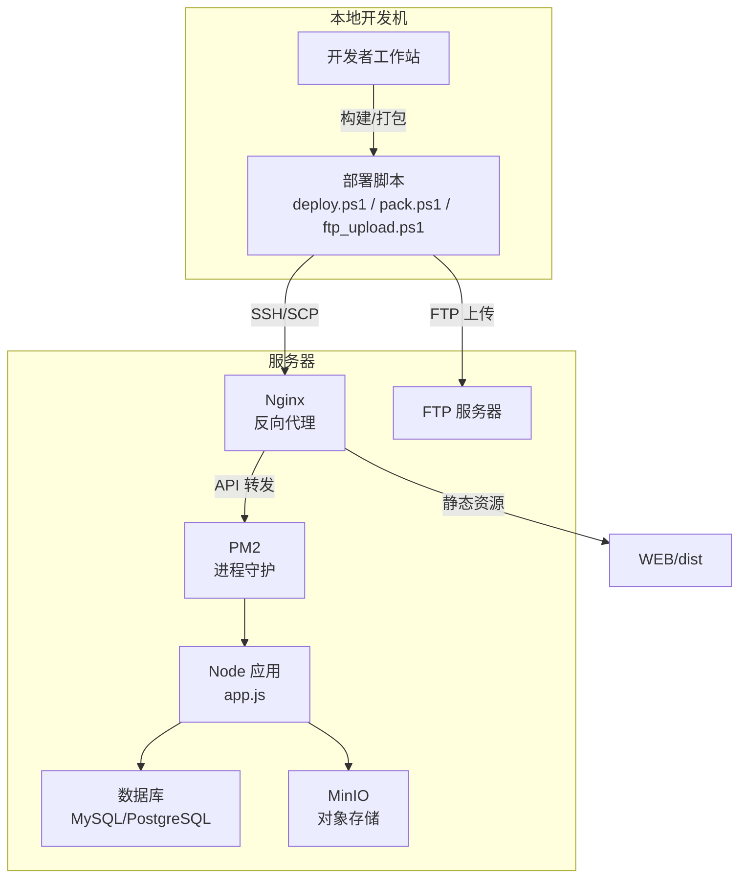
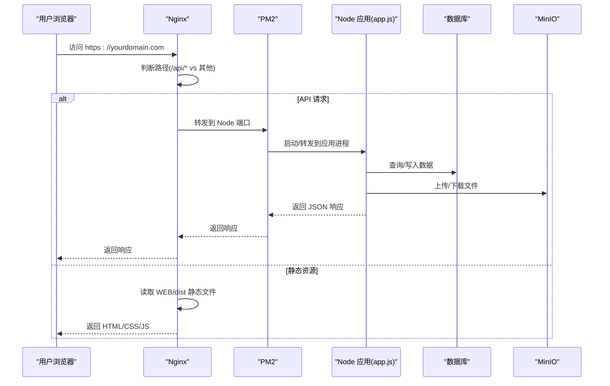
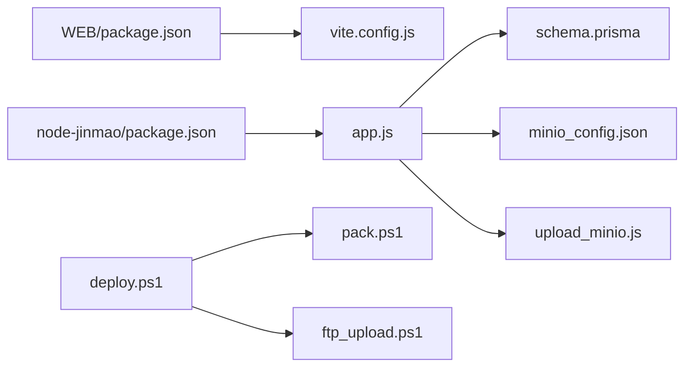

# 宝塔面板部署

<cite>
**本文引用的文件**   
- [宝塔部署指南.md](file://宝塔部署指南.md)
- [deploy.ps1](file://deploy.ps1)
- [ftp_upload.ps1](file://ftp_upload.ps1)
- [pack.ps1](file://pack.ps1)
- [start.ps1](file://start.ps1)
- [sync_wsl.ps1](file://sync_wsl.ps1)
- [node-jinmao/app.js](file://node-jinmao/app.js)
- [node-jinmao/package.json](file://node-jinmao/package.json)
- [node-jinmao/config/minio_config.json](file://node-jinmao/config/minio_config.json)
- [node-jinmao/utils/upload_minio.js](file://node-jinmao/utils/upload_minio.js)
- [node-jinmao/prisma/schema.prisma](file://node-jinmao/prisma/schema.prisma)
- [node-jinmao/setup.sh](file://node-jinmao/setup.sh)
- [WEB/package.json](file://WEB/package.json)
- [WEB/vite.config.js](file://WEB/vite.config.js)
- [test/code/minio-crud.js](file://test/code/minio-crud.js)
</cite>

## 目录
1. [简介](#简介)
2. [项目结构](#项目结构)
3. [核心组件](#核心组件)
4. [架构总览](#架构总览)
5. [详细组件分析](#详细组件分析)
6. [依赖关系分析](#依赖关系分析)
7. [性能考虑](#性能考虑)
8. [故障排查指南](#故障排查指南)
9. [结论](#结论)
10. [附录](#附录)

## 简介
本指南面向生产环境，基于宝塔面板完成前后端一体化部署。内容涵盖：
- 宝塔面板安装与基础安全配置
- 网站创建、域名绑定与SSL证书申请/自动续签
- Node.js 应用通过 PM2 进程管理
- Nginx 反向代理配置（前端静态资源与后端 API）
- 数据库远程连接配置（Prisma + MySQL/PostgreSQL）
- MinIO 对象存储接入与上传流程
- FTP 自动化上传脚本使用与批量部署流程
- 生产环境性能调优与安全加固建议

## 项目结构
本项目包含前端（Vue/Vite）、后端（Node.js/Express）、工具脚本与文档。关键目录与职责如下：
- WEB：前端工程，构建产物用于 Nginx 静态托管
- node-jinmao：后端服务，提供 REST API、任务处理、MinIO 集成、数据库访问等
- 根目录脚本：打包、部署、FTP 上传、WSL 同步等自动化脚本
- test：测试用例与示例代码（含 MinIO 操作示例）

图表来源
- [node-jinmao/app.js](file://node-jinmao/app.js)
- [WEB/package.json](file://WEB/package.json)
- [deploy.ps1](file://deploy.ps1)
- [ftp_upload.ps1](file://ftp_upload.ps1)

章节来源
- [node-jinmao/app.js](file://node-jinmao/app.js)
- [WEB/package.json](file://WEB/package.json)
- [deploy.ps1](file://deploy.ps1)
- [ftp_upload.ps1](file://ftp_upload.ps1)

## 核心组件
- 前端（WEB）
  - 构建产物为静态资源，由 Nginx 直接托管
  - 通过 Vite 构建优化，输出到 dist 目录
- 后端（node-jinmao）
  - Express 应用入口 app.js，加载路由、中间件、配置
  - Prisma ORM 管理数据库模型与迁移
  - MinIO 客户端用于对象存储上传/下载
  - PM2 进程守护，支持多实例与日志轮转
- 基础设施
  - Nginx 反向代理与 HTTPS 终结
  - 数据库（MySQL/PostgreSQL）远程连接
  - MinIO 对象存储桶与访问密钥
  - FTP 服务器用于文件批量上传

章节来源
- [node-jinmao/app.js](file://node-jinmao/app.js)
- [node-jinmao/package.json](file://node-jinmao/package.json)
- [node-jinmao/prisma/schema.prisma](file://node-jinmao/prisma/schema.prisma)
- [node-jinmao/config/minio_config.json](file://node-jinmao/config/minio_config.json)
- [node-jinmao/utils/upload_minio.js](file://node-jinmao/utils/upload_minio.js)
- [WEB/package.json](file://WEB/package.json)
- [WEB/vite.config.js](file://WEB/vite.config.js)

## 架构总览
下图展示从浏览器到后端与存储的完整请求链路，以及 Nginx 的反向代理策略。

图表来源
- [node-jinmao/app.js](file://node-jinmao/app.js)
- [WEB/package.json](file://WEB/package.json)
- [node-jinmao/config/minio_config.json](file://node-jinmao/config/minio_config.json)
- [node-jinmao/utils/upload_minio.js](file://node-jinmao/utils/upload_minio.js)

## 详细组件分析

### 宝塔面板安装与基础配置
- 安装宝塔面板
  - 在 Linux 服务器上执行官方安装脚本，按提示设置管理员账号与端口
  - 登录宝塔后，进入“软件商店”安装所需组件：Nginx、MySQL/PostgreSQL、Node.js 版本管理器、PM2 管理器（可选）
- 安全基线
  - 修改默认面板端口，启用防火墙仅开放必要端口（如 80/443/SSH）
  - 开启面板登录二次验证，限制 IP 白名单
  - 定期更新系统与应用补丁

章节来源
- [宝塔部署指南.md](file://宝塔部署指南.md)

### 网站创建、域名绑定与 SSL 证书
- 创建站点
  - 在宝塔“网站”中新增站点，选择“纯静态”或“Node.js”类型
  - 指定网站根目录（前端构建产物 dist 所在目录）
- 绑定域名
  - 将域名 CNAME/A 记录指向服务器公网 IP
  - 在宝塔站点设置中绑定域名，启用“强制 HTTPS”
- 申请与配置 SSL
  - 使用宝塔“SSL”功能申请 Let’s Encrypt 证书，开启自动续签
  - 若使用自有证书，上传证书并配置私钥

章节来源
- [宝塔部署指南.md](file://宝塔部署指南.md)

### Node.js 应用与 PM2 进程管理
- 应用入口与依赖
  - 后端入口文件为 app.js，依赖 Express 及业务模块
  - package.json 定义运行脚本与依赖版本
- PM2 部署步骤
  - 在服务器安装 PM2
  - 在项目目录执行 pm2 start 命令，设置名称、环境变量与重启策略
  - 配置日志轮转与监控告警
- 环境变量
  - 通过 PM2 或 .env 文件注入数据库连接串、MinIO 配置、JWT 密钥等

章节来源
- [node-jinmao/app.js](file://node-jinmao/app.js)
- [node-jinmao/package.json](file://node-jinmao/package.json)

### Nginx 反向代理设置
- 静态资源
  - 将域名根路径指向 WEB/dist 目录，启用 gzip 与缓存策略
- API 代理
  - 将 /api 路径反向代理至 Node 应用端口（如 3000）
  - 配置 WebSocket 支持（如需 SSE/长连接）
- 安全头
  - 添加 HSTS、CSP、X-Frame-Options 等安全响应头

章节来源
- [WEB/package.json](file://WEB/package.json)
- [WEB/vite.config.js](file://WEB/vite.config.js)

### 数据库远程连接配置（Prisma）
- 数据库初始化
  - 在宝塔安装数据库，创建数据库与用户，设置强密码
  - 允许远程访问（按需），配置防火墙放行端口
- Prisma 配置
  - schema.prisma 定义数据模型
  - 设置 DATABASE_URL 环境变量（含主机、端口、用户名、密码、库名）
  - 执行 prisma migrate deploy 应用迁移
- 连接池与超时
  - 根据并发量调整连接池大小与超时时间

章节来源
- [node-jinmao/prisma/schema.prisma](file://node-jinmao/prisma/schema.prisma)

### MinIO 对象存储配置
- 安装与初始化
  - 在服务器或独立节点安装 MinIO，创建桶与访问密钥
- 应用配置
  - minio_config.json 配置 endpoint、bucket、accessKey、secretKey
  - upload_minio.js 封装上传逻辑，供业务调用
- 测试与校验
  - 使用 test/code/minio-crud.js 进行基本 CRUD 验证

章节来源
- [node-jinmao/config/minio_config.json](file://node-jinmao/config/minio_config.json)
- [node-jinmao/utils/upload_minio.js](file://node-jinmao/utils/upload_minio.js)
- [test/code/minio-crud.js](file://test/code/minio-crud.js)

### FTP 上传文件的自动化脚本使用
- 准备 FTP 服务器
  - 在宝塔安装 FTP 服务，创建用户与目录权限
- 脚本使用
  - ftp_upload.ps1 用于批量上传文件到 FTP
  - 配置目标主机、端口、用户名、密码与上传目录
- 错误处理与重试
  - 脚本应实现断点续传与失败重试机制

章节来源
- [ftp_upload.ps1](file://ftp_upload.ps1)

### 批量部署流程
- 打包与构建
  - pack.ps1 负责前端构建与后端打包
  - deploy.ps1 通过 SSH/SCP 推送产物到服务器并重启服务
- WSL 同步
  - sync_wsl.ps1 用于开发与 WSL 环境同步代码
- 一键部署
  - 本地执行部署脚本，自动完成构建、上传、迁移、重启与验证

章节来源
- [pack.ps1](file://pack.ps1)
- [deploy.ps1](file://deploy.ps1)
- [sync_wsl.ps1](file://sync_wsl.ps1)

### 启动与运行
- 本地启动
  - start.ps1 用于 Windows 环境快速启动（开发用途）
- 生产启动
  - 使用 PM2 启动 Node 应用，配置开机自启与日志

章节来源
- [start.ps1](file://start.ps1)

## 依赖关系分析
- 前端依赖
  - WEB/package.json 定义构建与运行依赖
  - vite.config.js 控制构建输出与代理（开发时）
- 后端依赖
  - node-jinmao/package.json 定义运行时依赖与脚本
  - app.js 作为入口，加载路由、中间件、配置
- 外部依赖
  - 数据库驱动（Prisma 适配）
  - MinIO SDK
  - Nginx 反向代理
  - PM2 进程管理

图表来源
- [WEB/package.json](file://WEB/package.json)
- [WEB/vite.config.js](file://WEB/vite.config.js)
- [node-jinmao/package.json](file://node-jinmao/package.json)
- [node-jinmao/app.js](file://node-jinmao/app.js)
- [node-jinmao/prisma/schema.prisma](file://node-jinmao/prisma/schema.prisma)
- [node-jinmao/config/minio_config.json](file://node-jinmao/config/minio_config.json)
- [node-jinmao/utils/upload_minio.js](file://node-jinmao/utils/upload_minio.js)
- [deploy.ps1](file://deploy.ps1)
- [pack.ps1](file://pack.ps1)
- [ftp_upload.ps1](file://ftp_upload.ps1)

章节来源
- [WEB/package.json](file://WEB/package.json)
- [WEB/vite.config.js](file://WEB/vite.config.js)
- [node-jinmao/package.json](file://node-jinmao/package.json)
- [node-jinmao/app.js](file://node-jinmao/app.js)
- [node-jinmao/prisma/schema.prisma](file://node-jinmao/prisma/schema.prisma)
- [node-jinmao/config/minio_config.json](file://node-jinmao/config/minio_config.json)
- [node-jinmao/utils/upload_minio.js](file://node-jinmao/utils/upload_minio.js)
- [deploy.ps1](file://deploy.ps1)
- [pack.ps1](file://pack.ps1)
- [ftp_upload.ps1](file://ftp_upload.ps1)

## 性能考虑
- Nginx 优化
  - 启用 gzip/brotli 压缩，合理设置缓存与过期时间
  - 调整 worker_processes、worker_connections 与 keepalive_timeout
- Node.js 优化
  - 使用 PM2 多实例模式（cluster）提升并发能力
  - 调整 Node 内存上限与 GC 参数（按需）
  - 连接池与异步 I/O 优化（数据库与 MinIO 客户端）
- 数据库优化
  - 索引设计与查询优化
  - 连接池大小与超时配置
  - 定期分析与优化表结构
- 前端优化
  - 代码分割、懒加载与资源压缩
  - CDN 加速静态资源

[本节为通用指导，不直接分析具体文件]

## 故障排查指南
- 常见问题
  - 404/502：检查 Nginx 反向代理配置与 Node 应用端口
  - 数据库连接失败：核对 DATABASE_URL、网络连通性与权限
  - MinIO 上传失败：检查 endpoint、bucket、密钥与网络
  - FTP 上传失败：确认账户、目录权限与防火墙
- 日志与监控
  - PM2 日志查看与轮转
  - Nginx access/error 日志
  - 数据库慢查询与错误日志
  - MinIO 访问日志
- 回滚与恢复
  - 保留历史版本与数据库快照
  - 使用部署脚本的回滚步骤

章节来源
- [node-jinmao/app.js](file://node-jinmao/app.js)
- [node-jinmao/utils/upload_minio.js](file://node-jinmao/utils/upload_minio.js)
- [ftp_upload.ps1](file://ftp_upload.ps1)

## 结论
通过宝塔面板统一管理 Web、数据库与存储服务，结合 PM2 与 Nginx 可实现稳定高效的生产部署。配合自动化脚本可显著提升发布效率与一致性。建议在上线前完成性能压测与安全加固，建立完善的监控与备份策略。

[本节为总结性内容，不直接分析具体文件]

## 附录
- 参考脚本与配置文件路径
  - 部署脚本：deploy.ps1、pack.ps1、ftp_upload.ps1、sync_wsl.ps1、start.ps1
  - 后端入口与配置：node-jinmao/app.js、node-jinmao/package.json、node-jinmao/config/minio_config.json
  - 数据库模型：node-jinmao/prisma/schema.prisma
  - 前端构建：WEB/package.json、WEB/vite.config.js
  - MinIO 测试：test/code/minio-crud.js

章节来源
- [deploy.ps1](file://deploy.ps1)
- [pack.ps1](file://pack.ps1)
- [ftp_upload.ps1](file://ftp_upload.ps1)
- [sync_wsl.ps1](file://sync_wsl.ps1)
- [start.ps1](file://start.ps1)
- [node-jinmao/app.js](file://node-jinmao/app.js)
- [node-jinmao/package.json](file://node-jinmao/package.json)
- [node-jinmao/config/minio_config.json](file://node-jinmao/config/minio_config.json)
- [node-jinmao/prisma/schema.prisma](file://node-jinmao/prisma/schema.prisma)
- [WEB/package.json](file://WEB/package.json)
- [WEB/vite.config.js](file://WEB/vite.config.js)
- [test/code/minio-crud.js](file://test/code/minio-crud.js)