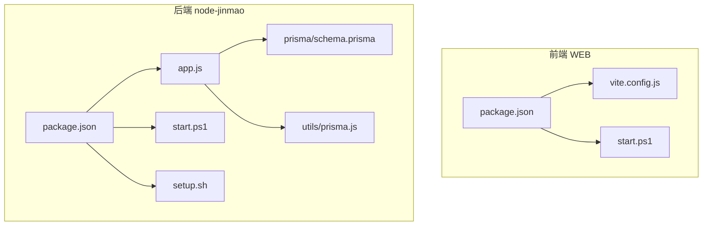
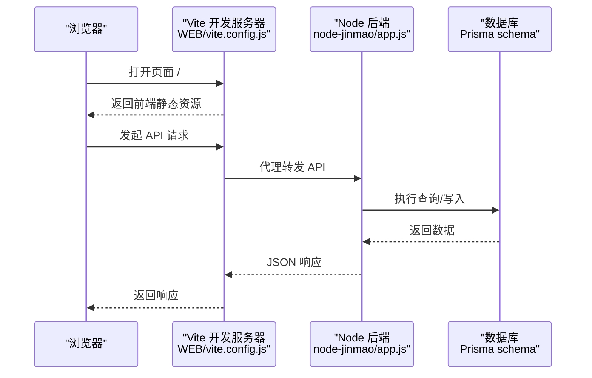
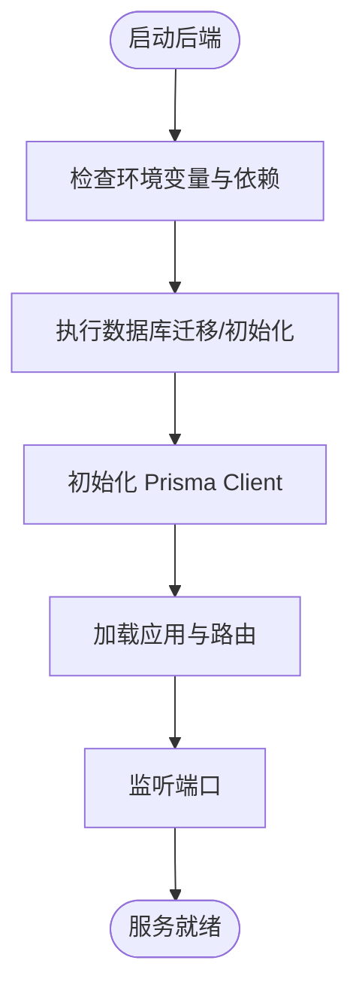
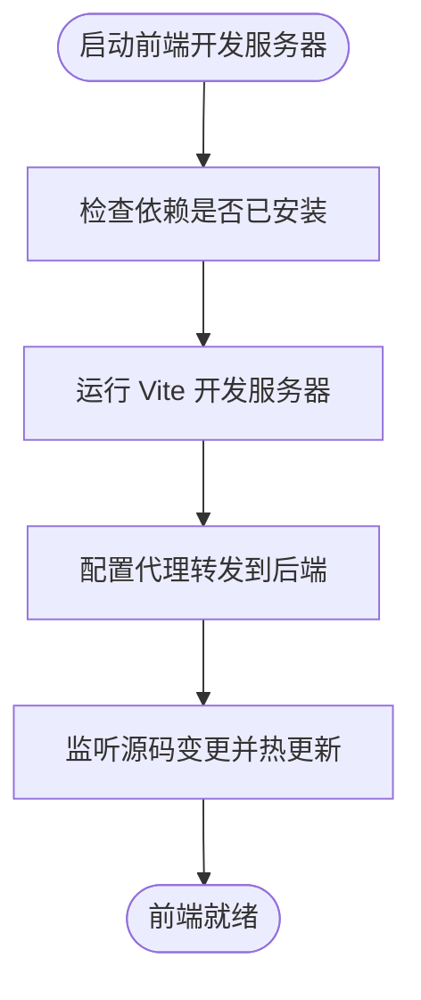
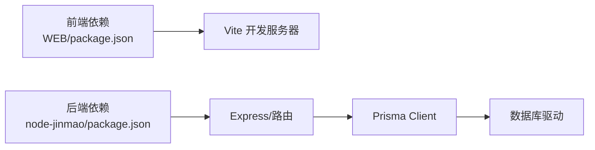

# 本地环境部署

<cite>
**本文引用的文件**   
- [package.json](file://node-jinmao/package.json)
- [app.js](file://node-jinmao/app.js)
- [start.ps1](file://node-jinmao/start.ps1)
- [setup.sh](file://node-jinmao/setup.sh)
- [schema.prisma](file://node-jinmao/prisma/schema.prisma)
- [prisma.js](file://node-jinmao/utils/prisma.js)
- [package.json](file://WEB/package.json)
- [vite.config.js](file://WEB/vite.config.js)
- [start.ps1](file://WEB/start.ps1)
- [.gitignore](file://node-jinmao/.gitignore)
- [.gitignore](file://WEB/.gitignore)
- [FILE.md](file://node-jinmao/FILE.md)
- [FILE.md](file://WEB/FILE.md)
</cite>

## 目录
1. [简介](#简介)
2. [项目结构](#项目结构)
3. [核心组件](#核心组件)
4. [架构总览](#架构总览)
5. [详细组件分析](#详细组件分析)
6. [依赖分析](#依赖分析)
7. [性能考虑](#性能考虑)
8. [故障排查指南](#故障排查指南)
9. [结论](#结论)
10. [附录](#附录)

## 简介
本指南面向在 Windows 本地搭建“金毛教你学重构版”开发环境的读者，覆盖 Node.js 版本要求、前后端依赖安装、数据库初始化与配置、环境变量与端口设置、服务启动顺序与依赖关系，以及常见问题排查方法。文档同时说明开发模式与生产模式的差异，帮助你快速完成从克隆到运行的全流程。

## 项目结构
本项目采用前后端分离的架构：
- 后端服务位于 node-jinmao 目录，基于 Node.js + Express（或类似框架），使用 Prisma 管理数据库模型与迁移，提供 REST API。
- 前端资源位于 WEB 目录，基于 Vite + Vue，通过 Vite 开发服务器提供热重载与代理转发至后端。

图表来源
- [package.json](file://node-jinmao/package.json)
- [app.js](file://node-jinmao/app.js)
- [start.ps1](file://node-jinmao/start.ps1)
- [setup.sh](file://node-jinmao/setup.sh)
- [schema.prisma](file://node-jinmao/prisma/schema.prisma)
- [prisma.js](file://node-jinmao/utils/prisma.js)
- [package.json](file://WEB/package.json)
- [vite.config.js](file://WEB/vite.config.js)
- [start.ps1](file://WEB/start.ps1)

章节来源
- [FILE.md](file://node-jinmao/FILE.md)
- [FILE.md](file://WEB/FILE.md)

## 核心组件
- 后端入口与路由
  - app.js 为后端主入口，负责加载中间件、注册路由、监听端口等。
  - start.ps1 提供 Windows 下的便捷启动脚本，通常包含依赖检查、数据库初始化与服务启动流程。
  - setup.sh 提供跨平台初始化脚本（Linux/macOS），Windows 下可参考其逻辑。
  - prisma/schema.prisma 定义数据模型与连接串；utils/prisma.js 封装 Prisma Client 实例化。
- 前端构建与开发
  - WEB/package.json 定义脚本命令（如 dev/build）与依赖。
  - WEB/vite.config.js 配置开发服务器、代理转发、静态资源路径等。
  - WEB/start.ps1 用于在 Windows 上快速启动前端开发服务器。

章节来源
- [app.js](file://node-jinmao/app.js)
- [start.ps1](file://node-jinmao/start.ps1)
- [setup.sh](file://node-jinmao/setup.sh)
- [schema.prisma](file://node-jinmao/prisma/schema.prisma)
- [prisma.js](file://node-jinmao/utils/prisma.js)
- [package.json](file://WEB/package.json)
- [vite.config.js](file://WEB/vite.config.js)
- [start.ps1](file://WEB/start.ps1)

## 架构总览
下图展示本地开发时前后端交互关系：浏览器访问 Vite 开发服务器，Vite 将 API 请求代理到后端服务；后端通过 Prisma 访问数据库。

图表来源
- [vite.config.js](file://WEB/vite.config.js)
- [app.js](file://node-jinmao/app.js)
- [schema.prisma](file://node-jinmao/prisma/schema.prisma)

## 详细组件分析

### 后端服务（node-jinmao）
- 运行环境与依赖
  - package.json 中定义了 Node 版本要求与运行时依赖。请确保本地 Node.js 版本满足要求。
- 启动流程
  - start.ps1 在 Windows 上执行，通常包括：
    - 检查 Node 版本与依赖是否安装
    - 执行数据库迁移与种子数据（如有）
    - 启动后端服务并输出日志
  - setup.sh 提供 Linux/macOS 的等价初始化流程，便于跨平台参考。
- 数据库配置
  - prisma/schema.prisma 定义数据源与模型，需配置正确的数据库连接字符串（例如 SQLite/MySQL/PostgreSQL）。
  - utils/prisma.js 负责创建 Prisma Client 实例，供业务模块调用。
- 环境变量与端口
  - 常见变量包括数据库连接串、JWT 密钥、第三方服务密钥等，具体以配置文件或 .env 为准。
  - 后端默认监听端口可在 app.js 或启动脚本中查看与修改。

图表来源
- [start.ps1](file://node-jinmao/start.ps1)
- [setup.sh](file://node-jinmao/setup.sh)
- [schema.prisma](file://node-jinmao/prisma/schema.prisma)
- [prisma.js](file://node-jinmao/utils/prisma.js)
- [app.js](file://node-jinmao/app.js)

章节来源
- [package.json](file://node-jinmao/package.json)
- [app.js](file://node-jinmao/app.js)
- [start.ps1](file://node-jinmao/start.ps1)
- [setup.sh](file://node-jinmao/setup.sh)
- [schema.prisma](file://node-jinmao/prisma/schema.prisma)
- [prisma.js](file://node-jinmao/utils/prisma.js)

### 前端服务（WEB）
- 运行环境与依赖
  - WEB/package.json 定义 Node 版本要求与依赖，建议使用与后端一致的 Node 版本。
- 开发服务器
  - WEB/vite.config.js 配置开发服务器端口、代理规则（将 /api 等路径转发到后端）、静态资源路径等。
  - WEB/start.ps1 在 Windows 上启动 Vite 开发服务器，支持热重载。
- 构建与生产
  - 通过 npm run build 生成 dist 静态资源，可用于生产部署。

图表来源
- [package.json](file://WEB/package.json)
- [vite.config.js](file://WEB/vite.config.js)
- [start.ps1](file://WEB/start.ps1)

章节来源
- [package.json](file://WEB/package.json)
- [vite.config.js](file://WEB/vite.config.js)
- [start.ps1](file://WEB/start.ps1)

## 依赖分析
- 后端依赖
  - 关键依赖由 node-jinmao/package.json 声明，包括 Web 框架、数据库驱动、Prisma 工具链等。
- 前端依赖
  - 关键依赖由 WEB/package.json 声明，包括 Vite、Vue 生态、HTTP 客户端等。
- 外部依赖
  - 数据库：根据 schema.prisma 的数据源配置决定（SQLite/MySQL/PostgreSQL）。
  - 第三方服务：如对象存储、LLM 接口等，需在环境变量中配置。

图表来源
- [package.json](file://WEB/package.json)
- [package.json](file://node-jinmao/package.json)
- [schema.prisma](file://node-jinmao/prisma/schema.prisma)

章节来源
- [package.json](file://WEB/package.json)
- [package.json](file://node-jinmao/package.json)
- [schema.prisma](file://node-jinmao/prisma/schema.prisma)

## 性能考虑
- 开发模式
  - 前端使用 Vite 开发服务器，具备热重载与按需编译，适合快速迭代。
  - 后端建议开启调试日志，便于定位问题。
- 生产模式
  - 前端通过构建生成静态资源，减少体积并启用缓存策略。
  - 后端应关闭冗余日志，合理设置进程数与内存限制，必要时使用 PM2 等进程管理器。
- 数据库
  - 本地开发可使用轻量数据库（如 SQLite），生产环境建议使用 MySQL/PostgreSQL。
  - 合理设计索引与查询，避免全表扫描。

[本节为通用指导，不直接分析具体文件]

## 故障排查指南
- 端口冲突
  - 现象：启动时报端口占用错误。
  - 处理：检查并释放被占用的端口，或修改 vite.config.js 与后端 app.js 中的端口配置。
- 权限问题
  - 现象：无法写入文件或目录、数据库初始化失败。
  - 处理：确保对 node_modules、data、dist 等目录有读写权限；Windows 下以管理员权限运行终端。
- 路径配置
  - 现象：静态资源 404、代理转发失败。
  - 处理：核对 vite.config.js 的代理前缀与后端路由一致；确认构建产物输出路径与部署路径匹配。
- 数据库连接失败
  - 现象：Prisma 连接报错、迁移失败。
  - 处理：检查 schema.prisma 的连接串是否正确；确认数据库服务已启动且网络可达。
- 环境变量缺失
  - 现象：第三方服务调用失败、鉴权异常。
  - 处理：在根目录或后端目录创建 .env 文件，补充必要的环境变量。

章节来源
- [vite.config.js](file://WEB/vite.config.js)
- [app.js](file://node-jinmao/app.js)
- [schema.prisma](file://node-jinmao/prisma/schema.prisma)

## 结论
按照本指南完成 Node.js 版本准备、依赖安装、数据库初始化与环境变量配置后，即可按“先后端、再前端”的顺序启动服务。开发模式下利用 Vite 的热重载与后端调试日志提升效率；生产模式下进行构建与优化部署。遇到端口、权限、路径与数据库问题时，可依据排查指南逐项定位解决。

## 附录
- 推荐启动顺序
  - 启动后端服务（node-jinmao/start.ps1）
  - 启动前端开发服务器（WEB/start.ps1）
- 常用命令
  - 后端：安装依赖、初始化数据库、启动服务
  - 前端：安装依赖、启动开发服务器、构建生产包
- 关键配置文件
  - 后端：app.js、schema.prisma、utils/prisma.js
  - 前端：vite.config.js、package.json

[本节为操作清单，不直接分析具体文件]