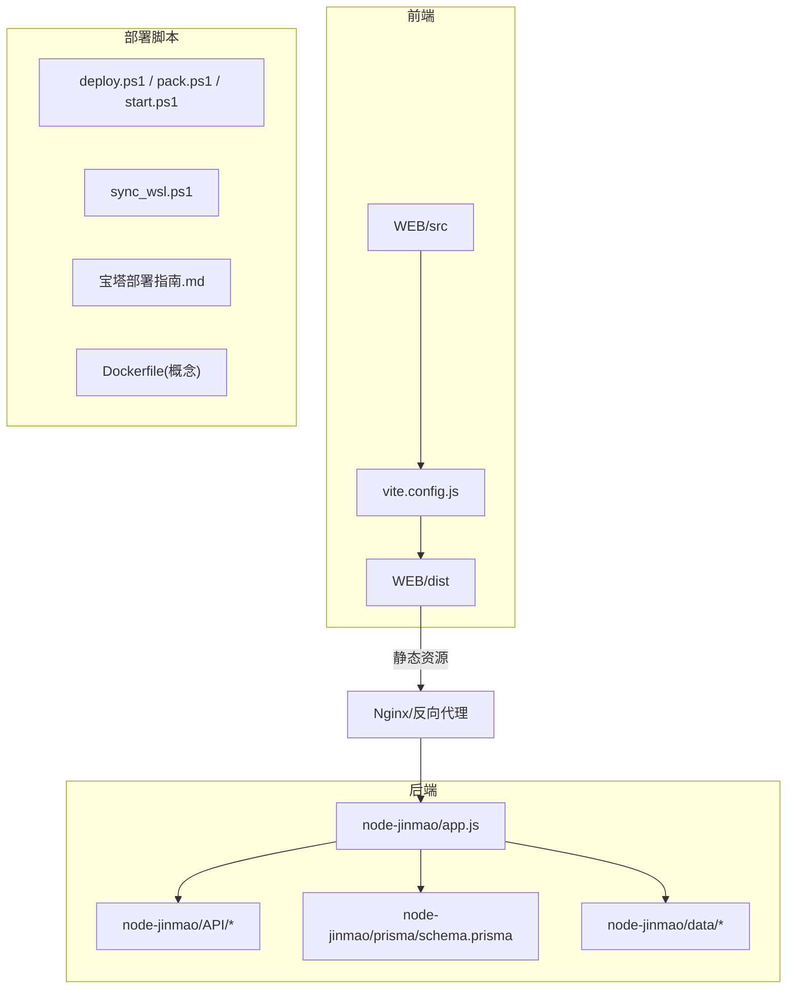
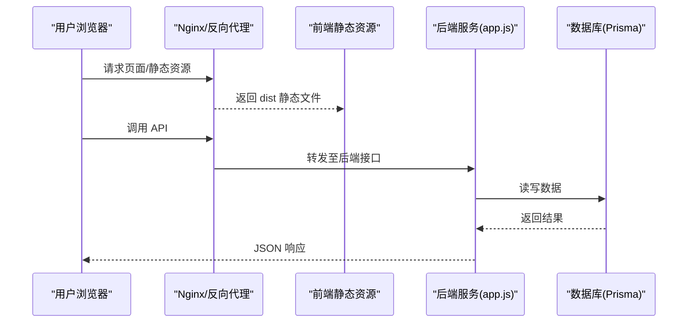
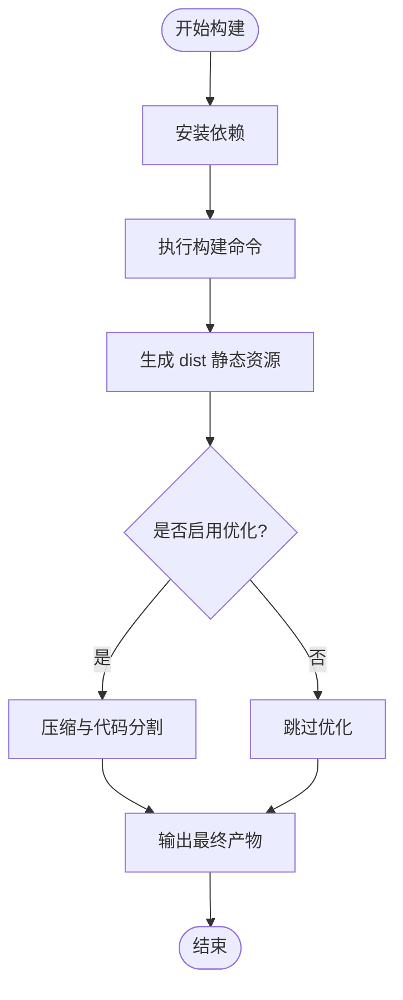
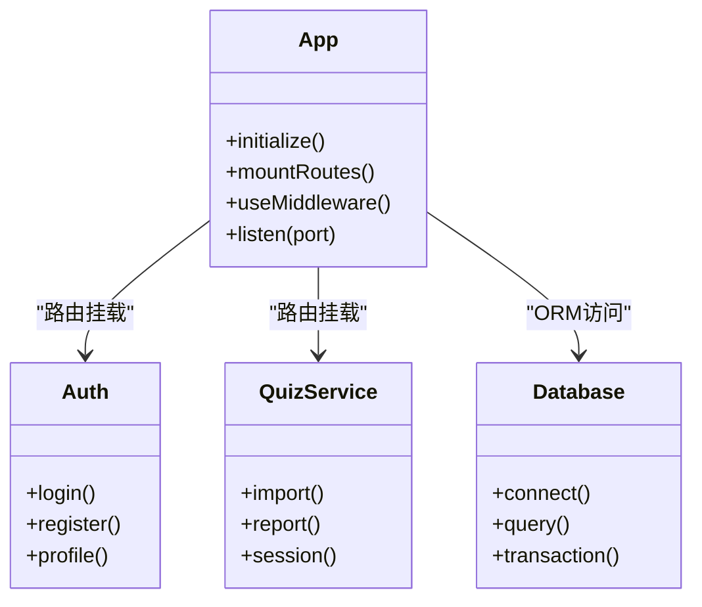
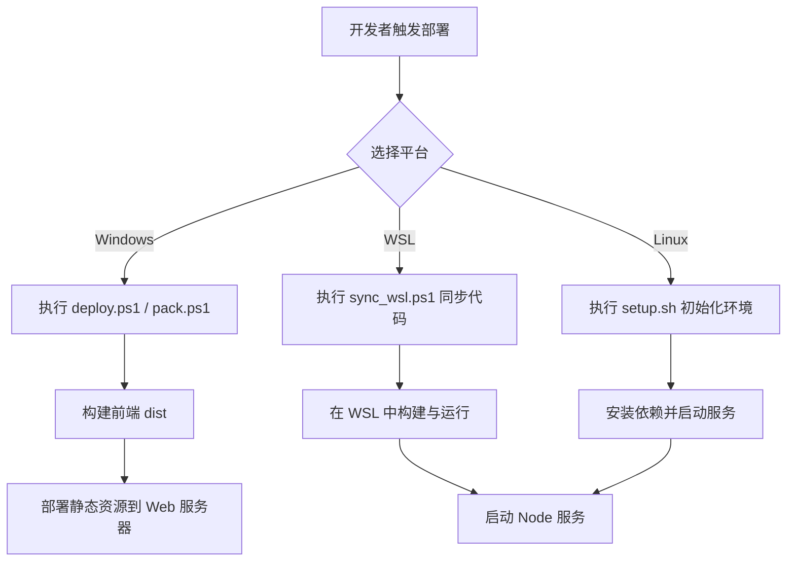
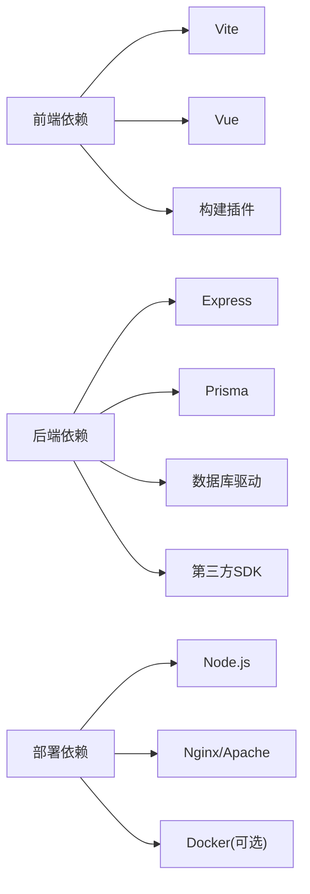

# 部署指南

<cite>
**本文档引用的文件**   
- [package.json](file://node-jinmao/package.json)
- [app.js](file://node-jinmao/app.js)
- [setup.sh](file://node-jinmao/setup.sh)
- [start.ps1](file://node-jinmao/start.ps1)
- [vite.config.js](file://WEB/vite.config.js)
- [package.json](file://WEB/package.json)
- [deploy.ps1](file://deploy.ps1)
- [pack.ps1](file://pack.ps1)
- [start.ps1](file://start.ps1)
- [sync_wsl.ps1](file://sync_wsl.ps1)
- [宝塔部署指南.md](file://宝塔部署指南.md)
- [WSL部署指南.md](file://WSL部署指南.md)
- [API文档.md](file://API文档.md)
- [数据库结构.md](file://数据库结构.md)
- [prisma/schema.prisma](file://node-jinmao/prisma/schema.prisma)
</cite>

## 目录
1. [简介](#简介)
2. [项目结构](#项目结构)
3. [核心组件](#核心组件)
4. [架构总览](#架构总览)
5. [详细组件分析](#详细组件分析)
6. [依赖分析](#依赖分析)
7. [性能考虑](#性能考虑)
8. [故障排查指南](#故障排查指南)
9. [结论](#结论)
10. [附录](#附录)

## 简介
本指南面向“金毛教你学重构版”项目的部署与发布，覆盖以下场景：
- Windows 本地部署
- WSL（Windows Subsystem for Linux）环境部署
- 宝塔面板部署
- Docker 容器化部署

同时包含：
- 前端打包流程与构建优化配置
- 静态资源处理策略
- 域名配置、SSL 证书安装与反向代理设置
- 自动化部署脚本使用说明
- CI/CD 流水线集成方案
- 多环境部署策略、灰度发布与回滚机制

## 项目结构
本项目由前后端两个主要部分组成：
- 前端：基于 Vite + Vue 的单页应用，位于 WEB 目录
- 后端：基于 Node.js 的 Express 服务，使用 Prisma ORM，位于 node-jinmao 目录

图表来源
- [vite.config.js](file://WEB/vite.config.js)
- [package.json](file://WEB/package.json)
- [app.js](file://node-jinmao/app.js)
- [schema.prisma](file://node-jinmao/prisma/schema.prisma)

章节来源
- [package.json](file://WEB/package.json)
- [package.json](file://node-jinmao/package.json)
- [vite.config.js](file://WEB/vite.config.js)
- [app.js](file://node-jinmao/app.js)

## 核心组件
- 前端构建器：Vite，负责开发服务器、热更新与生产构建
- 后端服务：Express 应用入口 app.js，路由与中间件在 API 与 middleware 目录
- 数据访问层：Prisma ORM，通过 schema.prisma 定义模型与迁移
- 部署脚本：PowerShell 脚本用于打包、同步与启动；Linux 下提供 setup.sh

章节来源
- [vite.config.js](file://WEB/vite.config.js)
- [package.json](file://WEB/package.json)
- [app.js](file://node-jinmao/app.js)
- [schema.prisma](file://node-jinmao/prisma/schema.prisma)
- [setup.sh](file://node-jinmao/setup.sh)

## 架构总览
系统采用前后端分离架构。前端通过 Vite 构建为静态资源，由 Nginx/Apache 或容器内 Web 服务器托管；后端以 Node.js 进程运行，提供 RESTful API 并持久化到数据库。

图表来源
- [app.js](file://node-jinmao/app.js)
- [vite.config.js](file://WEB/vite.config.js)

## 详细组件分析

### 前端构建与静态资源处理
- 构建工具：Vite，配置文件位于 vite.config.js
- 构建产物：输出到 WEB/dist，包含 JS/CSS/HTML 及静态资源
- 开发体验：支持热更新与开发服务器
- 优化建议：启用代码分割、压缩、缓存策略、CDN 前缀等

章节来源
- [vite.config.js](file://WEB/vite.config.js)
- [package.json](file://WEB/package.json)

### 后端服务与数据层
- 入口文件：node-jinmao/app.js，初始化 Express 应用、挂载路由与中间件
- 路由与业务逻辑：位于 API 目录，按模块划分
- 数据模型与迁移：Prisma schema.prisma 定义模型，配合迁移脚本管理数据库结构
- 运行时依赖：Node.js、数据库驱动、环境变量配置

图表来源
- [app.js](file://node-jinmao/app.js)
- [schema.prisma](file://node-jinmao/prisma/schema.prisma)

章节来源
- [app.js](file://node-jinmao/app.js)
- [schema.prisma](file://node-jinmao/prisma/schema.prisma)

### 部署脚本与自动化
- Windows 脚本：deploy.ps1、pack.ps1、start.ps1 用于打包、部署与启动
- WSL 同步：sync_wsl.ps1 用于 Windows 与 WSL 间文件同步
- Linux 初始化：setup.sh 用于后端环境初始化与依赖安装

章节来源
- [deploy.ps1](file://deploy.ps1)
- [pack.ps1](file://pack.ps1)
- [start.ps1](file://start.ps1)
- [sync_wsl.ps1](file://sync_wsl.ps1)
- [setup.sh](file://node-jinmao/setup.sh)

### 域名配置、SSL 与反向代理
- 域名解析：将域名指向服务器公网 IP
- SSL 证书：通过 Let’s Encrypt 或云厂商证书管理服务获取并安装
- 反向代理：Nginx/Apache 配置将静态资源与 API 请求分别转发至前端与后端
- 安全建议：启用 HTTPS、HSTS、CORS 白名单、限流与访问日志

章节来源
- [宝塔部署指南.md](file://宝塔部署指南.md)

### 多环境部署策略、灰度发布与回滚
- 多环境：开发、测试、预发、生产，通过环境变量区分配置
- 灰度发布：按流量比例或用户分群逐步放量新版本
- 回滚机制：保留历史版本包与数据库快照，快速切换回稳定版本

章节来源
- [API文档.md](file://API文档.md)
- [数据库结构.md](file://数据库结构.md)

## 依赖分析
- 前端依赖：Vite、Vue 生态、构建插件与样式库
- 后端依赖：Express、Prisma、数据库驱动、第三方 API SDK
- 部署依赖：Node.js、Nginx/Apache、Docker（可选）、Git

图表来源
- [package.json](file://WEB/package.json)
- [package.json](file://node-jinmao/package.json)

章节来源
- [package.json](file://WEB/package.json)
- [package.json](file://node-jinmao/package.json)

## 性能考虑
- 前端优化：开启代码分割、按需加载、图片与字体压缩、缓存头设置、CDN 加速
- 后端优化：连接池配置、查询索引优化、异步任务队列、SSE/流式响应
- 部署优化：静态资源 CDN、Gzip/Brotli 压缩、HTTP/2、反向代理缓存

## 故障排查指南
- 端口冲突：检查 80/443/3000/5000 等端口占用情况
- 权限问题：确保 Web 目录与数据目录可写
- 环境变量：核对数据库连接、第三方 API Key、路径配置
- 日志定位：查看 Nginx/Apache 错误日志与 Node.js 应用日志
- 数据库迁移：确认 Prisma 迁移已执行且 schema 一致

章节来源
- [宝塔部署指南.md](file://宝塔部署指南.md)
- [WSL部署指南.md](file://WSL部署指南.md)

## 结论
通过本指南，您可以在多种环境下完成“金毛教你学重构版”的部署与发布，涵盖从本地开发到生产上线的全流程。结合自动化脚本与 CI/CD 流水线，可实现高效、稳定的持续交付与版本管理。

## 附录

### Windows 本地部署步骤
- 前置条件：安装 Node.js、Git、可选的数据库客户端
- 步骤：
  - 克隆仓库并进入项目根目录
  - 安装前后端依赖
  - 执行前端构建脚本生成 dist
  - 启动后端服务
  - 使用本地 Web 服务器或反向代理访问

章节来源
- [start.ps1](file://start.ps1)
- [deploy.ps1](file://deploy.ps1)
- [pack.ps1](file://pack.ps1)

### WSL 环境部署步骤
- 前置条件：安装 WSL 与 Ubuntu，配置 Node.js 与 Git
- 步骤：
  - 在 Windows 中同步代码到 WSL
  - 在 WSL 中安装依赖并构建前端
  - 启动后端服务并验证接口
  - 配置反向代理与域名

章节来源
- [sync_wsl.ps1](file://sync_wsl.ps1)
- [WSL部署指南.md](file://WSL部署指南.md)

### 宝塔面板部署步骤
- 前置条件：安装宝塔面板、创建站点与数据库
- 步骤：
  - 上传后端代码并安装依赖
  - 配置环境变量与数据库连接
  - 构建前端并上传 dist 到站点目录
  - 配置反向代理与 SSL 证书

章节来源
- [宝塔部署指南.md](file://宝塔部署指南.md)

### Docker 容器化部署步骤
- 前置条件：安装 Docker 与 Docker Compose
- 步骤：
  - 编写 Dockerfile 与 docker-compose.yml
  - 构建镜像并启动容器
  - 配置环境变量与数据卷持久化
  - 通过反向代理暴露服务

章节来源
- [vite.config.js](file://WEB/vite.config.js)
- [app.js](file://node-jinmao/app.js)

### 自动化部署脚本使用说明
- Windows：使用 deploy.ps1 进行一键部署，pack.ps1 打包产物，start.ps1 启动服务
- WSL：使用 sync_wsl.ps1 同步代码，便于在 WSL 中独立构建与运行
- Linux：使用 setup.sh 初始化环境与依赖

章节来源
- [deploy.ps1](file://deploy.ps1)
- [pack.ps1](file://pack.ps1)
- [start.ps1](file://start.ps1)
- [sync_wsl.ps1](file://sync_wsl.ps1)
- [setup.sh](file://node-jinmao/setup.sh)

### CI/CD 流水线集成方案
- 触发条件：推送代码或创建标签时自动构建
- 阶段：
  - 安装依赖与单元测试
  - 构建前端与后端
  - 生成制品并上传到仓库或对象存储
  - 部署到目标环境（灰度/全量）
- 回滚：根据版本号快速切换镜像或包

章节来源
- [API文档.md](file://API文档.md)
- [数据库结构.md](file://数据库结构.md)

### 多环境部署策略
- 环境隔离：通过环境变量区分不同环境的配置
- 配置管理：集中管理敏感信息与外部服务地址
- 版本管理：使用语义化版本与标签管理发布

章节来源
- [API文档.md](file://API文档.md)
- [数据库结构.md](file://数据库结构.md)

### 灰度发布与回滚机制
- 灰度策略：按用户 ID 哈希或流量比例分发新版本
- 监控与告警：观察错误率与延迟指标，及时发现问题
- 回滚操作：切换到上一个稳定版本并恢复数据快照

章节来源
- [API文档.md](file://API文档.md)
- [数据库结构.md](file://数据库结构.md)