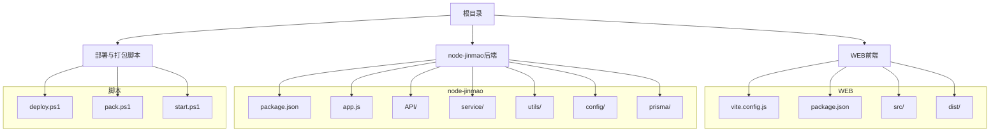
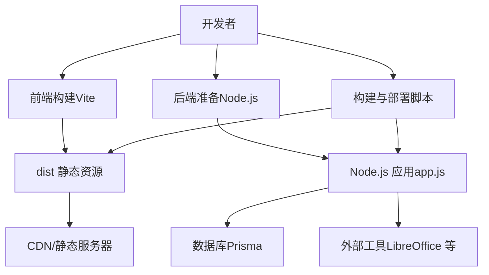
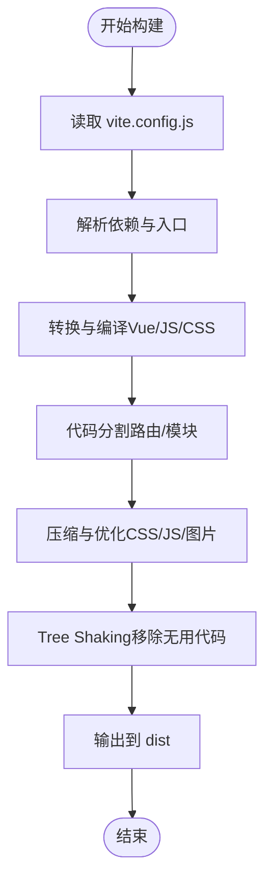
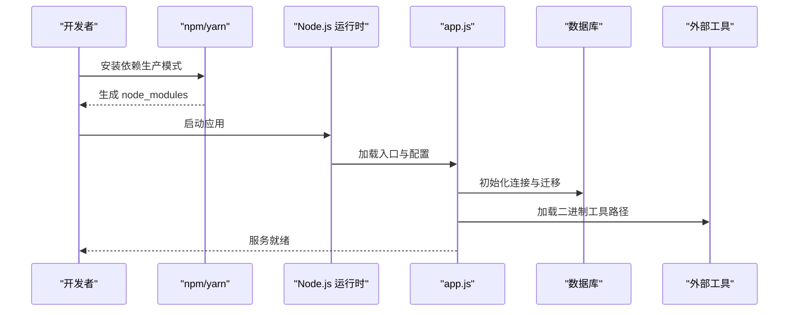
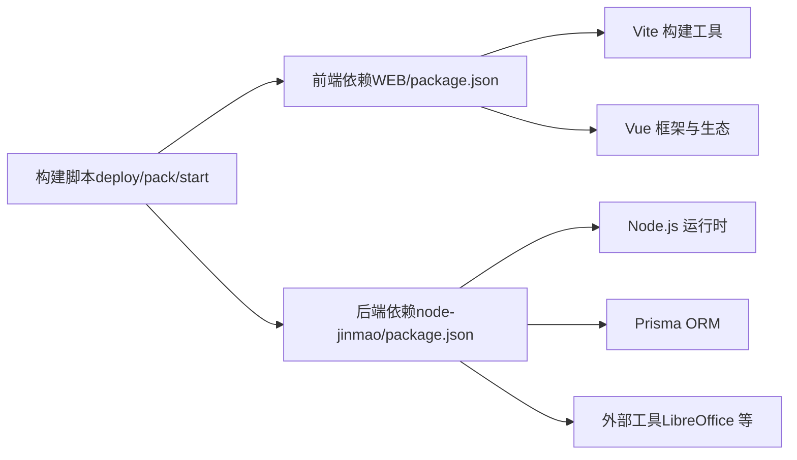

# 项目打包与构建

<cite>
**本文引用的文件**   
- [WEB/vite.config.js](file://WEB/vite.config.js)
- [WEB/package.json](file://WEB/package.json)
- [node-jinmao/package.json](file://node-jinmao/package.json)
- [node-jinmao/app.js](file://node-jinmao/app.js)
- [deploy.ps1](file://deploy.ps1)
- [pack.ps1](file://pack.ps1)
- [start.ps1](file://start.ps1)
</cite>

## 目录
1. [简介](#简介)
2. [项目结构](#项目结构)
3. [核心组件](#核心组件)
4. [架构总览](#架构总览)
5. [详细组件分析](#详细组件分析)
6. [依赖分析](#依赖分析)
7. [性能考虑](#性能考虑)
8. [故障排查指南](#故障排查指南)
9. [结论](#结论)
10. [附录](#附录)

## 简介
本指南面向项目的打包与构建，覆盖前端 Vite 构建配置、代码分割、资源压缩与 Tree Shaking 优化；后端 Node.js 项目的打包策略、依赖精简与二进制文件处理；构建脚本使用与自定义配置；多环境差异化构建（开发、测试、生产）；构建产物分析与性能优化建议；以及 CDN 资源托管配置。文档基于仓库中的实际配置文件与脚本进行说明，确保可操作性与可复现性。

## 项目结构
本项目包含两个主要子工程：
- WEB：前端应用，基于 Vite + Vue，构建产物输出到 dist 目录。
- node-jinmao：后端服务，基于 Node.js，提供 API 与业务逻辑。

根目录包含部署与打包脚本，用于统一前后端构建与发布流程。

图表来源
- [WEB/vite.config.js](file://WEB/vite.config.js)
- [WEB/package.json](file://WEB/package.json)
- [node-jinmao/package.json](file://node-jinmao/package.json)
- [node-jinmao/app.js](file://node-jinmao/app.js)
- [deploy.ps1](file://deploy.ps1)
- [pack.ps1](file://pack.ps1)
- [start.ps1](file://start.ps1)

章节来源
- [WEB/vite.config.js](file://WEB/vite.config.js)
- [WEB/package.json](file://WEB/package.json)
- [node-jinmao/package.json](file://node-jinmao/package.json)
- [node-jinmao/app.js](file://node-jinmao/app.js)
- [deploy.ps1](file://deploy.ps1)
- [pack.ps1](file://pack.ps1)
- [start.ps1](file://start.ps1)

## 核心组件
- 前端构建器：Vite（通过 vite.config.js 配置），负责编译、代码分割、资源压缩、Tree Shaking、插件扩展等。
- 后端运行器：Node.js（通过 app.js 启动），配合 package.json 的脚本与依赖管理。
- 构建与部署脚本：PowerShell 脚本（deploy.ps1、pack.ps1、start.ps1）统一执行构建、打包与发布流程。

章节来源
- [WEB/vite.config.js](file://WEB/vite.config.js)
- [WEB/package.json](file://WEB/package.json)
- [node-jinmao/package.json](file://node-jinmao/package.json)
- [node-jinmao/app.js](file://node-jinmao/app.js)
- [deploy.ps1](file://deploy.ps1)
- [pack.ps1](file://pack.ps1)
- [start.ps1](file://start.ps1)

## 架构总览
前端与后端的构建与运行关系如下：
- 前端通过 Vite 将源码编译为静态资源，输出到 dist 目录，供 Web 服务器或 CDN 托管。
- 后端通过 Node.js 直接运行，依赖 prisma、外部工具（如 LibreOffice 便携版）与配置文件。
- 根目录脚本协调前后端构建与部署，支持多环境与产物上传。

图表来源
- [WEB/vite.config.js](file://WEB/vite.config.js)
- [node-jinmao/app.js](file://node-jinmao/app.js)
- [deploy.ps1](file://deploy.ps1)
- [pack.ps1](file://pack.ps1)
- [start.ps1](file://start.ps1)

## 详细组件分析

### 前端 Vite 构建配置
- 构建目标：将 src 下的 Vue 单文件组件与 JS/CSS 等资源编译为浏览器可用的静态文件，输出至 dist。
- 代码分割：按路由或模块边界拆分，减少首屏体积，提升加载性能。
- 资源压缩：启用 CSS/JS 压缩与图片优化，减小传输体积。
- Tree Shaking：移除未使用的代码，进一步缩小包体。
- 环境变量：通过 .env.* 文件区分不同环境的变量（如 API 地址、调试开关）。
- 插件扩展：可集成路由懒加载、图标优化、代理等插件增强构建能力。

图表来源
- [WEB/vite.config.js](file://WEB/vite.config.js)

章节来源
- [WEB/vite.config.js](file://WEB/vite.config.js)
- [WEB/package.json](file://WEB/package.json)

### 后端 Node.js 打包策略
- 运行方式：通过 app.js 启动服务，依赖 package.json 中声明的运行时依赖。
- 依赖精简：仅保留生产所需依赖，避免携带开发依赖；对大型库按需引入。
- 二进制文件处理：对于需要系统级工具（如 LibreOffice 便携版），在构建时打包并随应用分发。
- 配置管理：集中化配置文件（config/*.json）与环境变量，便于多环境切换。
- 数据库迁移：使用 Prisma 管理 schema 与迁移，确保数据一致性。

图表来源
- [node-jinmao/package.json](file://node-jinmao/package.json)
- [node-jinmao/app.js](file://node-jinmao/app.js)

章节来源
- [node-jinmao/package.json](file://node-jinmao/package.json)
- [node-jinmao/app.js](file://node-jinmao/app.js)

### 构建脚本使用方法与自定义配置
- deploy.ps1：统一执行前后端构建与部署，支持指定环境参数与目标服务器。
- pack.ps1：打包应用与依赖，生成可分发的压缩包，包含二进制与配置文件。
- start.ps1：本地快速启动脚本，适用于开发与测试环境。

常见用法：
- 构建前端：在 WEB 目录下执行 npm run build（由 vite.config.js 驱动）。
- 构建后端：在 node-jinmao 目录下执行 npm install --production 与 npm start。
- 一键部署：在根目录执行 deploy.ps1，传入环境标识（如 dev/test/prod）。

自定义选项：
- 环境变量：通过 .env.development/.env.production 控制构建行为与 API 地址。
- 构建参数：在 vite.config.js 中调整输出目录、压缩级别、分包策略。
- 脚本参数：在 PowerShell 脚本中定义环境变量与路径映射，适配不同部署目标。

章节来源
- [deploy.ps1](file://deploy.ps1)
- [pack.ps1](file://pack.ps1)
- [start.ps1](file://start.ps1)
- [WEB/vite.config.js](file://WEB/vite.config.js)
- [WEB/package.json](file://WEB/package.json)
- [node-jinmao/package.json](file://node-jinmao/package.json)

### 多环境构建配置
- 开发环境：启用热更新、调试信息、详细日志，便于快速迭代。
- 测试环境：关闭部分调试功能，启用更严格的校验与错误上报。
- 生产环境：启用全量压缩、缓存策略、CDN 前缀与错误监控。

配置要点：
- 环境变量隔离：不同环境使用独立的 .env.* 文件，避免敏感信息泄露。
- 构建产物差异：生产环境禁用 source map，启用代码混淆与分包。
- 运行时差异：根据环境变量切换 API 地址、第三方服务密钥与功能开关。

章节来源
- [WEB/vite.config.js](file://WEB/vite.config.js)
- [WEB/package.json](file://WEB/package.json)
- [node-jinmao/package.json](file://node-jinmao/package.json)

### 构建产物分析与性能优化建议
- 产物分析：使用 Vite 内置或第三方插件（如 rollup-plugin-visualizer）分析包体结构与依赖占比。
- 性能优化：
  - 路由懒加载：按页面维度拆分代码，减少首屏负载。
  - 资源优化：启用图片压缩、字体子集化、CSS 提取与合并。
  - 缓存策略：为静态资源设置长期缓存与版本哈希，提升重复访问速度。
  - 依赖瘦身：移除未使用依赖，替换大体积库为轻量替代方案。
- CDN 托管：将 dist 静态资源上传至 CDN，配置域名、缓存头与回源策略。

章节来源
- [WEB/vite.config.js](file://WEB/vite.config.js)
- [WEB/package.json](file://WEB/package.json)

### CDN 资源托管配置
- 资源上传：通过部署脚本将 dist 内容同步至 CDN 存储桶或对象存储。
- 域名与路径：配置 CDN 域名与资源路径前缀，确保引用正确。
- 缓存与刷新：设置合理的缓存过期时间，并提供强制刷新机制以应对更新。
- 安全与权限：限制访问权限，启用 HTTPS 与防盗链策略。

章节来源
- [deploy.ps1](file://deploy.ps1)
- [pack.ps1](file://pack.ps1)

## 依赖分析
前端与后端依赖相互独立，通过脚本协调构建与部署。前端依赖集中在 WEB/package.json，后端依赖集中在 node-jinmao/package.json。构建过程不产生跨层耦合，便于独立升级与维护。

图表来源
- [WEB/package.json](file://WEB/package.json)
- [node-jinmao/package.json](file://node-jinmao/package.json)
- [deploy.ps1](file://deploy.ps1)
- [pack.ps1](file://pack.ps1)
- [start.ps1](file://start.ps1)

章节来源
- [WEB/package.json](file://WEB/package.json)
- [node-jinmao/package.json](file://node-jinmao/package.json)
- [deploy.ps1](file://deploy.ps1)
- [pack.ps1](file://pack.ps1)
- [start.ps1](file://start.ps1)

## 性能考虑
- 前端：
  - 启用代码分割与懒加载，降低首屏体积。
  - 使用 Tree Shaking 移除未使用代码。
  - 压缩与优化静态资源，启用 HTTP/2 与缓存。
- 后端：
  - 精简依赖，避免加载不必要的模块。
  - 合理配置外部工具路径，减少启动开销。
  - 使用连接池与异步 I/O 提升并发处理能力。
- 部署：
  - 使用 CDN 加速静态资源分发。
  - 配置合适的缓存策略与回源规则。
  - 监控构建与运行时的性能指标，持续优化。

## 故障排查指南
- 构建失败：
  - 检查环境变量是否正确配置。
  - 确认依赖安装完整且版本兼容。
  - 查看构建日志定位具体错误位置。
- 运行时异常：
  - 验证配置文件路径与权限。
  - 检查数据库连接与迁移状态。
  - 确认外部工具（如 LibreOffice）可用性与路径配置。
- 性能问题：
  - 使用浏览器开发者工具分析网络请求与渲染耗时。
  - 通过产物分析报告定位大包与冗余依赖。
  - 调整缓存策略与资源加载顺序。

章节来源
- [WEB/vite.config.js](file://WEB/vite.config.js)
- [node-jinmao/app.js](file://node-jinmao/app.js)
- [deploy.ps1](file://deploy.ps1)
- [pack.ps1](file://pack.ps1)
- [start.ps1](file://start.ps1)

## 结论
本指南系统梳理了前端 Vite 构建与后端 Node.js 打包策略，涵盖代码分割、资源压缩、Tree Shaking、多环境配置、产物分析与 CDN 托管等关键环节。通过统一的构建脚本与清晰的依赖管理，可实现高效、稳定、可维护的构建与发布流程。建议结合项目实际情况持续优化构建配置与部署策略，以提升整体性能与用户体验。

## 附录
- 常用命令：
  - 前端构建：cd WEB && npm run build
  - 后端启动：cd node-jinmao && npm start
  - 一键部署：./deploy.ps1 -env prod
- 参考文件：
  - 前端构建配置：[WEB/vite.config.js](file://WEB/vite.config.js)
  - 后端入口：[node-jinmao/app.js](file://node-jinmao/app.js)
  - 构建脚本：[deploy.ps1](file://deploy.ps1)、[pack.ps1](file://pack.ps1)、[start.ps1](file://start.ps1)