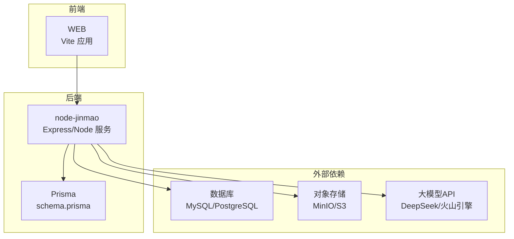
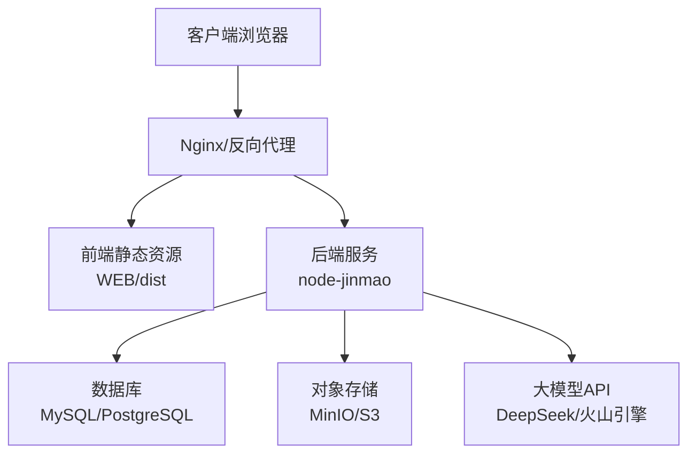
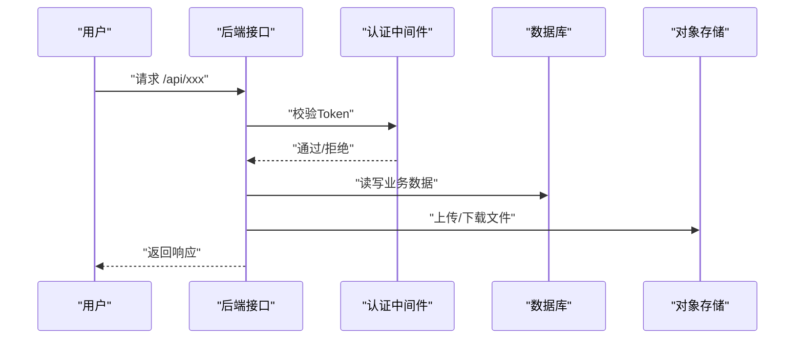
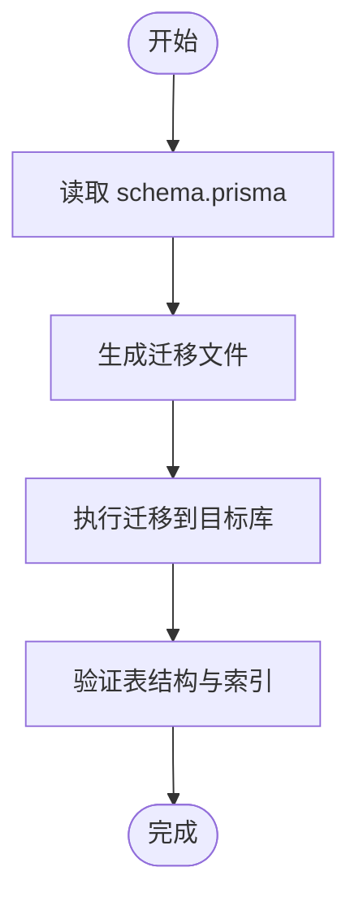
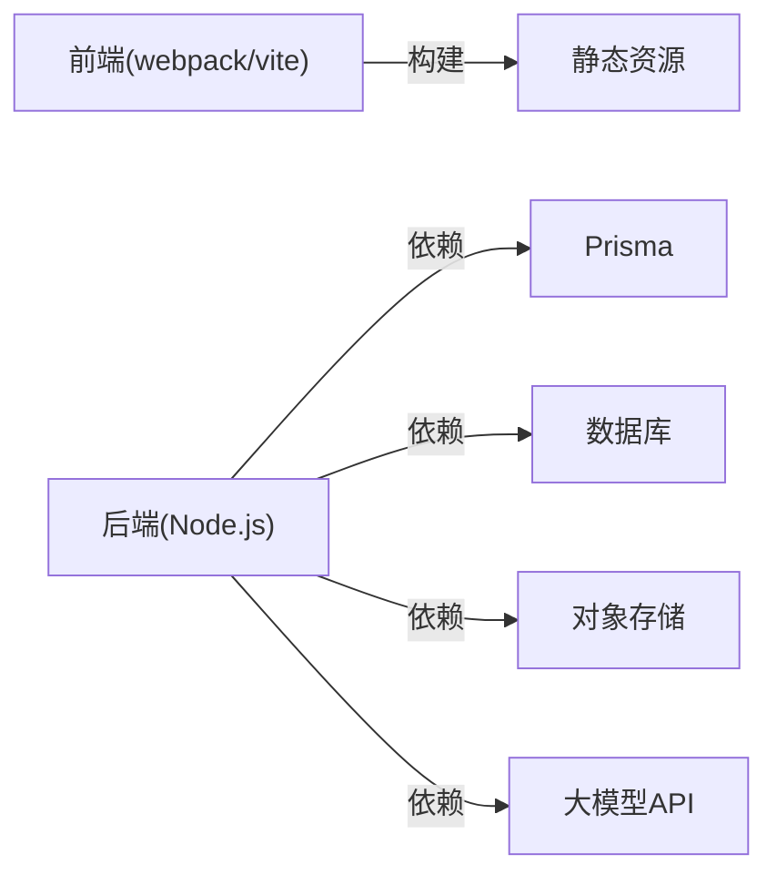

# 部署运维

<cite>
**本文引用的文件**   
- [deploy.ps1](file://deploy.ps1)
- [start.ps1](file://start.ps1)
- [pack.ps1](file://pack.ps1)
- [ftp_upload.ps1](file://ftp_upload.ps1)
- [sync_wsl.ps1](file://sync_wsl.ps1)
- [WSL部署指南.md](file://WSL部署指南.md)
- [宝塔部署指南.md](file://宝塔部署指南.md)
- [node-jinmao/app.js](file://node-jinmao/app.js)
- [node-jinmao/package.json](file://node-jinmao/package.json)
- [node-jinmao/setup.sh](file://node-jinmao/setup.sh)
- [node-jinmao/prisma/schema.prisma](file://node-jinmao/prisma/schema.prisma)
- [node-jinmao/config/deepseek_config.json](file://node-jinmao/config/deepseek_config.json)
- [node-jinmao/config/minio_config.json](file://node-jinmao/config/minio_config.json)
- [node-jinmao/config/volcengine_config.json](file://node-jinmao/config/volcengine_config.json)
- [node-jinmao/utils/prisma.js](file://node-jinmao/utils/prisma.js)
- [node-jinmao/utils/upload_minio.js](file://node-jinmao/utils/upload_minio.js)
- [node-jinmao/middleware/auth.js](file://node-jinmao/middleware/auth.js)
- [WEB/package.json](file://WEB/package.json)
- [WEB/vite.config.js](file://WEB/vite.config.js)
- [API文档.md](file://API文档.md)
</cite>

## 目录
1. [简介](#简介)
2. [项目结构](#项目结构)
3. [核心组件](#核心组件)
4. [架构总览](#架构总览)
5. [详细组件分析](#详细组件分析)
6. [依赖关系分析](#依赖关系分析)
7. [性能考虑](#性能考虑)
8. [故障排查指南](#故障排查指南)
9. [结论](#结论)
10. [附录](#附录)

## 简介
本部署运维文档面向“金毛教你学重构版”的生产环境，覆盖Docker容器化、传统服务器与云平台部署方式；说明环境变量与配置管理、数据库初始化、依赖服务（对象存储、LLM等）配置；提供CI/CD流水线建议、自动化构建发布与版本管理策略；给出监控告警、日志收集与分析、性能指标采集方案；包含故障排查、常见问题解决、性能调优建议；并阐述安全加固、备份恢复与灾难恢复预案，以及扩容缩容、负载均衡与高可用设计。

## 项目结构
本项目由前端静态站点与Node.js后端服务组成：
- WEB：基于Vite的前端工程，构建产物为静态资源，适合Nginx或对象存储托管。
- node-jinmao：Node.js后端服务，使用Prisma进行数据建模与迁移，集成第三方服务（如MinIO对象存储、大模型API等）。
- 根目录脚本：提供打包、部署、同步、FTP上传等自动化能力。

图表来源
- [node-jinmao/app.js](file://node-jinmao/app.js)
- [node-jinmao/prisma/schema.prisma](file://node-jinmao/prisma/schema.prisma)
- [WEB/package.json](file://WEB/package.json)

章节来源
- [node-jinmao/package.json](file://node-jinmao/package.json)
- [WEB/package.json](file://WEB/package.json)

## 核心组件
- 后端入口与路由：app.js负责服务启动、中间件注册与路由挂载。
- 数据库访问：utils/prisma.js封装Prisma客户端，schema.prisma定义数据模型与迁移。
- 认证鉴权：middleware/auth.js实现JWT校验与权限控制。
- 对象存储：utils/upload_minio.js对接MinIO/S3，用于文件上传与下载。
- 第三方服务：config下的JSON配置文件管理大模型与云服务密钥与端点。

章节来源
- [node-jinmao/app.js](file://node-jinmao/app.js)
- [node-jinmao/utils/prisma.js](file://node-jinmao/utils/prisma.js)
- [node-jinmao/middleware/auth.js](file://node-jinmao/middleware/auth.js)
- [node-jinmao/utils/upload_minio.js](file://node-jinmao/utils/upload_minio.js)
- [node-jinmao/config/deepseek_config.json](file://node-jinmao/config/deepseek_config.json)
- [node-jinmao/config/minio_config.json](file://node-jinmao/config/minio_config.json)
- [node-jinmao/config/volcengine_config.json](file://node-jinmao/config/volcengine_config.json)

## 架构总览
生产环境推荐分层部署：
- 前端静态资源通过Nginx或对象存储CDN分发。
- 后端服务以进程或容器运行，连接数据库与对象存储。
- 通过反向代理统一入口，启用HTTPS与限流。
- 使用环境变量注入敏感配置，避免硬编码。

图表来源
- [node-jinmao/app.js](file://node-jinmao/app.js)
- [node-jinmao/utils/upload_minio.js](file://node-jinmao/utils/upload_minio.js)
- [WEB/package.json](file://WEB/package.json)

## 详细组件分析

### 后端服务启动与配置
- 服务启动：app.js加载配置、注册中间件、挂载路由、监听端口。
- 数据库连接：utils/prisma.js初始化Prisma客户端，确保连接池与重试策略。
- 认证流程：middleware/auth.js解析Token、校验签名、注入用户上下文。
- 文件上传：utils/upload_minio.js根据配置选择桶与路径，处理分片与错误重试。

图表来源
- [node-jinmao/app.js](file://node-jinmao/app.js)
- [node-jinmao/middleware/auth.js](file://node-jinmao/middleware/auth.js)
- [node-jinmao/utils/prisma.js](file://node-jinmao/utils/prisma.js)
- [node-jinmao/utils/upload_minio.js](file://node-jinmao/utils/upload_minio.js)

章节来源
- [node-jinmao/app.js](file://node-jinmao/app.js)
- [node-jinmao/middleware/auth.js](file://node-jinmao/middleware/auth.js)
- [node-jinmao/utils/prisma.js](file://node-jinmao/utils/prisma.js)
- [node-jinmao/utils/upload_minio.js](file://node-jinmao/utils/upload_minio.js)

### 数据库与迁移
- 数据模型：schema.prisma定义表结构与关系。
- 迁移管理：通过Prisma CLI执行迁移，确保多环境一致性。
- 连接参数：通过环境变量注入数据库地址、用户名、密码与SSL选项。

图表来源
- [node-jinmao/prisma/schema.prisma](file://node-jinmao/prisma/schema.prisma)
- [node-jinmao/utils/prisma.js](file://node-jinmao/utils/prisma.js)

章节来源
- [node-jinmao/prisma/schema.prisma](file://node-jinmao/prisma/schema.prisma)
- [node-jinmao/utils/prisma.js](file://node-jinmao/utils/prisma.js)

### 对象存储与大模型配置
- MinIO/S3：minio_config.json配置端点、凭据、桶名与访问策略。
- 大模型：deepseek_config.json与volcengine_config.json配置API Key、模型名称与超时。
- 上传逻辑：upload_minio.js根据配置动态选择桶与路径，支持断点续传与错误重试。

章节来源
- [node-jinmao/config/minio_config.json](file://node-jinmao/config/minio_config.json)
- [node-jinmao/config/deepseek_config.json](file://node-jinmao/config/deepseek_config.json)
- [node-jinmao/config/volcengine_config.json](file://node-jinmao/config/volcengine_config.json)
- [node-jinmao/utils/upload_minio.js](file://node-jinmao/utils/upload_minio.js)

### 前端构建与部署
- 构建工具：Vite在WEB目录下构建静态资源。
- 构建产物：dist目录输出HTML/CSS/JS，适合Nginx或对象存储托管。
- 环境变量：通过vite.config.js与环境变量注入API基础路径与功能开关。

章节来源
- [WEB/package.json](file://WEB/package.json)
- [WEB/vite.config.js](file://WEB/vite.config.js)

## 依赖关系分析
- 后端依赖：Prisma、数据库驱动、HTTP框架、对象存储SDK、第三方API客户端。
- 前端依赖：Vite、Vue生态、HTTP客户端与状态管理。
- 运行时依赖：Node.js版本、系统库（如LibreOffice便携版）、网络访问（防火墙与代理）。

图表来源
- [node-jinmao/package.json](file://node-jinmao/package.json)
- [WEB/package.json](file://WEB/package.json)

章节来源
- [node-jinmao/package.json](file://node-jinmao/package.json)
- [WEB/package.json](file://WEB/package.json)

## 性能考虑
- 连接池：数据库连接池大小与超时需按QPS与并发调整。
- 缓存策略：热点数据引入Redis缓存，减少数据库压力。
- 静态资源：前端资源启用Gzip/Brotli压缩与CDN缓存。
- 异步任务：长耗时任务（如PDF转Markdown、题目生成）采用队列与Worker池。
- 资源限制：容器CPU/内存限制与OOM策略，避免单实例拖垮整体。

[本节为通用指导，不直接分析具体文件]

## 故障排查指南
- 服务无法启动：检查端口占用、环境变量缺失、依赖服务不可达。
- 数据库连接失败：核对连接字符串、SSL证书、权限与白名单。
- 对象存储上传失败：检查Bucket权限、网络可达性与签名有效期。
- 大模型调用超时：确认API Key、配额与网络代理设置。
- 日志定位：集中收集应用日志与访问日志，结合TraceID追踪请求链路。

章节来源
- [node-jinmao/app.js](file://node-jinmao/app.js)
- [node-jinmao/utils/prisma.js](file://node-jinmao/utils/prisma.js)
- [node-jinmao/utils/upload_minio.js](file://node-jinmao/utils/upload_minio.js)

## 结论
通过分层架构与标准化配置，项目可在多种环境中稳定运行。建议在生产环境采用容器化与CI/CD流水线，配合监控告警与备份恢复机制，保障高可用与可观测性。

[本节为总结，不直接分析具体文件]

## 附录

### 部署方式一：Docker容器化部署
- 镜像构建：基于Node基础镜像，安装依赖并拷贝代码，暴露端口。
- 环境变量：通过docker-compose或Kubernetes ConfigMap注入敏感配置。
- 健康检查：添加健康检查探针，自动重启异常实例。
- 日志与指标：侧车模式收集日志，Prometheus抓取指标。

[本节为通用指导，不直接分析具体文件]

### 部署方式二：传统服务器部署
- 环境准备：安装Node.js、数据库、对象存储客户端与系统库。
- 服务管理：使用systemd或PM2管理服务进程与自启。
- 反向代理：Nginx配置HTTPS、静态资源与API转发。
- 脚本辅助：使用setup.sh进行一键初始化与依赖安装。

章节来源
- [node-jinmao/setup.sh](file://node-jinmao/setup.sh)

### 部署方式三：云平台部署
- 容器编排：使用ECS+ACR或Kubernetes集群，声明式部署。
- 配置中心：使用云配置服务管理环境变量与Feature Flag。
- 弹性伸缩：基于CPU/内存或自定义指标自动扩缩容。
- 负载均衡：SLB/ALB分发流量，开启会话保持与健康检查。

[本节为通用指导，不直接分析具体文件]

### 环境配置管理与环境变量
- 环境变量：DATABASE_URL、MINIO_ENDPOINT、LLM_API_KEY等。
- 配置文件：config/*.json存放非敏感配置，敏感信息走环境变量。
- 多环境：dev/test/staging/prod分离配置，禁止跨环境复用密钥。

章节来源
- [node-jinmao/config/deepseek_config.json](file://node-jinmao/config/deepseek_config.json)
- [node-jinmao/config/minio_config.json](file://node-jinmao/config/minio_config.json)
- [node-jinmao/config/volcengine_config.json](file://node-jinmao/config/volcengine_config.json)

### 数据库初始化与迁移
- 初始化：创建数据库与用户，授予最小权限。
- 迁移：执行Prisma迁移，确保版本一致。
- 种子数据：按需导入初始数据，避免重复执行。

章节来源
- [node-jinmao/prisma/schema.prisma](file://node-jinmao/prisma/schema.prisma)
- [node-jinmao/utils/prisma.js](file://node-jinmao/utils/prisma.js)

### 依赖服务配置
- 对象存储：配置Endpoint、AccessKey、SecretKey、Bucket与CORS。
- 大模型API：配置API Key、模型名称、超时与重试策略。
- 邮件/短信：如需通知，接入SMTP或短信网关。

章节来源
- [node-jinmao/config/minio_config.json](file://node-jinmao/config/minio_config.json)
- [node-jinmao/config/deepseek_config.json](file://node-jinmao/config/deepseek_config.json)
- [node-jinmao/config/volcengine_config.json](file://node-jinmao/config/volcengine_config.json)

### CI/CD流水线与版本管理
- 构建阶段：前端构建静态资源，后端打包依赖与二进制。
- 测试阶段：单元测试、集成测试与API契约测试。
- 发布阶段：生成镜像与制品，推送至仓库，触发灰度发布。
- 版本策略：语义化版本，Git标签与Changelog自动生成。

[本节为通用指导，不直接分析具体文件]

### 监控告警与日志分析
- 指标采集：Prometheus抓取Node.js指标与应用自定义指标。
- 日志收集：Fluent Bit/Logstash汇聚到ELK或云日志服务。
- 告警规则：错误率、延迟、资源使用阈值触发告警。
- 链路追踪：OpenTelemetry埋点，端到端追踪请求。

[本节为通用指导，不直接分析具体文件]

### 安全加固措施
- 最小权限：数据库与对象存储账号仅授予必要权限。
- 密钥管理：使用密钥管理服务，避免明文存储。
- 网络安全：防火墙、WAF与TLS加密传输。
- 输入校验：服务端严格校验与过滤，防止注入与越权。

[本节为通用指导，不直接分析具体文件]

### 备份恢复与灾难恢复
- 备份策略：全量+增量备份，异地多副本。
- 恢复演练：定期演练恢复流程，验证RTO/RPO。
- 回滚机制：快速回滚到上一稳定版本。

[本节为通用指导，不直接分析具体文件]

### 扩容缩容与负载均衡
- 水平扩展：无状态服务多实例并行，共享数据库与对象存储。
- 垂直扩展：提升单机CPU/内存，注意瓶颈定位。
- 负载均衡：七层负载均衡，按权重与地域分发。

[本节为通用指导，不直接分析具体文件]

### 自动化脚本与工具
- 部署脚本：deploy.ps1、start.ps1、pack.ps1、ftp_upload.ps1、sync_wsl.ps1。
- 平台指南：WSL部署指南.md、宝塔部署指南.md。
- API文档：API文档.md提供接口规范与示例。

章节来源
- [deploy.ps1](file://deploy.ps1)
- [start.ps1](file://start.ps1)
- [pack.ps1](file://pack.ps1)
- [ftp_upload.ps1](file://ftp_upload.ps1)
- [sync_wsl.ps1](file://sync_wsl.ps1)
- [WSL部署指南.md](file://WSL部署指南.md)
- [宝塔部署指南.md](file://宝塔部署指南.md)
- [API文档.md](file://API文档.md)