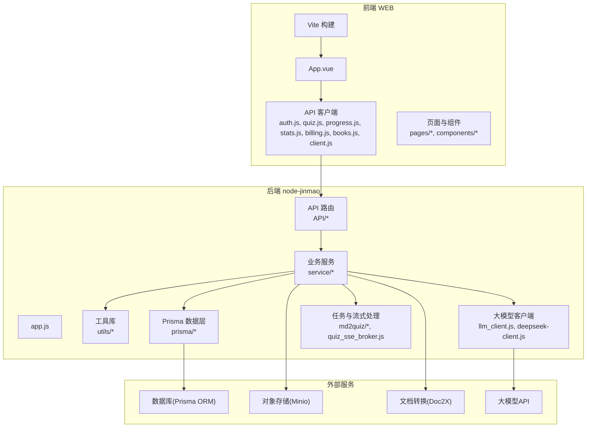
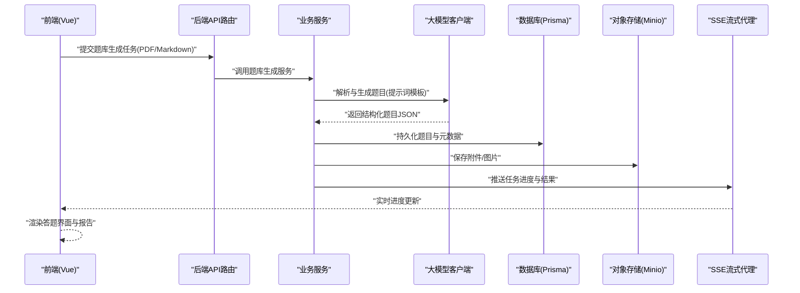
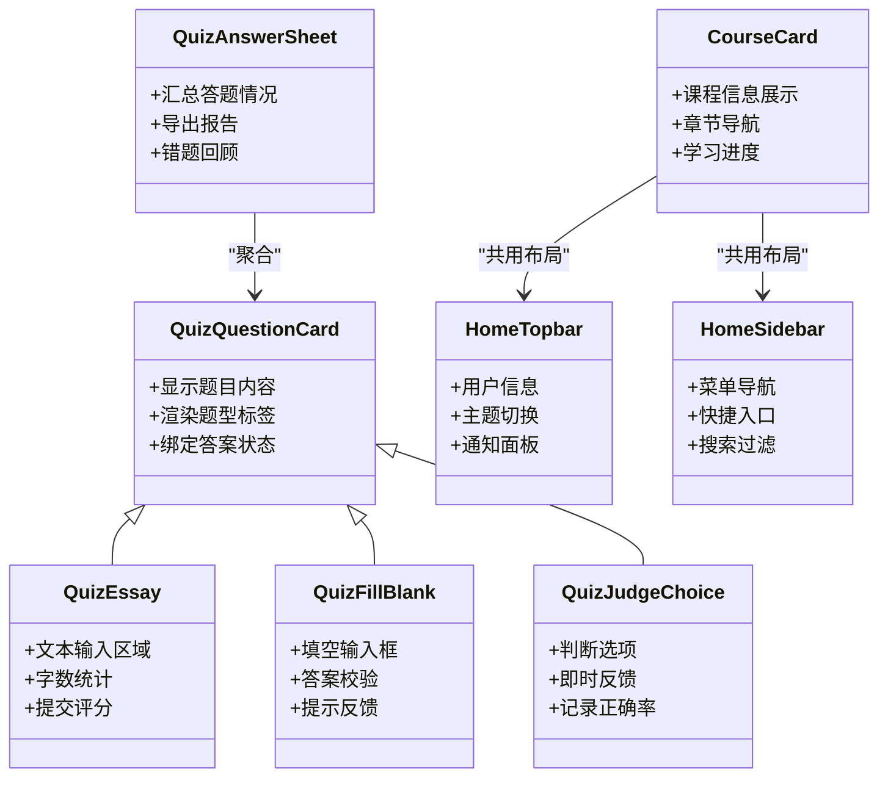
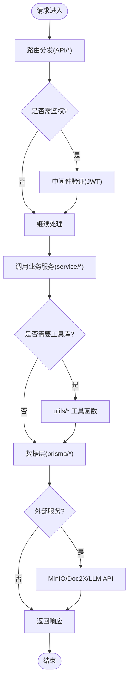
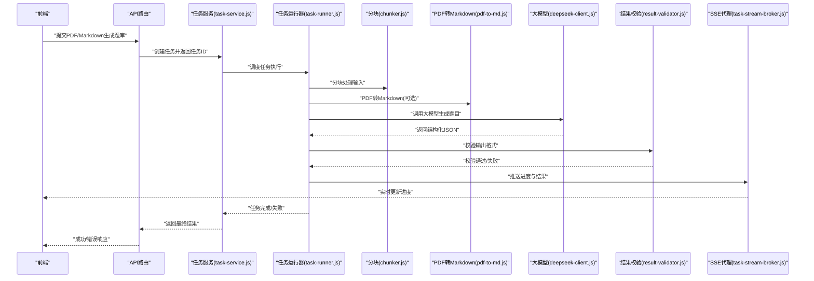
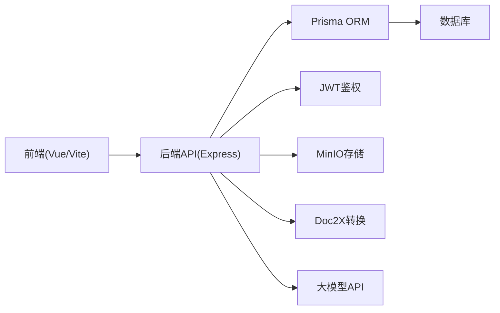

# 项目概述

<cite>
**本文引用的文件**   
- [package.json](file://node-jinmao/package.json)
- [app.js](file://node-jinmao/app.js)
- [schema.prisma](file://node-jinmao/prisma/schema.prisma)
- [API文档.md](file://API文档.md)
- [数据库结构.md](file://数据库结构.md)
- [start.ps1](file://start.ps1)
- [deploy.ps1](file://deploy.ps1)
- [vite.config.js](file://WEB/vite.config.js)
- [main.js](file://WEB/src/main.js)
- [auth.js](file://WEB/src/api/auth.js)
- [quiz.js](file://WEB/src/api/quiz.js)
- [progress.js](file://WEB/src/api/progress.js)
- [stats.js](file://WEB/src/api/stats.js)
- [billing.js](file://WEB/src/api/billing.js)
- [books.js](file://WEB/src/api/books.js)
- [client.js](file://WEB/src/api/client.js)
- [CourseCard.vue](file://WEB/src/components/CourseCard.vue)
- [QuizQuestionCard.vue](file://WEB/src/components/quiz/QuizQuestionCard.vue)
- [QuizEssay.vue](file://WEB/src/components/quiz/QuizEssay.vue)
- [QuizFillBlank.vue](file://WEB/src/components/quiz/QuizFillBlank.vue)
- [QuizJudgeChoice.vue](file://WEB/src/components/quiz/QuizJudgeChoice.vue)
- [QuizAnswerSheet.vue](file://WEB/src/components/quiz/QuizAnswerSheet.vue)
- [HomeTopbar.vue](file://WEB/src/components/HomeTopbar.vue)
- [HomeSidebar.vue](file://WEB/src/components/HomeSidebar.vue)
- [App.vue](file://WEB/src/App.vue)
- [index.html](file://WEB/index.html)
- [md2quiz_prompt.md](file://node-jinmao/config/md2quiz_prompt.md)
- [quiz-format-prompt.md](file://node-jinmao/config/quiz-format-prompt.md)
- [chunker.js](file://node-jinmao/service/md2quiz/chunker.js)
- [task-service.js](file://node-jinmao/service/md2quiz/task-service.js)
- [task-runner.js](file://node-jinmao/service/md2quiz/task-runner.js)
- [task-stream-broker.js](file://node-jinmao/service/md2quiz/task-stream-broker.js)
- [result-validator.js](file://node-jinmao/service/md2quiz/result-validator.js)
- [deepseek-client.js](file://node-jinmao/service/md2quiz/deepseek-client.js)
- [pdf-to-md.js](file://node-jinmao/service/md2quiz/pdf-to-md.js)
- [llm_client.js](file://node-jinmao/utils/llm_client.js)
- [prisma.js](file://node-jinmao/utils/prisma.js)
- [jwt.js](file://node-jinmao/utils/jwt.js)
- [upload_minio.js](file://node-jinmao/utils/upload_minio.js)
- [doc2x.js](file://node-jinmao/utils/doc2x.js)
- [generate_outline.js](file://node-jinmao/utils/generate_outline.js)
- [htmlppt.js](file://node-jinmao/utils/htmlppt.js)
- [input_validator.js](file://node-jinmao/utils/input_validator.js)
- [can_generate_next.js](file://node-jinmao/utils/can_generate_next.js)
- [create_title.js](file://node-jinmao/utils/create_title.js)
- [line_indexer.js](file://node-jinmao/utils/line_indexer.js)
- [extract_zip.js](file://node-jinmao/utils/extract_zip.js)
- [course_pipeline.js](file://node-jinmao/service/course_pipeline.js)
- [POSTbook.js](file://node-jinmao/service/POSTbook.js)
- [create_cover_image.js](file://node-jinmao/service/create_cover_image.js)
- [create_title.js](file://node-jinmao/service/create_title.js)
- [quiz_import.js](file://node-jinmao/service/quiz_import.js)
- [quiz_judge.js](file://node-jinmao/service/quiz_judge.js)
- [quiz_report_service.js](file://node-jinmao/service/quiz_report_service.js)
- [quiz_sse_broker.js](file://node-jinmao/service/quiz_sse_broker.js)
- [auth.js](file://node-jinmao/API/auth.js)
- [billing.js](file://node-jinmao/API/billing.js)
- [files.js](file://node-jinmao/API/files.js)
- [progress.js](file://node-jinmao/API/progress.js)
- [stats.js](file://node-jinmao/API/stats.js)
- [book/index.js](file://node-jinmao/API/book/index.js)
- [book/list.js](file://node-jinmao/API/book/list.js)
- [book/detail.js](file://node-jinmao/API/book/detail.js)
- [book/update.js](file://node-jinmao/API/book/update.js)
- [book/delete.js](file://node-jinmao/API/book/delete.js)
- [book/files.js](file://node-jinmao/API/book/files.js)
- [book/generate-next-chapter.js](file://node-jinmao/API/book/generate-next-chapter.js)
- [book/fix-missing.js](file://node-jinmao/API/book/fix-missing.js)
- [course/index.js](file://node-jinmao/API/course/index.js)
- [course/slides.js](file://node-jinmao/API/course/slides.js)
- [quiz/import.js](file://node-jinmao/API/quiz/import.js)
- [quiz/md2json.js](file://node-jinmao/API/quiz/md2json.js)
- [quiz/pdf2quiz.js](file://node-jinmao/API/quiz/pdf2quiz.js)
- [quiz/report.js](file://node-jinmao/API/quiz/report.js)
- [quiz/session.js](file://node-jinmao/API/quiz/session.js)
- [quiz/textbooks.js](file://node-jinmao/API/quiz/textbooks.js)
- [quiz/wrongbook.js](file://node-jinmao/API/quiz/wrongbook.js)
</cite>

## 目录
1. [简介](#简介)
2. [项目结构](#项目结构)
3. [核心组件](#核心组件)
4. [架构总览](#架构总览)
5. [详细组件分析](#详细组件分析)
6. [依赖关系分析](#依赖关系分析)
7. [性能考量](#性能考量)
8. [故障排查指南](#故障排查指南)
9. [结论](#结论)
10. [附录](#附录)

## 简介
本项目“金毛教你学重构版”是一个面向学习与题库管理的教育平台，提供智能题库生成、多题型支持、学习进度跟踪与AI辅助教学等核心能力。系统采用前后端分离架构：前端基于Vue.js（Vite构建），后端基于Node.js（Express风格路由与服务），数据层使用Prisma进行类型安全的数据库访问，并通过大模型API实现题目生成、内容解析与报告分析等智能化功能。整体价值在于将传统教材与题库转化为可交互、可追踪、可评估的学习体验，同时通过事件驱动与微服务风格的模块化组织，提升系统的可扩展性与可维护性。

## 项目结构
仓库包含多个子工程与资源目录：
- WEB：前端工程，使用Vite+Vue，提供用户界面与交互逻辑，按页面与组件划分模块，API调用集中在src/api下。
- node-jinmao：后端工程，包含Express风格的路由API、业务服务、工具库、Prisma配置与迁移、LLM客户端与任务处理管线。
- doc：大模型接口与语音合成相关参考文档。
- test：测试用例与示例数据。
- 根目录脚本：部署、打包、同步与启动脚本。

图表来源
- [vite.config.js](file://WEB/vite.config.js)
- [main.js](file://WEB/src/main.js)
- [app.js](file://node-jinmao/app.js)
- [schema.prisma](file://node-jinmao/prisma/schema.prisma)

章节来源
- [package.json](file://node-jinmao/package.json)
- [start.ps1](file://start.ps1)
- [deploy.ps1](file://deploy.ps1)
- [vite.config.js](file://WEB/vite.config.js)
- [main.js](file://WEB/src/main.js)
- [app.js](file://node-jinmao/app.js)

## 核心组件
- 前端核心
  - 应用入口与路由：App.vue、main.js、index.html
  - API客户端：auth.js、quiz.js、progress.js、stats.js、billing.js、books.js、client.js
  - 页面与组件：pages/*（登录、首页、刷题、学习、账单等）、components/*（课程卡片、题库答题、导入导出对话框等）
- 后端核心
  - 应用入口与中间件：app.js、middleware/auth.js
  - API路由：API/*（认证、计费、文件、进度、统计、书籍、课程、题库等）
  - 业务服务：service/*（课程流水线、题库导入/判题/报告、SSE流式推送等）
  - 工具库：utils/*（Prisma、JWT、MinIO上传、Doc2X、LLM客户端、输入校验、大纲生成、PPT转换等）
  - 数据层：prisma/schema.prisma 与迁移脚本
  - 大模型集成：llm_client.js、deepseek-client.js、config/*提示词模板
  - 任务与流式处理：service/md2quiz/*（分块、任务调度、流式代理、结果校验等）

章节来源
- [App.vue](file://WEB/src/App.vue)
- [main.js](file://WEB/src/main.js)
- [index.html](file://WEB/index.html)
- [auth.js](file://WEB/src/api/auth.js)
- [quiz.js](file://WEB/src/api/quiz.js)
- [progress.js](file://WEB/src/api/progress.js)
- [stats.js](file://WEB/src/api/stats.js)
- [billing.js](file://WEB/src/api/billing.js)
- [books.js](file://WEB/src/api/books.js)
- [client.js](file://WEB/src/api/client.js)
- [CourseCard.vue](file://WEB/src/components/CourseCard.vue)
- [QuizQuestionCard.vue](file://WEB/src/components/quiz/QuizQuestionCard.vue)
- [QuizEssay.vue](file://WEB/src/components/quiz/QuizEssay.vue)
- [QuizFillBlank.vue](file://WEB/src/components/quiz/QuizFillBlank.vue)
- [QuizJudgeChoice.vue](file://WEB/src/components/quiz/QuizJudgeChoice.vue)
- [QuizAnswerSheet.vue](file://WEB/src/components/quiz/QuizAnswerSheet.vue)
- [HomeTopbar.vue](file://WEB/src/components/HomeTopbar.vue)
- [HomeSidebar.vue](file://WEB/src/components/HomeSidebar.vue)
- [app.js](file://node-jinmao/app.js)
- [auth.js](file://node-jinmao/middleware/auth.js)
- [API文档.md](file://API文档.md)
- [数据库结构.md](file://数据库结构.md)

## 架构总览
系统采用前后端分离与微服务风格的模块化设计，结合事件驱动的异步处理模式：
- 前端通过REST/SSE与后端通信，发起题库生成、练习提交、进度上报等操作。
- 后端路由将请求分发到对应服务，服务组合工具库与外部服务完成数据处理。
- 大模型API用于智能生成题目、解析PDF/Markdown、生成报告与封面标题等。
- Prisma作为ORM统一数据访问，MinIO用于文件存储，Doc2X用于文档格式转换。
- 长耗时任务通过任务队列与SSE流式推送，保证用户体验与系统稳定性。

图表来源
- [quiz/pdf2quiz.js](file://node-jinmao/API/quiz/pdf2quiz.js)
- [quiz/import.js](file://node-jinmao/API/quiz/import.js)
- [task-service.js](file://node-jinmao/service/md2quiz/task-service.js)
- [task-runner.js](file://node-jinmao/service/md2quiz/task-runner.js)
- [task-stream-broker.js](file://node-jinmao/service/md2quiz/task-stream-broker.js)
- [deepseek-client.js](file://node-jinmao/service/md2quiz/deepseek-client.js)
- [llm_client.js](file://node-jinmao/utils/llm_client.js)
- [prisma.js](file://node-jinmao/utils/prisma.js)
- [upload_minio.js](file://node-jinmao/utils/upload_minio.js)
- [quiz_sse_broker.js](file://node-jinmao/service/quiz_sse_broker.js)

## 详细组件分析

### 前端组件与页面
- 应用入口与路由
  - App.vue定义全局布局与路由容器；main.js初始化应用与插件；index.html为HTML模板。
- API客户端
  - auth.js负责认证流程（登录、注册、会话管理）；quiz.js封装题库相关操作（导入、生成、提交、报告）；progress.js与stats.js分别处理学习进度与统计数据；billing.js处理计费与订阅；books.js管理书籍与章节；client.js提供统一的HTTP客户端封装。
- 页面与组件
  - pages/*包含登录、首页、刷题、学习、账单等页面视图；components/*提供通用UI组件（课程卡片、题库答题卡片、题型组件如选择题、填空题、判断题、作文题等）。

图表来源
- [QuizQuestionCard.vue](file://WEB/src/components/quiz/QuizQuestionCard.vue)
- [QuizEssay.vue](file://WEB/src/components/quiz/QuizEssay.vue)
- [QuizFillBlank.vue](file://WEB/src/components/quiz/QuizFillBlank.vue)
- [QuizJudgeChoice.vue](file://WEB/src/components/quiz/QuizJudgeChoice.vue)
- [QuizAnswerSheet.vue](file://WEB/src/components/quiz/QuizAnswerSheet.vue)
- [CourseCard.vue](file://WEB/src/components/CourseCard.vue)
- [HomeTopbar.vue](file://WEB/src/components/HomeTopbar.vue)
- [HomeSidebar.vue](file://WEB/src/components/HomeSidebar.vue)

章节来源
- [App.vue](file://WEB/src/App.vue)
- [main.js](file://WEB/src/main.js)
- [index.html](file://WEB/index.html)
- [auth.js](file://WEB/src/api/auth.js)
- [quiz.js](file://WEB/src/api/quiz.js)
- [progress.js](file://WEB/src/api/progress.js)
- [stats.js](file://WEB/src/api/stats.js)
- [billing.js](file://WEB/src/api/billing.js)
- [books.js](file://WEB/src/api/books.js)
- [client.js](file://WEB/src/api/client.js)
- [CourseCard.vue](file://WEB/src/components/CourseCard.vue)
- [QuizQuestionCard.vue](file://WEB/src/components/quiz/QuizQuestionCard.vue)
- [QuizEssay.vue](file://WEB/src/components/quiz/QuizEssay.vue)
- [QuizFillBlank.vue](file://WEB/src/components/quiz/QuizFillBlank.vue)
- [QuizJudgeChoice.vue](file://WEB/src/components/quiz/QuizJudgeChoice.vue)
- [QuizAnswerSheet.vue](file://WEB/src/components/quiz/QuizAnswerSheet.vue)
- [HomeTopbar.vue](file://WEB/src/components/HomeTopbar.vue)
- [HomeSidebar.vue](file://WEB/src/components/HomeSidebar.vue)

### 后端API与服务
- 认证与授权
  - API/auth.js提供登录、注册、令牌签发；middleware/auth.js进行鉴权校验。
- 题库与练习
  - API/quiz/*涵盖导入、Markdown转JSON、PDF转题库、报告、会话管理、教材与错题本；service/quiz_*提供判题、报告生成、SSE推送等。
- 书籍与课程
  - API/book/*管理书籍列表、详情、更新、删除、文件、章节生成与修复；API/course/*提供课程与幻灯片管理；service/course_pipeline.js与service/POSTbook.js编排内容生产流程。
- 进度与统计
  - API/progress.js与API/stats.js分别处理学习记录与统计分析。
- 计费与文件
  - API/billing.js处理计费逻辑；API/files.js与utils/upload_minio.js管理文件上传与存储。

图表来源
- [app.js](file://node-jinmao/app.js)
- [auth.js](file://node-jinmao/middleware/auth.js)
- [API/auth.js](file://node-jinmao/API/auth.js)
- [API/quiz/import.js](file://node-jinmao/API/quiz/import.js)
- [API/quiz/pdf2quiz.js](file://node-jinmao/API/quiz/pdf2quiz.js)
- [API/book/index.js](file://node-jinmao/API/book/index.js)
- [API/course/index.js](file://node-jinmao/API/course/index.js)
- [API/progress.js](file://node-jinmao/API/progress.js)
- [API/stats.js](file://node-jinmao/API/stats.js)
- [API/billing.js](file://node-jinmao/API/billing.js)
- [API/files.js](file://node-jinmao/API/files.js)
- [utils/prisma.js](file://node-jinmao/utils/prisma.js)
- [utils/upload_minio.js](file://node-jinmao/utils/upload_minio.js)
- [utils/doc2x.js](file://node-jinmao/utils/doc2x.js)
- [utils/llm_client.js](file://node-jinmao/utils/llm_client.js)

章节来源
- [app.js](file://node-jinmao/app.js)
- [auth.js](file://node-jinmao/middleware/auth.js)
- [API/auth.js](file://node-jinmao/API/auth.js)
- [API/quiz/import.js](file://node-jinmao/API/quiz/import.js)
- [API/quiz/pdf2quiz.js](file://node-jinmao/API/quiz/pdf2quiz.js)
- [API/book/index.js](file://node-jinmao/API/book/index.js)
- [API/course/index.js](file://node-jinmao/API/course/index.js)
- [API/progress.js](file://node-jinmao/API/progress.js)
- [API/stats.js](file://node-jinmao/API/stats.js)
- [API/billing.js](file://node-jinmao/API/billing.js)
- [API/files.js](file://node-jinmao/API/files.js)

### 智能题库生成与任务处理
- 任务生命周期
  - 任务创建与调度：task-service.js负责任务的创建、状态管理与调度；task-runner.js执行具体任务步骤；task-stream-broker.js提供SSE流式代理，向前端推送进度。
- 内容处理
  - chunker.js对输入内容进行分块；pdf-to-md.js将PDF转换为Markdown；deepseek-client.js调用大模型API进行题目生成与格式化；result-validator.js校验输出结构。
- 提示词与模板
  - config/md2quiz_prompt.md与config/quiz-format-prompt.md定义生成与格式化提示词，确保输出稳定与一致。

图表来源
- [task-service.js](file://node-jinmao/service/md2quiz/task-service.js)
- [task-runner.js](file://node-jinmao/service/md2quiz/task-runner.js)
- [chunker.js](file://node-jinmao/service/md2quiz/chunker.js)
- [pdf-to-md.js](file://node-jinmao/service/md2quiz/pdf-to-md.js)
- [deepseek-client.js](file://node-jinmao/service/md2quiz/deepseek-client.js)
- [result-validator.js](file://node-jinmao/service/md2quiz/result-validator.js)
- [task-stream-broker.js](file://node-jinmao/service/md2quiz/task-stream-broker.js)
- [md2quiz_prompt.md](file://node-jinmao/config/md2quiz_prompt.md)
- [quiz-format-prompt.md](file://node-jinmao/config/quiz-format-prompt.md)

章节来源
- [task-service.js](file://node-jinmao/service/md2quiz/task-service.js)
- [task-runner.js](file://node-jinmao/service/md2quiz/task-runner.js)
- [chunker.js](file://node-jinmao/service/md2quiz/chunker.js)
- [pdf-to-md.js](file://node-jinmao/service/md2quiz/pdf-to-md.js)
- [deepseek-client.js](file://node-jinmao/service/md2quiz/deepseek-client.js)
- [result-validator.js](file://node-jinmao/service/md2quiz/result-validator.js)
- [task-stream-broker.js](file://node-jinmao/service/md2quiz/task-stream-broker.js)
- [md2quiz_prompt.md](file://node-jinmao/config/md2quiz_prompt.md)
- [quiz-format-prompt.md](file://node-jinmao/config/quiz-format-prompt.md)

### 数据层与外部集成
- 数据模型与迁移
  - prisma/schema.prisma定义实体与关系；迁移脚本位于prisma/migrations/*，逐步演进数据结构。
- 工具与集成
  - utils/prisma.js封装数据库连接与查询；utils/jwt.js处理令牌签发与校验；utils/upload_minio.js对接MinIO对象存储；utils/doc2x.js调用Doc2X进行文档转换；utils/llm_client.js与service/md2quiz/deepseek-client.js封装大模型API调用。
- 其他工具
  - generate_outline.js生成大纲；htmlppt.js生成PPT；input_validator.js进行输入校验；can_generate_next.js控制章节生成条件；create_title.js与create_cover_image.js生成标题与封面；line_indexer.js与extract_zip.js处理行索引与压缩包解压。

章节来源
- [schema.prisma](file://node-jinmao/prisma/schema.prisma)
- [prisma.js](file://node-jinmao/utils/prisma.js)
- [jwt.js](file://node-jinmao/utils/jwt.js)
- [upload_minio.js](file://node-jinmao/utils/upload_minio.js)
- [doc2x.js](file://node-jinmao/utils/doc2x.js)
- [llm_client.js](file://node-jinmao/utils/llm_client.js)
- [generate_outline.js](file://node-jinmao/utils/generate_outline.js)
- [htmlppt.js](file://node-jinmao/utils/htmlppt.js)
- [input_validator.js](file://node-jinmao/utils/input_validator.js)
- [can_generate_next.js](file://node-jinmao/utils/can_generate_next.js)
- [create_title.js](file://node-jinmao/utils/create_title.js)
- [line_indexer.js](file://node-jinmao/utils/line_indexer.js)
- [extract_zip.js](file://node-jinmao/utils/extract_zip.js)

## 依赖关系分析
- 前端依赖
  - Vue.js生态（组件、路由、状态管理）、Vite构建工具、HTTP客户端封装。
- 后端依赖
  - Node.js运行时、Express风格路由、Prisma ORM、JWT鉴权、MinIO SDK、Doc2X HTTP客户端、大模型API客户端。
- 外部服务
  - 数据库（PostgreSQL/MySQL等，由Prisma适配）、对象存储（MinIO）、文档转换服务（Doc2X）、大模型API（DeepSeek等）。

图表来源
- [package.json](file://node-jinmao/package.json)
- [app.js](file://node-jinmao/app.js)
- [prisma.js](file://node-jinmao/utils/prisma.js)
- [jwt.js](file://node-jinmao/utils/jwt.js)
- [upload_minio.js](file://node-jinmao/utils/upload_minio.js)
- [doc2x.js](file://node-jinmao/utils/doc2x.js)
- [llm_client.js](file://node-jinmao/utils/llm_client.js)

章节来源
- [package.json](file://node-jinmao/package.json)
- [app.js](file://node-jinmao/app.js)
- [prisma.js](file://node-jinmao/utils/prisma.js)
- [jwt.js](file://node-jinmao/utils/jwt.js)
- [upload_minio.js](file://node-jinmao/utils/upload_minio.js)
- [doc2x.js](file://node-jinmao/utils/doc2x.js)
- [llm_client.js](file://node-jinmao/utils/llm_client.js)

## 性能考量
- 前端优化
  - 使用Vite进行快速构建与热更新；组件按需加载与懒路由减少首屏体积；状态管理集中化避免重复请求。
- 后端优化
  - 任务异步处理与SSE流式推送降低阻塞；数据库查询通过Prisma优化；文件上传与转换使用外部服务解耦；缓存热点数据减少重复计算。
- 大模型调用
  - 合理分块与重试机制提高成功率；提示词模板标准化减少无效输出；并发控制避免限流。

[本节为通用指导，不直接分析具体文件]

## 故障排查指南
- 常见问题定位
  - 认证失败：检查JWT签发与校验逻辑、中间件配置与请求头。
  - 题库生成失败：查看任务日志、分块与PDF转换结果、大模型API响应与提示词模板。
  - 文件上传失败：确认MinIO配置、权限与网络连通性。
  - 数据库异常：检查Prisma迁移状态、连接字符串与表结构一致性。
- 调试建议
  - 启用详细日志与错误堆栈；使用API文档对照请求与响应；通过SSE代理观察任务进度与错误信息。

章节来源
- [API文档.md](file://API文档.md)
- [数据库结构.md](file://数据库结构.md)
- [auth.js](file://node-jinmao/middleware/auth.js)
- [task-stream-broker.js](file://node-jinmao/service/md2quiz/task-stream-broker.js)
- [upload_minio.js](file://node-jinmao/utils/upload_minio.js)
- [prisma.js](file://node-jinmao/utils/prisma.js)

## 结论
“金毛教你学重构版”以清晰的前后端分离架构与微服务风格的模块化组织，结合事件驱动的异步处理模式，实现了智能题库生成、多题型支持、学习进度跟踪与AI辅助教学等核心能力。通过Prisma、MinIO、Doc2X与大模型API的集成，系统在可扩展性、可维护性与用户体验方面具备显著优势，适合教育机构与个人学习者高效利用AI技术提升学习效率与质量。

[本节为总结性内容，不直接分析具体文件]

## 附录
- 部署与启动
  - 使用start.ps1与deploy.ps1进行本地启动与部署；WSL部署指南与宝塔部署指南提供环境配置参考。
- 扩展方向
  - 增加更多题型与评测维度；引入推荐算法个性化学习路径；扩展语音合成与字幕生成功能。

章节来源
- [start.ps1](file://start.ps1)
- [deploy.ps1](file://deploy.ps1)
- [WSL部署指南.md](file://WSL部署指南.md)
- [宝塔部署指南.md](file://宝塔部署指南.md)