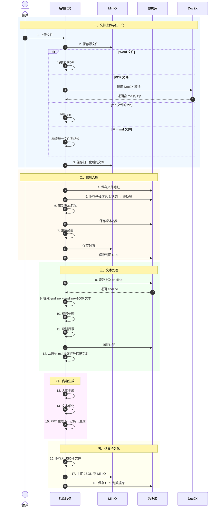

# 课程生成流水线设计
## 流程

### 一、文件上传与归一化
1. 用户上传文件
2. 将源文件保存到 MinIO
3. 文件归一化处理：
   - Word 文件 → 先转换为 PDF
   - PDF 文件 → 调用 Doc2X 统一转为包含 md 文件的 zip
   - md 文件的 zip → 解压后保存到 MinIO
   - 单一 md 文件 → 先构造文件夹为统一格式，再上传到 MinIO

### 二、信息入库
4. 将文件地址保存到数据库
5. 将基础信息和状态设为「待处理」保存到数据库
6. 识别课本名称 → 保存到数据库
7. 生成封面 → 保存到 MinIO → 保存到数据库

### 三、文本处理
8. 读取数据库，获取上次的 endline
9. 提取 endline ~ endline+1000 范围的文本-已完成，脚本为/utils/get_line.js
10. 标号处理-已完成，脚本为/utils/line_number.js
11. 识别行号 → 保存到数据库
12. 从原始 md 文件中提取出行号标记的文本-已完成，脚本为/utils/get_line.js

### 四、内容生成
13. 大纲生成-已完成，脚本为/utils/generate_outline.js
14. 文本细化-已完成，脚本为/utils/elaboration.js
15. PPT 生成 & mp3、srt 生成-已完成，脚本为/utils/generate_ppt.js、service/text_tts.js

### 五、结果持久化
16. 保存为 JSON 文件
17. 保存到 MinIO
18. 将 URL 保存到数据库

---

## 时序图



## 文件格式
- 输入：Word、PDF、md 文件的 zip、单一 md 文件
- getline之后保存一个md文件，这是一章的md文件
- 大纲生成之后保存一个json文件，这是一章的大纲
- 文本细化之后会更新大纲json，之前的大纲会被替换
- PPT 生成之后保存大纲要求数量个html文件，这是数页假装是ppt的html文件
- mp3 生成之后保存大纲要求数量个mp3文件，这是一章的mp3口播稿文件
- srt 生成之后保存大纲要求数量个srt文件，这是一章的srt字幕文件

---

## MinIO 存储设计

### 目录结构

```
{textbook_id}/                          # 课本根目录，按课本 ID 隔离
├── source/                             # 源文件（原始上传文件）
│   └── {原始文件名}                     # 保留原始文件名，如 "高等数学.pdf"
├── cover/                              # 课本封面
│   └── cover.{ext}                     # 如 cover.png
└── chapters/                           # 所有章节
    └── {chapter_id}/                   # 按章节 ID 隔离
        ├── content/                    # 归一化后的章节内容文件夹
        │   ├── content.md              # 章节正文
        │   └── images/                 # 章节中的图片
        │       ├── image001.png
        │       ├── image002.png
        │       └── ...
        ├── outline.json                # 大纲文件（文本细化时会覆盖更新，唯一）
        ├── ppt/                        # PPT HTML 文件（一页一个）
        │   ├── 001.html
        │   ├── 002.html
        │   └── ...
        ├── audio/                      # MP3 口播稿文件（一页一个）
        │   ├── 001.mp3
        │   ├── 002.mp3
        │   └── ...
        └── subtitle/                   # SRT 字幕文件（一页一个）
            ├── 001.srt
            ├── 002.srt
            └── ...
```

### 设计原则

| 原则 | 说明 |
|---|---|
| **课本隔离** | 顶层按 `{textbook_id}` 划分，不同课本互不干扰，删除课本时一键清理 |
| **章节隔离** | 每章独立目录，同一章的所有产出物聚合，方便批量操作 |
| **类型分目录** | 不同文件类型放不同子目录（ppt/audio/subtitle），避免文件名混乱 |
| **编号对齐** | PPT、MP3、SRT 统一用三位数字编号（001、002...），同一页的三个文件编号一致，天然关联 |
| **覆盖更新** | `content.md` 和 `outline.json` 是单文件，更新时直接覆盖写入 |
| **前缀查询** | 通过目录前缀即可批量获取某类文件，无需逐条查数据库 |

### 数据库存储方案

> **核心思路：数据库只存目录级路径，动态文件通过 MinIO ListObjects API 获取。**

| 表 | 字段 | 示例值 | 说明 |
|---|---|---|---|
| textbook | `source_path` | `{textbook_id}/source/高等数学.pdf` | 源文件路径 |
| textbook | `cover_path` | `{textbook_id}/cover/cover.png` | 封面路径 |
| chapter | `content_path` | `{textbook_id}/chapters/{chapter_id}/content/content.md` | 章节 md 路径 |
| chapter | `content_images_path` | `{textbook_id}/chapters/{chapter_id}/content/images/` | 章节图片目录路径 |
| chapter | `outline_path` | `{textbook_id}/chapters/{chapter_id}/outline.json` | 大纲 JSON 路径 |

### 调用示例

```python
# ========== 1. 获取某一页的三个关联文件 ==========
textbook_id = "tb_001"
chapter_id  = "ch_003"
page_no     = "002"  # 三位编号

ppt_path  = f"{textbook_id}/chapters/{chapter_id}/ppt/{page_no}.html"
mp3_path  = f"{textbook_id}/chapters/{chapter_id}/audio/{page_no}.mp3"
srt_path  = f"{textbook_id}/chapters/{chapter_id}/subtitle/{page_no}.srt"

# ========== 2. 列出某章节所有 PPT ==========
ppt_list = minio_client.list_objects(
    bucket_name="my-bucket",
    prefix=f"{textbook_id}/chapters/{chapter_id}/ppt/"
)

# ========== 3. 列出某章节所有 MP3 ==========
mp3_list = minio_client.list_objects(
    bucket_name="my-bucket",
    prefix=f"{textbook_id}/chapters/{chapter_id}/audio/"
)

# ========== 4. 更新大纲（直接覆盖写入） ==========
outline_path = chapter.outline_path  # 从 DB 读取
minio_client.put_object(
    bucket_name="my-bucket",
    object_name=outline_path,
    data=json.dumps(new_outline),
    content_type="application/json"
)

# ========== 5. 删除整个课本（前缀删除） ==========
objects = minio_client.list_objects(
    bucket_name="my-bucket",
    prefix=f"{textbook_id}/",
    recursive=True
)
for obj in objects:
    minio_client.remove_object("my-bucket", obj.object_name)
```

## 流水线数据库结构
### 数据库表设计

#### 1. textbook 表（课本表）

| 字段名 | 类型 | 说明 |
|--------|------|------|
| id | VARCHAR(64) | 主键，课本唯一标识 |
| name | VARCHAR(255) | 课本名称（AI识别生成） |
| source_path | VARCHAR(512) | 源文件在 MinIO 的路径 |
| cover_path | VARCHAR(512) | 封面图片在 MinIO 的路径 |
| status | TINYINT | 状态：0-待处理 1-处理中 2-已完成 3-失败 |
| created_at | DATETIME | 创建时间 |
| updated_at | DATETIME | 更新时间 |

#### 2. chapter 表（章节表）

| 字段名 | 类型 | 说明 |
|--------|------|------|
| id | VARCHAR(64) | 主键，章节唯一标识 |
| textbook_id | VARCHAR(64) | 外键，关联 textbook |
| name | VARCHAR(255) | 章节名称 |
| sequence | INT | 章节顺序号 |
| content_path | VARCHAR(512) | 章节 md 文件在 MinIO 的路径 |
| content_images_path | VARCHAR(512) | 章节图片目录在 MinIO 的路径 |
| outline_path | VARCHAR(512) | 大纲 JSON 在 MinIO 的路径 |
| start_line | INT | 本章在原始文件中的起始行号 |
| end_line | INT | 本章在原始文件中的结束行号 |
| status | TINYINT | 状态：0-待处理 1-处理中 2-已完成 3-失败 |
| created_at | DATETIME | 创建时间 |
| updated_at | DATETIME | 更新时间 |

#### 3. page 表（页面表，PPT/音频/字幕的元数据）

| 字段名 | 类型 | 说明 |
|--------|------|------|
| id | VARCHAR(64) | 主键，页面唯一标识 |
| chapter_id | VARCHAR(64) | 外键，关联 chapter |
| sequence | INT | 页面顺序号（对应 001, 002...） |
| title | VARCHAR(255) | 页面标题 |
| ppt_path | VARCHAR(512) | PPT HTML 文件在 MinIO 的路径 |
| audio_path | VARCHAR(512) | MP3 文件在 MinIO 的路径 |
| subtitle_path | VARCHAR(512) | SRT 字幕文件在 MinIO 的路径 |
| status | TINYINT | 状态：0-待生成 1-生成中 2-已完成 3-失败 |
| created_at | DATETIME | 创建时间 |
| updated_at | DATETIME | 更新时间 |

#### 4. pipeline_task 表（流水线任务表，用于追踪各阶段执行状态）

| 字段名 | 类型 | 说明 |
|--------|------|------|
| id | VARCHAR(64) | 主键，任务唯一标识 |
| textbook_id | VARCHAR(64) | 外键，关联 textbook |
| chapter_id | VARCHAR(64) | 外键，关联 chapter（可为空，表示整本书任务） |
| stage | TINYINT | 阶段：1-文件归一化 2-信息入库 3-文本处理 4-内容生成 5-结果持久化 |
| status | TINYINT | 状态：0-待执行 1-执行中 2-成功 3-失败 4-重试中 |
| retry_count | INT | 重试次数 |
| error_msg | TEXT | 错误信息 |
| started_at | DATETIME | 开始时间 |
| completed_at | DATETIME | 完成时间 |
| created_at | DATETIME | 创建时间 |
| updated_at | DATETIME | 更新时间 |

### 索引设计
